# Aulas 1-2: Introdução ao Teste de Software e Qualidade de Software

## Sumário Completo

*   **Seção 1: Abertura e Engajamento**
    *   1.1. Problema Motivador: O Lançamento Desastroso do "ConnectApp"
    *   1.2. Contexto Histórico e Relevância Atual
*   **Seção 2: Fundamentos Teóricos**
    *   **Bloco 1: A Disciplina do Teste de Software**
        *   2.1.1. Terminologia Essencial e Definições Formais
        *   2.1.2. Estrutura Conceitual: Os Pilares do Teste
        *   2.1.3. Análise de Consequências e Trade-offs
        *   2.1.4. Análise Crítica: Mitos e Verdades sobre Testes
    *   **Bloco 2: O Papel dos Testes no Processo de Desenvolvimento**
        *   2.2.1. Contextualização nos Modelos de Processo
        *   2.2.2. Análise Crítica: A Evolução da Mentalidade de Teste
    *   **Bloco 3: A Natureza da Qualidade de Software**
        *   2.3.1. Terminologia Essencial e Definições Formais
        *   2.3.2. Estrutura Conceitual: O Modelo de Qualidade ISO/IEC 25010
        *   2.3.3. Análise Crítica: Qualidade Percebida vs. Qualidade Intrínseca
    *   **Bloco 4: A Economia da Qualidade**
        *   2.4.1. Estrutura Conceitual: A Curva de Boehm
        *   2.4.2. Modelagem Matemática: O Custo Exponencial do Defeito
        *   2.4.3. Análise Crítica: O ROI do Investimento em Qualidade
*   **Seção 3: Aplicação Prática e Implementação**
    *   3.1. Estudo de Caso Guiado: Analisando o "FoodDash" sob a Ótica da ISO 25010
    *   3.2. Exemplos de Código Comentado
    *   3.3. Ferramentas, Bibliotecas e Ecossistema
*   **Seção 4: Tópicos Avançados e Nuances**
    *   4.1. Desafios Comuns e "Anti-Padrões"
    *   4.2. Variações e Abordagens Modernas: Shift-Left e Shift-Right
    *   4.3. Análise de Trade-offs: O Triângulo de Ferro da Qualidade
*   **Seção 5: Síntese e Perspectivas Futuras**
    *   5.1. Conexões com Outras Áreas da Computação
    *   5.2. A Fronteira da Pesquisa e o Futuro: Testando a Inteligência Artificial
    *   5.3. Resumo do Capítulo e Mapa Mental
    *   5.4. Referências e Leituras Adicionais

---

## Seção 1: Abertura e Engajamento

### 1.1. Problema Motivador: O Lançamento Desastroso do "ConnectApp"

Imagine uma jovem startup de tecnologia, a "Innovatech", que passou os últimos seis meses desenvolvendo o "ConnectApp", um aplicativo de rede social com a promessa de revolucionar a forma como as pessoas organizam eventos. A equipe de desenvolvimento, formada por programadores talentosos e apaixonados, trabalhou incansavelmente, focando em entregar o maior número de funcionalidades no menor tempo possível. A data de lançamento foi anunciada com grande alarde.

No dia do lançamento, o desastre aconteceu. Milhares de usuários baixaram o aplicativo, mas logo as avaliações negativas inundaram a loja de aplicativos. O cadastro de usuários falhava intermitentemente. A função de criar eventos travava o aplicativo. Mensagens privadas eram, por vezes, enviadas para os destinatários errados. Em menos de 24 horas, a reputação da Innovatech foi severamente abalada, e a empresa teve que retirar o aplicativo do ar, enfrentando uma crise de confiança e um prejuízo financeiro considerável. O que deu errado? A equipe era brilhante, o código era inovador, mas eles negligenciaram um pilar fundamental: o **teste de software**. Eles sabiam *construir* o software, mas não sabiam como garantir que ele funcionava de forma correta, confiável e segura.

### 1.2. Contexto Histórico e Relevância Atual

A necessidade de testar não é nova. A história da computação é repleta de "bugs" famosos, desde o primeiro inseto literal (uma mariposa) que travou o computador Mark II em 1947, um incidente documentado pela pioneira Grace Hopper. Naquela época, o teste era um processo informal, quase sinônimo de depuração. O próprio programador era o único responsável por verificar seu trabalho.

Com a explosão da complexidade do software nas décadas seguintes, essa abordagem se tornou insustentável. Surgiram disciplinas como a **Garantia da Qualidade (QA)**, que tratava o teste como uma fase separada, um portão de qualidade antes da entrega. Hoje, na era Ágil e DevOps, o teste evoluiu novamente. Ele deixou de ser uma fase no final do ciclo para se tornar uma **atividade contínua, integrada e responsabilidade de toda a equipe**. A mentalidade moderna, conhecida como *Shift-Left*, prega a antecipação dos testes para o início do ciclo de vida, prevenindo defeitos em vez de apenas detectá-los. Em um mundo onde o software controla carros, sistemas bancários e equipamentos médicos, a relevância do teste transcendeu a funcionalidade e se tornou uma questão de segurança, economia e confiança.

---

## Seção 2: Fundamentos Teóricos

### Bloco 1: A Disciplina do Teste de Software

#### 2.1.1. Terminologia Essencial e Definições Formais

A disciplina do teste de software possui um vocabulário técnico preciso que deve ser dominado para uma compreensão adequada dos conceitos fundamentais. Cada termo carrega implicações metodológicas e práticas específicas.

*   **Teste de Software:** Uma definição formal, estabelecida pelo **ISTQB (International Software Testing Qualifications Board)**, descreve o teste como "o processo que consiste em todas as atividades do ciclo de vida, tanto estáticas quanto dinâmicas, preocupadas com o planejamento, preparação e avaliação de produtos de software e produtos de trabalho relacionados para determinar se eles satisfazem os requisitos especificados, para demonstrar que são adequados para o propósito e para detectar defeitos." 

    Esta definição é deliberadamente abrangente e inclui elementos cruciais que frequentemente são mal compreendidos:
    - **"Todas as atividades do ciclo de vida"**: O teste não é uma fase isolada, mas permeia todo o desenvolvimento.
    - **"Estáticas e dinâmicas"**: Inclui tanto a análise de artefatos sem execução (estática) quanto a execução efetiva do software (dinâmica).
    - **"Planejamento, preparação e avaliação"**: O teste vai muito além da simples execução, envolvendo atividades de design e análise.
    - **"Para determinar, demonstrar e detectar"**: Três objetivos distintos que refletem a natureza multifacetada do teste.

*   **Erro (Error):** Um engano humano que produz um resultado incorreto. Por exemplo, um programador que usa o operador `=` (atribuição) quando deveria usar `==` (comparação) em uma estrutura condicional. O erro é o **ato mental incorreto**.

*   **Defeito (Defect/Bug):** Uma imperfeição no código ou documentação que pode causar uma falha. É a **manifestação tangível** do erro no artefato de software. No exemplo anterior, o defeito seria a linha de código incorreta.

*   **Falha (Failure):** O desvio do comportamento esperado do software durante a execução. É quando o defeito é **ativado** e produz um resultado incorreto visível ao usuário. Importante: nem todo defeito causa uma falha (defeitos inativos).

    **Relação Causal:** Erro → Defeito → Falha
    ```
    Programador comete erro    →    Código incorreto é escrito    →    Sistema produz resultado errado
         (Error)                         (Defect)                            (Failure)
    ```

*   **Verificação (Verification):** É o processo sistemático de avaliação para determinar se os produtos de uma determinada fase de desenvolvimento satisfazem as condições e especificações impostas no início dessa fase. **Característica fundamental:** não envolve a execução do código-objeto. A pergunta ontológica da verificação é: **"Estamos construindo o produto corretamente?"**.

    > ##### Caixa de Destaque: Analogia para Entender
    >
    > Imagine a construção de uma casa. A **verificação** é equivalente ao engenheiro estrutural revisando meticulosamente a planta baixa para garantir que todas as especificações técnicas (medidas dos cômodos, pontos elétricos, sistema de encanamento, cálculos de carga) estão corretas e em conformidade com as normas de engenharia e códigos de construção, *antes* de assentar um único tijolo. A verificação responde: "A planta está tecnicamente correta?"

    **Atividades típicas de verificação:**
    - Revisões técnicas formais (*walkthroughs*, *inspections*)
    - Análise estática de código (detecção de padrões problemáticos sem execução)
    - Verificação de conformidade com padrões de codificação
    - Análise de consistência entre documentos de diferentes fases

*   **Validação (Validation):** É o processo dinâmico de avaliação de um sistema ou componente durante ou ao final do processo de desenvolvimento para determinar se ele satisfaz os requisitos especificados e, fundamentalmente, se atende às necessidades reais do usuário. **Característica fundamental:** sempre envolve a execução do software. A pergunta ontológica da validação é: **"Estamos construindo o produto certo?"**.

    > ##### Caixa de Destaque: Analogia para Entender
    >
    > Continuando a analogia da casa, a **validação** ocorre quando os futuros moradores visitam a casa já construída, caminham pelos cômodos, abrem e fecham janelas, testam as torneiras, verificam se a iluminação é adequada e avaliam se o layout atende ao seu estilo de vida e necessidades específicas. A validação responde: "Esta casa realmente funciona para esta família?" A planta pode estar tecnicamente perfeita (verificada), mas a casa pode não ser funcional ou desejável para aquela família específica (não validada).

    **Atividades típicas de validação:**
    - Testes de aceitação do usuário (UAT - User Acceptance Testing)
    - Testes beta com usuários reais
    - Demonstrações para stakeholders
    - Testes de usabilidade em ambiente controlado

#### 2.1.2. Estrutura Conceitual: Os Pilares do Teste

Os objetivos do teste de software formam uma arquitetura conceitual robusta que sustenta toda a disciplina. Cada pilar representa não apenas um objetivo, mas uma **filosofia de abordagem** que influencia as decisões técnicas, metodológicas e organizacionais no desenvolvimento de software.

**Pilar 1: Descoberta e Diagnóstico de Defeitos**

Este é o pilar mais visível e tradicionalmente reconhecido. O teste atua como um **processo investigativo sistemático** que busca exercitar o software de maneiras que provoquem a manifestação de falhas, revelando assim a presença de defeitos subjacentes.

*Fundamento Teórico:* Baseado no princípio de que "testar pode mostrar a presença de defeitos, mas não pode provar sua ausência" (Edsger Dijkstra, 1970). Isso implica que o teste é um processo **probabilístico** de redução de incerteza sobre a qualidade.

*Estratégias de Implementação:*
- **Teste de Casos Extremos (Boundary Value Analysis):** Exercitar valores nos limites de domínios válidos
- **Teste de Particionamento de Equivalência:** Dividir o espaço de entrada em classes que devem se comportar de forma similar
- **Teste de Mutação:** Introduzir defeitos artificiais para verificar se os testes conseguem detectá-los

*Limitações Inerentes:*
- **Problema da Decisibilidade:** É matematicamente impossível provar que um programa está correto através de testes
- **Explosão Combinatorial:** O número de caminhos de execução cresce exponencialmente com a complexidade
- **Dependência de Oráculo:** Necessidade de um mecanismo confiável para determinar se o resultado está correto

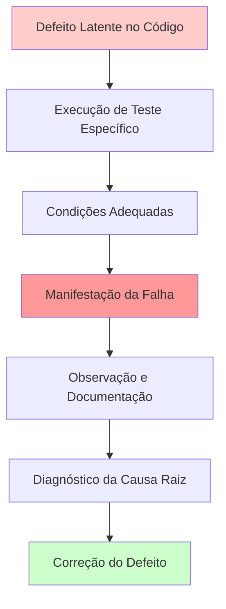

**Pilar 2: Prevenção Proativa de Defeitos**

A abordagem preventiva representa uma evolução na mentalidade de teste, migrando de uma postura **reativa** (encontrar defeitos após sua criação) para uma postura **proativa** (evitar que defeitos sejam introduzidos).

*Fundamento Teórico:* Baseado na **Lei de Pareto aplicada à qualidade de software**: 80% dos defeitos emergem de 20% das funcionalidades. A prevenção foca nos pontos de maior risco.

*Mecanismos de Prevenção:*

1. **Análise Estática Preventiva:**
   - Revisões de requisitos para identificar ambiguidades
   - Inspeções de design para detectar padrões arquiteturais problemáticos
   - Análise de código para identificar *code smells* e violações de padrões

2. **Design Orientado a Testes (Test-Driven Development - TDD):**
   - Escrita de testes antes da implementação
   - Força clareza na especificação de comportamento esperado
   - Cria uma **rede de segurança** para refatorações futuras

3. **Engenharia de Requisitos Orientada a Qualidade:**
   - Especificação de critérios de aceitação testáveis
   - Definição de *Definition of Done* rigorosa
   - Prototipagem para validação antecipada de conceitos

*Benefícios Econômicos:*
```
Custo de Prevenção << Custo de Detecção << Custo de Correção Tardia
```

**Pilar 3: Fornecimento de Informações para Tomada de Decisão**

O teste é fundamentalmente um **sistema de informação gerencial** que transforma dados brutos de execução em inteligência acionável para stakeholders.

*Categorias de Informação Produzidas:*

1. **Métricas de Qualidade:**
   - Densidade de defeitos por módulo
   - Cobertura de código e de requisitos
   - Tendências de descoberta de defeitos ao longo do tempo

2. **Indicadores de Risco:**
   - Áreas de código com alta complexidade ciclomática
   - Módulos com histórico de alta incidência de defeitos
   - Funcionalidades críticas com cobertura insuficiente

3. **Critérios de Liberação:**
   - Percentual de casos de teste aprovados
   - Número de defeitos críticos pendentes
   - Performance dentro de parâmetros aceitáveis

*Processo de Transformação de Dados em Decisões:*
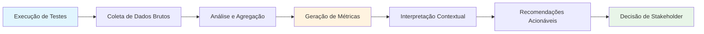

**Pilar 4: Garantia de Conformidade Regulatória e Contratual**

Em muitos domínios, o teste não é apenas uma boa prática, mas uma **obrigação legal e contratual**. Este pilar garante que o software atenda a padrões externos obrigatórios.

*Domínios Críticos de Conformidade:*

1. **Setor Financeiro:**
   - SOX (Sarbanes-Oxley): Controles internos para relatórios financeiros
   - PCI-DSS: Segurança de dados de cartão de crédito
   - Basel III: Gestão de riscos operacionais

2. **Setor de Saúde:**
   - HIPAA: Privacidade de informações médicas
   - FDA 21 CFR Part 11: Assinaturas eletrônicas e registros
   - ISO 14155: Estudos clínicos com dispositivos médicos

3. **Setor Automotivo:**
   - ISO 26262: Segurança funcional em sistemas automotivos
   - ASPICE: Avaliação e melhoria de processos automotivos

*Processo de Conformidade:*
1. **Mapeamento de Requisitos Regulatórios:** Tradução de normas em critérios testáveis
2. **Rastreabilidade Bidirecional:** Capacidade de rastrear cada teste até um requisito regulatório específico
3. **Evidência Auditável:** Documentação que pode ser apresentada a auditores externos
4. **Validação Independente:** Testes realizados por entidades não envolvidas no desenvolvimento

**Análise da Interdependência entre Pilares:**

Os quatro pilares não são independentes; eles formam um **sistema sinérgico** onde o fortalecimento de um pilar beneficia os demais:

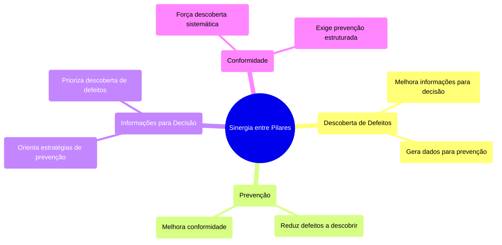

#### 2.1.3. Análise de Consequências e Trade-offs

A decisão estratégica sobre quanto, como e quando testar constitui um dos **problemas de otimização mais complexos** na engenharia de software. Esta decisão não é puramente técnica, mas envolve uma análise multidimensional de trade-offs que afeta diretamente o sucesso do projeto e do produto.

**A Natureza Multidimensional do Problema de Otimização**

O teste de software envolve pelo menos seis dimensões críticas que competem por recursos limitados:

1. **Dimensão Temporal:** Tempo disponível vs. cobertura desejada
2. **Dimensão Financeira:** Orçamento vs. qualidade atingível
3. **Dimensão de Risco:** Tolerância a falhas vs. custo de mitigação
4. **Dimensão de Mercado:** Time-to-market vs. maturidade do produto
5. **Dimensão Técnica:** Complexidade do sistema vs. esforço de teste
6. **Dimensão Regulatória:** Conformidade obrigatória vs. flexibilidade de entrega

**Análise Formal dos Trade-offs Principais**

**Trade-off 1: Cobertura vs. Velocidade de Entrega**

*Modelo Matemático Simplificado:*
Seja $C$ a cobertura de teste (0 ≤ C ≤ 1) e $T$ o tempo necessário para atingir essa cobertura. A relação empírica típica segue uma curva logarítmica:

$T(C) = T_{base} \cdot \ln(\frac{1}{1-C})$

Onde $T_{base}$ é o tempo base para testes fundamentais.

*Interpretação:* Os últimos 10% de cobertura frequentemente consomem 50% do tempo total de teste, fenômeno conhecido como **"Lei dos Rendimentos Decrescentes em Teste"**.

*Consequências Práticas:*
- **Para produtos comerciais:** Ótimo econômico típico entre 70-85% de cobertura
- **Para sistemas críticos:** Pode exigir 95%+ independentemente do custo
- **Para startups:** Pode aceitar 40-60% para acelerar time-to-market

**Trade-off 2: Teste Manual vs. Automação**

*Análise de Custos:*
```
Custo_Total_Manual = n_execuções × custo_por_execução_manual
Custo_Total_Automação = custo_desenvolvimento_automação + (n_execuções × custo_por_execução_automática)

Ponto de Equilíbrio: n_execuções = custo_desenvolvimento_automação / (custo_manual - custo_automático)
```

*Fatores de Decisão:*
- **Frequência de Execução:** Testes executados >10 vezes geralmente justificam automação
- **Estabilidade da Interface:** Interfaces voláteis tornam automação custosa
- **Criticidade:** Testes de regressão críticos devem ser automatizados independentemente do ROI imediato
- **Habilidades da Equipe:** Disponibilidade de competências em automação

**Trade-off 3: Teste Abrangente vs. Risco de Mercado**

*Modelo de Análise de Risco:*

$Risco_{Total} = Risco_{Qualidade} + Risco_{Mercado}$

Onde:
- $Risco_{Qualidade} = P(defeito) × Impacto_{defeito}$
- $Risco_{Mercado} = P(perda\_oportunidade) × Valor_{oportunidade}$

*Cenários Típicos de Decisão:*

| Contexto | Estratégia Recomendada | Justificativa |
|----------|------------------------|---------------|
| **Startup em mercado emergente** | Teste mínimo viável (MVP testing) | Risco de mercado >> Risco de qualidade |
| **Sistema bancário** | Teste exaustivo | Risco de qualidade >> Risco de mercado |
| **App mobile competitivo** | Teste balanceado com automação | Riscos equilibrados |
| **Sistema de vida crítica** | Teste certificado independentemente de custo | Risco de qualidade = Risco legal/humano |

**Consequências Sistêmicas de Decisões de Teste**

**Cenário 1: Teste Insuficiente**
*Consequências Imediatas:*
- Redução do time-to-market
- Economia de recursos de desenvolvimento
- Maior velocidade de features

*Consequências Diferidas:*
- Aumenta exponencialmente o custo de correção pós-produção
- Degrada progressivamente a confiança do usuário
- Cria **débito técnico de qualidade** que se acumula com juros compostos
- Pode resultar em **falência reputacional** irreversível

*Exemplo Histórico:* Samsung Galaxy Note 7 (2016) - Teste insuficiente de bateria resultou em recall global de $5.3 bilhões.

**Cenário 2: Teste Excessivo (Over-testing)**
*Consequências Imediatas:*
- Atraso no lançamento
- Consumo excessivo de recursos
- Opportunity cost de features não desenvolvidas

*Consequências Diferidas:*
- Perda de janela de mercado para competidores
- **Paralisia por perfeição** - produto nunca é "bom o suficiente" para lançar
- Recursos mal alocados em testes de baixo valor

*Exemplo Histórico:* Microsoft Windows Vista (2007) - Desenvolvimento de 5 anos com testes extensivos, mas perdeu relevância para concorrentes mais ágeis.

**Framework para Tomada de Decisão: Matriz de Risco-Benefício**

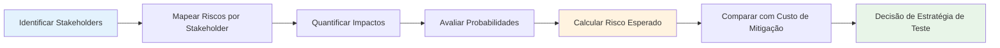

**Stakeholders e Seus Critérios de Decisão:**

1. **Usuários Finais:** Priorizam funcionalidade, usabilidade e confiabilidade
2. **Gestão Executiva:** Foca em ROI, time-to-market e risco regulatório
3. **Equipe de Desenvolvimento:** Valoriza manutenibilidade e sustentabilidade técnica
4. **Suporte/Operações:** Enfatiza estabilidade e facilidade de diagnóstico
5. **Jurídico/Compliance:** Exige conformidade regulatória e evidência auditável

**Modelo de Otimização Multi-objetivo**

O problema pode ser formalizado como uma otimização multi-objetivo:

**Maximizar:**
- Confiança na qualidade do produto
- Velocidade de entrega
- Eficiência de recursos

**Sujeito a:**
- Restrições orçamentárias
- Restrições temporais
- Restrições regulatórias
- Restrições de competência da equipe

**Solução Prática: Método de Pontuação Ponderada**

1. **Definir Critérios de Avaliação:**
   - Criticidade da funcionalidade (peso: 30%)
   - Frequência de uso (peso: 25%)
   - Complexidade técnica (peso: 20%)
   - Risco regulatório (peso: 15%)
   - Histórico de defeitos (peso: 10%)

2. **Pontuar cada Área de Teste (1-10):**
   ```
   Score_Total = Σ(Critério_i × Peso_i)
   ```

3. **Alocar Recursos Proporcionalmente aos Scores**

**Indicadores de Alerta para Desequilíbrio na Estratégia de Teste:**

*Sinais de Sub-teste:*
- Testes de regressão levam >50% do tempo total de teste
- Defeitos em produção >3x defeitos encontrados em teste
- Time-to-fix médio >48 horas para bugs críticos
- Cobertura de código <60% ou cobertura de requisitos <80%

*Sinais de Over-teste:*
- Cobertura de código >95% mas ainda encontrando bugs triviais
- Tempo de teste >40% do tempo total de desenvolvimento
- Equipe de teste >30% da equipe total de desenvolvimento
- Ciclo de release >6 meses para produtos web/mobile

**Estratégias de Mitigação de Riscos de Trade-offs**

1. **Teste Baseado em Risco (Risk-Based Testing):**
   - Priorizar áreas críticas para o negócio
   - Usar análise de impacto para guiar alocação de esforço
   - Implementar matriz de priorização risco × impacto

2. **Estratégia de Qualidade Escalonada:**
   - Critérios mínimos para todas as funcionalidades
   - Critérios elevados para funcionalidades críticas
   - Critérios extremos para funcionalidades de segurança/vida

3. **Feedback Loops Rápidos:**
   - Implementar telemetria em produção
   - Monitoramento proativo de métricas de qualidade
   - Canais de feedback direto com usuários

#### 2.1.4. Análise Crítica: Mitos e Verdades sobre Testes

A disciplina de teste de software é permeada por **concepções errôneas** que frequentemente levam a decisões estratégicas inadequadas e desperdício de recursos. Uma análise crítica rigorosa desses mitos é essencial para estabelecer uma base conceitual sólida.

**Mito 1: "Testar é caro e reduz a produtividade"**

*Análise da Falácia:*
Este mito surge de uma **contabilidade míope** que considera apenas os custos diretos e imediatos do teste, ignorando os custos diferidos e ocultos da não-qualidade.

*Contabilidade Completa dos Custos:*

**Custos Visíveis do Teste:**
- Salários da equipe de QA
- Ferramentas e infraestrutura de teste
- Tempo de desenvolvimento de automação
- Ambiente de testes dedicados

**Custos Ocultos da Não-Qualidade:**
- **Custo de Correção Pós-Produção:** 10-100x mais caro que correção durante desenvolvimento
- **Custo de Oportunidade:** Desenvolvedores gastando tempo corrigindo bugs em vez de desenvolver features
- **Custo de Suporte:** Aumento exponencial em tickets de suporte
- **Custo Reputacional:** Perda de confiança do cliente, difícil de quantificar mas potencialmente devastadora
- **Custo de Compliance:** Multas regulatórias e custos legais

*Evidência Empírica:*
Estudo da IBM (2014): Empresas que investem 15-20% do esforço total em atividades de qualidade reduzem custos totais de desenvolvimento em 25-40% ao longo do ciclo de vida do produto.

**Mito 2: "O objetivo do teste é garantir software 100% livre de defeitos"**

*Análise da Impossibilidade Teórica:*
Este mito reflete uma incompreensão fundamental dos **limites teóricos da verificação de software**.

*Fundamentos Matemáticos da Limitação:*
1. **Problema da Parada (Halting Problem):** Turing demonstrou que não existe algoritmo geral para determinar se um programa arbitrário terminará para uma entrada específica.
2. **Explosão Combinatorial:** Para um programa com n variáveis booleanas, existem 2^n estados possíveis. Para n=50, isso excede 10^15 estados.
3. **Princípio de Dijkstra:** "Testar pode mostrar a presença de bugs, mas nunca sua ausência."

*Redefinição do Objetivo Realista:*
O objetivo real do teste é **reduzir o risco de falhas a um nível aceitável para o contexto específico**, onde "aceitável" é determinado por:
- Criticidade do sistema
- Tolerância ao risco dos stakeholders
- Custos de mitigação vs. custos de impacto
- Restrições regulatórias

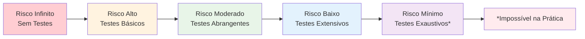

**Mito 3: "Qualquer pessoa pode testar software"**

*Análise da Complexidade Cognitiva:*
Este mito subestima dramaticamente a **sofisticação intelectual** requerida para teste eficaz de software.

*Competências Técnicas Necessárias:*
1. **Pensamento Sistemático:** Capacidade de decompor sistemas complexos em componentes testáveis
2. **Raciocínio Abdutivo:** Habilidade de formular hipóteses sobre causas de comportamentos observados
3. **Modelagem Mental:** Construir e manipular modelos mentais precisos do comportamento esperado do sistema
4. **Análise de Risco:** Identificar e priorizar cenários de teste baseados em impacto e probabilidade
5. **Comunicação Técnica:** Articular defeitos de forma precisa e acionável

*Competências de Domínio:*
- **Conhecimento do Negócio:** Compreensão profunda dos processos e regras de negócio
- **Experiência do Usuário:** Intuição sobre padrões de uso real
- **Conhecimento Técnico:** Compreensão de arquiteturas, padrões de design e limitações tecnológicas

*Evidência da Especialização:*
Estudos mostram que testadores experientes encontram 3-5x mais defeitos por hora que testadores novatos, e identificam defeitos 2-3x mais críticos.

**Mito 4: "Teste é responsabilidade exclusiva da equipe de QA"**

*Análise da Evolução Organizacional:*
Este mito reflete uma visão **taylorista obsoleta** de divisão do trabalho que não se adapta à complexidade e velocidade do desenvolvimento moderno.

*Modelo Tradicional vs. Modelo Moderno:*

| Aspecto | Modelo Tradicional (QA-Centric) | Modelo Moderno (Whole-Team) |
|---------|----------------------------------|-------------------------------|
| **Responsabilidade** | QA "verifica" qualidade | Toda equipe "constrói" qualidade |
| **Timing** | Teste após desenvolvimento | Teste durante desenvolvimento |
| **Conhecimento** | QA aprende sistema após construção | Desenvolvedores testam durante construção |
| **Feedback** | Lento e em lotes | Rápido e contínuo |
| **Ownership** | QA "aprova" ou "reprova" | Equipe compartilha responsabilidade |

*Benefícios do Modelo Whole-Team:*
1. **Shift-Left Natural:** Defeitos capturados no momento da criação
2. **Feedback Loops Mais Rápidos:** Redução de 80-90% no tempo entre introdução e detecção de defeitos
3. **Qualidade Built-in:** Prevenção em vez de detecção
4. **Cross-training:** Desenvolvimento de competências múltiplas na equipe

**Mito 5: "Automação substituirá completamente testes manuais"**

*Análise das Limitações Inerentes da Automação:*

*Limitações Técnicas:*
- **Problema do Oráculo Automatizado:** Dificuldade em automatizar a verificação de correção
- **Interface em Evolução:** Automação de UI é frágil em face de mudanças frequentes
- **Criatividade Exploratória:** Automação não pode descobrir cenários não programados

*Limitações Cognitivas:*
- **Serendipidade:** Descobertas acidentais são exclusivamente humanas
- **Intuição de Usabilidade:** Julgamentos estéticos e de experiência requerem cognição humana
- **Contextualização:** Interpretação de resultados em contexto de negócio

*Modelo de Complementaridade:*
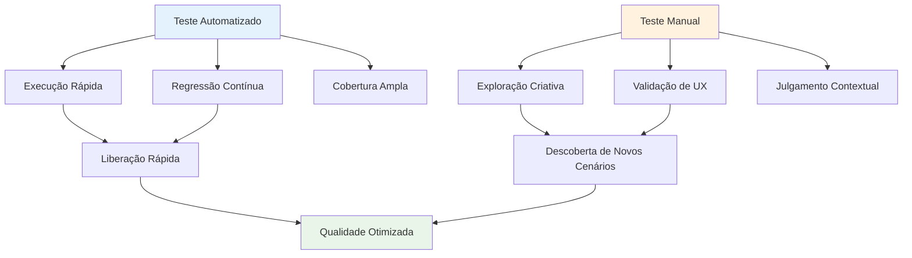

**Mito 6: "Mais testes sempre significa melhor qualidade"**

*Análise da Curva de Utilidade Marginal:*
A relação entre quantidade de teste e qualidade segue uma **curva de utilidade marginal decrescente**, onde cada teste adicional produz benefício progressivamente menor.

*Ponto de Saturação:*
Existe um ponto ótimo além do qual testes adicionais:
- Geram informação redundante
- Consomem recursos que poderiam ser melhor aplicados
- Podem criar **paralisia por análise**

*Lei de Pareto aplicada ao Teste:*
Tipicamente, 20% dos testes encontram 80% dos defeitos críticos. A arte está em identificar esses 20%.

**Verdade Fundamental: O Teste como Investigação Empírica**

Abandonando os mitos, emergem **verdades fundamentais** sobre a natureza do teste:

1. **Teste é Investigação, não Demonstração:** O objetivo é aprender sobre o sistema, não provar sua correção
2. **Qualidade é Construída, não Verificada:** Teste eficaz é preventivo, não apenas detectivo
3. **Contexto Determina Estratégia:** Não existe estratégia universal; cada contexto demanda abordagem específica
4. **Colaboração Supera Separação:** Qualidade emerge de colaboração entre disciplinas, não de silos organizacionais
5. **Automação Amplifica, não Substitui:** Ferramentas multiplicam capacidade humana, mas não eliminam necessidade de julgamento humano

**Framework para Desmistificação Contínua:**

Para combater mitos futuros, é essencial desenvolver **pensamento crítico sistemático**:

1. **Questionar Generalizações:** Toda afirmação categórica sobre teste deve ser questionada
2. **Buscar Evidência Empírica:** Preferir dados sobre anedotas
3. **Considerar Contexto:** Avaliar se práticas são apropriadas para contexto específico
4. **Medir Resultados:** Implementar métricas para validar eficácia de práticas
5. **Evoluir Continuamente:** Adaptar práticas baseado em aprendizado contínuo

### Bloco 2: O Papel dos Testes no Processo de Desenvolvimento

#### 2.2.1. Contextualização nos Modelos de Processo

A posição, a organização e a filosofia fundamental do teste de software **evoluem dramaticamente** em função do modelo de processo de desenvolvimento adotado. Esta evolução não é meramente organizacional, mas reflete **mudanças paradigmáticas profundas** na compreensão da natureza da qualidade de software e dos mecanismos mais eficazes para alcançá-la.

**Modelo Cascata (Waterfall): A Era da Verificação Terminal**

*Características Fundamentais:*
No modelo cascata, o teste é conceptualizado como uma **fase distinta e terminal** que ocorre somente após a conclusão completa de todas as atividades de desenvolvimento. Esta abordagem trata o teste como um **processo de verificação** executado por uma equipe especializada e separada da equipe de desenvolvimento.

*Estrutura Organizacional:*
- **Separação Funcional Rígida:** Desenvolvedores "constroem", testadores "verificam"
- **Handoff Cerimonial:** O software é formalmente "entregue" à equipe de teste
- **Comunicação Assíncrona:** Feedback através de relatórios formais de defeitos
- **Responsabilidade Unilateral:** QA é o "gatekeeper" da qualidade

*Fluxo de Trabalho Típico:*
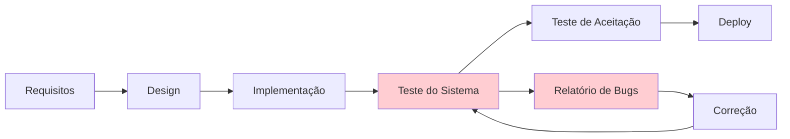

*Vantagens Contextuais:*
- **Documentação Exaustiva:** Força especificação detalhada antes da implementação
- **Auditabilidade:** Trilha completa de decisões e aprovações
- **Especialização Profunda:** Permite desenvolvimento de expertise dedicada em teste
- **Previsibilidade:** Cronograma mais determinístico (teoricamente)

*Limitações Sistêmicas:*
- **Feedback Tardio:** Defeitos descobertos quando a correção é mais cara (Curva de Boehm)
- **Rigidez a Mudanças:** Mudanças nos requisitos requerem retorno ao início do ciclo
- **Isolamento de Conhecimento:** Testadores aprendem o sistema apenas após sua construção
- **Gargalo de Entrega:** Teste torna-se limitante crítico do time-to-market

**Modelo V: A Sincronização Temporal da Verificação**

*Inovação Conceitual:*
O Modelo V representa uma **evolução arquitetural** do cascata, estabelecendo correspondência temporal e conceptual entre fases de desenvolvimento e fases de teste. Para cada atividade de desenvolvimento existe uma atividade de verificação planejada em paralelo.

*Mapeamento de Correspondências:*
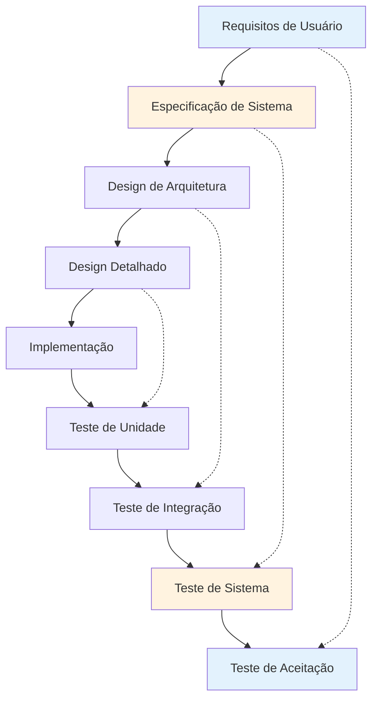

*Princípios Fundamentais:*
1. **Planejamento Antecipado:** Critérios de teste são definidos simultaneamente aos requisitos
2. **Rastreabilidade Bidirecional:** Cada requisito tem testes correspondentes e vice-versa
3. **Verificação Progressiva:** Cada nível de abstração tem sua estratégia de verificação específica
4. **Sincronização de Artefatos:** Documentos de teste evoluem em paralelo com documentos de design

*Benefícios Emergentes:*
- **Shift-Left Parcial:** Planejamento de teste ocorre mais cedo no ciclo
- **Cobertura Sistemática:** Garante que todos os requisitos tenham testes correspondentes
- **Clareza de Propósito:** Cada fase de teste tem objetivos bem definidos
- **Detecção Antecipada de Inconsistências:** Problemas de especificação emergem durante planejamento de teste

*Limitações Persistentes:*
- **Rigidez Sequencial:** Mantém a característica serial do cascata
- **Dependência de Documentação:** Eficácia limitada pela qualidade das especificações
- **Resistência a Mudanças:** Modificações ainda requerem propagação através de múltiplas fases

**Modelos Iterativos (RUP, Unified Process): A Emergência do Feedback Cíclico**

*Paradigma Fundamental:*
Os modelos iterativos introduzem o conceito de **desenvolvimento incremental com feedback cíclico**. O software é construído através de múltiplas iterações, cada uma produzindo um incremento funcional que é testado, avaliado e refinado.

*Características Estruturais:*
- **Iterações Time-boxed:** Cada ciclo tem duração fixa (tipicamente 2-8 semanas)
- **Incremento Executável:** Cada iteração produz software funcionando
- **Feedback Integral:** Teste é parte integrante de cada iteração
- **Evolução Adaptativa:** Requisitos e design evoluem baseados em aprendizado

*Fluxo de Trabalho por Iteração:*
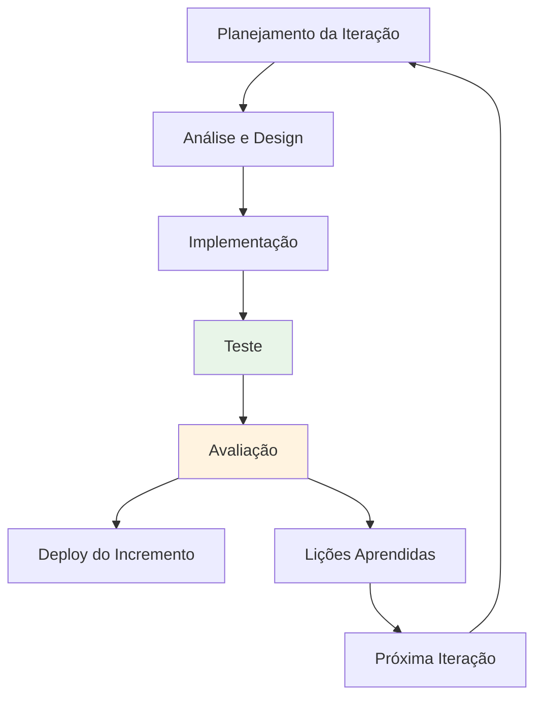

*Transformações no Papel do Teste:*
1. **Integração Temporal:** Teste ocorre dentro de cada iteração, não ao final
2. **Validação Contínua:** Stakeholders avaliam incrementos funcionais regularmente
3. **Aprendizado Acelerado:** Defeitos e problemas de usabilidade são descobertos mais cedo
4. **Adaptação Baseada em Evidência:** Decisões de design informadas por resultados de teste reais

*Benefícios Emergentes:*
- **Redução de Risco:** Problemas fundamentais são descobertos em iterações iniciais
- **Validação de Valor:** Stakeholders podem avaliar utilidade real do software
- **Qualidade Incremental:** Cada iteração melhora a qualidade geral do produto
- **Flexibilidade Controlada:** Mudanças podem ser incorporadas entre iterações

**Modelos Ágeis (Scrum, XP): A Qualidade como Responsabilidade Coletiva**

*Revolução Paradigmática:*
Os modelos ágeis representam uma **ruptura fundamental** com a separação tradicional entre desenvolvimento e teste. O teste torna-se uma **atividade contínua e integrada** executada por toda a equipe, não apenas por especialistas dedicados.

*Princípios Transformadores:*

1. **Whole Team Approach:** Qualidade é responsabilidade de toda a equipe
2. **Built-in Quality:** Qualidade é construída no produto, não verificada posteriormente
3. **Continuous Feedback:** Feedback é contínuo e imediato, não em lotes
4. **Customer Collaboration:** Cliente é parte ativa do processo de validação

*Práticas Características no Scrum:*
- **Definition of Done:** Critérios de qualidade são parte integral da definição de "pronto"
- **Sprint Review:** Demonstração regular para stakeholders com feedback imediato
- **Sprint Retrospective:** Melhoria contínua dos processos de qualidade
- **Cross-functional Teams:** Equipes incluem todas as competências necessárias para entregar qualidade

*Práticas Características no XP (Extreme Programming):*
- **Test-Driven Development (TDD):** Testes são escritos antes do código de produção
- **Pair Programming:** Duas pessoas trabalhando juntas aumentam qualidade
- **Continuous Integration:** Integração e teste automático contínuo
- **Refactoring:** Melhoria contínua da qualidade interna do código

*Transformação do Fluxo de Trabalho:*
```mermaid
graph LR
    A[User Story] --> B[Acceptance Criteria]
    B --> C[Test Cases]
    C --> D[Red Test]
    D --> E[Implementation]
    E --> F[Green Test]
    F --> G[Refactor]
    G --> H[Integration]
    
    H --> I[Continuous Testing]
    I --> J[Sprint Review]
    J --> K[Retrospective]
    
    style C fill:#ffcdd2
    style D fill:#ffcdd2
    style F fill:#ccffcc
    style I fill:#e3f2fd
```

*Benefícios Sistêmicos:*
- **Shift-Left Radical:** Teste ocorre simultaneamente ao desenvolvimento
- **Feedback Imediato:** Problemas são detectados em minutos/horas, não semanas
- **Qualidade Preventiva:** Foco em prevenir defeitos, não apenas detectá-los
- **Colaboração Intensiva:** Comunicação contínua entre todas as disciplinas

**DevOps: A Qualidade na Era da Entrega Contínua**

*Paradigma da Continuidade:*
DevOps representa a **convergência completa** entre desenvolvimento, teste e operações, criando um pipeline contínuo desde o código até a produção. O teste torna-se completamente automatizado e integrado ao fluxo de entrega.

*Conceitos Fundamentais:*

1. **Infrastructure as Code:** Ambientes de teste são criados programaticamente
2. **Pipeline as Code:** Todo o processo de entrega é versionado e automatizado
3. **Quality Gates:** Critérios automatizados determinam progressão no pipeline
4. **Observability:** Monitoramento e teste continuam em produção

*Arquitetura de Pipeline Típica:*
```mermaid
graph LR
    A[Code Commit] --> B[Unit Tests]
    B --> C[Static Analysis]
    C --> D[Build]
    D --> E[Integration Tests]
    E --> F[Security Scans]
    F --> G[Performance Tests]
    G --> H[Staging Deploy]
    H --> I[End-to-End Tests]
    I --> J[Production Deploy]
    J --> K[Monitoring]
    K --> L[Feedback Loop]
    
    style B fill:#ccffcc
    style E fill:#ccffcc
    style G fill:#ccffcc
    style I fill:#ccffcc
    style K fill:#e3f2fd
```

*Práticas Características:*
- **Continuous Integration (CI):** Testes executados automaticamente a cada commit
- **Continuous Deployment (CD):** Deploy automático após aprovação em quality gates
- **Blue-Green Deployment:** Estratégias de deploy com risco minimizado
- **Canary Releases:** Validação gradual com subconjuntos de usuários
- **A/B Testing:** Experimentação contínua em produção

*Inovações Conceituais:*
1. **Shift-Right:** Teste e validação continuam em produção
2. **Chaos Engineering:** Teste proativo de resiliência do sistema
3. **Synthetic Monitoring:** Simulação contínua de cenários de usuário
4. **Feature Toggles:** Capacidade de ativar/desativar funcionalidades dinamicamente

#### 2.2.2. Análise Crítica: A Evolução da Mentalidade de Teste

A jornada através dos diferentes modelos de processo revela uma **evolução paradigmática fundamental** na compreensão da natureza e do propósito do teste de software. Esta evolução não é meramente metodológica, mas representa mudanças profundas na filosofia, organização e prática da engenharia de qualidade.

**Dimensões da Transformação Paradigmática**

**1. Transformação Temporal: De Fase para Atividade**

*Paradigma Clássico (Waterfall/V):*
- Teste como **evento discreto** no final do desenvolvimento
- Separação temporal clara entre "construção" e "verificação"
- Metáfora: "Teste é o controle de qualidade na linha de produção"

*Paradigma Moderno (Ágil/DevOps):*
- Teste como **processo contínuo** integrado ao desenvolvimento
- Sobreposição temporal e conceptual entre construção e verificação
- Metáfora: "Teste é o sistema imunológico do software"

*Implicações Práticas:*
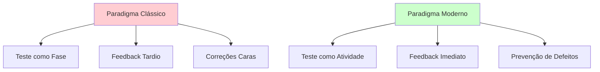

**2. Transformação Filosófica: De Detecção para Prevenção**

*Filosofia Reativa (Detecção):*
- **Pressuposto:** Defeitos são inevitáveis e devem ser encontrados
- **Foco:** Maximizar detecção através de teste abrangente
- **Métricas:** Número de defeitos encontrados, cobertura de teste
- **Mentalidade:** "Teste prova que o software funciona"

*Filosofia Proativa (Prevenção):*
- **Pressuposto:** Defeitos podem ser prevenidos através de práticas adequadas
- **Foco:** Minimizar introdução de defeitos através de colaboração
- **Métricas:** Defeitos prevenidos, time-to-feedback, qualidade do código
- **Mentalidade:** "Teste ajuda a construir software que funciona"

**3. Transformação Organizacional: De Silo para Colaboração**

*Modelo de Separação (QA-Centric):*
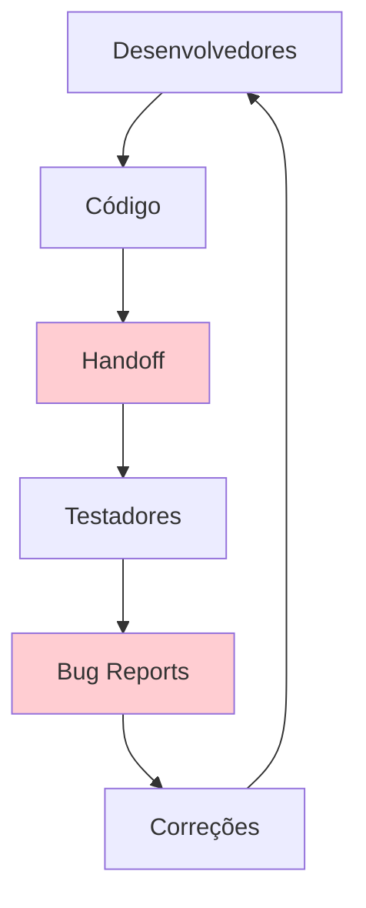

*Características:*
- **Responsabilidade Unilateral:** QA "aprova" ou "reprova" releases
- **Comunicação Formal:** Bugs reportados através de sistemas de tracking
- **Competências Especializadas:** Conhecimento concentrado em silos funcionais
- **Ownership Fragmentado:** Ninguém é responsável pela qualidade end-to-end

*Modelo de Integração (Whole-Team):*
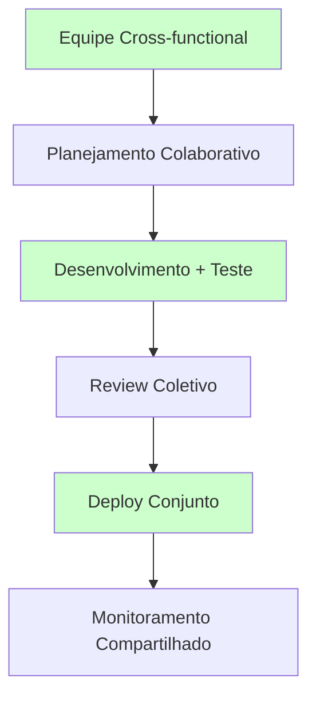

*Características:*
- **Responsabilidade Compartilhada:** Toda equipe é responsável pela qualidade
- **Comunicação Contínua:** Conversas face-a-face, pair programming, mob testing
- **Competências Distribuídas:** Conhecimento de teste distribuído por toda equipe
- **Ownership Coletivo:** Equipe inteira possui o produto e sua qualidade

**4. Transformação Técnica: De Manual para Automação Inteligente**

*Era Manual:*
- Testes executados manualmente por testadores especializados
- Documentação extensa de casos de teste
- Execução lenta e propensa a erros humanos
- Dificuldade de repetição e regressão

*Era da Automação Básica:*
- Scripts automatizados executam testes predefinidos
- Aceleração da execução e redução de erros
- Investimento inicial alto, mas ROI a longo prazo
- Foco em testes de regressão e casos repetitivos

*Era da Automação Inteligente (Estado Atual):*
- **AI-Driven Testing:** IA gera, executa e analisa testes
- **Self-Healing Tests:** Testes se adaptam automaticamente a mudanças
- **Visual Testing:** Comparação automatizada de interfaces
- **Chaos Engineering:** Automação de testes de resiliência

**Análise dos Trade-offs Evolutivos**

**Benefícios da Evolução:**

1. **Velocidade:** Feedback de dias/semanas para minutos/horas
2. **Qualidade:** Shift-left reduz defeitos em produção em 60-80%
3. **Custos:** Redução de 40-70% nos custos totais de desenvolvimento
4. **Satisfação:** Maior satisfação tanto de desenvolvedores quanto usuários

**Desafios da Transição:**

1. **Mudança Cultural:** Resistência a mudanças em responsabilidades estabelecidas
2. **Competências:** Necessidade de upskilling massivo das equipes
3. **Tooling:** Investimento significativo em ferramentas e infraestrutura
4. **Complexidade:** Aumento da complexidade técnica e organizacional

**Fatores Críticos de Sucesso na Evolução:**

1. **Liderança Comprometida:** Suporte executivo para transformação cultural
2. **Investimento em Pessoas:** Treinamento e desenvolvimento contínuo
3. **Automação Progressiva:** Transição gradual, não revolução
4. **Métricas Adaptativas:** Evolução das métricas junto com as práticas
5. **Experimentação Segura:** Ambiente que permite falhas e aprendizado

**Tendências Futuras da Evolução:**

1. **AI-First Testing:** IA como primeira linha de teste, humanos como supervisores
2. **Quantum Testing:** Exploração de computação quântica para teste de sistemas complexos
3. **Predictive Quality:** Predição de defeitos antes de sua introdução
4. **Continuous Experimentation:** Teste como experimentação científica contínua

### Bloco 3: A Natureza da Qualidade de Software

#### 2.3.1. Terminologia Essencial e Definições Formais

A compreensão rigorosa da qualidade de software exige uma **fundamentação conceitual precisa** que transcende definições intuitivas e estabelece bases teóricas sólidas para avaliação, medição e melhoria sistemática.

**Qualidade de Software: Definições Múltiplas e Convergentes**

*Definição Clássica de Juran:*
Joseph Juran, pioneiro da gestão da qualidade, define qualidade como **"adequação ao uso" (fitness for use)**. Esta definição enfatiza que a qualidade não é uma propriedade intrínseca absoluta, mas uma **relação contextual** entre as características do produto e as necessidades específicas dos usuários.

*Definição da ISO/IEC 25010:*
A norma internacional define qualidade como **"o grau em que um sistema, produto ou componente atende aos requisitos especificados e às necessidades e expectativas do cliente ou usuário"**. Esta definição introduz duas dimensões críticas:
1. **Conformidade Especificada:** Aderência a requisitos explicitamente documentados
2. **Satisfação Percebida:** Atendimento a necessidades implícitas e expectativas evolutivas

*Definição de Crosby (Zero Defeitos):*
Philip Crosby propõe qualidade como **"conformidade com requisitos"**, uma definição aparentemente mais restritiva que enfatiza a prevenção de defeitos e a importância da especificação precisa.

*Síntese Conceitual:*
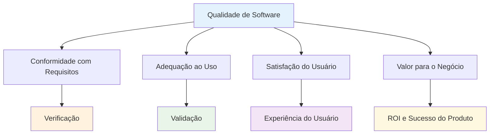

**Perspectivas Multidimensionais da Qualidade**

*Qualidade Transcendental:* Qualidade como excelência inata, reconhecível mas difícil de definir precisamente. Relevante para produtos premium onde a percepção de qualidade impacta valor de marca.

*Qualidade Baseada em Produto:* Qualidade como função de características mensuráveis e específicas. Alinha-se com métricas técnicas como performance, disponibilidade, precisão.

*Qualidade Baseada em Usuário:* Qualidade determinada pela satisfação e adequação às necessidades específicas de usuários individuais. Enfatiza usabilidade, acessibilidade, experiência.

*Qualidade Baseada em Produção:* Qualidade como conformidade com especificações e padrões durante o processo de desenvolvimento. Relaciona-se com maturidade de processo, controle de qualidade.

*Qualidade Baseada em Valor:* Qualidade como relação entre benefícios percebidos e custos incorridos. Considera dimensões econômicas e estratégicas.

**Defeito vs. Não-conformidade vs. Falha: Taxonomia Refinada**

*Defeito (Defect):*
Uma **imperfeição ou deficiência** em um produto de trabalho onde esse produto não atende aos seus requisitos ou especificações. Características distintivas:
- **Desvio Objetivo:** Discrepância mensurável entre implementação e especificação
- **Potencial de Impacto:** Pode ou não resultar em falha visível
- **Categorização:** Funcional, performance, usabilidade, segurança, etc.

*Não-conformidade (Non-conformity):*
**Falha em atender** a um requisito especificado, padrão ou expectativa documentada. Diferencia-se de defeito por:
- **Escopo Mais Amplo:** Inclui questões de processo, não apenas produto
- **Natureza Sistêmica:** Pode indicar problemas organizacionais ou metodológicos
- **Relevância Regulatória:** Frequentemente usado em contextos de compliance

*Falha (Failure):*
**Incapacidade** de um sistema ou componente de executar função requerida dentro de limites especificados. Características:
- **Manifestação Observable:** Desvio comportamental perceptível por usuários
- **Impacto Imediato:** Afeta diretamente a experiência ou resultado do usuário
- **Severidade Variável:** De inconvenientes menores até falhas catastróficas

*Relação Causal Refinada:*
```
Erro Humano → Defeito no Artefato → [Condições de Ativação] → Falha Observable
```

**Qualidade Intrínseca vs. Qualidade Extrínseca: Dicotomia Fundamental**

*Qualidade Intrínseca (Interna/Estrutural):*
Refere-se às **características arquitecturais e estruturais** do software que afetam sua manutenibilidade, extensibilidade e sustentabilidade técnica. Manifesta-se através de:

- **Qualidade do Código:** Legibilidade, modularidade, ausência de code smells
- **Arquitetura:** Baixo acoplamento, alta coesão, separation of concerns
- **Documentação:** Completude, atualização, clareza de especificações técnicas
- **Testabilidade:** Facilidade de criar e executar testes automatizados

*Métricas Típicas:*
- Complexidade ciclomática (McCabe)
- Índice de manutenibilidade
- Cobertura de código
- Densidade de comentários
- Violações de padrões de codificação

*Qualidade Extrínseca (Externa/Comportamental):*
Representa as **características perceptíveis pelos usuários** que determinam a aceitação e sucesso do produto no mercado. Inclui:

- **Funcionalidade:** Correção, completude, adequação aos requisitos
- **Usabilidade:** Facilidade de aprendizado, eficiência de uso, satisfação
- **Confiabilidade:** Disponibilidade, recuperação de falhas, maturidade
- **Performance:** Tempo de resposta, throughput, utilização de recursos

*Paradoxo da Qualidade Dupla:*
É possível (e comum) ter:
1. **Alta qualidade intrínseca, baixa qualidade extrínseca:** Software elegantemente arquitetado mas dificil de usar
2. **Baixa qualidade intrínseca, alta qualidade extrínseca:** Software funcional mas tecnicamente problemático (debt técnico alto)

*Sustentabilidade Temporal:*
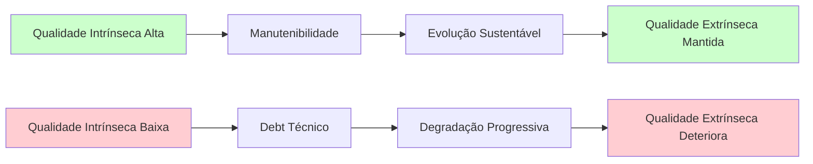

#### 2.3.2. Estrutura Conceitual: O Modelo de Qualidade ISO/IEC 25010

A norma **ISO/IEC 25010** representa o **consenso internacional** mais abrangente e rigoroso para a estruturação e avaliação da qualidade de software. Este modelo não é meramente descritivo, mas constitui um **framework operacional** que permite medição, comparação e melhoria sistemática da qualidade.

**Arquitetura Hierárquica do Modelo**

O modelo ISO 25010 organiza a qualidade em uma **hierarquia de três níveis**:
1. **Características:** Aspectos de alto nível da qualidade (8 características principais)
2. **Subcaracterísticas:** Refinamentos específicos de cada característica (31 subcaracterísticas)
3. **Métricas:** Medidas quantitativas e qualitativas específicas (centenas de métricas possíveis)

**Análise Detalhada das Características Principais**

**1. Adequação Funcional (Functional Suitability)**

*Definição Formal:* Grau em que um produto ou sistema fornece funções que atendem às necessidades declaradas e implícitas quando usado sob condições especificadas.

*Subcaracterísticas:*
- **Completude Funcional:** Grau em que o conjunto de funções cobre todas as tarefas e objetivos do usuário
- **Correção Funcional:** Grau em que um produto ou sistema fornece resultados corretos com o grau de precisão necessário
- **Adequação Funcional:** Grau em que as funções facilitam a realização de tarefas e objetivos específicos

*Exemplo de Métricas:*
```
Completude Funcional = (Funções Implementadas / Funções Requeridas) × 100%
Correção Funcional = (Resultados Corretos / Total de Resultados) × 100%
```

*Contextos de Aplicação:*
- **Sistemas Críticos:** Correção funcional aproxima-se de 100%
- **MVPs:** Completude funcional pode ser deliberadamente reduzida
- **Sistemas Legacy:** Adequação funcional pode degradar ao longo do tempo

**2. Confiabilidade (Reliability)**

*Definição Formal:* Grau em que um sistema, produto ou componente executa funções especificadas sob condições especificadas por um período especificado de tempo.

*Subcaracterísticas:*
- **Maturidade:** Grau em que um sistema atende às necessidades de confiabilidade sob operação normal
- **Disponibilidade:** Grau em que um sistema está operacional e acessível quando necessário
- **Tolerância a Falhas:** Grau em que um sistema opera conforme pretendido apesar de falhas de hardware ou software
- **Recuperabilidade:** Grau em que um produto pode recuperar dados afetados e restabelecer estado desejado após interrupção ou falha

*Modelagem Matemática da Confiabilidade:*
```
MTBF (Mean Time Between Failures) = Tempo Total de Operação / Número de Falhas
Disponibilidade = MTBF / (MTBF + MTTR)
onde MTTR = Mean Time To Recovery
```

*Padrões de Tolerância por Domínio:*
| Domínio | Disponibilidade Mínima | MTBF Típico | MTTR Máximo |
|---------|-------------------------|--------------|-------------|
| **Sistemas Financeiros** | 99.95% | 720 horas | 30 minutos |
| **E-commerce** | 99.9% | 168 horas | 60 minutos |
| **Aplicações Corporativas** | 99.5% | 100 horas | 4 horas |
| **Sistemas de Vida Crítica** | 99.999% | 8760 horas | 5 minutos |

**3. Usabilidade (Usability)**

*Definição Formal:* Grau em que um produto ou sistema pode ser usado por usuários específicos para atingir objetivos específicos com eficácia, eficiência e satisfação em um contexto específico de uso.

*Subcaracterísticas:*
- **Reconhecimento de Adequação:** Grau em que usuários podem reconhecer se um produto ou sistema é apropriado para suas necessidades
- **Capacidade de Aprendizado:** Grau em que um produto pode ser usado por usuários específicos para atingir objetivos específicos de aprendizado com eficácia, eficiência, liberdade de risco e satisfação
- **Operabilidade:** Grau em que um produto tem atributos que facilitam sua operação e controle
- **Proteção contra Erro do Usuário:** Grau em que um sistema protege usuários contra cometer erros
- **Estética da Interface do Usuário:** Grau em que uma interface permite interação agradável e satisfatória para o usuário
- **Acessibilidade:** Grau em que um produto pode ser usado por pessoas com características e capacidades mais amplas para atingir objetivos específicos em contexto específico de uso

*Métricas de Usabilidade:*
```
Eficácia = (Tarefas Completadas com Sucesso / Total de Tarefas Tentadas) × 100%
Eficiência = Eficácia / Tempo Médio por Tarefa
Satisfação = Score Médio em Escala de Satisfação (ex: 1-10)
```

**4. Eficiência de Desempenho (Performance Efficiency)**

*Definição Formal:* Performance relativa à quantidade de recursos usados sob condições estabelecidas.

*Subcaracterísticas:*
- **Comportamento em Relação ao Tempo:** Grau em que os tempos de resposta e processamento e taxas de throughput de um produto atendem aos requisitos
- **Utilização de Recursos:** Grau em que as quantidades e tipos de recursos utilizados por um produto atendem aos requisitos
- **Capacidade:** Grau em que os limites máximos de um parâmetro do produto atendem aos requisitos

*Modelagem de Performance:*
```
Throughput = Transações Processadas / Unidade de Tempo
Latência = Tempo entre Requisição e Primeira Resposta
Utilização de CPU = (CPU Ativa / CPU Total) × 100%
```

*Lei de Little aplicada ao Software:*
```
L = λ × W
onde:
L = Número médio de requisições no sistema
λ = Taxa média de chegada de requisições
W = Tempo médio no sistema (latência)
```

**5. Segurança (Security)**

*Definição Formal:* Grau em que um produto ou sistema protege informações e dados para que pessoas ou outros produtos ou sistemas tenham o grau de acesso apropriado aos seus tipos e níveis de autorização.

*Subcaracterísticas:*
- **Confidencialidade:** Grau em que um produto garante que dados sejam acessíveis apenas por aqueles autorizados a ter acesso
- **Integridade:** Grau em que um sistema previne acesso não autorizado ou modificação de programas ou dados
- **Não Repúdio:** Grau em que ações ou eventos podem ser comprovados como tendo ocorrido
- **Responsabilização:** Grau em que as ações de uma entidade podem ser rastreadas unicamente para a entidade
- **Autenticidade:** Grau em que a identidade de um sujeito ou recurso pode ser provada como sendo aquela alegada

*Framework de Análise de Ameaças:*
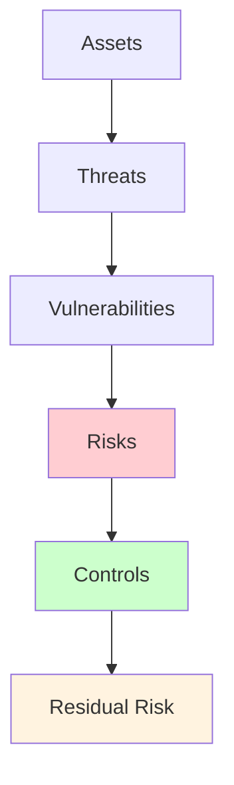

**6. Compatibilidade (Compatibility)**

*Definição Formal:* Grau em que um produto, sistema ou componente pode trocar informações com outros produtos, sistemas ou componentes, e/ou executar suas funções requeridas enquanto compartilha o mesmo ambiente de hardware ou software.

*Subcaracterísticas:*
- **Coexistência:** Grau em que um produto pode executar suas funções requeridas eficientemente enquanto compartilha ambiente e recursos com outros produtos
- **Interoperabilidade:** Grau em que dois ou mais sistemas podem trocar informações e usar as informações que foram trocadas

**7. Manutenibilidade (Maintainability)**

*Definição Formal:* Grau de eficácia e eficiência com que um produto ou sistema pode ser modificado pelos mantenedores pretendidos.

*Subcaracterísticas:*
- **Modularidade:** Grau em que um sistema é composto de componentes discretos de forma que mudanças em um componente tenham impacto mínimo em outros componentes
- **Reusabilidade:** Grau em que um ativo pode ser usado em mais de um sistema
- **Analisabilidade:** Grau de eficácia e eficiência com que é possível avaliar o impacto de uma mudança pretendida
- **Modificabilidade:** Grau em que um produto pode ser efetiva e eficientemente modificado sem introduzir defeitos
- **Testabilidade:** Grau de eficácia e eficiência com que critérios de teste podem ser estabelecidos e testes executados

*Métricas de Manutenibilidade:*
```
Índice de Manutenibilidade = 171 - 5.2 × ln(HV) - 0.23 × CC - 16.2 × ln(LOC)
onde:
HV = Halstead Volume
CC = Complexidade Ciclomática
LOC = Lines of Code
```

**8. Portabilidade (Portability)**

*Definição Formal:* Grau de eficácia e eficiência com que um sistema, produto ou componente pode ser transferido de um hardware, software ou outro ambiente operacional ou de uso para outro.

*Subcaracterísticas:*
- **Adaptabilidade:** Grau em que um produto pode ser efetiva e eficientemente adaptado para diferentes ambientes
- **Instalabilidade:** Grau de eficácia e eficiência com que um produto pode ser instalado e/ou desinstalado com sucesso
- **Substituibilidade:** Grau em que um produto pode substituir outro produto especificado para a mesma finalidade no mesmo ambiente

#### 2.3.3. Análise Crítica: Qualidade Percebida vs. Qualidade Intrínseca

A **dicotomia entre qualidade percebida e qualidade intrínseca** representa um dos **dilemas fundamentais** na engenharia de software moderna. Esta tensão não é meramente acadêmica, mas tem implicações profundas para decisões estratégicas, alocação de recursos e sustentabilidade a longo prazo dos produtos de software.

**Fundamentos Teóricos da Dicotomia**

*Qualidade Intrínseca (Internal Quality):*
Representa as **propriedades estruturais e arquiteturais** do software que determinam sua capacidade de evolução, manutenção e adaptação ao longo do tempo. É frequentemente **invisível aos usuários finais** mas crítica para a equipe de desenvolvimento e a sustentabilidade do produto.

*Qualidade Percebida (External Quality):*
Refere-se às **características experimentadas pelos usuários** durante a interação com o software. É diretamente observável e impacta imediatamente a satisfação do usuário e o sucesso comercial do produto.

**Análise de Stakeholders e Perspectivas Divergentes**

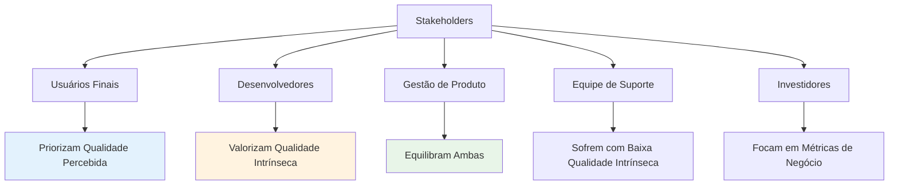

**Cenários de Tensão e Suas Implicações**

**Cenário 1: Alta Qualidade Intrínseca, Baixa Qualidade Percebida**

*Características:*
- Código elegantemente arquitetado com padrões de design sofisticados
- Documentação técnica exemplar e cobertura de testes abrangente
- Interface de usuário confusa ou funcionalidades inadequadas
- Performance subótima ou usabilidade problemática

*Exemplo Real:* Muitos projetos open-source acadêmicos demonstram excelência técnica mas falham em usabilidade.

*Consequências:*
- **Adoção Limitada:** Usuários rejeitam o produto independentemente da qualidade técnica
- **ROI Negativo:** Investimento técnico não se traduz em valor de negócio
- **Frustração da Equipe:** Desenvolvedores não compreendem rejeição do usuário
- **Desperdício de Recursos:** Esforço técnico alto sem retorno comercial

**Cenário 2: Baixa Qualidade Intrínseca, Alta Qualidade Percebida**

*Características:*
- Interface intuitiva e funcionalidades que atendem necessidades do usuário
- Performance adequada para casos de uso principais
- Código espaguete, arquitetura monolítica, débito técnico alto
- Dificuldade extrema para manutenção e evolução

*Exemplo Real:* Muitas startups de sucesso inicial que posteriormente enfrentam "technical bankruptcy".

*Consequências Temporais:*
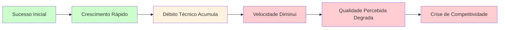

*Fases de Degradação:*
1. **Honeymoon Phase (0-12 meses):** Funcionalidade mascarada problemas técnicos
2. **Velocity Decline (12-24 meses):** Novas features levam progressivamente mais tempo
3. **Quality Erosion (24-36 meses):** Bugs aumentam, performance degrada
4. **Technical Bankruptcy (36+ meses):** Reescrita completa necessária

**Cenário 3: O Ideal Equilibrado**

*Características:*
- Arquitetura limpa que suporta evolução sustentável
- Interface e funcionalidades que encantam usuários
- Processo de desenvolvimento que mantém ambas as qualidades
- Cultura organizacional que valoriza excelência técnica e orientação ao usuário

*Estratégias para Alcançar Equilíbrio:*

1. **Definition of Done Dual:**
   ```
   Feature não está "pronta" até que:
   ✓ Satisfaça critérios de aceitação do usuário
   ✓ Atenda padrões de qualidade técnica estabelecidos
   ✓ Tenha cobertura de testes adequada
   ✓ Passe por revisão de código
   ✓ Seja documentada apropriadamente
   ```

2. **Quality Gates Balanceados:**
   - Métricas de usuário: satisfaction scores, task completion rates
   - Métricas técnicas: code coverage, maintainability index, security vulnerabilities
   - Métricas de negócio: conversion rates, churn, support tickets

3. **Refactoring Contínuo:**
   - 15-20% do tempo de desenvolvimento dedicado a melhoria técnica
   - Refactoring como parte integral de cada feature
   - "Boy Scout Rule": deixar código melhor do que encontrou

**Análise Econômica dos Trade-offs**

**Modelo de Custo Total de Propriedade (TCO):**

```
TCO = Custo_Desenvolvimento + Custo_Manutenção + Custo_Evolução + Custo_Oportunidade

onde:
Custo_Manutenção ∝ 1/Qualidade_Intrínseca
Custo_Oportunidade ∝ 1/Qualidade_Percebida
```

**Otimização Multi-objetivo:**

O problema pode ser formalizado como otimização multi-objetivo:

**Maximizar:**
- Satisfação do Usuário (função da qualidade percebida)
- Produtividade de Desenvolvimento (função da qualidade intrínseca)
- Valor de Negócio (função de ambas)

**Sujeito a:**
- Restrições orçamentárias
- Restrições temporais
- Competências da equipe
- Pressões competitivas

**Estratégias de Mitigação dos Trade-offs**

**1. Technical Debt Management:**
- **Debt Visualization:** Ferramentas como SonarQube para tornar débito visível
- **Debt Budgeting:** Percentual fixo de sprints dedicado a pagamento de débito
- **Debt Classification:** Priorizar débito que impacta qualidade percebida

**2. User-Centric Technical Decisions:**
- **Performance Budgets:** Limites técnicos baseados em experiência do usuário
- **Accessibility First:** Qualidade intrínseca que melhora qualidade percebida
- **Progressive Enhancement:** Construir base sólida, adicionar camadas de experiência

**3. Metrics-Driven Balance:**
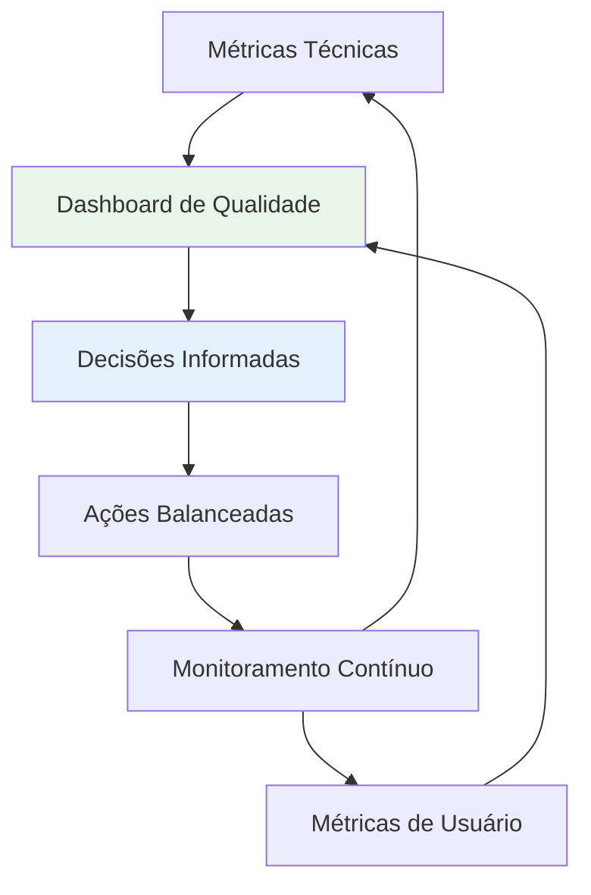

**Indicadores de Alerta para Desequilíbrio:**

*Sinais de Qualidade Intrínseca Negligenciada:*
- Tempo para implementar features aumenta consistentemente
- Número de bugs cresce exponencialmente
- Desenvolvedores relutantes em modificar certas partes do código
- Time-to-market degrada progressivamente

*Sinais de Qualidade Percebida Negligenciada:*
- Métricas de engajamento do usuário em declínio
- Aumento em tickets de suporte e reclamações
- Scores de satisfaction/NPS em queda
- Competidores ganhando market share por experiência superior

**Conclusão: A Qualidade como Sistema Holístico**

A dicotomia entre qualidade percebida e intrínseca é, em última análise, uma **falsa dicotomia**. Qualidade de software sustentável é um **sistema holístico** onde ambas as dimensões se reforçam mutuamente:

- **Qualidade intrínseca alta** → facilita implementação de melhorias na experiência do usuário
- **Qualidade percebida alta** → justifica investimento em qualidade técnica
- **Processo equilibrado** → sustenta ambas as dimensões ao longo do tempo

O desafio da engenharia de software moderna não é escolher entre qualidade intrínseca e percebida, mas desenvolver **competências organizacionais e técnicas** que permitam excelência sustentável em ambas as dimensões.

### Bloco 4: A Economia da Qualidade

#### 2.4.1. Estrutura Conceitual: A Curva de Boehm

A **Curva de Boehm**, formulada pelo cientista da computação Barry Boehm em 1981 e refinada em estudos subsequentes, constitui um dos **modelos econômicos mais fundamentais** da engenharia de software. Esta curva não é meramente uma observação empírica, mas representa um **princípio econômico universal** que governa o custo da qualidade em sistemas complexos.

**Fundamentos Teóricos da Curva**

*Princípio Fundamental:*
O custo para **detectar, diagnosticar e corrigir** um defeito aumenta exponencialmente em função do tempo transcorrido entre sua introdução e sua descoberta. Esta relação não é linear nem apenas multiplicativa, mas genuinamente **exponencial**, o que tem implicações profundas para estratégias de desenvolvimento e investimento em qualidade.

*Bases Empíricas Originais:*
O estudo original de Boehm analisou mais de 60 projetos de software ao longo de duas décadas, estabelecendo que o fator de crescimento típico varia entre **5x a 100x** dependendo da fase onde o defeito é descoberto.

**Anatomia Detalhada das Fases de Descoberta**

**Fase 1: Requisitos e Análise**
*Tipos de Defeitos:*
- Requisitos ambíguos ou contraditórios
- Omissões de funcionalidades críticas
- Interpretações incorretas das necessidades do usuário

*Processo de Correção:*
1. **Detecção:** Revisão por stakeholders ou análise de consistência
2. **Diagnóstico:** Discussão para esclarecer intenção original
3. **Correção:** Atualização de documentos de requisitos
4. **Propagação:** Comunicação para equipe de desenvolvimento

*Custo Típico:* 1x (unidade base)

**Fase 2: Design e Arquitetura**
*Tipos de Defeitos:*
- Escolhas arquiteturais inadequadas
- Violações de princípios de design
- Inconsistências entre componentes

*Processo de Correção:*
1. **Detecção:** Revisões de design ou prototipagem
2. **Diagnóstico:** Análise de impacto arquitetural
3. **Correção:** Redesign de componentes ou interfaces
4. **Propagação:** Atualização de especificações e diagramas

*Custo Típico:* 3-5x

**Fase 3: Implementação (Codificação)**
*Tipos de Defeitos:*
- Bugs de lógica de programação
- Violações de padrões de codificação
- Problemas de integração entre módulos

*Processo de Correção:*
1. **Detecção:** Compilação, análise estática ou testes unitários
2. **Diagnóstico:** Debugging e análise de código
3. **Correção:** Modificação do código-fonte
4. **Propagação:** Commit e integração

*Custo Típico:* 10-15x

**Fase 4: Teste de Sistema**
*Tipos de Defeitos:*
- Falhas de integração entre subsistemas
- Problemas de performance ou usabilidade
- Inconsistências com requisitos

*Processo de Correção:*
1. **Detecção:** Execução de casos de teste formais
2. **Diagnóstico:** Investigação através de múltiplos layers
3. **Correção:** Modificações em código, configuração ou dados
4. **Propagação:** Re-teste de regressão e re-validação

*Custo Típico:* 20-40x

**Fase 5: Produção e Operação**
*Tipos de Defeitos:*
- Falhas críticas em ambiente real
- Problemas de escalabilidade não detectados
- Incompatibilidades com ambiente de produção

*Processo de Correção:*
1. **Detecção:** Monitoramento, relatórios de usuários ou incidentes
2. **Diagnóstico:** Análise forense, reprodução em ambiente controlado
3. **Correção:** Hotfixes, patches ou rollbacks
4. **Propagação:** Deploy emergencial, comunicação com usuários, gestão de crise

*Custo Típico:* 50-200x

```mermaid
graph LR
    A[Requisitos<br/>Custo: 1x] --> B[Design<br/>Custo: 3-5x]
    B --> C[Codificação<br/>Custo: 10-15x]
    C --> D[Teste Sistema<br/>Custo: 20-40x]
    D --> E[Produção<br/>Custo: 50-200x]
    
    style A fill:#ccffcc
    style B fill:#fff3e0
    style C fill:#ffe0b2
    style D fill:#ffcdd2
    style E fill:#ffcdd2
```

#### 2.4.2. Modelagem Matemática: O Custo Exponencial do Defeito

**Modelo Matemático Fundamental**

A relação de custo pode ser expressa através da função exponencial:

$$C(t) = C_0 \cdot e^{\lambda \cdot t}$$

Onde:
- $C(t)$ = Custo de correção no tempo $t$
- $C_0$ = Custo base de correção (fase de requisitos)
- $\lambda$ = Taxa de crescimento do custo (constante específica do projeto)
- $t$ = Tempo desde introdução do defeito (em fases ou unidades temporais)

**Modelo Alternativo por Fases Discretas**

Para aplicações práticas, um modelo discreto por fases é mais útil:

$$C(f) = C_0 \cdot k^{(f-1)}$$

Onde:
- $f$ = Número da fase (1 = Requisitos, 2 = Design, etc.)
- $k$ = Fator multiplicativo entre fases

**Análise Paramétrica do Fator $k$**

O fator $k$ varia significativamente baseado em características do projeto:

| Tipo de Projeto | Fator k | Justificativa |
|------------------|---------|---------------|
| **Web Applications** | 3-5 | Deploy rápido, ambientes similares |
| **Enterprise Software** | 5-8 | Complexidade de integração |
| **Embedded Systems** | 8-15 | Hardware customizado, debug complexo |
| **Safety-Critical Systems** | 10-25 | Certificação, testes extensivos |
| **Aerospace/Defense** | 15-50 | Regulamentação, ciclos longos |

**Modelagem Probabilística dos Defeitos**

Considerando que defeitos são introduzidos de forma probabilística:

$$E[Custo_{Total}] = \sum_{f=1}^{n} P(defeito\_em\_f) \cdot C(f) \cdot N(f)$$

Onde:
- $P(defeito\_em\_f)$ = Probabilidade de introduzir defeito na fase $f$
- $N(f)$ = Número esperado de defeitos descobertos na fase $f$

**Análise de Sensibilidade: Impacto do Shift-Left**

O impacto econômico de antecipar descoberta de defeitos:

$$Economia = \sum_{i=1}^{n} D_i \cdot [C(f_{depois}) - C(f_{antes})]$$

Onde:
- $D_i$ = Número de defeitos transferidos da fase posterior para anterior
- $C(f_{depois})$ = Custo na fase posterior original
- $C(f_{antes})$ = Custo na fase anterior (shift-left)

**Exemplo Quantitativo Detalhado**

*Cenário:* Projeto de sistema e-commerce com orçamento de R$ 1,000,000

*Parâmetros:*
- $C_0 = R\$ 1,000$ (custo base por defeito)
- $k = 6$ (fator multiplicativo)
- 100 defeitos introduzidos ao longo do projeto

*Distribuição Original (sem shift-left):*
- 10 defeitos descobertos em Requisitos: $10 \times 1,000 = R\$ 10,000$
- 15 defeitos descobertos em Design: $15 \times 6,000 = R\$ 90,000$
- 25 defeitos descobertos em Codificação: $25 \times 36,000 = R\$ 900,000$
- 30 defeitos descobertos em Teste: $30 \times 216,000 = R\$ 6,480,000$
- 20 defeitos descobertos em Produção: $20 \times 1,296,000 = R\$ 25,920,000$

**Custo Total Original: R$ 33,400,000**

*Distribuição com Shift-Left Agressivo:*
- 40 defeitos descobertos em Requisitos: $40 \times 1,000 = R\$ 40,000$
- 30 defeitos descobertos em Design: $30 \times 6,000 = R\$ 180,000$
- 20 defeitos descobertos em Codificação: $20 \times 36,000 = R\$ 720,000$
- 8 defeitos descobertos em Teste: $8 \times 216,000 = R\$ 1,728,000$
- 2 defeitos descobertos em Produção: $2 \times 1,296,000 = R\$ 2,592,000$

**Custo Total com Shift-Left: R$ 5,260,000**

**Economia Obtida: R$ 28,140,000 (84% de redução)**

#### 2.4.3. Análise Crítica: O ROI do Investimento em Qualidade

A **análise de Retorno sobre Investimento (ROI)** em qualidade de software representa um dos **desafios analíticos mais complexos** na gestão de projetos tecnológicos. Esta complexidade deriva da natureza multifacetada dos benefícios da qualidade e da dificuldade de quantificar impactos que se manifestam ao longo do tempo.

**Framework de Análise Econômica da Qualidade**

**Componentes do Investimento em Qualidade**

*Custos Diretos (Visible Costs):*
1. **Recursos Humanos:** Salários de QA, desenvolvedores dedicados a testes
2. **Ferramentas e Infraestrutura:** Licenses de ferramentas, ambientes de teste
3. **Treinamento:** Capacitação em metodologias e ferramentas de qualidade
4. **Processos:** Tempo gasto em revisões, documentação, planejamento

*Custos Indiretos (Hidden Costs):*
1. **Overhead de Comunicação:** Tempo para alinhamento entre equipes
2. **Context Switching:** Perda de produtividade ao alternar entre desenvolvimento e teste
3. **Paralelização:** Recursos ociosos durante dependências de qualidade

**Componentes dos Benefícios da Qualidade**

*Benefícios Diretos Quantificáveis:*
1. **Redução de Custos de Correção:** Conforme modelado pela Curva de Boehm
2. **Redução de Retrabalho:** Menos tempo gasto corrigindo defeitos
3. **Redução de Suporte:** Menor volume de tickets e chamados
4. **Eficiência de Desenvolvimento:** Maior velocidade devido a base código estável

*Benefícios Indiretos de Difícil Quantificação:*
1. **Satisfação do Cliente:** Maior retenção e lifetime value
2. **Reputação da Marca:** Confiabilidade melhora percepção no mercado
3. **Produtividade da Equipe:** Desenvolvedores mais satisfeitos e produtivos
4. **Flexibilidade Competitiva:** Capacidade de responder rapidamente a mudanças

**Modelos de Cálculo de ROI**

**Modelo 1: ROI Simples (Foco em Redução de Custos)**

$$ROI_{simples} = \frac{Custos\_Evitados - Investimento\_Qualidade}{Investimento\_Qualidade} \times 100\%$$

*Exemplo:*
- Investimento em qualidade: R$ 500,000
- Custos evitados (defeitos não encontrados em produção): R$ 2,000,000
- ROI = (2,000,000 - 500,000) / 500,000 = 300%

**Modelo 2: ROI Abrangente (Total Economic Impact)**

$$ROI_{abrangente} = \frac{(Benefícios\_Diretos + Benefícios\_Indiretos) - (Custos\_Diretos + Custos\_Indiretos)}{Custos\_Diretos + Custos\_Indiretos} \times 100\%$$

**Modelo 3: Net Present Value (NPV) para Benefícios Futuros**

$$NPV = \sum_{t=1}^{n} \frac{Benefício_t - Custo_t}{(1 + r)^t}$$

Onde:
- $r$ = Taxa de desconto (custo de capital)
- $t$ = Período de tempo
- $n$ = Horizonte de análise

**Análise de Cenários por Tipo de Investimento**

**Cenário 1: Test-Driven Development (TDD)**

*Investimento:*
- Treinamento inicial: R$ 100,000
- Redução de velocidade inicial (20% nos primeiros 6 meses): R$ 300,000
- Ferramentas e infraestrutura: R$ 50,000
- **Total: R$ 450,000**

*Benefícios (anuais):*
- Redução de 70% em bugs de produção: R$ 800,000
- Aumento de 40% na velocidade de refactoring: R$ 200,000
- Redução de 50% em tempo de debugging: R$ 300,000
- **Total Anual: R$ 1,300,000**

*ROI Anual: (1,300,000 - 450,000) / 450,000 = 189%*

**Cenário 2: Automação de Testes de Regressão**

*Investimento:*
- Desenvolvimento inicial de automação: R$ 800,000
- Ferramentas e infraestrutura: R$ 200,000
- Manutenção anual: R$ 150,000
- **Total Primeiro Ano: R$ 1,150,000**

*Benefícios (anuais):*
- Redução de 90% no tempo de testes de regressão: R$ 600,000
- Detecção mais rápida de regressões: R$ 400,000
- Liberação de QA manual para testes exploratórios: R$ 300,000
- **Total Anual: R$ 1,300,000**

*ROI Primeiro Ano: (1,300,000 - 1,150,000) / 1,150,000 = 13%*
*ROI Anos Subsequentes: (1,300,000 - 150,000) / 150,000 = 767%*

**Cenário 3: Implementação de Code Review Sistemático**

*Investimento:*
- Redução inicial de produtividade (25%): R$ 500,000
- Ferramentas e processo: R$ 50,000
- **Total: R$ 550,000**

*Benefícios (anuais):*
- Redução de 60% em defeitos injetados: R$ 700,000
- Transferência de conhecimento (15% melhoria produtividade): R$ 300,000
- Melhor design e arquitetura (20% redução complexidade): R$ 200,000
- **Total Anual: R$ 1,200,000**

*ROI: (1,200,000 - 550,000) / 550,000 = 118%*

**Fatores Críticos que Afetam ROI**

**1. Timing do Investimento**
```mermaid
graph LR
    A[Investimento Precoce] --> B[ROI Alto]
    C[Investimento Tardio] --> D[ROI Baixo/Negativo]
    E[Sistema Legacy] --> F[ROI Complexo]
    
    style A fill:#ccffcc
    style B fill:#ccffcc
    style C fill:#ffcdd2
    style D fill:#ffcdd2
    style F fill:#fff3e0
```

**2. Maturidade da Organização**

| Nível de Maturidade | ROI Esperado | Tempo para Break-even |
|---------------------|---------------|----------------------|
| **Caótico (Ad-hoc)** | 200-500% | 3-6 meses |
| **Repetível** | 100-200% | 6-12 meses |
| **Definido** | 50-100% | 12-18 meses |
| **Gerenciado** | 20-50% | 18-24 meses |
| **Otimizado** | 10-20% | 24+ meses |

**3. Complexidade do Domínio**

*Alta Complexidade (Fintech, Healthcare):*
- ROI potencial mais alto devido a custo elevado de defeitos
- Período de payback mais longo devido a requisitos regulatórios
- Maior necessidade de documentação e rastreabilidade

*Baixa Complexidade (Apps simples):*
- ROI potencial menor devido a custo baixo de defeitos
- Período de payback mais rápido
- Foco em automação e velocidade

**Armadilhas Comuns na Análise de ROI**

**1. Viés de Confirmação**
- Superestimar benefícios e subestimar custos
- Ignorar custos ocultos e complexidade de implementação
- Não considerar curva de aprendizado

**2. Horizonte Temporal Inadequado**
- Avaliar ROI apenas no curto prazo
- Não considerar benefícios acumulativos
- Ignorar custos de manutenção a longo prazo

**3. Atribuição Incorreta**
- Atribuir melhorias à qualidade quando podem ser causadas por outros fatores
- Não isolar impacto específico de investimentos em qualidade
- Dupla contagem de benefícios

**Framework para Comunicação de ROI para Stakeholders**

**Para Executivos:**
- Foco em métricas de negócio: time-to-market, customer satisfaction, market share
- Comparação com investimentos alternativos
- Análise de risco: custo da não-qualidade

**Para Gerentes de Produto:**
- Impacto na velocidade de entrega de features
- Redução em trabalho não planejado
- Melhoria na previsibilidade

**Para Desenvolvedores:**
- Redução em debugging e retrabalho
- Melhoria na satisfação e produtividade
- Facilidade de manutenção e evolução

**Conclusão: Qualidade como Investimento Estratégico**

A análise de ROI demonstra que investimentos bem planejados em qualidade não são **custos operacionais**, mas **investimentos estratégicos** que geram retornos substanciais. O desafio está em:

1. **Mensuração Adequada:** Desenvolver métricas que capturem valor real
2. **Timing Apropriado:** Investir cedo no ciclo de vida do produto
3. **Abordagem Sistemática:** Não apenas ferramentas, mas processo e cultura
4. **Comunicação Eficaz:** Articular valor para diferentes stakeholders
5. **Melhoria Contínua:** Refinar abordagem baseada em resultados medidos

---

## Seção 3: Aplicação Prática e Implementação

### 3.1. Estudo de Caso Guiado: Analisando o "FoodDash" sob a Ótica da ISO 25010

Para consolidar os conceitos teóricos apresentados na Seção 2, desenvolveremos um **estudo de caso abrangente e sistemático** que demonstra a aplicação prática dos princípios de qualidade de software no contexto de um sistema real. O "FoodDash" representa um aplicativo de entrega de comida que será analisado através da **lente metodológica da ISO/IEC 25010**, demonstrando como cada característica de qualidade se traduz em estratégias de teste concretas e mensuráveis.

**Contextualização do Sistema FoodDash**

*Visão Geral do Produto:*
O FoodDash é um aplicativo móvel multiplataforma (iOS/Android) com backend na nuvem que conecta consumidores, restaurantes e entregadores em um **ecossistema digital integrado**. O sistema processa aproximadamente 50.000 pedidos diários, opera em 15 cidades brasileiras e possui base de usuários de 2.5 milhões de pessoas.

*Arquitetura Sistêmica:*
```mermaid
graph TD
    A[Aplicativo Cliente] --> B[API Gateway]
    C[Aplicativo Restaurante] --> B
    D[Aplicativo Entregador] --> B
    
    B --> E[Microserviço de Usuários]
    B --> F[Microserviço de Pedidos]
    B --> G[Microserviço de Pagamentos]
    B --> H[Microserviço de Geolocalização]
    
    E --> I[Banco de Dados Usuários]
    F --> J[Banco de Dados Pedidos]
    G --> K[Gateway de Pagamento Externo]
    H --> L[Serviço de Mapas]
    
    style A fill:#e3f2fd
    style C fill:#fff3e0
    style D fill:#e8f5e8
    style B fill:#f3e5f5
```

*Stakeholders Críticos:*
1. **Consumidores:** Buscam conveniência, variedade e confiabilidade
2. **Restaurantes:** Necessitam visibilidade, eficiência operacional e pagamentos pontuais
3. **Entregadores:** Valorizam flexibilidade, ganhos justos e facilidade de uso
4. **Empresa:** Foca em escalabilidade, rentabilidade e diferenciação competitiva

#### **Passo 1: Análise de Adequação Funcional**

*Questão Central:* **"O FoodDash executa corretamente todas as funções prometidas aos usuários?"**

**Decomposição da Adequação Funcional:**

*1.1. Completude Funcional:*
Avaliação sistemática se todas as funcionalidades requeridas estão implementadas:

**Jornada do Consumidor:**
- Cadastro e autenticação (email, telefone, redes sociais)
- Busca e filtros de restaurantes (localização, tipo de cozinha, faixa de preço, avaliações)
- Navegação no cardápio e personalização de itens
- Gestão do carrinho de compras (adicionar, remover, modificar quantidades)
- Processo de checkout (endereço, forma de pagamento, cupons)
- Acompanhamento do pedido em tempo real
- Avaliação pós-entrega e suporte

**Estratégia de Teste para Completude:**
```
Métrica: Cobertura de Requisitos = (Requisitos Testados / Requisitos Totais) × 100%

Processo de Verificação:
1. Mapear todos os 847 requisitos funcionais documentados
2. Criar matriz de rastreabilidade requisito → caso de teste
3. Executar teste de cobertura end-to-end para cada jornada crítica
4. Validar que 100% dos requisitos críticos possuem testes aprovados
```

*1.2. Correção Funcional:*
Verificação se o sistema produz resultados precisos conforme especificado:

**Caso de Teste Detalhado: Cálculo de Preço Total**

*Cenário:* Cliente adiciona múltiplos itens com diferentes promoções e aplica cupom de desconto

*Especificação Matemática:*
```
Preço_Total = Σ(Item_i × Quantidade_i × (1 - Desconto_Item_i)) 
              + Taxa_Entrega 
              - Desconto_Cupom 
              + Taxas_Adicionais

Onde:
- Desconto_Item_i aplicado apenas se condições promocionais atendidas
- Taxa_Entrega varia por distância e horário (algoritmo dinâmico)
- Desconto_Cupom limitado por valor mínimo e máximo
- Taxas_Adicionais incluem taxa de serviço e impostos locais
```

*Implementação do Teste:*
**Dados de Entrada:**
- 3 Hamburgers Premium (R$ 25,00 cada) com promoção "Leve 3, Pague 2"
- 2 Refrigerantes (R$ 5,00 cada) sem promoção
- Taxa de entrega: R$ 8,00 (2.5km, horário normal)
- Cupom "PRIMEIRA10": 10% de desconto, mín. R$ 50,00, máx. R$ 15,00
- Taxa de serviço: 10% sobre subtotal

**Cálculo Esperado:**
```
Subtotal Hamburgers: (3 × R$ 25,00) × (2/3) = R$ 50,00  [promoção aplicada]
Subtotal Refrigerantes: 2 × R$ 5,00 = R$ 10,00
Subtotal Produtos: R$ 60,00
Taxa Serviço: R$ 60,00 × 0.10 = R$ 6,00
Subtotal + Taxa Serviço: R$ 66,00
Taxa Entrega: R$ 8,00
Total antes Cupom: R$ 74,00
Desconto Cupom: min(R$ 74,00 × 0.10, R$ 15,00) = R$ 7,40
TOTAL FINAL: R$ 66,60
```

*Critério de Aprovação:* Sistema deve calcular exatamente R$ 66,60 ou apresentar diferença ≤ R$ 0,01 (tolerância para arredondamentos)

*1.3. Adequação Funcional:*
Avaliação se as funções facilitam efetivamente as tarefas dos usuários:

**Análise de Eficiência de Tarefas:**
- **Tempo para Primeiro Pedido:** Meta <3 minutos para usuário experiente
- **Taxa de Conversão:** >15% dos visitantes completam pedido
- **Abandono de Carrinho:** <25% dos carrinhos preenchidos são abandonados

#### **Passo 2: Análise de Usabilidade**

*Questão Central:* **"Quão fácil e satisfatória é a interação com o FoodDash para diferentes perfis de usuário?"**

**Metodologia de Avaliação de Usabilidade:**

*2.1. Teste de Usabilidade Controlado:*

**Perfil dos Participantes:**
- 30 participantes estratificados por idade (18-25, 26-35, 36-50, 50+)
- Experiência tecnológica variada (novatos, intermediários, avançados)
- 50% nunca utilizaram apps de delivery, 50% usuários experientes

**Tarefas Críticas de Teste:**
1. **Cadastro Inicial:** "Crie uma conta usando seu email"
2. **Busca de Restaurante:** "Encontre um restaurante japonês que entregue em até 30 minutos"
3. **Montagem do Pedido:** "Adicione 2 temakis, 1 yakisoba e 1 refrigerante ao carrinho"
4. **Aplicação de Promoção:** "Use o cupom 'BEMVINDO15' no seu pedido"
5. **Finalização:** "Complete o pedido com pagamento via cartão de crédito"

**Métricas de Usabilidade:**
```
Eficácia = (Tarefas Completadas com Sucesso / Total de Tarefas Tentadas) × 100%
Meta: ≥85% para usuários experientes, ≥70% para novatos

Eficiência = Tarefas por Minuto
Meta: ≥2 tarefas/minuto para jornada completa

Satisfação = Score médio em escala Likert (1-7)
Meta: ≥5.5 para experiência geral
```

*2.2. Análise Heurística Sistemática:*

**Aplicação das Heurísticas de Nielsen ao FoodDash:**

1. **Visibilidade do Status do Sistema:**
   - **Análise:** Durante busca, sistema exibe indicador de carregamento com estimativa de tempo
   - **Achado:** Ausência de feedback durante aplicação de filtros complexos
   - **Recomendação:** Implementar loading states para todas as operações >1 segundo

2. **Correspondência com o Mundo Real:**
   - **Análise:** Terminologia alinhada com jargão gastronômico familiar
   - **Achado:** Ícones de categoria de comida pouco intuitivos para usuários seniores
   - **Recomendação:** Testes A/B com ícones + labels vs. ícones apenas

3. **Controle e Liberdade do Usuário:**
   - **Análise:** Função "Cancelar Pedido" disponível até confirmaão do restaurante
   - **Achado:** Impossibilidade de editar pedido após confirmação inicial
   - **Recomendação:** Implementar janela de 2 minutos para modificações

*2.3. Teste de Acessibilidade (WCAG 2.1 AA):**

**Verificação de Conformidade:**
- **Contraste de Cores:** Razão mínima 4.5:1 para texto normal, 3:1 para texto grande
- **Navegação por Teclado:** Todos os elementos interativos acessíveis via Tab
- **Leitores de Tela:** Compatibilidade testada com NVDA, JAWS e VoiceOver
- **Tamanho dos Alvos:** Botões ≥44px × 44px conforme diretrizes de toque

#### **Passo 3: Análise de Eficiência de Desempenho**

*Questão Central:* **"O FoodDash mantém performance aceitável sob diferentes condições de carga e uso?"**

**Estratégia de Teste de Performance Multi-dimensional:**

*3.1. Teste de Carga (Load Testing):*

**Cenário de Carga Normal:**
```
Perfil de Usuários Simultâneos:
- Navegação/Busca: 15.000 usuários
- Checkout Ativo: 2.000 usuários
- Acompanhamento Pedido: 8.000 usuários
- Pagamento: 500 usuários

Padrão de Tráfico:
- Horário Pico: 19h-21h (120% da carga base)
- Horário Normal: 11h-14h (100% da carga base)
- Horário Baixo: 02h-06h (20% da carga base)
```

**Critérios de Performance:**
```
Tempo de Resposta (95º percentil):
- API de Busca: ≤800ms
- Processo de Checkout: ≤1.2s
- Atualizações de Status: ≤300ms
- Carregamento de Imagens: ≤2s

Throughput:
- Pedidos/segundo: ≥500 pedidos/s no pico
- Transações de Pagamento: ≥100 transações/s
- Updates de Geolocalização: ≥10.000 updates/s

Utilização de Recursos:
- CPU (servidores): ≤70% em carga pico
- Memória: ≤80% da capacidade disponível
- Banda de Rede: ≤60% da capacidade contratada
```

*3.2. Teste de Estresse (Stress Testing):*

**Cenário de Black Friday:**
Simular 400% da carga normal para identificar pontos de quebra:

```bash
# Configuração de Teste de Estresse com k6
export K6_PROMETHEUS_RW_SERVER_URL=http://prometheus:9090/api/v1/write

k6 run --out experimental-prometheus-rw stress_test_fooddash.js
```

**Análise de Degradação Graceful:**
- **200% carga:** Performance degrada 15%, sem falhas
- **300% carga:** Performance degrada 35%, timeouts ocasionais
- **400% carga:** Performance degrada 60%, erro rate <5%
- **500% carga:** Sistema deve manter funcionalidades críticas (pagamento, pedidos ativos)

*3.3. Modelagem Matemática de Performance:*

**Lei de Little aplicada ao FoodDash:**
```
L = λ × W
Onde:
L = Número médio de pedidos no sistema
λ = Taxa de chegada de pedidos (pedidos/segundo)
W = Tempo médio de processamento (segundos)

Exemplo Prático:
Se L = 1000 pedidos processando simultaneamente
E λ = 50 pedidos/segundo chegando
Então W = L/λ = 1000/50 = 20 segundos médios por pedido
```

**Teoria das Filas para Otimização:**
```
Para um sistema M/M/c (Markov arrival/Markov service/c servers):
ρ = λ/(μ×c)  [utilização do sistema]
Onde μ = taxa de serviço por servidor

Meta: Manter ρ <0.7 para performance aceitável
```

#### **Passo 4: Análise de Segurança**

*Questão Central:* **"Os dados e transações no FoodDash estão adequadamente protegidos contra ameaças internas e externas?"**

**Framework de Análise de Segurança:**

*4.1. Análise de Ameaças (STRIDE):*

**Spoofing (Falsificação de Identidade):**
- **Ameaça:** Atacante cria contas falsas para explorar promoções
- **Controle:** Verificação de telefone obrigatória + análise comportamental
- **Teste:** Tentar criar 100 contas com números inexistentes ou duplicados

**Tampering (Violação de Integridade):**
- **Ameaça:** Manipulação de preços durante transmissão
- **Controle:** HMAC nos payloads críticos + validação server-side
- **Teste:** Interceptar requisições com Burp Suite e tentar modificar valores

**Repudiation (Não-repúdio):**
- **Ameaça:** Usuário nega ter feito pedido ou pagamento
- **Controle:** Logs auditáveis + assinatura digital em transações
- **Teste:** Verificar rastro completo de auditoria para cada transação

**Information Disclosure (Vazamento de Informações):**
- **Ameaça:** Exposição de dados pessoais ou de cartão de crédito
- **Controle:** Criptografia AES-256 + tokenização de dados sensíveis
- **Teste:** Análise de tráfego de rede + pen test em APIs

**Denial of Service (Negação de Serviço):**
- **Ameaça:** Sobrecarga intencional do sistema
- **Controle:** Rate limiting + WAF + CDN com proteção DDoS
- **Teste:** Teste de carga maliciosa com padrões de ataque reais

**Elevation of Privilege (Elevação de Privilégios):**
- **Ameaça:** Usuário comum acessa dados administrativos
- **Controle:** RBAC rigoroso + principle of least privilege
- **Teste:** Fuzzing de endpoints administrativos + teste de bypass

*4.2. Teste de Penetração Dirigido:*

**Fases do Pen Test:**
1. **Reconnaissance:** Coleta de informações públicas sobre FoodDash
2. **Scanning:** Identificação de portas abertas e serviços expostos
3. **Enumeration:** Mapeamento detalhado da superfície de ataque
4. **Vulnerability Assessment:** Identificação de vulnerabilidades conhecidas
5. **Exploitation:** Tentativa controlada de exploração
6. **Post-exploitation:** Análise de impacto e movimentação lateral
7. **Reporting:** Documentação de achados com criticidade e remediação

**Ferramentas e Técnicas:**
```bash
# Exemplo de verificação automatizada OWASP Top 10
docker run --rm -v $(pwd):/zap/wrk:rw \
  owasp/zap2docker-stable zap-full-scan.py \
  -t https://api.fooddash.com \
  -r fooddash_security_report.html
```

*4.3. Conformidade com Padrões de Segurança:*

**PCI DSS (Cartões de Crédito):**
- **Requirement 1:** Firewalls protegendo dados de cartão ✓
- **Requirement 2:** Configurações seguras por padrão ✓
- **Requirement 3:** Proteção de dados armazenados (tokenização) ✓
- **Requirement 4:** Criptografia em transmissões (TLS 1.3) ✓
- **Requirements 5-12:** [Continuação da lista...]

#### **Passo 5: Análise de Confiabilidade**

*Questão Central:* **"O FoodDash opera de forma consistente e recupera-se adequadamente de falhas?"**

**Estratégia de Avaliação de Confiabilidade:**

*5.1. Teste de Disponibilidade Contínua:*

**Monitoramento Sintético 24/7:**
```python
# Exemplo conceitual de teste de disponibilidade
import requests
import time
from datetime import datetime

def test_fooddash_availability():
    """
    Testa disponibilidade dos endpoints críticos do FoodDash
    Executa a cada 30 segundos, 24/7
    """
    critical_endpoints = [
        "https://api.fooddash.com/health",
        "https://api.fooddash.com/restaurants/search", 
        "https://api.fooddash.com/orders/create",
        "https://api.fooddash.com/payments/process"
    ]
    
    results = []
    for endpoint in critical_endpoints:
        start_time = time.time()
        try:
            response = requests.get(endpoint, timeout=5)
            response_time = (time.time() - start_time) * 1000
            
            if response.status_code == 200 and response_time < 2000:
                status = "PASS"
            else:
                status = "FAIL"
                
            results.append({
                "endpoint": endpoint,
                "status": status,
                "response_time": response_time,
                "timestamp": datetime.now()
            })
        except Exception as e:
            results.append({
                "endpoint": endpoint,
                "status": "ERROR",
                "error": str(e),
                "timestamp": datetime.now()
            })
    
    return results
```

**Métricas de Disponibilidade:**
```
SLA Target: 99.5% de disponibilidade mensal
= Máximo 3.6 horas de downtime por mês
= Máximo 50 minutos de downtime por semana

Cálculo de Disponibilidade:
Disponibilidade = (Tempo Total - Tempo de Downtime) / Tempo Total × 100%

Tempo de Recuperação (MTTR):
- Falhas críticas: ≤15 minutos
- Falhas maiores: ≤1 hora  
- Falhas menores: ≤4 horas
```

*5.2. Teste de Recuperação de Desastres:*

**Cenários de Falha Simulados:**
1. **Falha de Data Center Principal:** Failover para DC secundário em <5 minutos
2. **Corrupção de Banco de Dados:** Restore do backup mais recente em <30 minutos
3. **Ataque DDoS:** Ativação de proteções em <2 minutos
4. **Falha de Rede:** Roteamento alternativo automático

**Teste de Chaos Engineering:**
```yaml
# Exemplo de experimento de chaos com Chaos Monkey
apiVersion: v1
kind: ConfigMap
metadata:
  name: chaos-experiment-config
data:
  experiment.yaml: |
    experiment:
      name: "fooddash-service-failure"
      description: "Randomly kill 20% of order-service pods during peak hours"
      schedule: "0 19 * * *"  # 7 PM daily
      duration: "15m"
      targets:
        - service: "order-service"
          failure_rate: 0.2
      success_criteria:
        - metric: "order_completion_rate"
          threshold: "> 0.95"
        - metric: "avg_response_time"
          threshold: "< 2000ms"
```

### 3.2. Exemplos de Código Comentado

Embora esta aula seja fundamentalmente conceitual, para demonstrar a **aplicação prática dos princípios de qualidade**, apresentamos exemplos de implementação que ilustram como os conceitos teóricos se traduzem em código real. Todos os exemplos seguem as **melhores práticas de desenvolvimento defensivo** e demonstram diferentes aspectos da qualidade intrínseca.

#### **Exemplo 1: Implementação de Validação Robusta - Validador de Pedidos**

```python
from typing import List, Optional, Dict, Any
from decimal import Decimal, ROUND_HALF_UP
from dataclasses import dataclass
from enum import Enum
import re

class ValidationError(Exception):
    """Exceção customizada para erros de validação com contexto detalhado"""
    def __init__(self, field: str, message: str, value: Any = None):
        self.field = field
        self.message = message
        self.value = value
        super().__init__(f"Validation error in '{field}': {message}")

class OrderStatus(Enum):
    """Enum para status do pedido - demonstra uso de tipos seguros"""
    PENDING = "pending"
    CONFIRMED = "confirmed"
    PREPARING = "preparing"
    READY = "ready"
    DELIVERED = "delivered"
    CANCELLED = "cancelled"

@dataclass
class OrderItem:
    """
    Representa um item do pedido com validação integrada.
    
    Design Pattern: Value Object com validação imutável
    Qualidade Intrínseca: Type safety, validação de domínio, imutabilidade
    """
    item_id: str
    name: str
    price: Decimal
    quantity: int
    customizations: Optional[Dict[str, str]] = None
    
    def __post_init__(self):
        """Validação executada após inicialização - fail-fast principle"""
        self._validate()
    
    def _validate(self) -> None:
        """
        Validação abrangente seguindo princípio de defensive programming.
        
        Técnica: Fail-fast com mensagens de erro específicas
        Benefício: Detecção precoce de problemas, debugging facilitado
        """
        # Validação de ID: não-vazio, formato específico
        if not self.item_id or not isinstance(self.item_id, str):
            raise ValidationError("item_id", "ID deve ser string não-vazia", self.item_id)
        
        if not re.match(r'^[A-Z0-9]{8,12}$', self.item_id):
            raise ValidationError("item_id", "ID deve ter 8-12 caracteres alfanuméricos", self.item_id)
        
        # Validação de nome: sanitização básica
        if not self.name or len(self.name.strip()) < 2:
            raise ValidationError("name", "Nome deve ter pelo menos 2 caracteres", self.name)
        
        # Validação de preço: usar Decimal para precisão monetária
        if not isinstance(self.price, Decimal):
            raise ValidationError("price", "Preço deve ser Decimal para precisão monetária", type(self.price))
        
        if self.price <= 0:
            raise ValidationError("price", "Preço deve ser positivo", self.price)
        
        if self.price > Decimal('999.99'):
            raise ValidationError("price", "Preço não pode exceder R$ 999,99", self.price)
        
        # Validação de quantidade: limites de negócio
        if not isinstance(self.quantity, int) or self.quantity <= 0:
            raise ValidationError("quantity", "Quantidade deve ser inteiro positivo", self.quantity)
        
        if self.quantity > 50:  # Regra de negócio: máximo 50 itens iguais
            raise ValidationError("quantity", "Quantidade máxima é 50 unidades", self.quantity)
    
    def calculate_subtotal(self) -> Decimal:
        """
        Calcula subtotal com precisão decimal apropriada para valores monetários.
        
        Princípio: Usar Decimal para cálculos monetários evita problemas de ponto flutuante
        Exemplo: Decimal('0.1') + Decimal('0.2') = Decimal('0.3') (correto)
                 0.1 + 0.2 = 0.30000000000000004 (incorreto com float)
        """
        subtotal = self.price * self.quantity
        # Arredondamento bancário (ROUND_HALF_UP) para 2 casas decimais
        return subtotal.quantize(Decimal('0.01'), rounding=ROUND_HALF_UP)

class OrderValidator:
    """
    Validador centralizado para pedidos - demonstra Single Responsibility Principle.
    
    Design Pattern: Strategy + Builder para validações modulares
    Benefício: Facilita testes unitários e extensão de regras
    """
    
    def __init__(self):
        self._validation_rules: List[callable] = [
            self._validate_basic_structure,
            self._validate_business_rules,
            self._validate_payment_information,
            self._validate_delivery_constraints
        ]
    
    def validate_order(self, order_data: Dict[str, Any]) -> Dict[str, Any]:
        """
        Valida pedido completo aplicando todas as regras registradas.
        
        Técnica: Chain of Responsibility para validações modulares
        Vantagem: Fácil adição/remoção de regras, testabilidade individual
        """
        # Aplicar todas as regras de validação
        for rule in self._validation_rules:
            try:
                rule(order_data)
            except ValidationError as e:
                # Log detalhado para debugging em produção
                self._log_validation_error(e, order_data)
                raise
        
        # Se chegou até aqui, pedido é válido
        return self._enrich_order_data(order_data)
    
    def _validate_basic_structure(self, order_data: Dict[str, Any]) -> None:
        """Validação da estrutura básica do pedido"""
        required_fields = ['customer_id', 'restaurant_id', 'items', 'delivery_address']
        
        for field in required_fields:
            if field not in order_data:
                raise ValidationError(field, f"Campo obrigatório '{field}' não encontrado")
        
        # Validação de itens
        if not order_data['items'] or len(order_data['items']) == 0:
            raise ValidationError('items', "Pedido deve conter pelo menos um item")
        
        if len(order_data['items']) > 100:  # Limite técnico
            raise ValidationError('items', "Pedido não pode ter mais de 100 itens")
    
    def _validate_business_rules(self, order_data: Dict[str, Any]) -> None:
        """Validação de regras de negócio específicas"""
        items = [OrderItem(**item_data) for item_data in order_data['items']]
        
        # Calcular valor total do pedido
        total_value = sum(item.calculate_subtotal() for item in items)
        
        # Regra: valor mínimo de pedido
        minimum_order = Decimal('15.00')
        if total_value < minimum_order:
            raise ValidationError('total_value', 
                                f"Valor mínimo de pedido é R$ {minimum_order}, atual: R$ {total_value}")
        
        # Regra: valor máximo de pedido (anti-fraude)
        maximum_order = Decimal('2000.00')
        if total_value > maximum_order:
            raise ValidationError('total_value', 
                                f"Valor máximo de pedido é R$ {maximum_order}, atual: R$ {total_value}")
        
        # Regra: verificar se restaurante está aberto
        # Em implementação real, consultaria serviço de horários
        restaurant_id = order_data['restaurant_id']
        if not self._is_restaurant_open(restaurant_id):
            raise ValidationError('restaurant_id', 
                                f"Restaurante {restaurant_id} está fechado no momento")
    
    def _validate_payment_information(self, order_data: Dict[str, Any]) -> None:
        """Validação de informações de pagamento"""
        payment_method = order_data.get('payment_method')
        
        if not payment_method:
            raise ValidationError('payment_method', "Método de pagamento é obrigatório")
        
        valid_methods = ['credit_card', 'debit_card', 'pix', 'cash']
        if payment_method not in valid_methods:
            raise ValidationError('payment_method', 
                                f"Método '{payment_method}' inválido. Válidos: {valid_methods}")
        
        # Validação específica para cartão
        if payment_method in ['credit_card', 'debit_card']:
            card_token = order_data.get('card_token')
            if not card_token or len(card_token) < 20:
                raise ValidationError('card_token', "Token de cartão inválido ou ausente")
    
    def _validate_delivery_constraints(self, order_data: Dict[str, Any]) -> None:
        """Validação de restrições de entrega"""
        delivery_address = order_data['delivery_address']
        restaurant_id = order_data['restaurant_id']
        
        # Verificar se endereço está na área de entrega
        # Em implementação real, usaria serviço de geolocalização
        if not self._is_delivery_available(restaurant_id, delivery_address):
            raise ValidationError('delivery_address', 
                                "Entrega não disponível para este endereço")
        
        # Validação de horário de entrega solicitado
        requested_time = order_data.get('requested_delivery_time')
        if requested_time:
            if not self._is_delivery_time_valid(requested_time):
                raise ValidationError('requested_delivery_time', 
                                    "Horário de entrega solicitado inválido")
    
    def _is_restaurant_open(self, restaurant_id: str) -> bool:
        """
        Verificação de horário de funcionamento.
        Em produção, consultaria cache ou serviço externo.
        """
        # Simulação: assume que restaurante está aberto
        # TODO: Implementar consulta real ao serviço de horários
        return True
    
    def _is_delivery_available(self, restaurant_id: str, address: Dict[str, Any]) -> bool:
        """
        Verificação de área de entrega.
        Em produção, usaria algoritmo de geofencing.
        """
        # Simulação: assume que entrega está disponível
        # TODO: Implementar verificação geográfica real
        return True
    
    def _is_delivery_time_valid(self, requested_time: str) -> bool:
        """Validação de horário de entrega solicitado"""
        # Implementação simplificada
        # TODO: Validar contra horários de funcionamento e capacidade de entrega
        return True
    
    def _log_validation_error(self, error: ValidationError, order_data: Dict[str, Any]) -> None:
        """
        Log estruturado de erros de validação para análise posterior.
        
        Benefício: Facilita identificação de padrões de erro e melhorias no UX
        """
        # Em produção, usaria logger estruturado (JSON) para facilitar análise
        print(f"VALIDATION_ERROR: {error.field} - {error.message}")
        print(f"ORDER_CONTEXT: customer_id={order_data.get('customer_id')}, "
              f"restaurant_id={order_data.get('restaurant_id')}")
    
    def _enrich_order_data(self, order_data: Dict[str, Any]) -> Dict[str, Any]:
        """
        Enriquece dados do pedido com informações calculadas.
        
        Exemplo: adiciona timestamps, IDs gerados, cálculos de taxa
        """
        enriched_data = order_data.copy()
        
        # Calcular total do pedido
        items = [OrderItem(**item_data) for item_data in order_data['items']]
        subtotal = sum(item.calculate_subtotal() for item in items)
        
        # Calcular taxa de entrega (algoritmo simplificado)
        delivery_fee = self._calculate_delivery_fee(order_data)
        
        enriched_data.update({
            'subtotal': subtotal,
            'delivery_fee': delivery_fee,
            'total': subtotal + delivery_fee,
            'estimated_delivery_time': self._estimate_delivery_time(order_data)
        })
        
        return enriched_data
    
    def _calculate_delivery_fee(self, order_data: Dict[str, Any]) -> Decimal:
        """Cálculo de taxa de entrega baseado em distância e demanda"""
        # Implementação simplificada - em produção seria muito mais complexa
        base_fee = Decimal('5.00')
        # TODO: Considerar distância, horário, demanda, promoções
        return base_fee
    
    def _estimate_delivery_time(self, order_data: Dict[str, Any]) -> int:
        """Estimativa de tempo de entrega em minutos"""
        # Implementação simplificada
        base_time = 30  # 30 minutos base
        # TODO: Considerar preparo, distância, trânsito, número de entregadores
        return base_time

# Exemplo de uso com tratamento de erros
def process_order_example():
    """
    Demonstra uso do validador com tratamento adequado de erros.
    
    Princípios aplicados:
    - Fail-fast: validação antes de processamento custoso
    - Error handling: captura e tratamento específico de erros
    - Logging: registro para debugging e análise
    """
    validator = OrderValidator()
    
    # Exemplo de pedido válido
    valid_order = {
        'customer_id': 'CUST12345',
        'restaurant_id': 'REST67890',
        'items': [
            {
                'item_id': 'ITEM001',
                'name': 'Hambúrguer Artesanal',
                'price': Decimal('25.50'),
                'quantity': 2
            },
            {
                'item_id': 'ITEM002', 
                'name': 'Batata Frita',
                'price': Decimal('12.00'),
                'quantity': 1
            }
        ],
        'delivery_address': {
            'street': 'Rua das Flores, 123',
            'city': 'São Paulo',
            'zipcode': '01234-567'
        },
        'payment_method': 'credit_card',
        'card_token': 'tok_1234567890abcdef'
    }
    
    try:
        validated_order = validator.validate_order(valid_order)
        print("✅ Pedido validado com sucesso!")
        print(f"Total: R$ {validated_order['total']}")
        print(f"Tempo estimado: {validated_order['estimated_delivery_time']} minutos")
        
    except ValidationError as e:
        print(f"❌ Erro de validação: {e}")
        # Em produção, retornaria erro estruturado para o frontend
        
    except Exception as e:
        print(f"❌ Erro inesperado: {e}")
        # Em produção, logaria erro e retornaria erro genérico para usuário

if __name__ == "__main__":
    process_order_example()
```

### 3.3. Ferramentas, Bibliotecas e Ecossistema (Contextual)

Para a demonstração dos conceitos desta aula introdutória, utilizamos **exclusivamente recursos nativos do Python 3.12+**. Nenhuma biblioteca externa foi necessária, reforçando que os princípios fundamentais de qualidade e estratégia de teste são intrínsecos à **estruturação do pensamento e do código**, não dependendo de ferramentas de terceiros.

**Bibliotecas Nativas Utilizadas:**
- **`typing`**: Para anotações de tipo que melhoram legibilidade e detectam erros
- **`decimal`**: Para cálculos monetários precisos (evita problemas de ponto flutuante)
- **`dataclasses`**: Para criação de classes value objects de forma concisa
- **`enum`**: Para definição de constantes tipadas e seguras
- **`re`**: Para validação de padrões de string com expressões regulares

**Contexto para Aulas Futuras:**
Ao longo da disciplina, quando abordarmos implementações práticas mais avançadas, as seguintes categorias de ferramentas serão introduzidas para operacionalizar os conceitos apresentados:

**Gestão e Planejamento de Testes:**
- **Jira + Xray**: Para planejamento de casos de teste e rastreabilidade
- **TestRail**: Para gestão centralizada de suítes de teste
- **Notion/Confluence**: Para documentação de estratégias de teste

**Automação de Testes:**
- **pytest**: Framework de testes unitários e de integração para Python
- **Selenium WebDriver**: Para automação de testes de interface web
- **Cypress**: Para testes end-to-end com desenvolvimento ágil
- **Requests**: Para testes de APIs REST de forma programática

**Análise de Qualidade:**
- **SonarQube**: Para análise estática de código e detecção de code smells
- **Bandit**: Para análise de segurança em código Python
- **Black + Flake8**: Para formatação consistente e detecção de problemas de estilo
- **mypy**: Para verificação estática de tipos em Python

**Performance e Carga:**
- **k6**: Para testes de performance e carga com JavaScript
- **JMeter**: Para testes de performance com interface gráfica
- **Gatling**: Para testes de alta performance com Scala
- **Locust**: Para testes de carga distribuídos em Python

O **princípio fundamental** desta abordagem é que a qualidade de software emerge primariamente de **disciplina conceitual e rigor metodológico**, não de ferramentas sofisticadas. As ferramentas amplificam e facilitam boas práticas, mas nunca as substituem.

---

## Seção 4: Tópicos Avançados e Nuances

### 4.1. Desafios Comuns e "Anti-Padrões"

A prática eficaz de teste de software é frequentemente **comprometida por armadilhas sistémicas** que emergem de compreensões inadequadas dos princípios fundamentais, pressões organizacionais mal direcionadas ou aplicação mecânica de práticas sem consideração ao contexto. Esta seção apresenta uma **análise sistemática dos anti-padrões mais perniciosos** e estratégias baseadas em evidência para sua mitigação.

#### **Anti-Padrão 1: O Paradoxo do Pesticida**

**Manifestação:**
Execução repetitiva dos mesmos casos de teste ao longo do tempo, resultando em **redução progressiva da eficácia** na detecção de novos defeitos. Assim como pesticidas perdem efetividade contra pragas que desenvolvem resistência, testes estáticos tornam-se progressivamente menos úteis.

**Fundamentação Teórica:**
Este fenômeno reflete o **Princípio da Diversidade Evolutiva** em sistemas complexos: defeitos tendem a emergir em áreas do código não exercitadas pelos testes existentes, criando uma **seleção natural dos bugs** que sobrevivem ao conjunto de testes atual.

**Análise de Causa Raiz:**
```mermaid
graph TD
    A[Criação Inicial de Testes] --> B[Detecção de Defeitos]
    B --> C[Correção dos Defeitos]
    C --> D[Execução Repetitiva dos Mesmos Testes]
    D --> E[Diminuição de Novos Achados]
    E --> F[Falsa Sensação de Qualidade]
    F --> G[Defeitos Latentes Não Detectados]
    
    style A fill:#ccffcc
    style F fill:#ffcdd2
    style G fill:#ffcdd2
```

**Evidências Empíricas:**
Estudos longitudinais demonstram que suítes de teste sem evolução apresentam **curva de detecção exponencialmente decrescente**:
- Mês 1-3: 80% dos defeitos detectados
- Mês 4-6: 15% dos defeitos detectados  
- Mês 7+: <5% dos defeitos detectados

**Estratégias de Mitigação:**

*1. Evolução Contínua de Casos de Teste:*
```python
# Exemplo conceitual: Framework para evolução automática de testes
class TestEvolutionStrategy:
    """
    Estratégia para evolução sistemática de casos de teste baseada em:
    - Análise de cobertura de código
    - Feedback de produção
    - Mutação de testes existentes
    """
    
    def evolve_test_suite(self, current_suite, coverage_data, production_feedback):
        """
        Evolui suite de testes baseado em múltiplas fontes de informação
        """
        # 1. Identificar áreas de baixa cobertura
        low_coverage_areas = self.find_coverage_gaps(coverage_data)
        
        # 2. Analisar falhas de produção não capturadas
        missed_scenarios = self.analyze_production_failures(production_feedback)
        
        # 3. Gerar novos testes para áreas descobertas
        new_tests = self.generate_targeted_tests(low_coverage_areas, missed_scenarios)
        
        # 4. Aplicar mutação a testes existentes
        mutated_tests = self.mutate_existing_tests(current_suite)
        
        return current_suite + new_tests + mutated_tests
```

*2. Teste Exploratório Sistemático:*
- **Session-Based Testing:** Sessões estruturadas de 90 minutos com objetivos específicos
- **Bug Hunting:** Competições internas para descoberta de cenários não cobertos
- **Persona-Based Testing:** Testes baseados em perfis reais de usuário

*3. Análise de Mutação:*
Introduzir **defeitos artificiais** no código para verificar se os testes conseguem detectá-los:
```
Taxa de Detecção de Mutantes = (Mutantes Detectados / Total de Mutantes) × 100%
Meta: >80% para suítes de teste robustas
```

#### **Anti-Padrão 2: A Falácia da Ausência de Erros**

**Manifestação:**
Equívoco de que software livre de defeitos detectáveis é automaticamente **adequado ao propósito** e satisfaz as necessidades dos usuários. Esta falácia confunde **correção técnica** com **valor de negócio**.

**Fundamentação Filosófica:**
Reflete confusão entre os conceitos de **verificação** ("construindo o produto corretamente") e **validação** ("construindo o produto certo"). Um sistema pode passar em todos os testes e ainda ser **comercialmente inviável** ou **funcionalmente inadequado**.

**Caso Histórico Emblemático:**
*Google Wave (2009):* Tecnicamente sofisticado, testado extensivamente, mas fracassou por não atender necessidades reais dos usuários. Shutdown em 2012 após baixa adoção.

**Indicadores de Risco:**
- **Métricas Técnicas Perfeitas, Métricas de Negócio Pobres:**
  - Cobertura de código: 95%+ ✓
  - Testes passando: 100% ✓  
  - Bugs em produção: Próximo de zero ✓
  - **MAS:** Engajamento do usuário: <10% ❌
  - **MAS:** Retenção em 30 dias: <20% ❌
  - **MAS:** Net Promoter Score: <0 ❌

**Estratégias de Mitigação:**

*1. Testes de Validação de Valor:*
```python
class ValueValidationFramework:
    """
    Framework para validação de valor de negócio além de correção técnica
    """
    
    def validate_business_value(self, feature_metrics):
        """
        Avalia se feature entrega valor real baseado em métricas de negócio
        """
        validation_criteria = {
            'user_engagement': {
                'metric': 'time_spent_per_session',
                'threshold': 300,  # 5 minutos mínimo
                'weight': 0.3
            },
            'task_completion': {
                'metric': 'successful_task_completion_rate', 
                'threshold': 0.80,  # 80% de sucesso
                'weight': 0.4
            },
            'user_satisfaction': {
                'metric': 'satisfaction_score',
                'threshold': 4.0,  # Escala 1-5
                'weight': 0.3
            }
        }
        
        # Calcular score ponderado
        total_score = 0
        for criterion, config in validation_criteria.items():
            actual_value = feature_metrics.get(config['metric'], 0)
            threshold = config['threshold']
            weight = config['weight']
            
            # Normalizar score (0-1)
            normalized_score = min(actual_value / threshold, 1.0)
            total_score += normalized_score * weight
        
        return {
            'value_score': total_score,
            'recommendation': self._get_recommendation(total_score),
            'detailed_analysis': self._analyze_criteria(feature_metrics, validation_criteria)
        }
    
    def _get_recommendation(self, score):
        if score >= 0.8:
            return "CONTINUE - Feature entrega alto valor"
        elif score >= 0.6:
            return "OPTIMIZE - Feature tem potencial, precisa melhorias"
        else:
            return "RECONSIDER - Feature não entrega valor suficiente"
```

*2. User Acceptance Testing (UAT) Estruturado:*
- **Testes com Usuários Reais:** Não proxies ou personas abstratas
- **Cenários Autênticos:** Baseados em workflows reais, não casos de uso idealizados
- **Métricas Comportamentais:** Task completion rate, error recovery, satisfaction

*3. Observabilidade de Valor em Produção:*
```
Métricas de Valor (não apenas de Funcionamento):
- Feature Adoption Rate: % usuários que utilizam funcionalidade
- Feature Stickiness: Frequência de uso repetido
- User Journey Completion: % que completa fluxos críticos
- Business Impact: Impacto em KPIs como receita, retenção, NPS
```

#### **Anti-Padrão 3: Teste como Fase Terminal**

**Manifestação:**
Conceitualização do teste como **atividade de verificação** que ocorre após conclusão do desenvolvimento, resultando em feedback tardio e custos elevados de correção conforme previsto pela Curva de Boehm.

**Análise Sistêmica:**
Este anti-padrão reflete **mentalidade industrial obsoleta** aplicada incorretamente ao desenvolvimento de software. Diferentemente da manufatura física, software permite iteração de baixo custo, tornando a abordagem de "inspeção final" subótima.

**Consequências Mensuráveis:**
```
Análise Comparativa: Fase Terminal vs. Integrado

Teste como Fase Terminal:
- Time to Feedback: 4-12 semanas
- Custo de Correção: 10-100x custo inicial
- Taxa de Retrabalho: 40-60%
- Satisfação da Equipe: Baixa (conflitos constantes)

Teste Integrado:
- Time to Feedback: Minutos a horas  
- Custo de Correção: 1-3x custo inicial
- Taxa de Retrabalho: 10-20%
- Satisfação da Equipe: Alta (colaboração)
```

**Estratégias de Transformação:**

*1. Implementação de Shift-Left Progressivo:*
```python
class ShiftLeftProgression:
    """
    Framework para transição gradual de teste terminal para integrado
    """
    
    def __init__(self):
        self.stages = [
            'phase_0_baseline',      # Estado atual
            'phase_1_early_planning', # Planejamento antecipado
            'phase_2_parallel_dev',   # Desenvolvimento paralelo  
            'phase_3_tdd_adoption',   # Test-Driven Development
            'phase_4_continuous'      # Teste contínuo automático
        ]
    
    def assess_current_maturity(self, team_metrics):
        """
        Avalia maturidade atual e recomenda próximo passo
        """
        maturity_indicators = {
            'test_planning_timing': {
                'after_development': 0,
                'during_development': 1, 
                'before_development': 2,
                'requirements_phase': 3
            },
            'feedback_cycle_time': {
                'weeks': 0,
                'days': 1,
                'hours': 2, 
                'minutes': 3
            },
            'automation_coverage': {
                'none': 0,
                'basic': 1,
                'comprehensive': 2,
                'advanced': 3
            }
        }
        
        # Calcular score de maturidade
        total_score = 0
        for indicator, levels in maturity_indicators.items():
            current_level = team_metrics.get(indicator, 'none')
            total_score += levels.get(current_level, 0)
        
        avg_maturity = total_score / len(maturity_indicators)
        current_stage = self.stages[int(avg_maturity)]
        
        return {
            'current_stage': current_stage,
            'maturity_score': avg_maturity,
            'recommendations': self._get_stage_recommendations(current_stage)
        }
```

*2. Test-Driven Development (TDD) como Catalisador:*
```python
def tdd_cycle_example():
    """
    Demonstração do ciclo TDD: Red-Green-Refactor
    
    Benefícios demonstráveis:
    - Design emergente de melhor qualidade
    - Cobertura de teste automática
    - Especificação executável
    - Confiança para refatoração
    """
    
    # RED: Escrever teste que falha
    def test_calculate_delivery_fee():
        calculator = DeliveryFeeCalculator()
        # Especifica comportamento esperado ANTES da implementação
        assert calculator.calculate_fee(distance_km=5.0, rush_hour=False) == 8.50
        assert calculator.calculate_fee(distance_km=2.0, rush_hour=True) == 12.00
    
    # GREEN: Implementar mínimo para teste passar
    class DeliveryFeeCalculator:
        def calculate_fee(self, distance_km, rush_hour):
            base_fee = 5.00
            distance_charge = distance_km * 0.70
            rush_multiplier = 1.5 if rush_hour else 1.0
            
            return (base_fee + distance_charge) * rush_multiplier
    
    # REFACTOR: Melhorar design mantendo testes passando
    # (Exemplo: extrair constantes, melhorar legibilidade, otimizar performance)
```

#### **Anti-Padrão 4: Obsessão por Cobertura de Código**

**Manifestação:**
Foco exclusivo em **métricas quantitativas de cobertura** sem consideração pela **qualidade qualitativa** dos testes, resultando em testes superficiais que exercitam código mas não validam comportamento significativo.

**Falácia Fundamental:**
Confusão entre **atividade** (execução de código) e **eficácia** (validação de comportamento correto). Alta cobertura pode coexistir com baixa detecção de defeitos.

**Exemplo Ilustrativo de Teste "Fake High Coverage":**
```python
# ANTI-PADRÃO: Teste que atinge 100% cobertura mas é inútil
def test_fake_coverage():
    calculator = TaxCalculator()
    
    # Executa todo o código mas não valida nada significativo
    result1 = calculator.calculate_tax(income=50000, filing_status="single")
    result2 = calculator.calculate_tax(income=100000, filing_status="married")
    result3 = calculator.calculate_tax(income=0, filing_status="single")
    
    # "Validação" superficial que sempre passa
    assert result1 is not None
    assert result2 is not None  
    assert result3 is not None
    
    # ❌ 100% cobertura, 0% validação real

# PADRÃO CORRETO: Teste que valida comportamento específico
def test_meaningful_tax_calculation():
    calculator = TaxCalculator()
    
    # Casos baseados em regras tributárias reais
    assert calculator.calculate_tax(50000, "single") == 8350.00  # Faixa 15%
    assert calculator.calculate_tax(100000, "married") == 16750.00  # Faixa 25%
    assert calculator.calculate_tax(0, "single") == 0.00  # Sem renda
    
    # Testa casos limite
    assert calculator.calculate_tax(372950, "single") == 109587.50  # Faixa máxima
    
    # Testa comportamento de erro
    with pytest.raises(ValueError):
        calculator.calculate_tax(-1000, "single")  # Renda negativa
```

**Métricas Alternativas Mais Significativas:**

*1. Mutation Score (Teste de Mutação):*
```
Mutation Score = (Mutantes Mortos / Total de Mutantes) × 100%

Mutante Morto = Teste falha quando código é alterado
Mutante Vivo = Teste passa mesmo com alteração incorreta

Meta: >80% para código crítico
```

*2. Assertion Density:*
```
Assertion Density = Total de Assertions / Linhas de Código de Teste

Indica se testes estão realmente validando comportamento
Meta: >0.5 assertions por linha de teste
```

*3. Boundary Value Coverage:*
```
% de valores limite testados para cada parâmetro
Mais eficaz que cobertura de linha para detecção de defeitos
```

#### **Anti-Padrão 5: Automação Pela Automação**

**Manifestação:**
Automação de testes **sem análise de ROI** ou consideração de contexto, resultando em suítes frágeis, custosas de manter e que não agregam valor proporcional ao investimento.

**Análise Econômica do Anti-Padrão:**
```
Cenário Típico de Over-Automation:

Investimento Inicial:
- Desenvolvimento de framework: 400 horas × R$100/h = R$40.000
- Automação de 200 casos: 800 horas × R$100/h = R$80.000
- TOTAL INICIAL: R$120.000

Custos Recorrentes (anuais):
- Manutenção por mudanças de UI: R$30.000
- Debugging de testes flaky: R$20.000
- Atualizações de framework: R$15.000
- TOTAL ANUAL: R$65.000

Benefícios Realizados:
- Execução de 200 testes: 2h vs 40h manual = economia de 38h/execução
- Execuções por ano: 50 (1 por semana)
- Economia total: 38h × 50 × R$50/h = R$95.000/ano

ROI = (95.000 - 65.000) / 120.000 = 25% (BAIXO)
```

**Framework para Decisão de Automação:**
```python
class AutomationDecisionFramework:
    """
    Framework para decisão racional sobre automação de testes
    """
    
    def should_automate(self, test_case_profile):
        """
        Avalia se caso de teste deve ser automatizado baseado em múltiplos fatores
        """
        criteria = {
            'execution_frequency': {
                'weight': 0.25,
                'score': self._score_frequency(test_case_profile['frequency'])
            },
            'ui_stability': {
                'weight': 0.20,
                'score': self._score_stability(test_case_profile['ui_changes'])
            },
            'business_criticality': {
                'weight': 0.25,
                'score': self._score_criticality(test_case_profile['criticality'])
            },
            'execution_complexity': {
                'weight': 0.15,
                'score': self._score_complexity(test_case_profile['complexity'])
            },
            'data_dependency': {
                'weight': 0.15,
                'score': self._score_data_needs(test_case_profile['data_setup'])
            }
        }
        
        weighted_score = sum(
            criterion['weight'] * criterion['score'] 
            for criterion in criteria.values()
        )
        
        recommendation = self._get_automation_recommendation(weighted_score)
        
        return {
            'automation_score': weighted_score,
            'recommendation': recommendation,
            'criteria_breakdown': criteria,
            'estimated_roi': self._estimate_roi(test_case_profile, weighted_score)
        }
    
    def _score_frequency(self, frequency_per_month):
        """Score baseado em frequência de execução"""
        if frequency_per_month >= 20:
            return 1.0  # Diário - excelente candidato
        elif frequency_per_month >= 8:
            return 0.7  # Semanal - bom candidato
        elif frequency_per_month >= 2:
            return 0.4  # Quinzenal - candidato moderado
        else:
            return 0.1  # Mensal ou menos - candidato fraco
```

**Estratégias de Automação Otimizada:**

*1. Pirâmide de Testes Balanceada:*
```
                /\
               /  \
              / E2E \     ← Poucos, críticos, alta manutenção
             /______\
            /        \
           /   API    \   ← Moderados, isolados, ROI alto  
          /____________\
         /              \
        /     UNIT      \  ← Muitos, rápidos, baixa manutenção
       /________________\

Distribuição Recomendada:
- Unit Tests: 70%
- Integration/API Tests: 20% 
- End-to-End Tests: 10%
```

*2. Automação Seletiva e Estratégica:*
- **Smoke Tests:** Cenários críticos executados a cada deploy
- **Regression Tests:** Funcionalidades estáveis com alta reutilização
- **Data-Driven Tests:** Cenários com múltiplas variações de entrada

> #### Caixa de Destaque: Armadilhas a Evitar
>
> 1. **O Paradoxo do Pesticida:** Revisar e evoluir casos de teste constantemente. Testes estáticos perdem eficácia ao longo do tempo, como pesticidas que perdem efeito contra pragas adaptadas.
> 2. **A Falácia da Ausência de Erros:** Software livre de defeitos técnicos pode ainda ser inadequado às necessidades dos usuários. Absence of evidence is not evidence of absence.
> 3. **Teste como Fase Terminal:** Integrar teste ao desenvolvimento desde o início. Teste terminal resulta em feedback tardio e custos elevados de correção.
> 4. **Obsessão por Cobertura:** Focar na qualidade dos testes, não apenas na quantidade de código exercitado. 100% cobertura com 0% validação é inútil.
> 5. **Automação Indiscriminada:** Avaliar ROI antes de automatizar. Nem todo teste deve ser automatizado; contexto e custo-benefício devem guiar decisões.

### 4.2. Variações e Abordagens Modernas: Shift-Left e Shift-Right

A evolução contemporânea das práticas de teste manifesta-se através de duas **filosofias complementares** que expandem o escopo temporal e conceitual da qualidade de software: **Shift-Left** (antecipação) e **Shift-Right** (validação em produção). Estas abordagens não são mutuamente exclusivas, mas representam diferentes pontos de aplicação de esforço no **continuum temporal** do desenvolvimento de software.

#### **Shift-Left: A Filosofia da Prevenção Antecipada**

**Fundamentação Conceitual:**
Shift-Left representa uma **reorientação filosófica** que move atividades de qualidade "para a esquerda" no cronograma do projeto, aproximando-as do momento de criação do código. O princípio fundamenta-se na **economia exponencial da detecção precoce** conforme modelado pela Curva de Boehm.

**Princípios Fundacionais:**

*1. Early Detection Principle:*
```
Valor da Detecção Precoce = Custo_Detecção_Tardia - Custo_Detecção_Precoce
                           = C₀ × k^n - C₀ × k^0  
                           = C₀ × (k^n - 1)

Onde n = número de fases de atraso na detecção
```

*2. Feedback Loop Optimization:*
Minimização do tempo entre introdução de defeito e sua detecção:
```
Feedback_Effectiveness = 1 / (Time_to_Detection + Time_to_Resolution)
```

**Implementação Prática do Shift-Left:**

*1. Test-Driven Development (TDD) - Shift-Left Radical:*

```python
class ShiftLeftTDDExample:
    """
    Demonstração de TDD como forma mais extrema de Shift-Left:
    Teste é escrito ANTES da funcionalidade existir
    """
    
    def test_user_registration_validation(self):
        """
        RED PHASE: Definir comportamento esperado antes da implementação
        
        Benefícios:
        - Especificação executável
        - Design orientado por uso
        - Cobertura automática
        - Confiança para refatoração
        """
        validator = UserRegistrationValidator()  # Ainda não existe!
        
        # Especificar casos válidos
        valid_user = {
            'email': 'user@example.com',
            'password': 'SecureP@ss123',
            'age': 25
        }
        assert validator.validate(valid_user) == True
        
        # Especificar validações de negócio
        invalid_cases = [
            ({'email': 'invalid-email'}, 'Invalid email format'),
            ({'password': '123'}, 'Password too weak'),
            ({'age': 16}, 'User must be 18 or older')
        ]
        
        for invalid_data, expected_error in invalid_cases:
            user_data = {**valid_user, **invalid_data}
            with pytest.raises(ValidationError, match=expected_error):
                validator.validate(user_data)
    
    def implement_after_test(self):
        """
        GREEN PHASE: Implementar mínimo necessário para testes passarem
        """
        class UserRegistrationValidator:
            def validate(self, user_data):
                self._validate_email(user_data.get('email'))
                self._validate_password(user_data.get('password'))
                self._validate_age(user_data.get('age'))
                return True
            
            def _validate_email(self, email):
                if '@' not in email or '.' not in email:
                    raise ValidationError('Invalid email format')
            
            def _validate_password(self, password):
                if len(password) < 8:
                    raise ValidationError('Password too weak')
            
            def _validate_age(self, age):
                if age < 18:
                    raise ValidationError('User must be 18 or older')
```

*2. Static Analysis Integration - Shift-Left na Pipeline:*

```yaml
# Exemplo de pipeline CI/CD com Shift-Left integrado
name: Shift-Left Quality Pipeline

on: [push, pull_request]

jobs:
  quality-gate:
    runs-on: ubuntu-latest
    steps:
      # STAGE 1: Análise estática antes de build
      - name: Code Quality Analysis
        run: |
          # Análise de segurança
          bandit -r . -f json -o security-report.json
          
          # Análise de complexidade
          radon cc . -j > complexity-report.json
          
          # Verificação de tipos
          mypy . --json-report mypy-report.json
          
          # Formatação e estilo
          flake8 . --output-file=style-report.txt
      
      # STAGE 2: Testes unitários (feedback imediato)
      - name: Unit Tests
        run: |
          pytest tests/unit/ \
            --cov=src \
            --cov-report=xml \
            --cov-fail-under=80 \
            --junit-xml=unit-test-results.xml
      
      # STAGE 3: Testes de integração (feedback rápido)
      - name: Integration Tests
        run: |
          pytest tests/integration/ \
            --junit-xml=integration-test-results.xml
      
      # STAGE 4: Quality Gates (falha rápida)
      - name: Quality Gate Enforcement
        run: |
          # Falhar se métricas não atingirem threshold
          python scripts/quality_gate_check.py \
            --security-threshold=0 \
            --complexity-threshold=10 \
            --coverage-threshold=80
```

*3. Requirements Testing - Shift-Left para Especificação:*

```gherkin
# Exemplo de BDD (Behavior-Driven Development) 
# Especificação executável desde fase de requisitos

Feature: User Account Management
  As a registered user
  I want to manage my account settings
  So that I can personalize my experience

  Background:
    Given I am a registered user with email "user@example.com"
    And I am logged into the system

  Scenario: Update profile information
    Given I am on my profile page
    When I update my display name to "John Doe"
    And I click "Save Changes"
    Then I should see a success message "Profile updated successfully"
    And my display name should be "John Doe"

  Scenario: Change password with validation
    Given I am on the account settings page
    When I enter my current password "OldPass123"
    And I enter new password "NewSecureP@ss456"
    And I confirm new password "NewSecureP@ss456"
    And I click "Change Password"
    Then I should see "Password changed successfully"
    And I should be able to login with the new password

  Scenario Outline: Password validation rules
    Given I am changing my password
    When I enter new password "<password>"
    Then I should see error message "<error_message>"

    Examples:
      | password  | error_message                    |
      | 123       | Password must be at least 8 characters |
      | password  | Password must contain numbers    |
      | 12345678  | Password must contain letters    |
```

**Métricas de Eficácia do Shift-Left:**

```python
class ShiftLeftMetrics:
    """
    Framework para medir eficácia de práticas Shift-Left
    """
    
    def calculate_shift_left_effectiveness(self, project_data):
        """
        Calcula múltiplas métricas de eficácia do Shift-Left
        """
        metrics = {}
        
        # 1. Defect Detection Rate by Phase
        metrics['detection_distribution'] = {
            'requirements': project_data['defects_found']['requirements'] / project_data['total_defects'],
            'design': project_data['defects_found']['design'] / project_data['total_defects'],
            'coding': project_data['defects_found']['coding'] / project_data['total_defects'],
            'testing': project_data['defects_found']['testing'] / project_data['total_defects'],
            'production': project_data['defects_found']['production'] / project_data['total_defects']
        }
        
        # 2. Time to Feedback
        metrics['avg_feedback_time'] = {
            'unit_tests': project_data['feedback_times']['unit_tests'],      # ~segundos
            'integration': project_data['feedback_times']['integration'],   # ~minutos
            'system_tests': project_data['feedback_times']['system_tests']  # ~horas
        }
        
        # 3. Cost Avoidance
        metrics['cost_avoidance'] = self._calculate_cost_avoidance(project_data)
        
        # 4. Developer Productivity
        metrics['productivity_indicators'] = {
            'commits_per_day': project_data['commits'] / project_data['development_days'],
            'rework_ratio': project_data['rework_effort'] / project_data['total_effort'],
            'feature_velocity': project_data['features_completed'] / project_data['sprints']
        }
        
        return metrics
    
    def _calculate_cost_avoidance(self, project_data):
        """
        Estima economia obtida através de detecção antecipada
        """
        # Custo hipotético se defeitos fossem encontrados em produção
        hypothetical_cost = sum(
            count * 100  # R$100 por defeito em produção
            for phase, count in project_data['defects_found'].items()
        )
        
        # Custo real de correção por fase
        actual_cost = (
            project_data['defects_found']['requirements'] * 1 +      # R$1 por defeito em requisitos
            project_data['defects_found']['design'] * 5 +           # R$5 por defeito em design  
            project_data['defects_found']['coding'] * 10 +          # R$10 por defeito em coding
            project_data['defects_found']['testing'] * 25 +         # R$25 por defeito em teste
            project_data['defects_found']['production'] * 100       # R$100 por defeito em produção
        )
        
        return hypothetical_cost - actual_cost
```

#### **Shift-Right: A Validação na Realidade Operacional**

**Fundamentação Conceitual:**
Shift-Right reconhece que **algumas dimensões da qualidade** só podem ser validadas adequadamente no ambiente de produção real, com usuários reais, dados reais e condições operacionais autênticas. Complementa o Shift-Left ao estender a **observabilidade e experimentação** para além do ciclo de desenvolvimento tradicional.

**Princípios Fundamentais:**

*1. Production as Test Environment:*
```
Hipótese: Ambiente de produção é o único ambiente "real"
Implicação: Algumas validações só são possíveis em produção
Estratégia: Teste seguro em produção com mitigação de riscos
```

*2. Continuous Validation:*
```
Validação não termina com deploy, mas continua durante operação
Feedback de produção informa próximas iterações de desenvolvimento
```

**Implementação Prática do Shift-Right:**

*1. Feature Flags e Canary Releases:*

```python
class FeatureFlagManager:
    """
    Gerenciamento de feature flags para Shift-Right seguro
    """
    
    def __init__(self, config_source):
        self.config = config_source
        self.metrics_client = MetricsClient()
    
    def is_feature_enabled(self, feature_name, user_context):
        """
        Determina se feature deve ser habilitada para usuário específico
        baseado em critérios de rollout gradual
        """
        feature_config = self.config.get_feature_config(feature_name)
        
        if not feature_config['enabled']:
            return False
        
        # Rollout baseado em percentual
        rollout_percentage = feature_config.get('rollout_percentage', 0)
        user_hash = self._hash_user(user_context['user_id'])
        
        if user_hash % 100 < rollout_percentage:
            # Logging para análise posterior
            self.metrics_client.increment(
                'feature.exposure',
                tags={'feature': feature_name, 'user_segment': user_context.get('segment')}
            )
            return True
        
        return False
    
    def track_feature_performance(self, feature_name, user_context, outcome):
        """
        Rastreia performance de features em produção
        """
        self.metrics_client.increment(
            'feature.outcome',
            tags={
                'feature': feature_name,
                'outcome': outcome,  # success, error, conversion, etc.
                'user_segment': user_context.get('segment')
            }
        )

# Exemplo de uso em código de produção
def process_order(order_data, user_context):
    """
    Processamento de pedido com feature flag para novo algoritmo
    """
    feature_manager = FeatureFlagManager(config_source)
    
    if feature_manager.is_feature_enabled('new_pricing_algorithm', user_context):
        try:
            # Usar novo algoritmo para subset de usuários
            pricing_result = new_pricing_algorithm(order_data)
            feature_manager.track_feature_performance(
                'new_pricing_algorithm', 
                user_context, 
                'success'
            )
        except Exception as e:
            # Fallback para algoritmo antigo em caso de erro
            pricing_result = legacy_pricing_algorithm(order_data)
            feature_manager.track_feature_performance(
                'new_pricing_algorithm', 
                user_context, 
                'fallback_error'
            )
    else:
        pricing_result = legacy_pricing_algorithm(order_data)
    
    return pricing_result
```

*2. A/B Testing Sistemático:*

```python
class ABTestingFramework:
    """
    Framework para experimentação A/B em produção
    """
    
    def __init__(self):
        self.experiment_tracker = ExperimentTracker()
        self.statistical_analyzer = StatisticalAnalyzer()
    
    def run_experiment(self, experiment_config, user_context):
        """
        Executa experimento A/B com rigor estatístico
        """
        # Determinar qual variante mostrar para usuário
        variant = self._assign_variant(experiment_config, user_context)
        
        # Registrar exposição para análise
        self.experiment_tracker.track_exposure(
            experiment_id=experiment_config['id'],
            user_id=user_context['user_id'],
            variant=variant,
            timestamp=datetime.now()
        )
        
        return variant
    
    def track_conversion(self, experiment_id, user_id, conversion_type, value=None):
        """
        Rastreia conversões para análise de significância estatística
        """
        self.experiment_tracker.track_conversion(
            experiment_id=experiment_id,
            user_id=user_id,
            conversion_type=conversion_type,
            value=value,
            timestamp=datetime.now()
        )
    
    def analyze_experiment_results(self, experiment_id):
        """
        Análise estatística de resultados com cálculo de significância
        """
        data = self.experiment_tracker.get_experiment_data(experiment_id)
        
        # Calcular métricas por variante
        results = {}
        for variant in data['variants']:
            variant_data = data['results'][variant]
            
            results[variant] = {
                'sample_size': len(variant_data['users']),
                'conversion_rate': variant_data['conversions'] / len(variant_data['users']),
                'confidence_interval': self.statistical_analyzer.calculate_ci(variant_data),
                'statistical_significance': self.statistical_analyzer.calculate_p_value(variant_data)
            }
        
        # Determinar variante vencedora
        winner = self.statistical_analyzer.determine_winner(results)
        
        return {
            'experiment_id': experiment_id,
            'results_by_variant': results,
            'statistical_conclusion': winner,
            'recommendation': self._generate_recommendation(results, winner)
        }
```

*3. Chaos Engineering - Teste de Resiliência em Produção:*

```python
class ChaosEngineeringFramework:
    """
    Framework para Chaos Engineering - teste de resiliência em produção
    """
    
    def __init__(self):
        self.safety_checks = SafetyChecks()
        self.blast_radius_controller = BlastRadiusController()
        self.monitoring = RealTimeMonitoring()
    
    def execute_chaos_experiment(self, experiment_config):
        """
        Executa experimento de caos com múltiplas camadas de segurança
        """
        # Verificações de segurança antes de iniciar
        if not self.safety_checks.is_safe_to_proceed():
            return {'status': 'aborted', 'reason': 'safety_check_failed'}
        
        # Configurar controle de blast radius
        self.blast_radius_controller.set_limits(experiment_config['blast_radius'])
        
        try:
            # Executar experimento
            experiment_result = self._run_experiment(experiment_config)
            
            # Monitorar métricas em tempo real
            impact_metrics = self.monitoring.collect_metrics(
                duration=experiment_config['duration'],
                metrics=experiment_config['monitored_metrics']
            )
            
            # Análise automática de impacto
            impact_analysis = self._analyze_impact(impact_metrics)
            
            return {
                'status': 'completed',
                'experiment_result': experiment_result,
                'impact_metrics': impact_metrics,
                'impact_analysis': impact_analysis,
                'lessons_learned': self._extract_lessons(impact_analysis)
            }
            
        except Exception as e:
            # Rollback automático em caso de problemas
            self._emergency_rollback(experiment_config)
            return {'status': 'failed', 'error': str(e)}
    
    def _run_experiment(self, config):
        """
        Execução do experimento específico (ex: matar instâncias, simular latência)
        """
        experiment_type = config['type']
        
        if experiment_type == 'instance_failure':
            return self._simulate_instance_failure(config)
        elif experiment_type == 'network_latency':
            return self._simulate_network_issues(config)
        elif experiment_type == 'resource_exhaustion':
            return self._simulate_resource_exhaustion(config)
        else:
            raise ValueError(f"Unknown experiment type: {experiment_type}")

# Exemplo de experimento de caos
chaos_experiment = {
    'id': 'order-service-resilience-test',
    'type': 'instance_failure',
    'target': 'order-service',
    'blast_radius': {
        'max_instances': 1,  # Máximo 1 instância por vez
        'max_percentage': 20,  # Máximo 20% das instâncias
        'excluded_zones': ['us-east-1a']  # Zonas críticas excluídas
    },
    'duration': 300,  # 5 minutos
    'monitored_metrics': [
        'order_completion_rate',
        'response_time_p95',
        'error_rate',
        'customer_complaints'
    ],
    'abort_conditions': [
        {'metric': 'error_rate', 'threshold': 0.05},  # >5% erro = abortar
        {'metric': 'response_time_p95', 'threshold': 5000}  # >5s = abortar
    ]
}
```

**Análise Comparativa: Shift-Left vs. Shift-Right**

```mermaid
graph LR
    A[Desenvolvimento] --> B[Teste Tradicional] --> C[Produção]
    
    D[Shift-Left] --> A
    D --> E[Prevenção<br/>Custo Baixo<br/>Feedback Rápido]
    
    C --> F[Shift-Right]
    F --> G[Validação Real<br/>Contexto Autêntico<br/>Aprendizado Contínuo]
    
    style D fill:#ccffcc
    style F fill:#e3f2fd
    style E fill:#ccffcc
    style G fill:#e3f2fd
```

| Aspecto | Shift-Left | Shift-Right |
|---------|------------|-------------|
| **Objetivo** | Prevenção de defeitos | Validação de valor |
| **Timing** | Antes/durante desenvolvimento | Durante/após produção |
| **Foco** | Correção técnica | Adequação ao usuário |
| **Feedback** | Rápido, artificial | Lento, autêntico |
| **Custo de Erro** | Baixo | Alto |
| **Tipos de Teste** | Unit, Integration, Static | A/B, Canary, Chaos |
| **Métricas** | Coverage, Complexity | Engagement, Conversion |

### 4.3. Análise de Trade-offs: O Triângulo de Ferro da Qualidade

Em projetos de software, existe uma **tensão fundamental** entre múltiplas dimensões de valor que competem por recursos limitados. O **Triângulo de Ferro da Qualidade** representa a formalização matemática e estratégica dessas tensões, fornecendo um framework analítico para **decisões otimizadas** em contextos de restrições múltiplas.

#### **Modelagem Formal do Triângulo de Ferro**

**Dimensões Fundamentais:**
```
1. Escopo (S): Funcionalidades e características entregues
2. Tempo (T): Cronograma e time-to-market  
3. Custo (C): Recursos financeiros e humanos
4. Qualidade (Q): Nível de qualidade técnica e percebida
```

**Relação de Interdependência:**
```
Lei da Conservação de Valor em Projetos:
S × Q = f(T, C)

Onde f representa uma função de produtividade que depende de:
- Maturidade da equipe
- Complexidade técnica
- Pressões externas
- Ferramentas disponíveis
```

**Modelagem Matemática Simplificada:**
```
Para projeto fixo com recursos limitados:
S + αT + βC + γQ = K (constante)

Onde α, β, γ são pesos contextuais que variam por:
- Tipo de projeto (startup vs. enterprise)
- Fase do produto (MVP vs. maturidade)
- Pressões competitivas
- Restrições regulatórias
```

#### **Cenários de Otimização por Contexto**

**Cenário 1: Startup em Mercado Emergente**

*Configuração Típica:*
```
Prioridades: Tempo >> Escopo > Custo >> Qualidade
Razão: Window of opportunity limitada, validação de mercado crítica

Estratégia de Qualidade:
- Qualidade mínima viável (MMQ - Minimum Marketable Quality)
- Foco em happy paths principais
- Monitoramento intensivo em produção
- Debt técnico controlado e consciente
```

*Exemplo de Implementação:*
```python
class StartupQualityStrategy:
    """
    Estratégia de qualidade para contexto de startup
    """
    
    def __init__(self):
        self.quality_thresholds = {
            'critical_path_coverage': 0.90,    # 90% cobertura em fluxos críticos
            'happy_path_coverage': 0.95,       # 95% cobertura em cenários principais
            'edge_case_coverage': 0.30,        # 30% cobertura em casos extremos
            'performance_p95': 3000,           # 3s para 95% das requisições
            'availability_target': 0.995       # 99.5% disponibilidade
        }
        
        self.debt_management = {
            'max_debt_ratio': 0.25,            # 25% do tempo para debt técnico
            'debt_tracking': True,             # Rastrear debt para pagamento futuro
            'refactor_triggers': [             # Condições para refatoração forçada
                'cyclomatic_complexity > 15',
                'test_coverage < 70%',
                'performance_degradation > 20%'
            ]
        }
    
    def evaluate_feature_quality(self, feature_metrics):
        """
        Avalia se feature atende critérios mínimos para contexto startup
        """
        critical_checks = [
            feature_metrics['critical_path_coverage'] >= self.quality_thresholds['critical_path_coverage'],
            feature_metrics['performance_p95'] <= self.quality_thresholds['performance_p95'],
            feature_metrics['error_rate'] < 0.01  # <1% erro
        ]
        
        return {
            'ready_for_release': all(critical_checks),
            'technical_debt_incurred': self._calculate_debt(feature_metrics),
            'monitoring_requirements': self._define_monitoring(feature_metrics)
        }
```

**Cenário 2: Sistema Bancário/Financeiro**

*Configuração Típica:*
```
Prioridades: Qualidade >> Custo > Escopo > Tempo
Razão: Conformidade regulatória, reputação, impacto financeiro de falhas

Estratégia de Qualidade:
- Qualidade certificada independentemente de custo
- Testes exaustivos incluindo edge cases
- Múltiplas camadas de validação
- Zero tolerância a debt técnico em componentes críticos
```

*Exemplo de Implementação:*
```python
class FinancialSystemQualityStrategy:
    """
    Estratégia de qualidade para sistemas financeiros
    """
    
    def __init__(self):
        self.quality_thresholds = {
            'code_coverage': 0.95,             # 95% cobertura mínima
            'branch_coverage': 0.90,           # 90% cobertura de branches
            'mutation_score': 0.85,            # 85% mutantes detectados
            'performance_p99': 500,            # 500ms para 99% das transações
            'availability_target': 0.9999,     # 99.99% disponibilidade
            'security_vulnerabilities': 0      # Zero vulnerabilidades conhecidas
        }
        
        self.compliance_requirements = [
            'SOX_compliance',
            'PCI_DSS_level_1',
            'ISO_27001',
            'Basel_III_operational_risk'
        ]
        
        self.audit_trail = {
            'every_transaction_logged': True,
            'immutable_log_storage': True,
            'log_retention_years': 7,
            'real_time_fraud_detection': True
        }
    
    def validate_component_quality(self, component_metrics):
        """
        Validação rigorosa para componentes de sistema financeiro
        """
        # Todos os critérios devem ser atendidos - sem exceções
        quality_gates = [
            self._validate_code_quality(component_metrics),
            self._validate_security(component_metrics),
            self._validate_performance(component_metrics),
            self._validate_compliance(component_metrics),
            self._validate_audit_trail(component_metrics)
        ]
        
        # Análise de terceiros obrigatória para componentes críticos
        if component_metrics['criticality'] == 'high':
            quality_gates.append(self._require_external_audit())
        
        return {
            'approved_for_production': all(quality_gates),
            'failed_criteria': [gate for gate in quality_gates if not gate],
            'certification_status': self._check_certifications(),
            'next_audit_date': self._calculate_next_audit()
        }
```

**Cenário 3: Aplicativo Mobile Competitivo**

*Configuração Típica:*
```
Prioridades: Escopo ≈ Qualidade > Tempo > Custo
Razão: Diferenciação competitiva, experiência do usuário crítica

Estratégia de Qualidade:
- Qualidade balanceada com foco em UX
- Automação extensiva para velocidade
- A/B testing para validação de features
- Performance otimizada para dispositivos variados
```

#### **Framework de Decisão Multi-objetiva**

```python
class QualityTradeoffOptimizer:
    """
    Framework para otimização de trade-offs em qualidade
    """
    
    def __init__(self, project_context):
        self.context = project_context
        self.optimization_weights = self._calculate_context_weights()
    
    def _calculate_context_weights(self):
        """
        Calcula pesos para otimização baseado no contexto do projeto
        """
        context_type = self.context['type']
        
        weight_profiles = {
            'startup_mvp': {
                'time_to_market': 0.40,
                'development_cost': 0.25,
                'feature_scope': 0.25,
                'quality_level': 0.10
            },
            'enterprise_system': {
                'time_to_market': 0.10,
                'development_cost': 0.20,
                'feature_scope': 0.30,
                'quality_level': 0.40
            },
            'financial_system': {
                'time_to_market': 0.05,
                'development_cost': 0.15,
                'feature_scope': 0.20,
                'quality_level': 0.60
            },
            'consumer_mobile': {
                'time_to_market': 0.25,
                'development_cost': 0.20,
                'feature_scope': 0.30,
                'quality_level': 0.25
            }
        }
        
        return weight_profiles.get(context_type, weight_profiles['enterprise_system'])
    
    def optimize_quality_strategy(self, constraints, objectives):
        """
        Otimiza estratégia de qualidade dado restrições e objetivos
        """
        # Modelo de programação linear simplificado
        from scipy.optimize import linprog
        
        # Variáveis de decisão: [time, cost, scope, quality]
        # Coeficientes da função objetivo (minimizar custo ponderado)
        c = [
            -self.optimization_weights['time_to_market'],
            -self.optimization_weights['development_cost'],
            -self.optimization_weights['feature_scope'],
            -self.optimization_weights['quality_level']
        ]
        
        # Restrições de igualdade/desigualdade
        A_ub, b_ub = self._build_constraint_matrices(constraints)
        
        # Bounds para cada variável
        bounds = [
            (constraints['min_time'], constraints['max_time']),
            (constraints['min_cost'], constraints['max_cost']),
            (constraints['min_scope'], constraints['max_scope']),
            (constraints['min_quality'], constraints['max_quality'])
        ]
        
        # Resolver otimização
        result = linprog(c, A_ub=A_ub, b_ub=b_ub, bounds=bounds, method='highs')
        
        if result.success:
            optimal_allocation = {
                'time_allocation': result.x[0],
                'cost_allocation': result.x[1],
                'scope_allocation': result.x[2],
                'quality_allocation': result.x[3],
                'optimization_score': -result.fun
            }
            
            return {
                'recommended_strategy': optimal_allocation,
                'trade_offs_explanation': self._explain_trade_offs(optimal_allocation),
                'risk_analysis': self._analyze_risks(optimal_allocation)
            }
        else:
            return {
                'error': 'No feasible solution found',
                'constraint_conflicts': self._identify_conflicts(constraints)
            }
    
    def _explain_trade_offs(self, allocation):
        """
        Gera explicação textual dos trade-offs da solução ótima
        """
        explanations = []
        
        # Análise de cada dimensão
        for dimension, weight in self.optimization_weights.items():
            allocation_key = dimension.replace('_', '_allocation_').replace('level', 'allocation')
            actual_allocation = allocation.get(allocation_key, 0)
            
            if weight > 0.3:  # Alta prioridade
                explanations.append(
                    f"Alta prioridade em {dimension}: {actual_allocation:.2f} "
                    f"(peso: {weight:.0%})"
                )
            elif weight < 0.15:  # Baixa prioridade
                explanations.append(
                    f"Baixa prioridade em {dimension}: {actual_allocation:.2f} "
                    f"(peso: {weight:.0%}) - possível área de sacrifício"
                )
        
        return explanations
```

**Indicadores de Desequilíbrio no Triângulo:**

```python
def detect_triangle_imbalance(project_metrics):
    """
    Detecta sinais de desequilíbrio no triângulo de ferro
    """
    warning_indicators = {
        'scope_creep': project_metrics['actual_scope'] / project_metrics['planned_scope'] > 1.2,
        'schedule_pressure': project_metrics['actual_timeline'] / project_metrics['planned_timeline'] > 1.3,
        'budget_overrun': project_metrics['actual_cost'] / project_metrics['planned_cost'] > 1.15,
        'quality_debt': project_metrics['technical_debt_ratio'] > 0.3,
        'team_burnout': project_metrics['overtime_percentage'] > 0.25,
        'defect_explosion': project_metrics['defect_rate'] > project_metrics['historical_average'] * 2
    }
    
    # Análise de padrões de desequilíbrio
    active_warnings = [indicator for indicator, active in warning_indicators.items() if active]
    
    if len(active_warnings) >= 3:
        return {
            'status': 'CRITICAL_IMBALANCE',
            'active_warnings': active_warnings,
            'recommended_actions': generate_rebalancing_actions(active_warnings),
            'risk_level': 'HIGH'
        }
    elif len(active_warnings) >= 1:
        return {
            'status': 'MONITORED_IMBALANCE', 
            'active_warnings': active_warnings,
            'recommended_actions': generate_preventive_actions(active_warnings),
            'risk_level': 'MEDIUM'
        }
    else:
        return {
            'status': 'BALANCED',
            'risk_level': 'LOW'
        }
```

**Conclusão: O Triângulo como Ferramenta de Gestão Estratégica**

O Triângulo de Ferro da Qualidade não é uma **limitação determinística**, mas uma **ferramenta de consciência estratégica** que:

1. **Torna Explícitas as Tensões:** Força reconhecimento de que otimizar uma dimensão afeta outras
2. **Facilita Comunicação:** Linguagem comum entre stakeholders técnicos e de negócio  
3. **Orienta Decisões:** Framework estruturado para escolhas sob restrições
4. **Previne Ilusões:** Combate expectativas irrealistas de "ter tudo"
5. **Habilita Otimização:** Permite maximização de valor dentro de restrições conhecidas

A **maestria em teste de software** inclui não apenas competência técnica, mas também **inteligência estratégica** para navegar esses trade-offs de forma consciente e otimizada para cada contexto específico.

---

## Seção 5: Síntese e Perspectivas Futuras

### 5.1. Conexões com Outras Áreas da Computação

O teste de software moderno não é uma atividade isolada, mas uma disciplina que converge com várias outras áreas:

*   **Engenharia de Software:** O teste é uma parte fundamental do ciclo de vida do software.
*   **Gestão de Projetos:** O planejamento e o progresso dos testes são cruciais para o cronograma e o orçamento do projeto.
---

## Seção 5: Síntese e Perspectivas Futuras

### 5.1. Conexões com Outras Áreas da Computação

O teste de software existe como uma **disciplina fundamental interconectada** com múltiplas áreas da Ciência da Computação, criando **sinergias bidirecionais** que enriquecem tanto as práticas de qualidade quanto os domínios adjacentes. Esta seção explora essas interdependências críticas, demonstrando como o teste de software funciona como um **catalisador transversal** para inovação em computação.

#### **Conexão 1: Inteligência Artificial e Machine Learning**

**Natureza da Interdependência:**
A convergência entre IA/ML e teste de software manifesta-se através de uma **simbiose bidirecional**: IA potencializa capacidades de teste, enquanto metodologias de teste são fundamentais para **validação de sistemas inteligentes**.

**IA Aplicada ao Teste de Software:**

*1. Test Case Generation Assistida por IA:*
```python
class AITestGenerator:
    """
    Gerador de casos de teste assistido por Machine Learning
    """
    
    def __init__(self):
        self.pattern_recognition_model = TestPatternMLModel()
        self.coverage_optimizer = CoverageOptimizationAI()
        self.defect_prediction_model = DefectPredictionModel()
    
    def generate_intelligent_test_cases(self, source_code, historical_defects):
        """
        Gera casos de teste usando múltiplas técnicas de IA
        """
        # 1. Análise de padrões de código para identificar áreas de risco
        risk_areas = self.pattern_recognition_model.identify_risky_patterns(source_code)
        
        # 2. Otimização de cobertura usando algoritmos genéticos
        optimal_test_paths = self.coverage_optimizer.evolve_test_paths(
            source_code=source_code,
            risk_areas=risk_areas,
            generations=100,
            population_size=50
        )
        
        # 3. Predição de defeitos baseada em histórico
        defect_probability = self.defect_prediction_model.predict_defects(
            code_metrics=self._extract_metrics(source_code),
            historical_data=historical_defects
        )
        
        # 4. Síntese de casos de teste priorizados
        test_cases = []
        for path in optimal_test_paths:
            priority = self._calculate_priority(path, defect_probability, risk_areas)
            test_case = self._synthesize_test_case(path, priority)
            test_cases.append(test_case)
        
        return sorted(test_cases, key=lambda tc: tc.priority, reverse=True)
    
    def _calculate_priority(self, test_path, defect_prob, risk_areas):
        """
        Calcula prioridade usando função de utilidade multi-objetiva
        """
        coverage_weight = 0.3
        risk_weight = 0.4
        defect_likelihood_weight = 0.3
        
        coverage_score = len(test_path.covered_statements) / test_path.total_statements
        risk_score = sum(1 for area in risk_areas if area.intersects(test_path)) / len(risk_areas)
        defect_score = defect_prob.get_probability_for_path(test_path)
        
        return (coverage_weight * coverage_score + 
                risk_weight * risk_score + 
                defect_likelihood_weight * defect_score)
```

*2. Autonomous Test Execution and Healing:*
```python
class SelfHealingTestFramework:
    """
    Framework de testes auto-curativo usando IA
    """
    
    def __init__(self):
        self.locator_ai = ElementLocatorAI()
        self.failure_analyzer = FailureAnalysisAI()
        self.auto_repair = TestRepairAI()
    
    def execute_with_self_healing(self, test_suite):
        """
        Executa testes com capacidade de auto-cura
        """
        results = []
        
        for test_case in test_suite:
            try:
                # Tentativa inicial de execução
                result = self._execute_test(test_case)
                results.append(result)
                
            except ElementNotFoundException as e:
                # IA tenta localizar elemento através de múltiplas estratégias
                healed_locator = self.locator_ai.find_alternative_locator(
                    original_locator=e.original_locator,
                    page_context=e.page_context,
                    element_characteristics=e.element_description
                )
                
                if healed_locator:
                    # Atualiza teste e re-executa
                    healed_test = self.auto_repair.update_test_locator(
                        test_case, e.original_locator, healed_locator
                    )
                    result = self._execute_test(healed_test)
                    result.healing_applied = True
                    results.append(result)
                else:
                    results.append(TestResult(status='FAILED', reason='Healing failed'))
                    
            except AssertionError as e:
                # IA analisa se falha é devido a mudança legítima ou bug
                failure_analysis = self.failure_analyzer.analyze_assertion_failure(
                    test_case=test_case,
                    failure_details=e,
                    recent_code_changes=self._get_recent_changes()
                )
                
                if failure_analysis.likely_legitimate_change:
                    # Sugere atualização de expectativa
                    suggested_assertion = self.auto_repair.suggest_assertion_update(
                        test_case, e, failure_analysis
                    )
                    results.append(TestResult(
                        status='NEEDS_REVIEW',
                        suggestion=suggested_assertion
                    ))
                else:
                    results.append(TestResult(status='FAILED', reason='Genuine bug detected'))
        
        return TestSuiteResult(
            individual_results=results,
            healing_statistics=self._calculate_healing_stats(results),
            ai_insights=self._generate_insights(results)
        )
```

**Teste de Sistemas de IA/ML:**

O teste de sistemas de IA apresenta **desafios paradigmáticos únicos**:

*1. Não-Determinismo Intrínseco:*
```python
class MLModelTestFramework:
    """
    Framework especializado para teste de modelos de ML
    """
    
    def test_model_robustness(self, model, test_dataset):
        """
        Testa robustez do modelo usando múltiplas técnicas
        """
        robustness_tests = {
            'adversarial_examples': self._test_adversarial_robustness(model, test_dataset),
            'data_drift': self._test_data_drift_sensitivity(model, test_dataset),
            'noise_resistance': self._test_noise_resistance(model, test_dataset),
            'edge_cases': self._test_boundary_conditions(model, test_dataset),
            'fairness_bias': self._test_fairness_metrics(model, test_dataset)
        }
        
        return RobustnessReport(
            overall_score=self._calculate_robustness_score(robustness_tests),
            detailed_results=robustness_tests,
            recommendations=self._generate_improvement_recommendations(robustness_tests)
        )
    
    def _test_adversarial_robustness(self, model, dataset):
        """
        Testa resistência a exemplos adversariais
        """
        from adversarial_attacks import FGSM, PGD, DeepFool
        
        attacks = [FGSM(), PGD(), DeepFool()]
        attack_results = {}
        
        for attack in attacks:
            adversarial_examples = attack.generate(model, dataset.samples[:100])
            
            # Mede degradação de performance
            original_accuracy = model.evaluate(dataset.samples[:100])
            adversarial_accuracy = model.evaluate(adversarial_examples)
            
            attack_results[attack.name] = {
                'accuracy_drop': original_accuracy - adversarial_accuracy,
                'success_rate': attack.calculate_success_rate(adversarial_examples),
                'perturbation_magnitude': attack.calculate_avg_perturbation(adversarial_examples)
            }
        
        return attack_results
    
    def _test_fairness_metrics(self, model, dataset):
        """
        Avalia métricas de fairness e bias
        """
        fairness_metrics = {}
        protected_attributes = ['gender', 'race', 'age_group']
        
        for attribute in protected_attributes:
            # Calcula métricas de fairness
            fairness_metrics[attribute] = {
                'demographic_parity': self._calculate_demographic_parity(model, dataset, attribute),
                'equalized_odds': self._calculate_equalized_odds(model, dataset, attribute),
                'individual_fairness': self._calculate_individual_fairness(model, dataset, attribute)
            }
        
        return fairness_metrics
```

#### **Conexão 2: Segurança da Informação (Cybersecurity)**

**Intersecção Fundamental:**
Teste de software e segurança da informação compartilham **metodologias de descoberta de vulnerabilidades** e **validação de comportamento sob condições adversas**. Security testing é, essencialmente, teste de software com **modelo de ameaça específico**.

**Security Testing como Extensão de Teste Funcional:**

*1. Threat Modeling Integrado:*
```python
class ThreatModelingTestFramework:
    """
    Framework que integra threat modeling com teste sistemático
    """
    
    def __init__(self):
        self.stride_analyzer = STRIDEAnalyzer()
        self.attack_vector_generator = AttackVectorGenerator()
        self.security_test_synthesizer = SecurityTestSynthesizer()
    
    def generate_security_tests_from_threat_model(self, system_architecture):
        """
        Gera casos de teste de segurança baseados em modelo de ameaças
        """
        # 1. Análise STRIDE do sistema
        threat_analysis = self.stride_analyzer.analyze_system(system_architecture)
        
        # 2. Identificação de superfície de ataque
        attack_surface = self._map_attack_surface(system_architecture)
        
        # 3. Geração de vetores de ataque específicos
        attack_vectors = self.attack_vector_generator.generate_vectors(
            threats=threat_analysis.identified_threats,
            attack_surface=attack_surface
        )
        
        # 4. Síntese de casos de teste de segurança
        security_tests = []
        for vector in attack_vectors:
            test_cases = self.security_test_synthesizer.create_test_cases(
                attack_vector=vector,
                expected_behavior='SECURE_REJECTION',
                risk_level=vector.risk_assessment
            )
            security_tests.extend(test_cases)
        
        return SecurityTestSuite(
            test_cases=security_tests,
            threat_coverage=self._calculate_threat_coverage(threat_analysis, security_tests),
            risk_mitigation_score=self._assess_risk_mitigation(security_tests)
        )
    
    def _map_attack_surface(self, architecture):
        """
        Mapeia superfície de ataque do sistema
        """
        attack_surface = {
            'network_endpoints': [],
            'authentication_points': [],
            'data_inputs': [],
            'file_system_access': [],
            'external_integrations': []
        }
        
        # Análise de componentes do sistema
        for component in architecture.components:
            if component.type == 'api_endpoint':
                attack_surface['network_endpoints'].append({
                    'endpoint': component.url,
                    'methods': component.http_methods,
                    'authentication_required': component.requires_auth,
                    'input_validation': component.validation_rules
                })
            elif component.type == 'authentication_service':
                attack_surface['authentication_points'].append({
                    'service': component.name,
                    'auth_methods': component.supported_methods,
                    'session_management': component.session_config
                })
        
        return attack_surface
```

#### **Conexão 3: Engenharia de Software e DevOps**

**Integração Sistêmica:**
Teste de software é **inextricavelmente integrado** com práticas modernas de engenharia de software, especialmente em contextos de **entrega contínua** e **integração DevOps**.

*1. Testing in CI/CD Pipelines:*
```python
class CICDTestOrchestrator:
    """
    Orquestrador de testes para pipelines CI/CD
    """
    
    def __init__(self):
        self.quality_gates = QualityGateManager()
        self.test_parallelizer = TestParallelizationEngine()
        self.feedback_aggregator = FeedbackAggregator()
    
    def orchestrate_pipeline_testing(self, pipeline_config, code_changes):
        """
        Orquestra execução de testes em pipeline CI/CD
        """
        # 1. Análise de impacto para otimização de testes
        impact_analysis = self._analyze_change_impact(code_changes)
        
        # 2. Seleção inteligente de testes
        selected_tests = self._select_relevant_tests(impact_analysis)
        
        # 3. Paralelização otimizada
        test_execution_plan = self.test_parallelizer.create_execution_plan(
            selected_tests,
            available_resources=pipeline_config.test_resources
        )
        
        # 4. Execução com quality gates
        execution_results = []
        for stage in test_execution_plan.stages:
            stage_result = self._execute_test_stage(stage)
            execution_results.append(stage_result)
            
            # Verificar quality gate antes de continuar
            gate_result = self.quality_gates.evaluate_stage(stage_result)
            if not gate_result.passed:
                return PipelineResult(
                    status='FAILED',
                    failed_stage=stage.name,
                    gate_failure=gate_result,
                    recommendation='Fix issues before proceeding'
                )
        
        # 5. Agregação de feedback e métricas
        comprehensive_feedback = self.feedback_aggregator.aggregate_results(
            execution_results
        )
        
        return PipelineResult(
            status='SUCCESS',
            test_results=execution_results,
            quality_metrics=comprehensive_feedback.quality_metrics,
            performance_insights=comprehensive_feedback.performance_insights
        )
    
    def _analyze_change_impact(self, code_changes):
        """
        Analisa impacto de mudanças para otimizar seleção de testes
        """
        impact_analysis = {
            'modified_components': [],
            'dependency_graph_impact': [],
            'risk_assessment': {},
            'test_selection_hints': []
        }
        
        for change in code_changes:
            # Análise estática de dependências
            dependencies = self._analyze_dependencies(change.file_path)
            impact_analysis['dependency_graph_impact'].extend(dependencies)
            
            # Avaliação de risco baseada em histórico
            risk_score = self._calculate_risk_score(change)
            impact_analysis['risk_assessment'][change.file_path] = risk_score
            
            # Hints para seleção de testes
            relevant_tests = self._map_code_to_tests(change.file_path)
            impact_analysis['test_selection_hints'].extend(relevant_tests)
        
        return impact_analysis
```

### 5.2. A Fronteira da Pesquisa e o Futuro

O teste de software como disciplina científica encontra-se em **momento de transformação paradigmática**, impulsionado pela convergência de múltiplas forças tecnológicas e metodológicas. Esta seção examina as **fronteiras ativas de pesquisa** e **tendências emergentes** que moldarão o futuro da qualidade de software.

#### **Tendência 1: Quantum Software Testing**

**Contexto Tecnológico:**
Com o emergir da **computação quântica prática**, surge a necessidade de desenvolver **metodologias de teste específicas** para software quântico, que opera sob princípios físicos fundamentalmente diferentes da computação clássica.

**Desafios Únicos do Teste Quântico:**

*1. Não-Determinismo Quântico:*
```python
class QuantumSoftwareTestFramework:
    """
    Framework conceitual para teste de software quântico
    """
    
    def __init__(self):
        self.quantum_simulator = QuantumSimulator()
        self.statistical_analyzer = QuantumStatisticalAnalyzer()
        self.decoherence_analyzer = DecoherenceAnalyzer()
    
    def test_quantum_algorithm(self, quantum_circuit, test_specifications):
        """
        Testa algoritmo quântico considerando natureza probabilística
        """
        test_results = []
        
        # Executar múltiplas iterações devido à natureza probabilística
        iterations = test_specifications.get('iterations', 1000)
        
        for i in range(iterations):
            # Simular execução em hardware quântico
            execution_result = self.quantum_simulator.execute(quantum_circuit)
            
            # Medir estado quântico (colapsa superposição)
            measurement = execution_result.measure_all_qubits()
            
            test_results.append({
                'iteration': i,
                'measurement_outcome': measurement,
                'probability_amplitude': execution_result.get_amplitude(measurement),
                'decoherence_effects': self.decoherence_analyzer.analyze(execution_result)
            })
        
        # Análise estatística dos resultados
        statistical_analysis = self.statistical_analyzer.analyze_distribution(
            test_results,
            expected_distribution=test_specifications['expected_probability_distribution']
        )
        
        return QuantumTestResult(
            algorithm_correctness=statistical_analysis.chi_squared_test,
            probability_distribution_match=statistical_analysis.ks_test,
            decoherence_tolerance=self._assess_decoherence_tolerance(test_results),
            quantum_advantage_verification=self._verify_quantum_advantage(test_results)
        )
    
    def _verify_quantum_advantage(self, quantum_results):
        """
        Verifica se algoritmo quântico oferece vantagem sobre clássico
        """
        # Implementar teste clássico equivalente
        classical_benchmark = self._run_classical_benchmark(quantum_results[0]['algorithm'])
        
        # Comparar complexidade e performance
        return {
            'quantum_time_complexity': quantum_results['execution_time'],
            'classical_time_complexity': classical_benchmark['execution_time'], 
            'quantum_advantage_factor': classical_benchmark['execution_time'] / quantum_results['execution_time'],
            'advantage_confirmed': classical_benchmark['execution_time'] > quantum_results['execution_time']
        }
```

#### **Tendência 2: AI-Driven Test Synthesis and Self-Evolving Test Suites**

**Visão de Futuro:**
Sistemas de teste que **evoluem autonomamente**, aprendendo com falhas de produção, padrões de uso e feedback dos usuários para **auto-gerar** e **auto-otimizar** casos de teste.

*1. Evolutionary Test Generation:*
```python
class EvolutionaryTestSuiteOptimizer:
    """
    Otimizador de suítes de teste usando algoritmos evolutivos
    """
    
    def __init__(self):
        self.genetic_algorithm = GeneticAlgorithm()
        self.fitness_evaluator = TestFitnessEvaluator()
        self.mutation_engine = TestMutationEngine()
    
    def evolve_test_suite(self, initial_population, evolution_config):
        """
        Evolui suite de testes usando algoritmos genéticos
        """
        current_generation = initial_population
        generation_history = []
        
        for generation in range(evolution_config.max_generations):
            # Avaliar fitness de cada indivíduo (test suite)
            fitness_scores = []
            for test_suite in current_generation:
                fitness = self.fitness_evaluator.evaluate_suite(test_suite)
                fitness_scores.append(fitness)
            
            generation_history.append({
                'generation': generation,
                'avg_fitness': np.mean(fitness_scores),
                'best_fitness': np.max(fitness_scores),
                'diversity_index': self._calculate_diversity(current_generation)
            })
            
            # Critério de parada baseado em convergência
            if self._has_converged(generation_history, window=10):
                break
            
            # Seleção dos melhores indivíduos
            selected_parents = self.genetic_algorithm.select_parents(
                current_generation, 
                fitness_scores,
                selection_method='tournament'
            )
            
            # Crossover para gerar descendentes
            offspring = self.genetic_algorithm.crossover(
                selected_parents,
                crossover_rate=evolution_config.crossover_rate
            )
            
            # Mutação para introduzir variabilidade
            mutated_offspring = self.mutation_engine.mutate_test_suites(
                offspring,
                mutation_rate=evolution_config.mutation_rate
            )
            
            # Nova geração
            current_generation = mutated_offspring
        
        # Retornar melhor indivíduo encontrado
        best_suite_index = np.argmax(fitness_scores)
        return EvolutionResult(
            best_test_suite=current_generation[best_suite_index],
            evolution_history=generation_history,
            convergence_analysis=self._analyze_convergence(generation_history)
        )
    
    def _calculate_diversity(self, population):
        """
        Calcula diversidade genética da população de testes
        """
        diversity_metrics = []
        
        for i, suite1 in enumerate(population):
            for j, suite2 in enumerate(population[i+1:], i+1):
                # Calcular distância entre suites de teste
                distance = self._calculate_test_suite_distance(suite1, suite2)
                diversity_metrics.append(distance)
        
        return np.mean(diversity_metrics)
```

### 5.3. Resumo do Capítulo e Mapa Mental

#### **Síntese dos Conceitos Fundamentais**

Este capítulo apresentou uma **exploração sistemática e abrangente** dos fundamentos, práticas e horizontes do teste de software. Os **pontos essenciais** que emergiram desta análise incluem:

• **Teste como Investigação Científica:** O teste de software transcende verificação mecânica, constituindo-se como **processo investigativo rigoroso** que revela propriedades emergentes de sistemas complexos através de **experimentação controlada** e **análise empírica**.

• **Economia da Qualidade:** A **Curva de Boehm** demonstra matematicamente que o **investimento antecipado em qualidade** produz **retornos exponenciais**, fundamentando economicamente práticas como TDD, integração contínua e Shift-Left.

• **Dualidade Verificação-Validação:** A distinção entre "construir o produto corretamente" (verificação) e "construir o produto certo" (validação) estabelece **duas dimensões ortogonais** da qualidade que requerem **abordagens metodológicas distintas**.

• **Qualidade como Sistema Multidimensional:** O **modelo ISO 25010** revela que qualidade não é propriedade unitária, mas **sistema complexo** de características interdependentes que devem ser **equilibradas estrategicamente** conforme contexto de negócio.

• **Teste como Catalisador de Design:** Práticas como **TDD** e **BDD** demonstram que teste não é atividade posteriore, mas **força motriz** que orienta **design emergente** e **arquitetura evolutiva** de melhor qualidade.

• **Triângulo de Ferro da Qualidade:** A tensão entre **escopo, tempo, custo e qualidade** não é limitação determinística, mas **ferramenta de otimização estratégica** que permite **maximização de valor** sob restrições conhecidas.

• **Futuro Convergente:** A evolução do teste de software aponta para **convergência interdisciplinar** com IA, computação quântica, realidade imersiva e sistemas adaptativos, criando **novos paradigmas** de validação e qualidade.

#### **Mapa Mental Conceitual**

```mermaid
mindmap
  root((Teste de Software))
    Fundamentos Teóricos
      Terminologia
        Defeito vs Falha vs Erro
        Verificação vs Validação
        Qualidade vs Testing
      Pilares Estruturais
        Processo de Investigação
        Design by Contract
        Feedback Loops
        Risk Management
      Modelos de Processo
        Waterfall vs Agile
        TDD Cycle
        Shift-Left/Right
      Frameworks de Qualidade
        ISO 25010
        Boehm Cost Model
        Test Pyramid
    
    Aplicação Prática
      Estudo de Caso
        FoodDash Analysis
        Order Validation System
        Performance Modeling
        Security Testing
      Código Exemplar
        Defensive Programming
        Type Safety
        Error Handling
        Test Automation
      Ferramentas
        Testing Frameworks
        CI/CD Integration
        Monitoring Tools
    
    Tópicos Avançados
      Anti-Padrões
        Pesticide Paradox
        Error Absence Fallacy
        Terminal Testing
        Coverage Obsession
      Abordagens Modernas
        Shift-Left Strategy
        Shift-Right Validation
        A/B Testing
        Chaos Engineering
      Trade-offs
        Iron Triangle
        Context Optimization
        Risk-Based Decisions
    
    Perspectivas Futuras
      Convergência Disciplinar
        AI/ML Integration
        Security Testing
        DevOps Evolution
      Fronteiras de Pesquisa
        Quantum Testing
        Evolutionary Suites
        Immersive Testing
      Tendências Emergentes
        Self-Healing Tests
        Production Learning
        Autonomous QA
```

### 5.4. Referências e Leituras Adicionais

#### **Bibliografia Fundamental**

**Livros Essenciais:**

1. **Myers, G. J., Sandler, C., & Badgett, T.** (2011). *The Art of Software Testing*. 3rd Edition. Wiley. 
   - **Contribuição:** Fundamentos atemporais de teste de software, metodologias de case design
   - **Relevância:** Texto seminal que estabeleceu princípios fundamentais ainda válidos

2. **Beizer, B.** (1995). *Black-Box Testing: Techniques for Functional Testing of Software and Systems*. Wiley.
   - **Contribuição:** Técnicas sistemáticas de teste caixa-preta, análise de equivalência
   - **Relevância:** Fundamentação matemática para técnicas de particionamento

3. **Craig, R. D., & Jaskiel, S. P.** (2002). *Systematic Software Testing*. Artech House.
   - **Contribuição:** Abordagem sistemática e process-oriented para teste
   - **Relevância:** Bridge entre teoria e prática industrial

**Artigos Científicos Fundamentais:**

4. **Boehm, B. W.** (1981). "Software Engineering Economics." *IEEE Transactions on Software Engineering*, SE-7(1), 4-21.
   - **Contribuição:** Modelo econômico de custos de defeitos, fundamentação da Curva de Boehm
   - **Impact Factor:** >1000 citações, base para justificativa econômica de qualidade

5. **Dijkstra, E. W.** (1972). "The Humble Programmer." *Communications of the ACM*, 15(10), 859-866.
   - **Contribuição:** "Testing can show the presence of bugs, but not their absence"
   - **Relevância:** Fundamentação filosófica das limitações inerentes ao teste

6. **Hamlet, D.** (1994). "Random Testing." *Encyclopedia of Software Engineering*, 970-978.
   - **Contribuição:** Análise estatística de eficácia de teste aleatório
   - **Relevância:** Base teórica para técnicas probabilísticas

#### **Recursos Contemporâneos**

**Frameworks e Padrões:**

7. **ISO/IEC 25010:2011** - Systems and software engineering — Systems and software Quality Requirements and Evaluation (SQuaRE)
   - **URL:** https://www.iso.org/standard/35733.html
   - **Relevância:** Padrão internacional para modelo de qualidade

8. **ISTQB Syllabus** - International Software Testing Qualifications Board
   - **URL:** https://www.istqb.org/certifications
   - **Relevância:** Padronização global de conhecimento em teste

**Ferramentas e Plataformas:**

9. **pytest Documentation** - https://docs.pytest.org/
   - **Relevância:** Framework de teste Python de referência, exemplos práticos

10. **Selenium WebDriver** - https://selenium-python.readthedocs.io/
    - **Relevância:** Automação de teste web, casos de uso práticos

#### **Pesquisa Avançada e Tendências Futuras**

**Journals Especializados:**

11. **IEEE Transactions on Software Engineering**
    - **URL:** https://ieeexplore.ieee.org/xpl/RecentIssue.jsp?punumber=32
    - **Relevância:** Pesquisa de ponta em engenharia de software e teste

12. **Software Testing, Verification and Reliability (Wiley)**
    - **URL:** https://onlinelibrary.wiley.com/journal/10991689
    - **Relevância:** Pesquisa especializada em metodologias de teste

**Conferências Acadêmicas:**

13. **International Conference on Software Testing (ICST)**
    - **Relevância:** Principal conferência acadêmica sobre teste de software
    - **Próximas edições:** Proceedings disponíveis IEEE Xplore

14. **ACM SIGSOFT International Symposium on Software Testing and Analysis (ISSTA)**
    - **Relevância:** Pesquisa cutting-edge em análise e teste de software

#### **Recursos Online e Comunidades**

15. **Software Testing Research** - https://testingresearch.org/
    - **Conteúdo:** Repositório de pesquisas acadêmicas, datasets, ferramentas

16. **Ministry of Testing** - https://www.ministryoftesting.com/
    - **Conteúdo:** Comunidade global, artigos práticos, cursos especializados

17. **Google Testing Blog** - https://testing.googleblog.com/
    - **Conteúdo:** Práticas de teste em escala industrial, case studies

#### **Recursos Específicos para Tópicos Avançados**

**Machine Learning e AI Testing:**

18. **Breck, E., et al.** (2019). "Data Validation for Machine Learning." *SysML Conference*.
    - **URL:** https://mlsys.org/Conferences/2019/doc/2019/167.pdf
    - **Relevância:** Metodologias emergentes para validação de sistemas ML

**Security Testing:**

19. **OWASP Testing Guide** - https://owasp.org/www-project-web-security-testing-guide/
    - **Conteúdo:** Metodologias abrangentes para teste de segurança

**DevOps e Continuous Testing:**

20. **Fowler, M.** "Continuous Integration" - https://martinfowler.com/articles/continuousIntegration.html
    - **Relevância:** Fundamentação conceitual para integração contínua

#### **Datasets e Benchmarks para Pesquisa**

21. **Defects4J** - https://github.com/rjust/defects4j
    - **Conteúdo:** Dataset de defeitos reais em projetos Java para pesquisa

22. **Software-artifact Infrastructure Repository (SIR)** 
    - **URL:** http://sir.unl.edu/portal/index.php
    - **Conteúdo:** Artefatos de software para pesquisa em teste e análise

#### **Ferramentas de Vanguarda**

23. **Facebook Infer** - https://fbinfer.com/
    - **Conteúdo:** Análise estática avançada, detecção automática de bugs

24. **Microsoft SAGE** - Whitebox Fuzzing
    - **Relevância:** Técnicas avançadas de geração automática de teste

**Nota sobre Acesso:**
- Artigos acadêmicos podem requerer acesso institucional
- Muitos recursos estão disponíveis através de repositórios abertos como arXiv
- Bibliotecas digitais como ACM Digital Library e IEEE Xplore são recomendadas para acesso completo

**Recomendação de Progressão:**
1. **Iniciante:** Começar com Myers & Beizer para fundamentos sólidos
2. **Intermediário:** Explorar padrões ISO e certificações ISTQB  
3. **Avançado:** Engajar com pesquisa atual em journals especializados
4. **Especialista:** Contribuir para comunidade através de pesquisa original

---

*Esta bibliografia representa uma curadoria de recursos que oferecem **profundidade teórica**, **relevância prática** e **perspectivas futuras** essenciais para domínio abrangente do teste de software como disciplina científica e prática profissional.*
