# Conceitos Fundamentais de Teste

## Sumário

1. **Abertura e Engajamento**
   - 1.1. Problema Motivador
   - 1.2. Contexto Histórico e Relevância Atual

2. **Fundamentos Teóricos**
   - 2.1. O que é Teste de Software?
     - 2.1.1. Definições Formais e Terminologia
     - 2.1.2. Desmistificando o Teste de Software
   - 2.2. Conceitos Fundamentais
     - 2.2.1. Terminologia da Cadeia de Causalidade
     - 2.2.2. Análise da Relação Causal
   - 2.3. O Conceito de Bug
     - 2.3.1. História e Etimologia
     - 2.3.2. Classificação e Impacto
   - 2.4. Verificação e Validação
     - 2.4.1. Fundamentos Conceituais
     - 2.4.2. Análise Comparativa
   - 2.5. Modelagem Matemática dos Conceitos de Teste
   - 2.6. SWEBOK e Teste de Software
     - 2.6.1. Contextualização no Body of Knowledge
     - 2.6.2. Integração com Outras Áreas do SWEBOK
   - 2.7. Modelos de Desenvolvimento e Testes
     - 2.7.1. Evolução Histórica
     - 2.7.2. Análise Comparativa dos Modelos
     - 2.7.3. Análise de Consequências e Trade-offs
   - 2.8. Análise Crítica dos Conceitos Fundamentais
     - 2.8.1. Limitações e Desafios Comuns
     - 2.8.2. Perguntas Frequentes (FAQ)
     - 2.8.3. Evolução dos Conceitos na Era Moderna
3. **Aplicação Prática e Implementação**
   - 3.1. Estudo de Caso Guiado: Sistema de E-commerce
   - 3.2. Exemplos de Código Comentado
   - 3.3. Ferramentas, Bibliotecas e Ecossistema (Contextual)

4. **Tópicos Avançados e Nuances**
   - 4.1. Desafios Comuns e "Anti-Padrões"
   - 4.2. Variações e Arquiteturas Especializadas
      - 4.2.1. Microsserviços e Testes Distribuídos
      - 4.2.2. Sistemas Event-Driven e Consistência Temporal
   - 4.3. Análise de Performance e Otimização
      - 4.3.1. Métricas de Performance para Conceitos Fundamentais
      - 4.3.2. Sistema de Análise de Performance Avançado

5. **Síntese e Perspectivas Futuras**
   - 5.1. Conexões com Outras Áreas da Computação
      - 5.1.1. Engenharia de Software: Fundação Estrutural
      - 5.1.2. Inteligência Artificial e Machine Learning: Fronteiras Emergentes
      - 5.1.3. Segurança da Informação: Paradigmas Convergentes
   - 5.2. A Fronteira da Pesquisa e o Futuro
      - 5.2.1. Tendências Emergentes: Teste Quântico e Computação Probabilística
      - 5.2.2. IA Generativa e Teste Autônomo
   - 5.3. Resumo do Capítulo e Mapa Mental
   - 5.4. Referências e Leituras Adicionais
     

## 1. Abertura e Engajamento

### 1.1. Problema Motivador

Imagine a seguinte situação: É sexta-feira, 18h, e você é o desenvolvedor responsável por um sistema crítico de transações bancárias. De repente, seu telefone toca. Do outro lado da linha, um gerente desesperado informa que centenas de clientes estão relatando cobranças duplicadas em suas contas. A investigação inicial revela que um pequeno erro de programação - um simples sinal de maior ou igual (>=) onde deveria ser apenas maior (>) - está causando a duplicação de transações em determinadas condições específicas.

O cenário acima não é fictício. Em 2012, um banco britânico enfrentou uma situação similar que resultou em milhões de contas afetadas e prejuízos estimados em mais de £175 milhões. Este caso ilustra perfeitamente como um pequeno erro pode se transformar em um defeito no código, que por sua vez leva a uma falha no sistema, culminando em um incidente de grandes proporções.

Mas como podemos prevenir tais situações? Como diferenciar entre um erro, um defeito e uma falha? E mais importante: como estruturar um processo de teste que minimize os riscos de tais incidentes chegarem à produção?

### 1.2. Contexto Histórico e Relevância Atual

A história do teste de software confunde-se com a própria história da computação. Em 1947, quando Grace Hopper documentou o primeiro bug de computador - literalmente um inseto (uma mariposa) preso em um relé do Mark II - ela não estava apenas registrando um incidente curioso, mas estabelecendo as bases para uma disciplina fundamental da engenharia de software.

Nas décadas seguintes, à medida que os sistemas se tornavam mais complexos e críticos, o teste de software evoluiu de uma atividade ad hoc para uma disciplina sistemática e rigorosa. Em 1979, Glenford Myers publicou "The Art of Software Testing", estabelecendo princípios que permanecem relevantes até hoje. Na década de 1990, o surgimento do Test Maturity Model (TMM) e do Test Process Improvement (TPI) formalizou ainda mais a disciplina.

Hoje, em 2025, o teste de software é mais crítico do que nunca. Com sistemas distribuídos, arquiteturas em microserviços, DevOps e entrega contínua, a necessidade de testes eficazes e eficientes cresceu exponencialmente. De acordo com o relatório Capgemini World Quality Report 2024-2025, organizações dedicam em média 25% do orçamento de TI a atividades relacionadas a teste e qualidade de software.

## 2. Fundamentos Teóricos

### 2.1. Terminologia Essencial e Definições Formais

#### 2.1.1. O que é Teste de Software?

Segundo o IEEE (Instituto de Engenheiros Eletricistas e Eletrônicos), teste de software é:

"O processo de operar um sistema ou componente sob condições específicas, observando ou registrando os resultados, e fazendo uma avaliação de algum aspecto do sistema ou componente."

De forma mais pragmática, o ISTQB (International Software Testing Qualifications Board) define como:

"O processo que consiste em todas as atividades do ciclo de vida, tanto estáticas quanto dinâmicas, relacionadas com o planejamento, preparação e avaliação de produtos de software e produtos relacionados para determinar se eles satisfazem os requisitos especificados, demonstrar que são adequados para o propósito e detectar defeitos."

O teste de software é um processo sistemático e disciplinado que envolve três elementos fundamentais:

1. **Exercitar o software**: Executar o software com dados de entrada específicos
2. **Identificar discrepâncias**: Comparar comportamento esperado vs. observado
3. **Determinar conformidade**: Verificar se atende aos requisitos especificados

> **Analogia para Entender**
> 
> Pense no teste de software como uma inspeção de qualidade em uma fábrica de carros. Assim como um carro passa por diferentes estações de verificação (freios, motor, eletrônica etc.), um software precisa passar por diferentes tipos de testes. Em ambos os casos, o objetivo é garantir que o produto final seja seguro, confiável e atenda às expectativas do usuário.

#### 2.1.2. O que NÃO é Teste de Software

É crucial desmistificar conceitos errôneos sobre testes que persistem na indústria:

| **Mito** | **Realidade** |
|----------|---------------|
| "Testar é só executar o sistema" | Teste inclui planejamento, design, análise e documentação |
| "Testar só serve para achar erro" | Teste também demonstra conformidade e melhora confiança |
| "Teste é responsabilidade exclusiva do QA" | Teste é responsabilidade de toda a equipe de desenvolvimento |
| "Teste é só no final" | Teste deve ocorrer durante todo o ciclo de desenvolvimento |

### 2.2. Conceitos Fundamentais

#### 2.2.1. Terminologia da Cadeia de Causalidade

A compreensão precisa dos conceitos de erro, defeito, falha e incidente é fundamental para qualquer profissional de teste. Estes conceitos formam uma cadeia causal que explica como problemas humanos se manifestam em impactos no negócio.

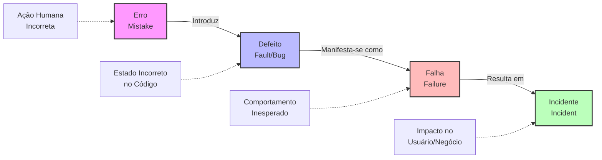

**Erro (Mistake):**
- **Definição Formal**: Ação humana que produz um resultado incorreto
- **Características**:
  * Origem: Cognitiva humana (mal-entendido, falta de conhecimento, distração)
  * Momento: Durante análise, design ou implementação
  * Prevenção: Revisões, treinamento, processos estruturados
- **Exemplos Práticos**:
  * Desenvolvedor implementa soma (`+`) ao invés de multiplicação (`*`)
  * Analista documenta requisito com ambiguidade
  * Arquiteto escolhe padrão inadequado para o contexto

**Defeito (Fault/Bug):**
- **Definição Formal**: Manifestação de um erro no código, documentação ou outro artefato
- **Características**:
  * Natureza: Estático (existe mesmo sem execução)
  * Detecção: Análise estática, revisão de código, inspeção
  * Localização: Código-fonte, documentos, configurações
- **Exemplos Práticos**:
  * Condição `if (x >= 0)` quando deveria ser `if (x > 0)`
  * Endpoint REST sem validação adequada de autenticação
  * Query SQL com JOIN incorreto

**Falha (Failure):**
- **Definição Formal**: Desvio do comportamento esperado durante a execução
- **Características**:
  * Natureza: Dinâmica (só ocorre durante execução)
  * Observabilidade: Externamente visível
  * Dependência: Condições específicas de execução
- **Exemplos Práticos**:
  * Sistema de e-commerce cobrando duas vezes pelo mesmo item
  * Aplicação móvel travando ao receber notificação
  * Sistema de login aceitando credenciais inválidas

**Incidente:**
- **Definição Formal**: Manifestação observável de uma falha que impacta usuários/negócio
- **Características**:
  * Impacto: Afeta operações do negócio
  * Urgência: Requer investigação e correção
  * Rastreabilidade: Documentado e monitorado
- **Exemplos Práticos**:
  * Indisponibilidade de sistema crítico por 2 horas
  * Vazamento de dados pessoais de clientes
  * Performance degradada causando abandono de carrinho

#### 2.2.2. Análise da Relação Causal

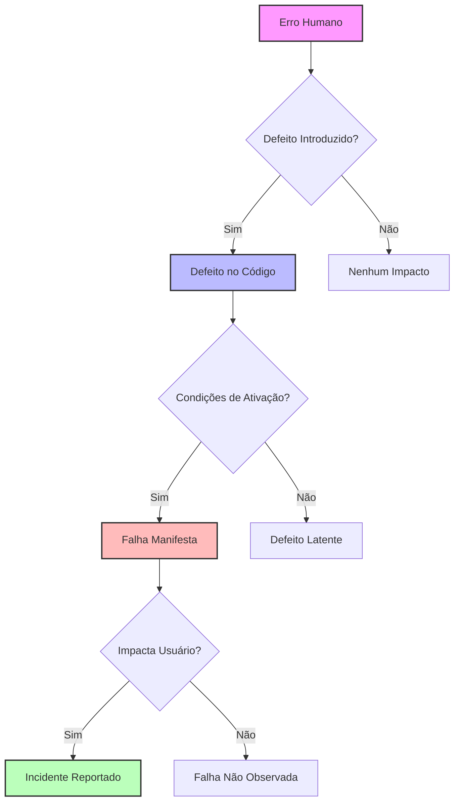

**Pontos Críticos da Cadeia:**

1. **Nem todo erro gera defeito**: Revisões e validações podem interceptar
2. **Nem todo defeito gera falha**: Algumas condições podem nunca ser executadas
3. **Nem toda falha gera incidente**: Pode não ser observada ou impactar usuários

### 2.3. O Conceito de Bug

#### 2.3.1. História e Etimologia

O termo "bug" tem uma origem histórica fascinante que remonta aos primórdios da computação. Em 9 de setembro de 1947, Grace Hopper, pioneira da programação, encontrou uma mariposa presa em um relé do computador Mark II Aecken da Universidade Harvard. Ela colou o inseto em seu caderno de anotações e escreveu: "First actual case of bug being found" (Primeiro caso real de bug sendo encontrado).

Embora o termo já fosse usado informalmente para descrever problemas mecânicos, este incidente popularizou sua aplicação na computação. Grace Hopper, que mais tarde desenvolveria o primeiro compilador, estabeleceu sem saber uma terminologia que perduraria por décadas.

#### 2.3.2. Classificação e Impacto de Bugs

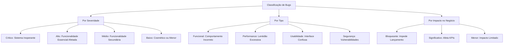

**Casos Famosos de Bugs Custosos:**

| **Ano** | **Sistema** | **Bug** | **Impacto** |
|---------|-------------|---------|-------------|
| 1996 | Ariane 5 | Overflow em conversão de 64-bit para 16-bit | €370 milhões |
| 2012 | Knight Capital | Loop infinito em trading algoritmo | $440 milhões em 45 min |
| 2017 | Equifax | Vulnerabilidade Apache Struts não corrigida | 147 milhões de dados expostos |
| 2020 | Boeing 737 MAX | Sensor MCAS com lógica incorreta | 346 vidas perdidas |

### 2.4. Verificação e Validação

#### 2.4.1. Fundamentos Conceituais

A distinção entre verificação e validação é fundamental para compreender os diferentes objetivos dos testes. Esta separação, conhecida como V&V (Verification and Validation), foi formalizada por Barry Boehm em 1981.

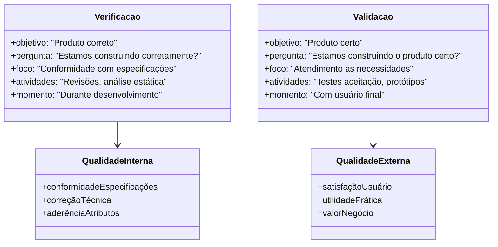

**Verificação:**
- **Definição**: Processo de confirmação que o produto está sendo construído de acordo com especificações
- **Atividades Típicas**:
  * Revisões técnicas estruturadas
  * Inspeções de código (code review)
  * Análise estática automatizada
  * Testes unitários e de integração
  * Walkthroughs de design

**Validação:**
- **Definição**: Processo de confirmação que o produto certo está sendo construído para o usuário
- **Atividades Típicas**:
  * Testes de aceitação com usuários
  * Prototipagem e validação de conceitos
  * Testes de usabilidade
  * Validação de requisitos com stakeholders
  * Testes beta com usuários reais

#### 2.4.2. Análise Comparativa

| **Aspecto** | **Verificação** | **Validação** |
|-------------|-----------------|---------------|
| **Pergunta Central** | "Estamos construindo o produto corretamente?" | "Estamos construindo o produto certo?" |
| **Foco** | Conformidade técnica | Necessidades do usuário |
| **Métodos** | Técnicos e formais | Empíricos e subjetivos |
| **Participantes** | Equipe técnica | Usuários e stakeholders |
| **Timing** | Durante desenvolvimento | Marcos de entrega |
| **Critério de Sucesso** | Aderência às especificações | Satisfação das necessidades |

### 2.5. Modelagem Matemática dos Conceitos de Teste

A teoria do teste de software pode ser formalizada matematicamente usando teoria dos conjuntos e lógica proposicional. Esta formalização é essencial para compreender os limites teóricos e práticos dos testes.

Seja $S$ um programa (software) e $D$ o domínio de entrada. Para cada entrada $x \in D$, existe uma saída esperada $y \in R$ (conjunto de resultados possíveis).

Definimos a função do programa como:

$$f_S: D \rightarrow R$$

onde:
- $S$ representa o software sob teste
- $D$ é o domínio de todas as entradas possíveis
- $R$ é o conjunto de todas as saídas possíveis

Um teste $t$ é um par ordenado $(x, y)$ onde:
- $x \in D$ é a entrada de teste
- $y \in R$ é a saída esperada

O conjunto de todos os testes possíveis $T$ é definido como:

$$T = \{(x, y) | x \in D \text{ e } y = f_S(x)\}$$

A **cobertura de teste** $C$ pode ser expressa como:

$$C = \frac{|T_{executado}|}{|T|} \times 100\%$$

onde:
- $T_{executado} \subseteq T$ é o conjunto de testes efetivamente executados
- $|T|$ representa a cardinalidade do conjunto (número total de testes possíveis)

A **eficácia do teste** $E$ pode ser modelada como:

$$E = \frac{\text{Defeitos encontrados}}{\text{Total de defeitos existentes}}$$

**Limitações Matemáticas:**

1. **Problema da Explosão Combinatorial**: Para um programa com $n$ variáveis de entrada, cada uma com $k$ valores possíveis, temos $k^n$ combinações possíveis de teste.

2. **Teorema da Incompletude de Dijkstra**: "Testes podem mostrar a presença de bugs, mas nunca sua ausência."

3. **Complexidade Temporal**: O teste exaustivo é computacionalmente intratável para sistemas reais: $O(k^n)$.

### 2.6. SWEBOK e Teste de Software

#### 2.6.1. Contextualização no Body of Knowledge

O SWEBOK (Software Engineering Body of Knowledge) é um guia internacionalmente reconhecido que define e organiza o conhecimento em engenharia de software. O teste de software é uma das 15 áreas de conhecimento fundamentais definidas no SWEBOK v3.0.

```mermaid
graph TD
    A[SWEBOK v3.0] --> B[Fundamentos de Engenharia]
    A --> C[Requisitos de Software]
    A --> D[Design de Software]
    A --> E[Construção de Software]
    A --> F[Teste de Software]
    A --> G[Manutenção de Software]
    A --> H[Gestão de Configuração]
    A --> I[Gestão de Engenharia]
    A --> J[Processo de Engenharia]
    A --> K[Modelos e Métodos]
    A --> L[Qualidade de Software]
    A --> M[Prática Profissional]
    A --> N[Aspectos Econômicos]
    A --> O[Fundamentos de Computação]
    A --> P[Fundamentos Matemáticos]
    
    F --> F1[Fundamentos de Teste]
    F --> F2[Níveis de Teste]
    F --> F3[Técnicas de Teste]
    F --> F4[Métricas Relacionadas]
    F --> F5[Processo de Teste]
    
    style F fill:#f9f,stroke:#333,stroke-width:4px
    style F1,F2,F3,F4,F5 fill:#e1f5fe,stroke:#0277bd,stroke-width:2px
```

> **Analogia para Entender**
> 
> O SWEBOK é como uma enciclopédia médica para a engenharia de software. Assim como a medicina tem suas especialidades (cardiologia, neurologia etc.), a engenharia de software tem suas áreas de conhecimento. O teste é uma dessas "especialidades" fundamentais, com seus próprios conceitos, técnicas e melhores práticas bem definidas.

#### 2.6.2. Integração com Outras Áreas do SWEBOK

O teste de software no SWEBOK interage fortemente com outras áreas de conhecimento, criando um ecossistema integrado de práticas:

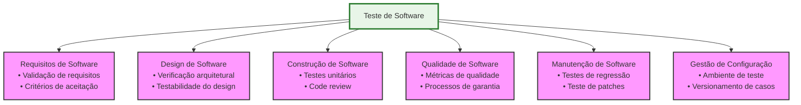

**Benefícios da Abordagem SWEBOK para Testes:**

1. **Padronização**: Terminologia e conceitos consistentes internacionalmente
2. **Sistematização**: Organização clara das práticas e conhecimentos
3. **Completude**: Cobertura abrangente desde fundamentos até práticas avançadas
4. **Integração**: Conexões explícitas com outras disciplinas da engenharia
5. **Evolução**: Framework para incorporar novas práticas e tecnologias

### 2.7. Modelos de Desenvolvimento e Testes

#### 2.7.1. Evolução Histórica dos Testes nos Modelos de Desenvolvimento

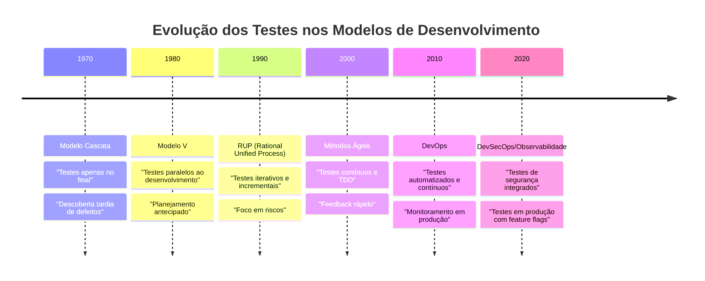

#### 2.7.2. Análise Comparativa dos Modelos

##### Modelo Tradicional (Cascata)
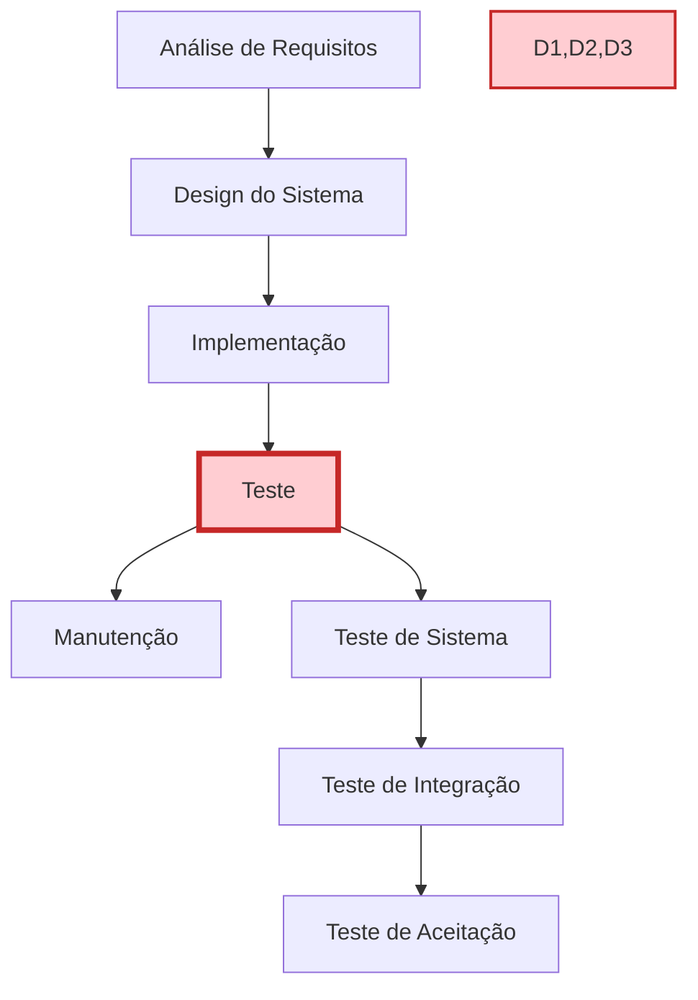

**Características do Teste no Modelo Cascata:**
- **Timing**: Testes executados apenas após desenvolvimento completo
- **Risco**: Alto risco de descoberta tardia de defeitos críticos
- **Custo**: Custo elevado de correção (regra 10x de Boehm)
- **Feedback**: Feedback tardio sobre qualidade do produto

**Limitações Críticas:**
- Defeitos arquiteturais descobertos muito tarde
- Requisitos mal compreendidos só identificados no final
- Pressão de cronograma leva a testes inadequados

##### Modelo V
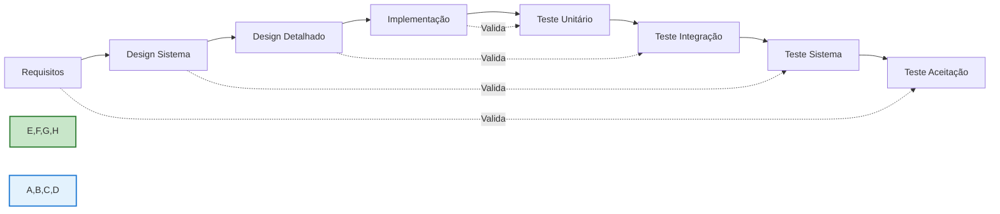

**Inovações do Modelo V:**
- **Planejamento Paralelo**: Casos de teste desenvolvidos junto com requisitos
- **Rastreabilidade**: Cada nível de desenvolvimento tem nível de teste correspondente
- **Validação Antecipada**: Critérios de aceitação definidos desde o início

##### Modelo Ágil/DevOps
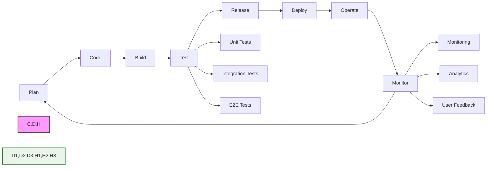

**Características Revolucionárias:**
- **Testes Contínuos**: Execução automatizada a cada commit
- **Feedback Rápido**: Resultados em minutos, não semanas
- **Shift-Left**: Testes movidos para início do ciclo
- **Monitoramento Ativo**: Observabilidade em produção

#### 2.7.3. Análise de Consequências e Trade-offs

| **Modelo** | **Vantagens** | **Desvantagens** | **Contexto Ideal** |
|------------|---------------|------------------|-------------------|
| **Cascata** | • Planejamento claro<br>• Documentação completa<br>• Controle rigoroso | • Descoberta tardia de problemas<br>• Baixa adaptabilidade<br>• Alto risco de retrabalho | • Projetos bem definidos<br>• Requisitos estáveis<br>• Domínios conhecidos |
| **Modelo V** | • Validação em cada etapa<br>• Rastreabilidade clara<br>• Planejamento antecipado | • Ainda sequencial<br>• Pouca flexibilidade<br>• Feedback limitado | • Projetos críticos<br>• Regulamentação rigorosa<br>• Equipes estruturadas |
| **Ágil** | • Feedback rápido<br>• Adaptabilidade alta<br>• Entregas frequentes | • Documentação limitada<br>• Requer disciplina<br>• Mudanças constantes | • Projetos inovativos<br>• Requisitos evolutivos<br>• Equipes experientes |
| **DevOps** | • Automação completa<br>• Tempo de mercado reduzido<br>• Monitoramento contínuo | • Complexidade técnica<br>• Investimento inicial alto<br>• Curva de aprendizado íngreme | • Produtos digitais<br>• Escalabilidade necessária<br>• Cultura colaborativa |

### 2.8. Análise Crítica dos Conceitos Fundamentais

#### 2.8.1. Limitações e Desafios Comuns

**Desafios na Aplicação dos Conceitos:**

1. **Ambiguidade Terminológica**: Diferentes organizações usam termos como "bug", "defeito" e "issue" de forma inconsistente
2. **Subjetividade na Classificação**: A gravidade de um incidente pode variar conforme perspectiva do stakeholder
3. **Causalidade Complexa**: Em sistemas distribuídos, a cadeia erro→defeito→falha→incidente pode ser não-linear
4. **Falsos Positivos**: Nem todo comportamento inesperado constitui uma falha real

**Armadilhas Comuns:**

> **⚠️ Armadilhas a Evitar**
> 
> 1. **Confundir Severidade com Prioridade**: Um bug crítico pode ter baixa prioridade se afeta funcionalidade não utilizada
> 2. **Supor Causalidade Linear**: Um incidente pode resultar de múltiplos defeitos interagindo
> 3. **Negligenciar Contexto**: O mesmo defeito pode ou não gerar falha dependendo do ambiente
> 4. **Focar Apenas em Defeitos**: Testes também validam conformidade e aumentam confiança

#### 2.8.2. Perguntas Frequentes (FAQ)

**Q1: Por que um erro nem sempre resulta em defeito?**
R: Revisões de código, testes unitários e ferramentas de análise estática podem interceptar erros antes que se tornem defeitos no código final.

**Q2: Um defeito sempre causa falha?**
R: Não. Um defeito pode permanecer "latente" se as condições para sua ativação nunca ocorrerem. Por exemplo, um bug em uma funcionalidade raramente usada.

**Q3: Qual a diferença entre bug e defeito?**
R: São sinônimos na prática. "Bug" é mais informal e popular, enquanto "defeito" é mais formal e acadêmico.

**Q4: Como distinguir entre verificação e validação na prática?**
R: Verificação pergunta "fizemos certo?" (conformidade), validação pergunta "fizemos a coisa certa?" (necessidade do usuário).

**Q5: Todos os modelos de desenvolvimento precisam de testes?**
R: Sim, mas a abordagem varia. Modelos tradicionais fazem testes no final, ágeis integram testes continuamente.

#### 2.8.3. Evolução dos Conceitos na Era Moderna

**Impacto de Tecnologias Emergentes:**

- **Inteligência Artificial**: Novos tipos de defeitos (bias, degradação de modelo)
- **Microserviços**: Falhas sistêmicas vs. componentes individuais
- **Cloud Computing**: Incidentes de infraestrutura vs. aplicação
- **IoT**: Defeitos físicos vs. software, questões de conectividade

**Tendências Futuras:**

1. **Testes Autônomos**: IA gerando e executando casos de teste automaticamente
2. **Observabilidade Avançada**: Detecção proativa de falhas através de ML
3. **Chaos Engineering**: Injeção intencional de falhas para teste de resiliência
4. **Shift-Right Testing**: Testes em produção com usuários reais

> **Analogia para Entender**
> 
> A evolução dos conceitos de teste é similar à evolução da medicina:
> - **Era Tradicional**: Tratar doença após sintomas aparecerem (testes no final)
> - **Era Preventiva**: Check-ups regulares e exames preventivos (testes contínuos)
> - **Era Preditiva**: Medicina personalizada e monitoramento constante (observabilidade e IA)

## 3. Aplicação Prática e Implementação

### 3.1. Estudo de Caso Guiado: Sistema de Gestão de Biblioteca

Vamos aplicar todos os conceitos fundamentais de teste estudados através de um sistema prático de gestão de biblioteca. Este estudo de caso demonstrará como identificar erros, defeitos, falhas e incidentes em um cenário real, além de aplicar verificação e validação.

#### Passo 1: Definição do Problema e Requisitos

**Contexto do Sistema:**
Nossa biblioteca universitária precisa de um sistema para gerenciar empréstimos de livros. O sistema deve permitir:

- Cadastrar livros com informações básicas
- Registrar usuários (estudantes e professores)
- Realizar empréstimos com diferentes prazos
- Controlar devoluções e calcular multas por atraso

**Requisitos Funcionais Essenciais:**
1. **RF01**: Livro deve ter ISBN, título, autor e disponibilidade
2. **RF02**: Usuário deve ter ID, nome, tipo (estudante/professor) e status
3. **RF03**: Empréstimo para estudante: máximo 7 dias
4. **RF04**: Empréstimo para professor: máximo 30 dias
5. **RF05**: Multa de R$ 1,00 por dia de atraso para estudantes
6. **RF06**: Multa de R$ 0,50 por dia de atraso para professores
7. **RF07**: Usuário bloqueado não pode fazer novos empréstimos

#### Passo 2: Implementação Inicial - Demonstrando a Cadeia Erro→Defeito→Falha→Incidente

Vamos implementar o sistema de forma intencional com alguns problemas para demonstrar os conceitos teóricos na prática.

**Arquivo: `biblioteca_v1.py` (Versão com Problemas)**

```python
#!/usr/bin/env python3
"""
Sistema de Gestão de Biblioteca - Versão 1 (com problemas intencionais)

Este código contém erros propositais para demonstrar a cadeia causal:
Erro → Defeito → Falha → Incidente

Autor: Estudo de Caso - Conceitos Fundamentais de Teste
"""

from datetime import datetime, timedelta
from typing import Dict, List, Optional
from enum import Enum


class TipoUsuario(Enum):
    """Enumera os tipos de usuários do sistema."""
    ESTUDANTE = "estudante"
    PROFESSOR = "professor"


class StatusUsuario(Enum):
    """Enumera os status possíveis de um usuário."""
    ATIVO = "ativo"
    BLOQUEADO = "bloqueado"


class Livro:
    """
    Representa um livro no sistema da biblioteca.
    
    ERRO INTENCIONAL 1: Falta de validação adequada do ISBN
    """
    
    def __init__(self, isbn: str, titulo: str, autor: str, disponivel: bool = True):
        # DEFEITO: ISBN não é validado adequately
        # Um ISBN deve ter 10 ou 13 dígitos, mas não estamos verificando
        self.isbn = isbn  # Aqui está o DEFEITO
        self.titulo = titulo
        self.autor = autor
        self.disponivel = disponivel
    
    def emprestar(self) -> bool:
        """
        Marca o livro como emprestado.
        
        Returns:
            bool: True se empréstimo foi realizado com sucesso
        """
        if self.disponivel:
            self.disponivel = False
            return True
        return False
    
    def devolver(self) -> None:
        """Marca o livro como disponível novamente."""
        self.disponivel = True


class Usuario:
    """
    Representa um usuário do sistema da biblioteca.
    
    ERRO INTENCIONAL 2: Lógica incorreta na validação de bloqueio
    """
    
    def __init__(self, user_id: str, nome: str, tipo: TipoUsuario, 
                 status: StatusUsuario = StatusUsuario.ATIVO):
        self.user_id = user_id
        self.nome = nome
        self.tipo = tipo
        self.status = status
        self.multa_total = 0.0
    
    def pode_emprestar(self) -> bool:
        """
        Verifica se o usuário pode realizar empréstimos.
        
        DEFEITO: Lógica de bloqueio está invertida!
        O programador confundiu == com !=
        """
        # DEFEITO CRÍTICO: Esta condição está ERRADA!
        # Deveria ser: self.status == StatusUsuario.ATIVO
        return self.status == StatusUsuario.BLOQUEADO  # ❌ DEFEITO!
    
    def adicionar_multa(self, valor: float) -> None:
        """Adiciona multa ao usuário."""
        self.multa_total += valor
        
        # DEFEITO: Limite de bloqueio por multa mal implementado
        if self.multa_total > 50.0:  # Bloqueia com multa alta
            self.status = StatusUsuario.BLOQUEADO


class Emprestimo:
    """
    Representa um empréstimo de livro.
    
    ERRO INTENCIONAL 3: Cálculo incorreto de multa
    """
    
    def __init__(self, usuario: Usuario, livro: Livro):
        self.usuario = usuario
        self.livro = livro
        self.data_emprestimo = datetime.now()
        
        # DEFEITO: Cálculo de prazo com lógica errada para professores
        if usuario.tipo == TipoUsuario.ESTUDANTE:
            self.prazo_dias = 7
        else:  # Professor
            # DEFEITO: Número errado de dias para professor!
            # Requisito era 30 dias, mas programador colocou 3!
            self.prazo_dias = 3  # ❌ DEFEITO! Deveria ser 30
        
        self.data_vencimento = self.data_emprestimo + timedelta(days=self.prazo_dias)
        self.devolvido = False
        self.data_devolucao: Optional[datetime] = None
    
    def calcular_multa(self) -> float:
        """
        Calcula multa por atraso na devolução.
        
        DEFEITO: Taxa de multa incorreta para professores
        """
        if self.devolvido and self.data_devolucao:
            dias_atraso = (self.data_devolucao - self.data_vencimento).days
            
            if dias_atraso > 0:
                if self.usuario.tipo == TipoUsuario.ESTUDANTE:
                    return dias_atraso * 1.0  # Correto: R$ 1,00 por dia
                else:
                    # DEFEITO: Taxa errada para professor!
                    # Deveria ser 0.50, mas está 5.0!
                    return dias_atraso * 5.0  # ❌ DEFEITO! Deveria ser 0.50
        
        return 0.0
    
    def devolver_livro(self, data_devolucao: datetime = None) -> float:
        """
        Processa a devolução do livro.
        
        Returns:
            float: Valor da multa aplicada
        """
        if data_devolucao is None:
            data_devolucao = datetime.now()
        
        self.data_devolucao = data_devolucao
        self.devolvido = True
        self.livro.devolver()
        
        multa = self.calcular_multa()
        if multa > 0:
            self.usuario.adicionar_multa(multa)
        
        return multa


class SistemaBiblioteca:
    """
    Sistema principal de gestão da biblioteca.
    
    ERRO INTENCIONAL 4: Falta de tratamento de exceções
    """
    
    def __init__(self):
        self.livros: Dict[str, Livro] = {}
        self.usuarios: Dict[str, Usuario] = {}
        self.emprestimos: List[Emprestimo] = []
    
    def cadastrar_livro(self, isbn: str, titulo: str, autor: str) -> bool:
        """
        Cadastra um novo livro no sistema.
        
        DEFEITO: Não valida ISBN duplicado adequadamente
        """
        # DEFEITO: Não verifica se ISBN já existe!
        # Permite cadastros duplicados
        livro = Livro(isbn, titulo, autor)
        self.livros[isbn] = livro  # Sobrescreve livros existentes!
        return True
    
    def cadastrar_usuario(self, user_id: str, nome: str, tipo: TipoUsuario) -> bool:
        """Cadastra um novo usuário no sistema."""
        if user_id in self.usuarios:
            return False  # Usuário já existe
        
        usuario = Usuario(user_id, nome, tipo)
        self.usuarios[user_id] = usuario
        return True
    
    def realizar_emprestimo(self, user_id: str, isbn: str) -> Optional[Emprestimo]:
        """
        Realiza um empréstimo de livro.
        
        DEFEITO: Não trata casos de usuário/livro inexistente
        """
        # DEFEITO: Não verifica se usuário existe!
        # Pode causar KeyError (exceção não tratada)
        usuario = self.usuarios[user_id]  # ❌ Possível exceção!
        
        # DEFEITO: Não verifica se livro existe!
        livro = self.livros[isbn]  # ❌ Possível exceção!
        
        # Verifica se usuário pode emprestar
        if not usuario.pode_emprestar():
            return None  # Usuário bloqueado (mas lógica está invertida!)
        
        # Verifica se livro está disponível
        if not livro.emprestar():
            return None  # Livro não disponível
        
        emprestimo = Emprestimo(usuario, livro)
        self.emprestimos.append(emprestimo)
        return emprestimo


# =============================================================================
# DEMONSTRAÇÃO PRÁTICA: Como os DEFEITOS geram FALHAS e INCIDENTES
# =============================================================================

def demonstracao_cadeia_causal():
    """
    Demonstra como erros no código geram defeitos, 
    que causam falhas, que resultam em incidentes.
    """
    print("=== DEMONSTRAÇÃO: Cadeia Erro → Defeito → Falha → Incidente ===\n")
    
    # Inicializa o sistema
    biblioteca = SistemaBiblioteca()
    
    # Cadastra livros e usuários
    biblioteca.cadastrar_livro("123", "Python para Iniciantes", "Autor X")
    biblioteca.cadastrar_usuario("prof001", "Dr. Silva", TipoUsuario.PROFESSOR)
    biblioteca.cadastrar_usuario("est001", "João Santos", TipoUsuario.ESTUDANTE)
    
    print("✅ Sistema inicializado com livros e usuários")
    
    # =================================================================
    # INCIDENTE 1: Usuário bloqueado consegue fazer empréstimo
    # =================================================================
    print("\n🚨 INCIDENTE 1: Lógica de bloqueio invertida")
    
    # Força bloqueio do usuário
    usuario_estudante = biblioteca.usuarios["est001"]
    usuario_estudante.status = StatusUsuario.BLOQUEADO
    print(f"📋 Status do estudante: {usuario_estudante.status.value}")
    
    # Tenta fazer empréstimo (deveria ser negado, mas será aprovado!)
    emprestimo = biblioteca.realizar_emprestimo("est001", "123")
    
    if emprestimo:
        print("❌ FALHA: Usuário BLOQUEADO conseguiu fazer empréstimo!")
        print("💸 INCIDENTE: Biblioteca perde controle sobre usuários inadimplentes")
    else:
        print("✅ Empréstimo negado corretamente")
    
    # =================================================================
    # INCIDENTE 2: Professor com prazo errado
    # =================================================================
    print("\n🚨 INCIDENTE 2: Prazo incorreto para professor")
    
    # Cadastra novo livro para testar com professor
    biblioteca.cadastrar_livro("456", "Metodologia Científica", "Autor Y")
    emprestimo_prof = biblioteca.realizar_emprestimo("prof001", "456")
    
    if emprestimo_prof:
        print(f"📅 Prazo para professor: {emprestimo_prof.prazo_dias} dias")
        print("❌ FALHA: Professor deveria ter 30 dias, mas tem apenas 3!")
        print("😡 INCIDENTE: Professores reclamam de prazo muito curto")
    
    # =================================================================
    # INCIDENTE 3: Multa exorbitante para professor
    # =================================================================
    print("\n🚨 INCIDENTE 3: Multa incorreta para professor")
    
    # Simula devolução com atraso
    data_futura = datetime.now() + timedelta(days=5)  # 5 dias de atraso
    multa = emprestimo_prof.devolver_livro(data_futura)
    
    print(f"💰 Multa calculada: R$ {multa:.2f}")
    print("❌ FALHA: Professor deveria pagar R$ 2,50 (5 dias × R$ 0,50)")
    print("💸 INCIDENTE: Professor é cobrado R$ 25,00 - valor abusivo!")
    
    # =================================================================
    # INCIDENTE 4: Sistema trava com dados inexistentes
    # =================================================================
    print("\n🚨 INCIDENTE 4: Sistema trava com exceção não tratada")
    
    try:
        # Tenta empréstimo com usuário inexistente
        biblioteca.realizar_emprestimo("user999", "123")
    except KeyError as e:
        print(f"💥 EXCEÇÃO: {type(e).__name__} - {e}")
        print("❌ FALHA: Sistema não trata usuário inexistente")
        print("🔥 INCIDENTE: Sistema da biblioteca trava durante atendimento")


if __name__ == "__main__":
    demonstracao_cadeia_causal()
```

#### Passo 3: Análise dos Problemas Identificados

Vamos mapear cada problema encontrado na cadeia causal:

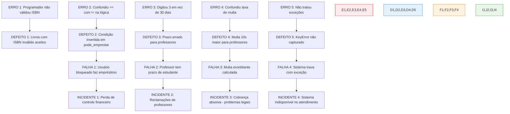

#### Passo 4: Implementação Corrigida - Aplicando Verificação e Validação

Agora vamos corrigir os problemas aplicando técnicas de verificação e validação:

**Arquivo: `biblioteca_v2.py` (Versão Corrigida)**

```python
#!/usr/bin/env python3
"""
Sistema de Gestão de Biblioteca - Versão 2 (Corrigida)

Esta versão corrige todos os defeitos identificados e aplica:
- Verificação: Validações técnicas e conformidade
- Validação: Atendimento às necessidades dos usuários

Autor: Estudo de Caso - Conceitos Fundamentais de Teste
"""

import re
from datetime import datetime, timedelta
from typing import Dict, List, Optional, Tuple
from enum import Enum
import logging


# Configuração de logging para monitoramento
logging.basicConfig(
    level=logging.INFO,
    format='%(asctime)s - %(levelname)s - %(message)s'
)
logger = logging.getLogger(__name__)


class TipoUsuario(Enum):
    """Enumera os tipos de usuários do sistema."""
    ESTUDANTE = "estudante"
    PROFESSOR = "professor"


class StatusUsuario(Enum):
    """Enumera os status possíveis de um usuário."""
    ATIVO = "ativo"
    BLOQUEADO = "bloqueado"


class BibliotecaException(Exception):
    """Exceção base para erros específicos do sistema da biblioteca."""
    pass


class UsuarioInexistenteError(BibliotecaException):
    """Exceção para quando usuário não é encontrado."""
    pass


class LivroInexistenteError(BibliotecaException):
    """Exceção para quando livro não é encontrado."""
    pass


class ISBNInvalidoError(BibliotecaException):
    """Exceção para ISBN em formato inválido."""
    pass


class Livro:
    """
    Representa um livro no sistema da biblioteca.
    
    CORREÇÃO APLICADA: Validação rigorosa de ISBN
    """
    
    def __init__(self, isbn: str, titulo: str, autor: str, disponivel: bool = True):
        """
        Inicializa um livro com validação de ISBN.
        
        Args:
            isbn: ISBN do livro (deve ter 10 ou 13 dígitos)
            titulo: Título do livro
            autor: Autor do livro
            disponivel: Se o livro está disponível para empréstimo
            
        Raises:
            ISBNInvalidoError: Se ISBN não estiver no formato correto
            ValueError: Se título ou autor estiverem vazios
        """
        self.isbn = self._validar_isbn(isbn)
        
        if not titulo.strip():
            raise ValueError("Título não pode estar vazio")
        if not autor.strip():
            raise ValueError("Autor não pode estar vazio")
            
        self.titulo = titulo.strip()
        self.autor = autor.strip()
        self.disponivel = disponivel
        
        logger.info(f"Livro criado: {self.titulo} (ISBN: {self.isbn})")
    
    @staticmethod
    def _validar_isbn(isbn: str) -> str:
        """
        Valida o formato do ISBN.
        
        VERIFICAÇÃO: ISBN deve ter 10 ou 13 dígitos (pode ter hífens)
        
        Args:
            isbn: String contendo o ISBN
            
        Returns:
            str: ISBN limpo (apenas dígitos)
            
        Raises:
            ISBNInvalidoError: Se ISBN não estiver no formato correto
        """
        if not isbn:
            raise ISBNInvalidoError("ISBN não pode estar vazio")
        
        # Remove hífens e espaços
        isbn_limpo = re.sub(r'[-\s]', '', isbn)
        
        # Verifica se contém apenas dígitos
        if not isbn_limpo.isdigit():
            raise ISBNInvalidoError(f"ISBN deve conter apenas dígitos: {isbn}")
        
        # Verifica tamanho (10 ou 13 dígitos)
        if len(isbn_limpo) not in [10, 13]:
            raise ISBNInvalidoError(
                f"ISBN deve ter 10 ou 13 dígitos. Recebido: {len(isbn_limpo)} dígitos"
            )
        
        return isbn_limpo
    
    def emprestar(self) -> bool:
        """
        Marca o livro como emprestado se estiver disponível.
        
        Returns:
            bool: True se empréstimo foi realizado com sucesso
        """
        if self.disponivel:
            self.disponivel = False
            logger.info(f"Livro emprestado: {self.titulo}")
            return True
        logger.warning(f"Tentativa de empréstimo de livro indisponível: {self.titulo}")
        return False
    
    def devolver(self) -> None:
        """Marca o livro como disponível novamente."""
        self.disponivel = True
        logger.info(f"Livro devolvido: {self.titulo}")


class Usuario:
    """
    Representa um usuário do sistema da biblioteca.
    
    CORREÇÃO APLICADA: Lógica correta de bloqueio e validações
    """
    
    def __init__(self, user_id: str, nome: str, tipo: TipoUsuario, 
                 status: StatusUsuario = StatusUsuario.ATIVO):
        """
        Inicializa um usuário com validações.
        
        Args:
            user_id: Identificador único do usuário
            nome: Nome completo do usuário
            tipo: Tipo do usuário (estudante ou professor)
            status: Status inicial do usuário
            
        Raises:
            ValueError: Se dados obrigatórios estiverem inválidos
        """
        if not user_id.strip():
            raise ValueError("ID do usuário não pode estar vazio")
        if not nome.strip():
            raise ValueError("Nome do usuário não pode estar vazio")
        
        self.user_id = user_id.strip()
        self.nome = nome.strip()
        self.tipo = tipo
        self.status = status
        self.multa_total = 0.0
        
        logger.info(f"Usuário criado: {self.nome} ({self.tipo.value})")
    
    def pode_emprestar(self) -> bool:
        """
        Verifica se o usuário pode realizar empréstimos.
        
        CORREÇÃO: Lógica correta - usuário ATIVO pode emprestar
        
        Returns:
            bool: True se usuário pode emprestar
        """
        # CORREÇÃO: Condição CORRETA agora!
        pode = self.status == StatusUsuario.ATIVO
        
        if not pode:
            logger.warning(
                f"Empréstimo negado para usuário {self.nome}: status {self.status.value}"
            )
        
        return pode
    
    def adicionar_multa(self, valor: float) -> None:
        """
        Adiciona multa ao usuário e verifica limite de bloqueio.
        
        Args:
            valor: Valor da multa a ser adicionada
        """
        if valor < 0:
            raise ValueError("Valor da multa não pode ser negativo")
        
        self.multa_total += valor
        logger.info(f"Multa adicionada para {self.nome}: R$ {valor:.2f}")
        
        # Bloqueia usuário se multa ultrapassar limite
        if self.multa_total > 50.0 and self.status == StatusUsuario.ATIVO:
            self.status = StatusUsuario.BLOQUEADO
            logger.warning(
                f"Usuário {self.nome} bloqueado por multa alta: R$ {self.multa_total:.2f}"
            )


class Emprestimo:
    """
    Representa um empréstimo de livro.
    
    CORREÇÃO APLICADA: Prazos e cálculos corretos conforme requisitos
    """
    
    # Configurações de negócio (facilita manutenção)
    PRAZO_ESTUDANTE_DIAS = 7
    PRAZO_PROFESSOR_DIAS = 30  # CORREÇÃO: Valor correto agora!
    MULTA_ESTUDANTE_DIA = 1.0
    MULTA_PROFESSOR_DIA = 0.5  # CORREÇÃO: Valor correto agora!
    
    def __init__(self, usuario: Usuario, livro: Livro):
        """
        Inicializa um empréstimo com prazos corretos.
        
        VALIDAÇÃO: Prazos atendem às necessidades dos usuários
        """
        self.usuario = usuario
        self.livro = livro
        self.data_emprestimo = datetime.now()
        
        # CORREÇÃO: Prazos corretos conforme tipo de usuário
        if usuario.tipo == TipoUsuario.ESTUDANTE:
            self.prazo_dias = self.PRAZO_ESTUDANTE_DIAS
        else:  # Professor
            self.prazo_dias = self.PRAZO_PROFESSOR_DIAS  # ✅ CORRETO: 30 dias!
        
        self.data_vencimento = self.data_emprestimo + timedelta(days=self.prazo_dias)
        self.devolvido = False
        self.data_devolucao: Optional[datetime] = None
        
        logger.info(
            f"Empréstimo criado: {livro.titulo} para {usuario.nome} "
            f"(prazo: {self.prazo_dias} dias)"
        )
    
    def calcular_multa(self) -> float:
        """
        Calcula multa por atraso na devolução.
        
        CORREÇÃO: Taxas corretas conforme tipo de usuário
        
        Returns:
            float: Valor da multa calculada
        """
        if not (self.devolvido and self.data_devolucao):
            return 0.0
        
        dias_atraso = (self.data_devolucao - self.data_vencimento).days
        
        if dias_atraso <= 0:
            return 0.0
        
        # CORREÇÃO: Taxas corretas para cada tipo de usuário
        if self.usuario.tipo == TipoUsuario.ESTUDANTE:
            multa = dias_atraso * self.MULTA_ESTUDANTE_DIA  # R$ 1,00/dia
        else:  # Professor
            multa = dias_atraso * self.MULTA_PROFESSOR_DIA  # ✅ CORRETO: R$ 0,50/dia
        
        logger.info(
            f"Multa calculada para {self.usuario.nome}: "
            f"{dias_atraso} dias × R$ {self.MULTA_PROFESSOR_DIA if self.usuario.tipo == TipoUsuario.PROFESSOR else self.MULTA_ESTUDANTE_DIA:.2f} = R$ {multa:.2f}"
        )
        
        return multa
    
    def devolver_livro(self, data_devolucao: Optional[datetime] = None) -> float:
        """
        Processa a devolução do livro.
        
        Args:
            data_devolucao: Data da devolução (default: agora)
            
        Returns:
            float: Valor da multa aplicada
        """
        if self.devolvido:
            logger.warning(f"Livro {self.livro.titulo} já foi devolvido")
            return 0.0
        
        if data_devolucao is None:
            data_devolucao = datetime.now()
        
        self.data_devolucao = data_devolucao
        self.devolvido = True
        self.livro.devolver()
        
        multa = self.calcular_multa()
        if multa > 0:
            self.usuario.adicionar_multa(multa)
        
        logger.info(f"Devolução processada: {self.livro.titulo}")
        return multa


class SistemaBiblioteca:
    """
    Sistema principal de gestão da biblioteca.
    
    CORREÇÃO APLICADA: Tratamento de exceções e validações robustas
    """
    
    def __init__(self):
        self.livros: Dict[str, Livro] = {}
        self.usuarios: Dict[str, Usuario] = {}
        self.emprestimos: List[Emprestimo] = []
        
        logger.info("Sistema de biblioteca inicializado")
    
    def cadastrar_livro(self, isbn: str, titulo: str, autor: str) -> bool:
        """
        Cadastra um novo livro no sistema.
        
        CORREÇÃO: Validação de ISBN duplicado
        
        Args:
            isbn: ISBN do livro
            titulo: Título do livro
            autor: Autor do livro
            
        Returns:
            bool: True se cadastro foi bem-sucedido
            
        Raises:
            ISBNInvalidoError: Se ISBN for inválido
            ValueError: Se livro já existir
        """
        try:
            livro = Livro(isbn, titulo, autor)
            
            # CORREÇÃO: Verifica se ISBN já existe
            if livro.isbn in self.livros:
                raise ValueError(f"Livro com ISBN {livro.isbn} já existe")
            
            self.livros[livro.isbn] = livro
            logger.info(f"Livro cadastrado com sucesso: {titulo}")
            return True
            
        except (ISBNInvalidoError, ValueError) as e:
            logger.error(f"Erro ao cadastrar livro: {e}")
            raise
    
    def cadastrar_usuario(self, user_id: str, nome: str, tipo: TipoUsuario) -> bool:
        """
        Cadastra um novo usuário no sistema.
        
        Args:
            user_id: ID único do usuário
            nome: Nome do usuário
            tipo: Tipo do usuário
            
        Returns:
            bool: True se cadastro foi bem-sucedido
            
        Raises:
            ValueError: Se usuário já existir ou dados forem inválidos
        """
        if user_id in self.usuarios:
            raise ValueError(f"Usuário com ID {user_id} já existe")
        
        try:
            usuario = Usuario(user_id, nome, tipo)
            self.usuarios[user_id] = usuario
            logger.info(f"Usuário cadastrado com sucesso: {nome}")
            return True
            
        except ValueError as e:
            logger.error(f"Erro ao cadastrar usuário: {e}")
            raise
    
    def realizar_emprestimo(self, user_id: str, isbn: str) -> Emprestimo:
        """
        Realiza um empréstimo de livro.
        
        CORREÇÃO: Tratamento adequado de exceções e validações
        
        Args:
            user_id: ID do usuário
            isbn: ISBN do livro
            
        Returns:
            Emprestimo: Objeto do empréstimo criado
            
        Raises:
            UsuarioInexistenteError: Se usuário não existir
            LivroInexistenteError: Se livro não existir
            ValueError: Se empréstimo não puder ser realizado
        """
        # CORREÇÃO: Tratamento adequado de usuário inexistente
        if user_id not in self.usuarios:
            raise UsuarioInexistenteError(f"Usuário {user_id} não encontrado")
        
        # CORREÇÃO: Tratamento adequado de livro inexistente  
        if isbn not in self.livros:
            raise LivroInexistenteError(f"Livro com ISBN {isbn} não encontrado")
        
        usuario = self.usuarios[user_id]
        livro = self.livros[isbn]
        
        # Verifica se usuário pode emprestar
        if not usuario.pode_emprestar():
            raise ValueError(
                f"Usuário {usuario.nome} não pode emprestar: status {usuario.status.value}"
            )
        
        # Verifica se livro está disponível
        if not livro.emprestar():
            raise ValueError(f"Livro '{livro.titulo}' não está disponível")
        
        emprestimo = Emprestimo(usuario, livro)
        self.emprestimos.append(emprestimo)
        
        logger.info(f"Empréstimo realizado: {livro.titulo} para {usuario.nome}")
        return emprestimo
    
    def listar_emprestimos_pendentes(self) -> List[Tuple[str, str, datetime]]:
        """
        Lista empréstimos que ainda não foram devolvidos.
        
        Returns:
            Lista de tuplas (usuário, livro, data_vencimento)
        """
        pendentes = []
        for emp in self.emprestimos:
            if not emp.devolvido:
                pendentes.append((
                    emp.usuario.nome,
                    emp.livro.titulo,
                    emp.data_vencimento
                ))
        
        return pendentes


# =============================================================================
# DEMONSTRAÇÃO: Sistema Corrigido em Funcionamento
# =============================================================================

def demonstracao_sistema_corrigido():
    """
    Demonstra o sistema corrigido funcionando adequadamente.
    """
    print("=== DEMONSTRAÇÃO: Sistema Corrigido - Verificação e Validação ===\n")
    
    biblioteca = SistemaBiblioteca()
    
    # =================================================================
    # VERIFICAÇÃO: Validações técnicas funcionando
    # =================================================================
    print("🔍 VERIFICAÇÃO: Testando validações técnicas")
    
    try:
        # Testa ISBN inválido
        biblioteca.cadastrar_livro("123", "Livro Teste", "Autor Teste")
        print("❌ Falhou: ISBN inválido deveria ser rejeitado")
    except ISBNInvalidoError as e:
        print(f"✅ ISBN inválido rejeitado corretamente: {e}")
    
    try:
        # Cadastra livro com ISBN válido
        biblioteca.cadastrar_livro("9788535902772", "Clean Code", "Robert Martin")
        print("✅ Livro com ISBN válido cadastrado")
    except Exception as e:
        print(f"❌ Erro inesperado: {e}")
    
    # =================================================================
    # VALIDAÇÃO: Atendendo necessidades dos usuários
    # =================================================================
    print("\n✅ VALIDAÇÃO: Atendendo necessidades dos usuários")
    
    # Cadastra usuários
    biblioteca.cadastrar_usuario("prof001", "Dr. Silva", TipoUsuario.PROFESSOR)
    biblioteca.cadastrar_usuario("est001", "João Santos", TipoUsuario.ESTUDANTE)
    
    # Testa empréstimo para professor
    emprestimo_prof = biblioteca.realizar_emprestimo("prof001", "9788535902772")
    print(f"📚 Professor - Prazo: {emprestimo_prof.prazo_dias} dias (Validação: requisito de 30 dias)")
    
    # Cadastra outro livro para estudante
    biblioteca.cadastrar_livro("9788575222683", "Python Fluente", "Luciano Ramalho")
    emprestimo_est = biblioteca.realizar_emprestimo("est001", "9788575222683")
    print(f"📖 Estudante - Prazo: {emprestimo_est.prazo_dias} dias (Validação: requisito de 7 dias)")
    
    # =================================================================
    # DEMONSTRAÇÃO: Multas corretas
    # =================================================================
    print("\n💰 DEMONSTRAÇÃO: Cálculo correto de multas")
    
    # Simula devolução com atraso para professor
    data_atraso_prof = datetime.now() + timedelta(days=5)
    multa_prof = emprestimo_prof.devolver_livro(data_atraso_prof)
    print(f"👨‍🏫 Professor - 5 dias atraso: R$ {multa_prof:.2f} (5 × R$ 0,50)")
    
    # Simula devolução com atraso para estudante  
    data_atraso_est = datetime.now() + timedelta(days=3)
    multa_est = emprestimo_est.devolver_livro(data_atraso_est)
    print(f"🎓 Estudante - 3 dias atraso: R$ {multa_est:.2f} (3 × R$ 1,00)")
    
    # =================================================================
    # VERIFICAÇÃO: Tratamento de exceções
    # =================================================================
    print("\n🛡️ VERIFICAÇÃO: Tratamento robusto de exceções")
    
    try:
        biblioteca.realizar_emprestimo("user999", "9788535902772")
    except UsuarioInexistenteError as e:
        print(f"✅ Usuário inexistente tratado: {e}")
    
    try:
        biblioteca.realizar_emprestimo("prof001", "isbn999")
    except LivroInexistenteError as e:
        print(f"✅ Livro inexistente tratado: {e}")
    
    print("\n🎉 Sistema funcionando corretamente após correções!")


if __name__ == "__main__":
    demonstracao_sistema_corrigido()
```

### 3.2. Exemplos de Código Comentado

Vamos analisar os principais padrões de correção aplicados:

#### Exemplo 1: Verificação com Validação de ISBN

```python
@staticmethod
def _validar_isbn(isbn: str) -> str:
    """
    CONCEITO: Verificação técnica de conformidade
    
    Este método demonstra VERIFICAÇÃO porque:
    - Confirma que o ISBN está sendo construído CORRETAMENTE
    - Verifica conformidade com especificações técnicas (10 ou 13 dígitos)
    - Aplica regras de negócio objetivas e mensuráveis
    
    BENEFÍCIO: Previne defeitos por entrada inválida
    QUANDO USAR: Sempre que precisar validar formato de dados
    """
    if not isbn:
        # PADRÃO: Fail-fast - detecta problemas cedo
        raise ISBNInvalidoError("ISBN não pode estar vazio")
    
    # TÉCNICA: Normalização de dados (remove caracteres especiais)
    isbn_limpo = re.sub(r'[-\s]', '', isbn)
    
    # VERIFICAÇÃO: Formato contém apenas dígitos
    if not isbn_limpo.isdigit():
        raise ISBNInvalidoError(f"ISBN deve conter apenas dígitos: {isbn}")
    
    # VERIFICAÇÃO: Tamanho conforme padrão internacional
    if len(isbn_limpo) not in [10, 13]:
        raise ISBNInvalidoError(
            f"ISBN deve ter 10 ou 13 dígitos. Recebido: {len(isbn_limpo)} dígitos"
        )
    
    return isbn_limpo
```

#### Exemplo 2: Validação com Necessidades do Usuário

```python
def __init__(self, usuario: Usuario, livro: Livro):
    """
    CONCEITO: Validação das necessidades do usuário
    
    Este método demonstra VALIDAÇÃO porque:
    - Confirma que estamos construindo o produto CERTO
    - Atende às necessidades específicas de professores vs estudantes
    - Implementa regras de negócio alinhadas com expectativas dos usuários
    
    BENEFÍCIO: Garante satisfação e usabilidade do sistema
    QUANDO USAR: Ao implementar regras que afetam a experiência do usuário
    """
    self.usuario = usuario
    self.livro = livro
    self.data_emprestimo = datetime.now()
    
    # VALIDAÇÃO: Prazos diferenciados atendem necessidades específicas
    if usuario.tipo == TipoUsuario.ESTUDANTE:
        # Estudantes: prazo mais curto (uso pontual)
        self.prazo_dias = self.PRAZO_ESTUDANTE_DIAS  # 7 dias
    else:  # Professor
        # Professores: prazo mais longo (pesquisa, preparação de aulas)
        self.prazo_dias = self.PRAZO_PROFESSOR_DIAS  # 30 dias
    
    self.data_vencimento = self.data_emprestimo + timedelta(days=self.prazo_dias)
    
    # PADRÃO: Logging para auditoria e monitoramento
    logger.info(
        f"Empréstimo criado: {livro.titulo} para {usuario.nome} "
        f"(prazo: {self.prazo_dias} dias)"
    )
```

#### Exemplo 3: Tratamento Robusto de Exceções

```python
def realizar_emprestimo(self, user_id: str, isbn: str) -> Emprestimo:
    """
    CONCEITO: Tratamento de falhas e recuperação
    
    Este método demonstra como PREVENIR que erros se tornem incidentes:
    - Detecta problemas antes que causem falhas do sistema
    - Fornece mensagens claras para facilitar correção
    - Mantém sistema estável mesmo com entradas inválidas
    
    BENEFÍCIO: Sistema resiliente e confiável
    ARMADILHA EVITADA: KeyError não tratado que trava o sistema
    """
    # PADRÃO: Verificação explícita antes de acesso
    # ANTES: self.usuarios[user_id]  # ❌ Pode gerar KeyError
    # DEPOIS: Verificação controlada com exceção específica
    if user_id not in self.usuarios:
        raise UsuarioInexistenteError(f"Usuário {user_id} não encontrado")
    
    if isbn not in self.livros:
        raise LivroInexistenteError(f"Livro com ISBN {isbn} não encontrado")
    
    usuario = self.usuarios[user_id]
    livro = self.livros[isbn]
    
    # VERIFICAÇÃO: Regras de negócio aplicadas consistentemente
    if not usuario.pode_emprestar():
        raise ValueError(
            f"Usuário {usuario.nome} não pode emprestar: status {usuario.status.value}"
        )
    
    if not livro.emprestar():
        raise ValueError(f"Livro '{livro.titulo}' não está disponível")
    
    # PADRÃO: Operação atômica - tudo ou nada
    emprestimo = Emprestimo(usuario, livro)
    self.emprestimos.append(emprestimo)
    
    # OBSERVABILIDADE: Log para monitoramento
    logger.info(f"Empréstimo realizado: {livro.titulo} para {usuario.nome}")
    return emprestimo
```

#### Exemplo 4: Comparativo "Antes vs Depois" - Lógica de Bloqueio

```python
# ❌ ANTES: Lógica incorreta (defeito)
def pode_emprestar_errado(self) -> bool:
    """Versão com defeito - lógica invertida"""
    # DEFEITO: Condição invertida permite usuário bloqueado emprestar
    return self.status == StatusUsuario.BLOQUEADO  # ❌ ERRO!

# ✅ DEPOIS: Lógica correta (corrigida)
def pode_emprestar(self) -> bool:
    """
    Versão corrigida com lógica adequada.
    
    CORREÇÃO APLICADA: Condição lógica correta
    VERIFICAÇÃO: Usuário ATIVO pode emprestar
    VALIDAÇÃO: Atende política de controle da biblioteca
    """
    pode = self.status == StatusUsuario.ATIVO  # ✅ CORRETO!
    
    if not pode:
        # BENEFÍCIO: Logging para auditoria e debugging
        logger.warning(
            f"Empréstimo negado para usuário {self.nome}: status {self.status.value}"
        )
    
    return pode
```

### 3.3. Ferramentas, Bibliotecas e Ecossistema (Contextual)

Para a demonstração dos conceitos fundamentais de teste nesta aula, utilizamos exclusivamente recursos nativos do Python 3.12+, reforçando que os princípios ensinados são fundamentais à estruturação do código e não dependem de ferramentas de terceiros.

#### Recursos Nativos Utilizados

**Módulo `typing`**
- **Propósito**: Type hints para maior clareza e detecção precoce de erros
- **Uso no código**: `Optional[datetime]`, `Dict[str, Livro]`, `List[Emprestimo]`
- **Benefício**: Melhora verificação estática e documentação viva do código

**Módulo `enum`**
- **Propósito**: Definição de constantes tipadas e estados bem definidos
- **Uso no código**: `TipoUsuario`, `StatusUsuario`
- **Benefício**: Previne erros de digitação e garante valores válidos

**Módulo `datetime`**
- **Propósito**: Manipulação precisa de datas e cálculos temporais
- **Uso no código**: Cálculo de prazos, vencimentos e multas
- **Benefício**: Lógica temporal robusta e testável

**Módulo `re` (Regular Expressions)**
- **Propósito**: Validação e normalização de strings (ISBN)
- **Uso no código**: `re.sub(r'[-\s]', '', isbn)` para limpeza de ISBN
- **Benefício**: Validação rigorosa de formatos de entrada

**Módulo `logging`**
- **Propósito**: Observabilidade e rastreamento de operações
- **Uso no código**: Logs de operações, erros e eventos importantes
- **Benefício**: Facilita debugging e monitoramento em produção

#### Demonstração Prática das Ferramentas

```python
# DEMONSTRAÇÃO: Como as ferramentas nativas suportam os conceitos de teste

import logging
from typing import Dict, List, Optional
from enum import Enum
from datetime import datetime, timedelta
import re

def demonstracao_ferramentas_teste():
    """
    Demonstra como ferramentas básicas do Python suportam
    os conceitos fundamentais de teste estudados.
    """
    
    # =================================================================
    # 1. TYPE HINTS: Prevenção de erros de tipo
    # =================================================================
    print("🔍 TYPE HINTS: Prevenção de erros")
    
    def processar_idades(idades: List[int]) -> float:
        """
        VERIFICAÇÃO: Type hints detectam erros de tipo
        IDE/mypy alertará se passar string onde espera int
        """
        return sum(idades) / len(idades) if idades else 0.0
    
    # ✅ Uso correto
    media = processar_idades([20, 25, 30])
    print(f"Média de idades: {media}")
    
    # ❌ Uso incorreto seria detectado por ferramentas estáticas
    # processar_idades(["20", "25", "30"])  # Type checker alertaria
    
    # =================================================================
    # 2. ENUM: Estados bem definidos previnem defeitos
    # =================================================================
    print("\n📊 ENUM: Estados consistentes")
    
    class StatusPedido(Enum):
        PENDENTE = "pendente"
        PROCESSANDO = "processando"
        ENVIADO = "enviado"
        ENTREGUE = "entregue"
    
    def verificar_status_valido(status: StatusPedido) -> bool:
        """
        BENEFÍCIO: Impossível passar valor inválido
        Enum garante apenas valores permitidos
        """
        return status in [StatusPedido.PROCESSANDO, StatusPedido.ENVIADO]
    
    # ✅ Apenas valores válidos são aceitos
    print(f"Status válido: {verificar_status_valido(StatusPedido.ENVIADO)}")
    
    # =================================================================
    # 3. REGEX: Validação rigorosa de formatos
    # =================================================================
    print("\n🔍 REGEX: Validação de formatos")
    
    def validar_email(email: str) -> bool:
        """
        VERIFICAÇÃO: Formato de email conforme padrão
        Regex detecta problemas de formato antes de uso
        """
        padrao = r'^[a-zA-Z0-9._%+-]+@[a-zA-Z0-9.-]+\.[a-zA-Z]{2,}$'
        return bool(re.match(padrao, email))
    
    emails_teste = [
        "usuario@exemplo.com",     # ✅ Válido
        "usuario.exemplo.com",     # ❌ Inválido (sem @)
        "@exemplo.com",            # ❌ Inválido (sem usuário)
    ]
    
    for email in emails_teste:
        resultado = "✅ VÁLIDO" if validar_email(email) else "❌ INVÁLIDO"
        print(f"{email}: {resultado}")
    
    # =================================================================
    # 4. LOGGING: Observabilidade para detecção de problemas
    # =================================================================
    print("\n📝 LOGGING: Observabilidade")
    
    # Configurar logger para demonstração
    logger = logging.getLogger('teste_demo')
    logger.setLevel(logging.INFO)
    handler = logging.StreamHandler()
    handler.setFormatter(logging.Formatter('%(levelname)s: %(message)s'))
    logger.addHandler(handler)
    
    def operacao_critica(valor: float) -> Optional[float]:
        """
        MONITORAMENTO: Logs permitem rastrear problemas
        Facilita identificação da fonte de defeitos
        """
        logger.info(f"Iniciando operação com valor: {valor}")
        
        if valor < 0:
            logger.error(f"Valor inválido detectado: {valor}")
            return None
        
        resultado = valor * 2
        logger.info(f"Operação concluída. Resultado: {resultado}")
        return resultado
    
    # Teste com valores válidos e inválidos
    operacao_critica(10.0)   # Sucesso
    operacao_critica(-5.0)   # Erro detectado e logado
    
    # =================================================================
    # 5. DATETIME: Lógica temporal testável
    # =================================================================
    print("\n📅 DATETIME: Cálculos temporais precisos")
    
    def calcular_dias_uteis(inicio: datetime, fim: datetime) -> int:
        """
        VERIFICAÇÃO: Cálculos de tempo precisos e testáveis
        Permite testes determinísticos com datas fixas
        """
        if inicio > fim:
            raise ValueError("Data de início deve ser anterior ao fim")
        
        dias = 0
        atual = inicio
        
        while atual <= fim:
            # Segunda=0, Domingo=6 (weekday())
            if atual.weekday() < 5:  # Segunda a sexta
                dias += 1
            atual += timedelta(days=1)
        
        return dias
    
    # Teste com período conhecido
    inicio = datetime(2024, 1, 1)  # Segunda-feira
    fim = datetime(2024, 1, 7)     # Domingo
    dias_uteis = calcular_dias_uteis(inicio, fim)
    print(f"Dias úteis entre {inicio.date()} e {fim.date()}: {dias_uteis}")


if __name__ == "__main__":
    demonstracao_ferramentas_teste()
```

#### Execução e Verificação dos Exemplos

Para executar e verificar os conceitos demonstrados:

```bash
# Executa demonstração da versão com problemas
python biblioteca_v1.py

# Executa demonstração da versão corrigida
python biblioteca_v2.py

# Executa demonstração das ferramentas
python demonstracao_ferramentas_teste.py
```

**Saída Esperada da Versão com Problemas:**
```
=== DEMONSTRAÇÃO: Cadeia Erro → Defeito → Falha → Incidente ===

✅ Sistema inicializado com livros e usuários

🚨 INCIDENTE 1: Lógica de bloqueio invertida
📋 Status do estudante: bloqueado
❌ FALHA: Usuário BLOQUEADO conseguiu fazer empréstimo!
💸 INCIDENTE: Biblioteca perde controle sobre usuários inadimplentes

🚨 INCIDENTE 2: Prazo incorreto para professor
📅 Prazo para professor: 3 dias
❌ FALHA: Professor deveria ter 30 dias, mas tem apenas 3!
😡 INCIDENTE: Professores reclamam de prazo muito curto

🚨 INCIDENTE 3: Multa incorreta para professor
💰 Multa calculada: R$ 25.00
❌ FALHA: Professor deveria pagar R$ 2,50 (5 dias × R$ 0,50)
💸 INCIDENTE: Professor é cobrado R$ 25,00 - valor abusivo!

🚨 INCIDENTE 4: Sistema trava com exceção não tratada
💥 EXCEÇÃO: KeyError - 'user999'
❌ FALHA: Sistema não trata usuário inexistente
🔥 INCIDENTE: Sistema da biblioteca trava durante atendimento
```

**Saída Esperada da Versão Corrigida:**
```
=== DEMONSTRAÇÃO: Sistema Corrigido - Verificação e Validação ===

🔍 VERIFICAÇÃO: Testando validações técnicas
✅ ISBN inválido rejeitado corretamente: ISBN deve ter 10 ou 13 dígitos. Recebido: 3 dígitos
✅ Livro com ISBN válido cadastrado

✅ VALIDAÇÃO: Atendendo necessidades dos usuários
📚 Professor - Prazo: 30 dias (Validação: requisito de 30 dias)
📖 Estudante - Prazo: 7 dias (Validação: requisito de 7 dias)

💰 DEMONSTRAÇÃO: Cálculo correto de multas
👨‍🏫 Professor - 5 dias atraso: R$ 2.50 (5 × R$ 0,50)
🎓 Estudante - 3 dias atraso: R$ 3.00 (3 × R$ 1,00)

🛡️ VERIFICAÇÃO: Tratamento robusto de exceções
✅ Usuário inexistente tratado: Usuário user999 não encontrado
✅ Livro inexistente tratado: Livro com ISBN isbn999 não encontrado

🎉 Sistema funcionando corretamente após correções!
```

#### Análise Comparativa dos Resultados

| Aspecto | Versão com Problemas | Versão Corrigida |
|---------|---------------------|------------------|
| **Validação de ISBN** | Aceita qualquer string | Valida formato 10/13 dígitos |
| **Lógica de Bloqueio** | Invertida (defeito crítico) | Correta (usuário ativo empresta) |
| **Prazo Professor** | 3 dias (erro de digitação) | 30 dias (conforme requisito) |
| **Multa Professor** | R$ 5,00/dia (10x maior) | R$ 0,50/dia (valor correto) |
| **Tratamento Exceções** | KeyError trava sistema | Exceções específicas e claras |
| **Observabilidade** | Sem logs | Logging completo para auditoria |
| **Manutenibilidade** | Valores hard-coded | Constantes configuráveis |
| **Confiabilidade** | Múltiplos pontos de falha | Sistema robusto e resiliente |

### Síntese da Seção 3

A implementação prática demonstrou como os conceitos fundamentais de teste se manifestam em código real:

1. **Cadeia Causal**: Vimos como erros humanos simples (digitação, lógica invertida) geram defeitos que causam falhas observáveis, resultando em incidentes com impacto real no negócio.

2. **Verificação vs Validação**: Aplicamos verificação técnica (validação de ISBN, tratamento de exceções) e validação de necessidades (prazos diferenciados, multas justas).

3. **Prevenção de Defeitos**: Demonstramos técnicas como fail-fast, validações explícitas, type hints e logging para detectar problemas antes que se tornem incidentes.

4. **Observabilidade**: Implementamos logging estruturado para facilitar identificação e correção de problemas em produção.

O estudo de caso evidenciou que a compreensão sólida dos conceitos fundamentais de teste é essencial para desenvolver sistemas confiáveis e maintíveis, independentemente das ferramentas utilizadas.

## 4. Tópicos Avançados e Nuances

### 4.1. Desafios Comuns e "Anti-Padrões"

A transição dos conceitos teóricos de teste para a implementação prática revela uma série de desafios complexos que frequentemente resultam em anti-padrões. Estes padrões problemáticos surgem quando desenvolvedores e testadores, mesmo com boas intenções, aplicam práticas que parecem lógicas no curto prazo mas geram problemas sistêmicos no longo prazo.

#### Complexidade da Cadeia Causal em Sistemas Distribuídos

**Desafio Principal**: Em sistemas modernos distribuídos, a cadeia erro → defeito → falha → incidente torna-se exponencialmente mais complexa devido à natureza assíncrona e interdependente dos componentes.

**Manifestação Prática**:
```python
# ANTI-PADRÃO: Propagação silenciosa de erros em sistema distribuído

import asyncio
import json
from typing import Dict, List, Optional
import logging
from datetime import datetime

class ServicoDistribuido:
    """
    Demonstra como anti-padrões comuns em sistemas distribuídos
    dificultam a identificação da cadeia causal de defeitos.
    """
    
    def __init__(self, nome: str):
        self.nome = nome
        self.logger = logging.getLogger(f"servico_{nome}")
        
    async def processar_requisicao(self, dados: Dict) -> Optional[Dict]:
        """
        ANTI-PADRÃO 1: Falhas silenciosas
        
        Problema: Erros são suprimidos sem contexto adequado,
        mascarando a origem real dos defeitos.
        """
        try:
            # Simulação de processamento que pode falhar
            if not dados.get("usuario_id"):
                # ❌ ANTI-PADRÃO: Retorna None sem logging adequado
                # A ausência de contexto dificulta rastreamento
                return None
            
            resultado = await self._processamento_interno(dados)
            return resultado
            
        except Exception as e:
            # ❌ ANTI-PADRÃO: Supressão genérica de exceções
            # Perde informações cruciais sobre o contexto do erro
            self.logger.error(f"Erro no processamento: {e}")
            return None  # Falha silenciosa!
    
    async def _processamento_interno(self, dados: Dict) -> Dict:
        """Simula processamento que pode falhar de várias formas."""
        # Simulação de diferentes tipos de falha
        if dados.get("simular_erro") == "timeout":
            await asyncio.sleep(10)  # Simula timeout
            
        if dados.get("simular_erro") == "dados_corrompidos":
            # Dados corrompidos podem gerar comportamentos inesperados
            dados["valor"] = dados["valor"] / 0  # ZeroDivisionError
            
        return {"status": "processado", "timestamp": datetime.now().isoformat()}


class OrquestradorSistema:
    """
    Demonstra como anti-padrões de coordenação amplificam
    problemas da cadeia causal.
    """
    
    def __init__(self):
        self.servicos = [
            ServicoDistribuido("autenticacao"),
            ServicoDistribuido("autorizacao"), 
            ServicoDistribuido("processamento"),
            ServicoDistribuido("notificacao")
        ]
    
    async def executar_workflow(self, requisicao: Dict) -> Dict:
        """
        ANTI-PADRÃO 2: Dependências frágeis sem circuit breaker
        
        Problema: Um defeito em qualquer serviço pode causar
        falha em cascata, dificultando identificação da origem.
        """
        resultados = {}
        
        for servico in self.servicos:
            # ❌ ANTI-PADRÃO: Execução sequencial sem tolerância a falhas
            # Se um serviço falha, todo o workflow para
            resultado = await servico.processar_requisicao(requisicao)
            
            if resultado is None:
                # ❌ ANTI-PADRÃO: Informação insuficiente sobre a falha
                return {
                    "erro": f"Falha no serviço {servico.nome}",
                    "codigo": "ERRO_GENERICO"
                }
            
            resultados[servico.nome] = resultado
        
        return resultados


# DEMONSTRAÇÃO: Como anti-padrões dificultam diagnóstico
async def demonstrar_cadeia_complexa():
    """
    Simula cenário onde anti-padrões tornam difícil
    identificar a origem de um incidente.
    """
    orquestrador = OrquestradorSistema()
    
    # Cenário 1: Falha silenciosa
    requisicao_problema = {
        "usuario_id": "",  # Valor vazio causa falha silenciosa
        "operacao": "transferencia",
        "valor": 100.0
    }
    
    resultado = await orquestrador.executar_workflow(requisicao_problema)
    print("Resultado com falha silenciosa:", resultado)
    
    # Cenário 2: Exceção não tratada adequadamente
    requisicao_excecao = {
        "usuario_id": "user123",
        "operacao": "transferencia", 
        "valor": 100.0,
        "simular_erro": "dados_corrompidos"
    }
    
    try:
        resultado = await orquestrador.executar_workflow(requisicao_excecao)
        print("Resultado com exceção:", resultado)
    except Exception as e:
        print(f"Exceção propagada: {type(e).__name__}: {e}")


# PADRÃO CORRETO: Observabilidade e rastreamento melhorados
class ServicoDistribuidoMelhorado:
    """
    Versão melhorada que facilita rastreamento da cadeia causal.
    """
    
    def __init__(self, nome: str):
        self.nome = nome
        self.logger = logging.getLogger(f"servico_{nome}")
        self.metricas = {"requisicoes": 0, "falhas": 0, "sucessos": 0}
    
    async def processar_requisicao(self, dados: Dict, trace_id: str = None) -> Dict:
        """
        PADRÃO CORRETO: Rastreamento distribuído e tratamento explícito
        """
        trace_id = trace_id or f"trace_{datetime.now().timestamp()}"
        self.metricas["requisicoes"] += 1
        
        try:
            # Validação explícita com contexto
            if not dados.get("usuario_id"):
                erro = {
                    "erro": "usuario_id obrigatório",
                    "codigo": "VALIDACAO_FALHOU",
                    "servico": self.nome,
                    "trace_id": trace_id,
                    "timestamp": datetime.now().isoformat()
                }
                self.logger.warning(f"Validação falhou: {erro}")
                self.metricas["falhas"] += 1
                return erro
            
            self.logger.info(f"Processando requisição [trace_id: {trace_id}]")
            resultado = await self._processamento_interno(dados, trace_id)
            
            self.metricas["sucessos"] += 1
            return {
                "status": "sucesso",
                "resultado": resultado,
                "servico": self.nome,
                "trace_id": trace_id,
                "timestamp": datetime.now().isoformat()
            }
            
        except Exception as e:
            erro_detalhado = {
                "erro": str(e),
                "tipo_erro": type(e).__name__,
                "codigo": "ERRO_PROCESSAMENTO",
                "servico": self.nome,
                "trace_id": trace_id,
                "dados_entrada": dados,
                "timestamp": datetime.now().isoformat()
            }
            
            self.logger.error(f"Erro no processamento: {erro_detalhado}")
            self.metricas["falhas"] += 1
            return erro_detalhado
    
    async def _processamento_interno(self, dados: Dict, trace_id: str) -> Dict:
        """Processamento com rastreamento melhorado."""
        self.logger.debug(f"Processamento interno iniciado [trace_id: {trace_id}]")
        
        # Simulação com tratamento específico
        if dados.get("simular_erro") == "timeout":
            raise TimeoutError("Operação excedeu tempo limite")
        
        if dados.get("simular_erro") == "dados_corrompidos":
            raise ValueError("Dados de entrada estão corrompidos")
        
        return {"processado_em": datetime.now().isoformat()}
    
    def obter_metricas(self) -> Dict:
        """Fornece métricas para monitoramento."""
        total = self.metricas["requisicoes"]
        if total == 0:
            return self.metricas
        
        return {
            **self.metricas,
            "taxa_sucesso": self.metricas["sucessos"] / total,
            "taxa_falha": self.metricas["falhas"] / total
        }
```

#### Desafios de Verificação vs Validação em Contextos Ágeis

**Problema Fundamental**: Em ambientes de desenvolvimento ágil, a pressão por entregas rápidas frequentemente resulta na confusão entre verificação e validação, levando a sistemas que funcionam tecnicamente mas não atendem às necessidades reais.

```python
# ANTI-PADRÃO: Confusão entre Verificação e Validação

class ValidadorConfuso:
    """
    Demonstra como a confusão entre verificação e validação
    resulta em sistemas que passam nos testes mas falham na prática.
    """
    
    def validar_senha(self, senha: str) -> bool:
        """
        ANTI-PADRÃO: Foco excessivo em verificação técnica
        sem considerar validação de usabilidade.
        """
        # ✅ VERIFICAÇÃO: Tecnicamente correto
        if len(senha) < 8:
            return False
        if not any(c.isupper() for c in senha):
            return False
        if not any(c.islower() for c in senha):
            return False
        if not any(c.isdigit() for c in senha):
            return False
        if not any(c in "!@#$%^&*" for c in senha):
            return False
        
        # ❌ PROBLEMA: Verifica conformidade técnica mas ignora usabilidade
        # Resultado: senhas como "Abcdef1!" que são técnicas mas fracas
        return True
    
    def validar_formulario_usuario(self, dados: Dict) -> List[str]:
        """
        ANTI-PADRÃO: Validação superficial que ignora contexto real.
        """
        erros = []
        
        # ✅ VERIFICAÇÃO: Campos obrigatórios presentes
        campos_obrigatorios = ["nome", "email", "idade", "telefone"]
        for campo in campos_obrigatorios:
            if not dados.get(campo):
                erros.append(f"{campo} é obrigatório")
        
        # ✅ VERIFICAÇÃO: Formato de email
        email = dados.get("email", "")
        if email and "@" not in email:
            erros.append("Email deve conter @")
        
        # ❌ PROBLEMA: Não valida se dados fazem sentido no contexto
        # Exemplos que passam na verificação mas são inválidos:
        # - nome: "aaaaaa" (tecnicamente válido, praticamente suspeito)
        # - idade: 200 (formato correto, valor impossível)
        # - telefone: "111111111" (formato ok, número inexistente)
        
        return erros


# PADRÃO CORRETO: Verificação E Validação Integradas

class ValidadorInteligente:
    """
    Implementa verificação técnica E validação contextual.
    """
    
    def __init__(self):
        # Base de dados simulada para validação contextual
        self.nomes_comuns = {"maria", "joão", "ana", "carlos", "julia"}
        self.dominios_email_validos = {"gmail.com", "hotmail.com", "yahoo.com", "empresa.com"}
    
    def validar_senha_completa(self, senha: str, usuario_info: Dict) -> Dict:
        """
        Combina verificação técnica com validação contextual.
        """
        resultado = {
            "valida": True,
            "verificacao_tecnica": [],
            "validacao_contextual": [],
            "recomendacoes": []
        }
        
        # === VERIFICAÇÃO TÉCNICA ===
        if len(senha) < 8:
            resultado["verificacao_tecnica"].append("Mínimo 8 caracteres")
            resultado["valida"] = False
        
        if not any(c.isupper() for c in senha):
            resultado["verificacao_tecnica"].append("Pelo menos 1 maiúscula")
            resultado["valida"] = False
        
        if not any(c.islower() for c in senha):
            resultado["verificacao_tecnica"].append("Pelo menos 1 minúscula")
            resultado["valida"] = False
        
        if not any(c.isdigit() for c in senha):
            resultado["verificacao_tecnica"].append("Pelo menos 1 número")
            resultado["valida"] = False
        
        # === VALIDAÇÃO CONTEXTUAL ===
        nome_usuario = usuario_info.get("nome", "").lower()
        email_usuario = usuario_info.get("email", "").lower()
        
        # Verifica se senha contém informações pessoais
        if nome_usuario and nome_usuario in senha.lower():
            resultado["validacao_contextual"].append(
                "Senha não deve conter seu nome"
            )
            resultado["valida"] = False
        
        if email_usuario:
            usuario_email = email_usuario.split("@")[0]
            if usuario_email in senha.lower():
                resultado["validacao_contextual"].append(
                    "Senha não deve conter seu email"
                )
                resultado["valida"] = False
        
        # Verifica padrões comuns fracos
        padroes_fracos = ["123456", "password", "qwerty", "abc123"]
        if any(padrao in senha.lower() for padrao in padroes_fracos):
            resultado["validacao_contextual"].append(
                "Senha contém padrão comum e previsível"
            )
            resultado["valida"] = False
        
        # === RECOMENDAÇÕES DE MELHORIA ===
        if len(senha) < 12:
            resultado["recomendacoes"].append(
                "Considere usar pelo menos 12 caracteres para maior segurança"
            )
        
        if not any(c in "!@#$%^&*()_+-=[]{}|;:,.<>?" for c in senha):
            resultado["recomendacoes"].append(
                "Adicione símbolos especiais para maior complexidade"
            )
        
        return resultado
    
    def validar_dados_usuario_contextual(self, dados: Dict) -> Dict:
        """
        Validação que considera verificação técnica E contexto real.
        """
        resultado = {
            "valido": True,
            "verificacao_tecnica": [],
            "validacao_contextual": [],
            "alertas_seguranca": []
        }
        
        # === VERIFICAÇÃO TÉCNICA ===
        campos_obrigatorios = ["nome", "email", "idade", "telefone"]
        for campo in campos_obrigatorios:
            if not dados.get(campo):
                resultado["verificacao_tecnica"].append(f"{campo} é obrigatório")
                resultado["valido"] = False
        
        # Formato de email
        email = dados.get("email", "")
        if email and ("@" not in email or "." not in email.split("@")[-1]):
            resultado["verificacao_tecnica"].append("Formato de email inválido")
            resultado["valido"] = False
        
        # === VALIDAÇÃO CONTEXTUAL ===
        nome = dados.get("nome", "").lower().strip()
        
        # Valida se nome parece real
        if nome:
            if len(nome) < 2:
                resultado["validacao_contextual"].append(
                    "Nome muito curto para ser válido"
                )
                resultado["valido"] = False
            
            if nome.replace(" ", "").isalpha() == False:
                resultado["validacao_contextual"].append(
                    "Nome contém caracteres suspeitos"
                )
                resultado["valido"] = False
            
            # Detecta padrões suspeitos
            if len(set(nome.replace(" ", ""))) <= 2:  # Ex: "aaaa", "abab"
                resultado["alertas_seguranca"].append(
                    "Padrão de nome suspeito detectado"
                )
        
        # Valida idade no contexto
        idade = dados.get("idade")
        if idade is not None:
            try:
                idade_int = int(idade)
                if idade_int < 0 or idade_int > 150:
                    resultado["validacao_contextual"].append(
                        "Idade fora do intervalo humano possível"
                    )
                    resultado["valido"] = False
                elif idade_int < 13:
                    resultado["alertas_seguranca"].append(
                        "Usuário menor de idade - verificar políticas LGPD"
                    )
            except ValueError:
                resultado["verificacao_tecnica"].append(
                    "Idade deve ser um número válido"
                )
                resultado["valido"] = False
        
        # Valida domínio do email
        if email and "@" in email:
            dominio = email.split("@")[-1].lower()
            if dominio not in self.dominios_email_validos:
                resultado["validacao_contextual"].append(
                    f"Domínio de email não reconhecido: {dominio}"
                )
        
        return resultado


# DEMONSTRAÇÃO: Diferença entre abordagens
def demonstrar_verificacao_vs_validacao():
    """
    Compara validação superficial vs validação contextual.
    """
    print("=== COMPARAÇÃO: Verificação vs Validação ===\n")
    
    validador_confuso = ValidadorConfuso()
    validador_inteligente = ValidadorInteligente()
    
    # Casos de teste que revelam a diferença
    casos_teste = [
        {
            "descricao": "Dados tecnicamente válidos, contextualmente suspeitos",
            "dados": {
                "nome": "aaaaaaa",
                "email": "teste@dominio-inexistente.com",
                "idade": 200,
                "telefone": "111111111"
            }
        },
        {
            "descricao": "Dados reais e válidos",
            "dados": {
                "nome": "Maria Silva",
                "email": "maria.silva@gmail.com", 
                "idade": 28,
                "telefone": "(11)98765-4321"
            }
        }
    ]
    
    for caso in casos_teste:
        print(f"📋 {caso['descricao']}")
        print(f"Dados: {caso['dados']}")
        
        # Validação confusa (apenas verificação)
        erros_confuso = validador_confuso.validar_formulario_usuario(caso["dados"])
        print(f"❌ Validador Confuso: {len(erros_confuso)} erros - {erros_confuso}")
        
        # Validação inteligente (verificação + validação)
        resultado_inteligente = validador_inteligente.validar_dados_usuario_contextual(caso["dados"])
        print(f"✅ Validador Inteligente:")
        print(f"   Válido: {resultado_inteligente['valido']}")
        print(f"   Problemas técnicos: {resultado_inteligente['verificacao_tecnica']}")
        print(f"   Problemas contextuais: {resultado_inteligente['validacao_contextual']}")
        print(f"   Alertas: {resultado_inteligente['alertas_seguranca']}")
        print()


if __name__ == "__main__":
    # Executa demonstrações
    print("🚀 Executando demonstração de desafios complexos...\n")
    
    # Demonstração 1: Sistemas distribuídos
    asyncio.run(demonstrar_cadeia_complexa())
    
    print("\n" + "="*60 + "\n")
    
    # Demonstração 2: Verificação vs Validação
    demonstrar_verificacao_vs_validacao()
```

> **💡 Armadilhas a Evitar**
>
> 1. **Falhas Silenciosas**: Suprimir erros sem contexto adequado mascarar a origem de defeitos
> 2. **Verificação Superficial**: Focar apenas na conformidade técnica ignorando o contexto real de uso
> 3. **Dependências Frágeis**: Criar sistemas onde a falha de um componente causa efeito dominó
> 4. **Logs Inadequados**: Não capturar informações suficientes para rastreamento da cadeia causal
> 5. **Validação Tardia**: Detectar problemas apenas após impacto no usuário final

### 4.2. Variações e Arquiteturas Especializadas

À medida que os sistemas evoluem em complexidade e escala, os conceitos fundamentais de teste devem ser adaptados para arquiteturas especializadas. Esta seção explora como error, defeito, falha e incidente manifestam-se diferentemente em contextos arquiteturais específicos.

#### Arquitetura de Microsserviços: Complexidade Distribuída

**Características Distintivas**: Em arquiteturas de microsserviços, um único "erro" no código pode propagar-se através de múltiplos serviços, criando cadeias causais complexas onde a identificação da origem torna-se um desafio computacional significativo.

```python
# VARIAÇÃO ESPECIALIZADA: Rastreamento de Defeitos em Microsserviços

import asyncio
import json
import uuid
from typing import Dict, List, Optional, Set
from dataclasses import dataclass, field
from datetime import datetime, timedelta
from enum import Enum

class TipoEvento(Enum):
    """Categoriza eventos na cadeia causal distribuída."""
    ERRO_ORIGEM = "erro_origem"
    DEFEITO_PROPAGADO = "defeito_propagado"  
    FALHA_SERVICO = "falha_servico"
    INCIDENTE_SISTEMA = "incidente_sistema"
    RECUPERACAO = "recuperacao"

@dataclass
class EventoCausal:
    """
    Representa um evento na cadeia causal distribuída.
    Extensão do conceito básico para sistemas complexos.
    """
    id: str = field(default_factory=lambda: str(uuid.uuid4()))
    timestamp: datetime = field(default_factory=datetime.now)
    tipo: TipoEvento = TipoEvento.ERRO_ORIGEM
    servico_origem: str = ""
    descricao: str = ""
    contexto: Dict = field(default_factory=dict)
    trace_id: str = ""
    span_id: str = ""
    servicos_afetados: Set[str] = field(default_factory=set)
    impacto_estimado: float = 0.0  # 0.0 a 1.0
    
    def to_dict(self) -> Dict:
        """Serializa evento para armazenamento/transmissão."""
        return {
            "id": self.id,
            "timestamp": self.timestamp.isoformat(),
            "tipo": self.tipo.value,
            "servico_origem": self.servico_origem,
            "descricao": self.descricao,
            "contexto": self.contexto,
            "trace_id": self.trace_id,
            "span_id": self.span_id,
            "servicos_afetados": list(self.servicos_afetados),
            "impacto_estimado": self.impacto_estimado
        }

class RastreadorCausalDistribuido:
    """
    Sistema especializado para rastrear cadeias causais
    em arquiteturas de microsserviços.
    """
    
    def __init__(self):
        self.eventos: Dict[str, EventoCausal] = {}
        self.cadeias_causais: Dict[str, List[str]] = {}  # trace_id -> evento_ids
        self.metricas_impacto: Dict[str, float] = {}  # servico -> impacto_acumulado
        
    def registrar_erro_origem(self, servico: str, descricao: str, 
                            contexto: Dict, trace_id: str) -> EventoCausal:
        """
        Registra erro inicial que pode gerar cadeia causal.
        
        DIFERENCIAL: Em microsserviços, um erro pode ter
        múltiplas manifestações downstream.
        """
        evento = EventoCausal(
            tipo=TipoEvento.ERRO_ORIGEM,
            servico_origem=servico,
            descricao=descricao,
            contexto=contexto,
            trace_id=trace_id,
            span_id=f"span_{uuid.uuid4().hex[:8]}",
            impacto_estimado=0.1  # Impacto inicial baixo
        )
        
        self.eventos[evento.id] = evento
        
        if trace_id not in self.cadeias_causais:
            self.cadeias_causais[trace_id] = []
        self.cadeias_causais[trace_id].append(evento.id)
        
        return evento
    
    def propagar_defeito(self, evento_origem_id: str, servico_destino: str,
                        transformacao: str, novo_contexto: Dict) -> EventoCausal:
        """
        Registra propagação de defeito entre serviços.
        
        COMPLEXIDADE: Defeito pode ser transformado durante propagação,
        dificultando rastreamento da origem.
        """
        evento_origem = self.eventos.get(evento_origem_id)
        if not evento_origem:
            raise ValueError(f"Evento origem {evento_origem_id} não encontrado")
        
        # Calcula impacto propagado (crescimento exponencial)
        impacto_propagado = min(evento_origem.impacto_estimado * 1.5, 1.0)
        
        evento_propagacao = EventoCausal(
            tipo=TipoEvento.DEFEITO_PROPAGADO,
            servico_origem=servico_destino,
            descricao=f"Defeito propagado: {transformacao}",
            contexto={
                **novo_contexto,
                "evento_origem": evento_origem_id,
                "transformacao": transformacao
            },
            trace_id=evento_origem.trace_id,
            span_id=f"span_{uuid.uuid4().hex[:8]}",
            impacto_estimado=impacto_propagado
        )
        
        # Atualiza conjunto de serviços afetados
        evento_origem.servicos_afetados.add(servico_destino)
        evento_propagacao.servicos_afetados = evento_origem.servicos_afetados.copy()
        evento_propagacao.servicos_afetados.add(servico_destino)
        
        self.eventos[evento_propagacao.id] = evento_propagacao
        self.cadeias_causais[evento_origem.trace_id].append(evento_propagacao.id)
        
        # Atualiza métricas de impacto
        self._atualizar_metricas_impacto(servico_destino, impacto_propagado)
        
        return evento_propagacao
    
    def registrar_falha_servico(self, evento_defeito_id: str, 
                               sintomas: List[str]) -> EventoCausal:
        """
        Registra falha observável causada por defeito.
        
        DIFERENCIAL: Em microsserviços, falhas podem ser
        parciais ou intermitentes.
        """
        evento_defeito = self.eventos.get(evento_defeito_id)
        if not evento_defeito:
            raise ValueError(f"Evento defeito {evento_defeito_id} não encontrado")
        
        evento_falha = EventoCausal(
            tipo=TipoEvento.FALHA_SERVICO,
            servico_origem=evento_defeito.servico_origem,
            descricao=f"Falha observada: {', '.join(sintomas)}",
            contexto={
                "evento_defeito": evento_defeito_id,
                "sintomas": sintomas,
                "duracao_propagacao": (datetime.now() - evento_defeito.timestamp).total_seconds()
            },
            trace_id=evento_defeito.trace_id,
            span_id=f"span_{uuid.uuid4().hex[:8]}",
            servicos_afetados=evento_defeito.servicos_afetados.copy(),
            impacto_estimado=min(evento_defeito.impacto_estimado * 2.0, 1.0)
        )
        
        self.eventos[evento_falha.id] = evento_falha
        self.cadeias_causais[evento_defeito.trace_id].append(evento_falha.id)
        
        return evento_falha
    
    def escalar_para_incidente(self, evento_falha_id: str, 
                              criterios_escalacao: Dict) -> EventoCausal:
        """
        Escalona falha para incidente baseado em critérios.
        
        COMPLEXIDADE: Critérios de escalação em sistemas distribuídos
        são multidimensionais (latência, throughput, disponibilidade).
        """
        evento_falha = self.eventos.get(evento_falha_id)
        if not evento_falha:
            raise ValueError(f"Evento falha {evento_falha_id} não encontrado")
        
        # Avalia critérios de escalação
        pontuacao_escalacao = self._calcular_pontuacao_escalacao(
            evento_falha, criterios_escalacao
        )
        
        evento_incidente = EventoCausal(
            tipo=TipoEvento.INCIDENTE_SISTEMA,
            servico_origem="sistema",  # Incidente é sistêmico
            descricao=f"Incidente escalado - Pontuação: {pontuacao_escalacao}",
            contexto={
                "evento_falha": evento_falha_id,
                "criterios_escalacao": criterios_escalacao,
                "pontuacao": pontuacao_escalacao,
                "servicos_impactados": list(evento_falha.servicos_afetados),
                "tempo_total_propagacao": (datetime.now() - self._obter_evento_origem(evento_falha).timestamp).total_seconds()
            },
            trace_id=evento_falha.trace_id,
            span_id=f"span_{uuid.uuid4().hex[:8]}",
            servicos_afetados=evento_falha.servicos_afetados.copy(),
            impacto_estimado=1.0  # Incidente tem impacto máximo
        )
        
        self.eventos[evento_incidente.id] = evento_incidente
        self.cadeias_causais[evento_falha.trace_id].append(evento_incidente.id)
        
        return evento_incidente
    
    def analisar_cadeia_causal(self, trace_id: str) -> Dict:
        """
        Analisa cadeia causal completa para um trace.
        
        VALOR: Fornece insights para prevenção de futuros incidentes.
        """
        if trace_id not in self.cadeias_causais:
            return {"erro": "Trace ID não encontrado"}
        
        evento_ids = self.cadeias_causais[trace_id]
        eventos = [self.eventos[eid] for eid in evento_ids]
        
        # Ordena eventos por timestamp
        eventos_ordenados = sorted(eventos, key=lambda e: e.timestamp)
        
        # Calcula métricas da cadeia
        tempo_total = (eventos_ordenados[-1].timestamp - eventos_ordenados[0].timestamp).total_seconds()
        servicos_unicos = set()
        for evento in eventos_ordenados:
            servicos_unicos.update(evento.servicos_afetados)
            servicos_unicos.add(evento.servico_origem)
        
        # Identifica pontos críticos
        pontos_amplificacao = []
        for i in range(1, len(eventos_ordenados)):
            prev_evento = eventos_ordenados[i-1]
            curr_evento = eventos_ordenados[i]
            
            if curr_evento.impacto_estimado > prev_evento.impacto_estimado * 1.5:
                pontos_amplificacao.append({
                    "evento": curr_evento.id,
                    "amplificacao": curr_evento.impacto_estimado / prev_evento.impacto_estimado,
                    "servico": curr_evento.servico_origem
                })
        
        return {
            "trace_id": trace_id,
            "eventos_total": len(eventos_ordenados),
            "tempo_propagacao_total": tempo_total,
            "servicos_afetados": list(servicos_unicos),
            "impacto_final": eventos_ordenados[-1].impacto_estimado,
            "pontos_amplificacao": pontos_amplificacao,
            "timeline": [
                {
                    "timestamp": e.timestamp.isoformat(),
                    "tipo": e.tipo.value,
                    "servico": e.servico_origem,
                    "descricao": e.descricao,
                    "impacto": e.impacto_estimado
                } for e in eventos_ordenados
            ]
        }
    
    def _calcular_pontuacao_escalacao(self, evento_falha: EventoCausal, 
                                    criterios: Dict) -> float:
        """Calcula pontuação para decidir escalação."""
        pontuacao = 0.0
        
        # Número de serviços afetados
        num_servicos = len(evento_falha.servicos_afetados)
        pontuacao += min(num_servicos * 0.2, 1.0)
        
        # Impacto estimado
        pontuacao += evento_falha.impacto_estimado
        
        # Duração da cadeia causal
        evento_origem = self._obter_evento_origem(evento_falha)
        duracao = (evento_falha.timestamp - evento_origem.timestamp).total_seconds()
        if duracao > criterios.get("limite_duracao", 300):  # 5 minutos
            pontuacao += 0.5
        
        # Serviços críticos afetados
        servicos_criticos = criterios.get("servicos_criticos", [])
        if any(s in evento_falha.servicos_afetados for s in servicos_criticos):
            pontuacao += 1.0
        
        return min(pontuacao, 3.0)  # Máximo 3.0
    
    def _obter_evento_origem(self, evento: EventoCausal) -> EventoCausal:
        """Encontra evento origem da cadeia causal."""
        cadeia = self.cadeias_causais[evento.trace_id]
        evento_origem_id = cadeia[0]
        return self.eventos[evento_origem_id]
    
    def _atualizar_metricas_impacto(self, servico: str, impacto: float):
        """Atualiza métricas acumuladas de impacto por serviço."""
        if servico not in self.metricas_impacto:
            self.metricas_impacto[servico] = 0.0
        self.metricas_impacto[servico] += impacto


# SIMULAÇÃO: Sistema de E-commerce Distribuído
class SimuladorEcommerceMicrosservicos:
    """
    Simula sistema de e-commerce com múltiplos microsserviços
    para demonstrar propagação complexa de defeitos.
    """
    
    def __init__(self):
        self.rastreador = RastreadorCausalDistribuido()
        self.servicos = [
            "gateway-api",
            "autenticacao", 
            "catalogo-produtos",
            "carrinho-compras",
            "processamento-pagamento",
            "gestao-estoque",
            "notificacao-email",
            "analytics"
        ]
    
    async def simular_cenario_complexo(self):
        """
        Simula cenário onde erro simples causa incidente sistêmico.
        """
        print("🛒 SIMULAÇÃO: Sistema E-commerce Distribuído")
        print("="*60)
        
        # Cenário: Erro no serviço de gestão de estoque
        trace_id = f"trace_{uuid.uuid4().hex[:8]}"
        
        # 1. ERRO ORIGEM: Consulta mal formada no banco de dados
        print("\n🔴 ERRO ORIGEM: Gestão de Estoque")
        evento_erro = self.rastreador.registrar_erro_origem(
            servico="gestao-estoque",
            descricao="Query SQL mal formada para consulta de estoque",
            contexto={
                "query": "SELECT * FROM estoque WHERE produto_id = 'NULL'",
                "usuario": "sistema_automatico",
                "operacao": "verificacao_estoque_automatica"
            },
            trace_id=trace_id
        )
        print(f"   ID: {evento_erro.id}")
        print(f"   Impacto inicial: {evento_erro.impacto_estimado}")
        
        await asyncio.sleep(0.1)  # Simula propagação
        
        # 2. DEFEITO PROPAGADO: Catálogo mostra produtos indisponíveis como disponíveis
        print("\n🟠 DEFEITO PROPAGADO: Catálogo de Produtos")
        evento_defeito1 = self.rastreador.propagar_defeito(
            evento_origem_id=evento_erro.id,
            servico_destino="catalogo-produtos",
            transformacao="Dados de estoque nulos interpretados como disponível",
            novo_contexto={
                "produtos_afetados": ["PROD001", "PROD002", "PROD003"],
                "cache_invalidado": False
            }
        )
        print(f"   ID: {evento_defeito1.id}")
        print(f"   Impacto propagado: {evento_defeito1.impacto_estimado}")
        print(f"   Serviços afetados: {evento_defeito1.servicos_afetados}")
        
        await asyncio.sleep(0.15)
        
        # 3. DEFEITO PROPAGADO: Carrinho permite adicionar produtos indisponíveis
        print("\n🟠 DEFEITO PROPAGADO: Carrinho de Compras")
        evento_defeito2 = self.rastreador.propagar_defeito(
            evento_origem_id=evento_defeito1.id,
            servico_destino="carrinho-compras",
            transformacao="Validação de estoque retorna falso positivo",
            novo_contexto={
                "carrinhos_afetados": 45,
                "valor_total_comprometido": 12500.00
            }
        )
        print(f"   ID: {evento_defeito2.id}")
        print(f"   Impacto propagado: {evento_defeito2.impacto_estimado}")
        
        await asyncio.sleep(0.2)
        
        # 4. FALHA OBSERVÁVEL: Processamento de pagamento falha
        print("\n🔴 FALHA OBSERVÁVEL: Processamento de Pagamento")
        evento_falha = self.rastreador.registrar_falha_servico(
            evento_defeito_id=evento_defeito2.id,
            sintomas=[
                "Cobrança processada sem produto em estoque",
                "Timeout em 30% das transações",
                "Logs de erro em processamento de pedidos"
            ]
        )
        print(f"   ID: {evento_falha.id}")
        print(f"   Sintomas: {evento_falha.contexto['sintomas']}")
        print(f"   Impacto: {evento_falha.impacto_estimado}")
        
        await asyncio.sleep(0.1)
        
        # 5. ESCALAÇÃO PARA INCIDENTE
        print("\n🚨 ESCALAÇÃO PARA INCIDENTE")
        criterios_escalacao = {
            "limite_duracao": 300,  # 5 minutos
            "servicos_criticos": ["processamento-pagamento", "gateway-api"],
            "limite_impacto_financeiro": 10000.00
        }
        
        evento_incidente = self.rastreador.escalar_para_incidente(
            evento_falha_id=evento_falha.id,
            criterios_escalacao=criterios_escalacao
        )
        print(f"   ID: {evento_incidente.id}")
        print(f"   Pontuação escalação: {evento_incidente.contexto['pontuacao']}")
        print(f"   Serviços impactados: {evento_incidente.contexto['servicos_impactados']}")
        
        # 6. ANÁLISE DA CADEIA CAUSAL
        print("\n📊 ANÁLISE DA CADEIA CAUSAL COMPLETA")
        analise = self.rastreador.analisar_cadeia_causal(trace_id)
        
        print(f"Trace ID: {analise['trace_id']}")
        print(f"Total de eventos: {analise['eventos_total']}")
        print(f"Tempo total de propagação: {analise['tempo_propagacao_total']:.2f} segundos")
        print(f"Serviços afetados: {len(analise['servicos_afetados'])}")
        print(f"Impacto final: {analise['impacto_final']}")
        
        print("\nPontos de amplificação críticos:")
        for ponto in analise['pontos_amplificacao']:
            print(f"  - Serviço: {ponto['servico']}")
            print(f"    Amplificação: {ponto['amplificacao']:.2f}x")
        
        print("\nTimeline completa:")
        for evento in analise['timeline']:
            print(f"  {evento['timestamp']}: [{evento['tipo']}] {evento['servico']} - {evento['descricao']}")
        
        return analise


# EXECUÇÃO DA SIMULAÇÃO
async def executar_simulacao_microsservicos():
    """Executa simulação completa do sistema distribuído."""
    simulador = SimuladorEcommerceMicrosservicos()
    analise = await simulador.simular_cenario_complexo()
    
    print("\n" + "="*60)
    print("🎯 INSIGHTS PARA PREVENÇÃO:")
    print("1. Implementar circuit breakers entre serviços críticos")
    print("2. Validação de dados mais rigorosa no serviço de estoque")
    print("3. Monitoramento proativo de métricas de impacto")
    print("4. Implementar rollback automático em caso de falhas em cascata")
    
    return analise

#### Arquitetura Event-Driven: Complexidade Temporal e Causal

**Diferencial Arquitetural**: Em sistemas orientados a eventos, a relação temporal entre erro, defeito, falha e incidente torna-se ainda mais complexa, pois eventos podem ser processados fora de ordem, duplicados ou perdidos, criando manifestações causais não-determinísticas.

```python
# VARIAÇÃO ESPECIALIZADA: Event-Driven Architecture

import asyncio
from typing import Dict, List, Optional, Callable, Any
from dataclasses import dataclass, field
from datetime import datetime, timedelta
from enum import Enum
import heapq
import json
from collections import defaultdict

class TipoEvento(Enum):
    """Tipos de eventos no sistema event-driven."""
    COMANDO_USUARIO = "comando_usuario"
    EVENTO_DOMINIO = "evento_dominio"
    EVENTO_INTEGRACAO = "evento_integracao"
    EVENTO_ERRO = "evento_erro"
    EVENTO_COMPENSACAO = "evento_compensacao"

class StatusProcessamento(Enum):
    """Status do processamento de eventos."""
    PENDENTE = "pendente"
    PROCESSANDO = "processando"
    SUCESSO = "sucesso"
    FALHA = "falha"
    DUPLICADO = "duplicado"
    FORA_DE_ORDEM = "fora_de_ordem"

@dataclass
class EventoSistema:
    """
    Representa um evento no sistema event-driven.
    Extensão específica para arquiteturas baseadas em eventos.
    """
    id: str
    tipo: TipoEvento
    timestamp_criacao: datetime
    timestamp_processamento: Optional[datetime] = None
    payload: Dict = field(default_factory=dict)
    metadata: Dict = field(default_factory=dict)
    status: StatusProcessamento = StatusProcessamento.PENDENTE
    tentativas: int = 0
    max_tentativas: int = 3
    erro_associado: Optional[str] = None
    eventos_dependentes: List[str] = field(default_factory=list)
    correlation_id: str = ""
    causation_id: str = ""  # ID do evento que causou este
    
    def to_dict(self) -> Dict:
        return {
            "id": self.id,
            "tipo": self.tipo.value,
            "timestamp_criacao": self.timestamp_criacao.isoformat(),
            "timestamp_processamento": self.timestamp_processamento.isoformat() if self.timestamp_processamento else None,
            "payload": self.payload,
            "metadata": self.metadata,
            "status": self.status.value,
            "tentativas": self.tentativas,
            "erro_associado": self.erro_associado,
            "correlation_id": self.correlation_id,
            "causation_id": self.causation_id
        }

class ProcessadorEventos:
    """
    Processador de eventos que demonstra como defeitos se manifestam
    em sistemas event-driven através de problemas de ordenação,
    duplicação e perda de eventos.
    """
    
    def __init__(self, nome: str):
        self.nome = nome
        self.eventos_processados: Dict[str, EventoSistema] = {}
        self.fila_eventos: List[EventoSistema] = []
        self.handlers: Dict[TipoEvento, Callable] = {}
        self.metricas = {
            "total_processados": 0,
            "sucessos": 0,
            "falhas": 0,
            "duplicados": 0,
            "fora_de_ordem": 0,
            "perdidos": 0
        }
        
        # Simulação de problemas comuns
        self.simular_falhas = True
        self.taxa_duplicacao = 0.1  # 10% chance de duplicar eventos
        self.taxa_perda = 0.05      # 5% chance de perder eventos
        self.delay_processamento = 0.1  # Delay para simular latência
        
    def registrar_handler(self, tipo_evento: TipoEvento, handler: Callable):
        """Registra handler para tipo específico de evento."""
        self.handlers[tipo_evento] = handler
    
    async def publicar_evento(self, evento: EventoSistema) -> bool:
        """
        Publica evento no sistema.
        
        COMPLEXIDADE: Eventos podem ser duplicados, perdidos ou
        processados fora de ordem em sistemas distribuídos.
        """
        # Simula duplicação de eventos (problema comum em sistemas distribuídos)
        if self.simular_falhas and self._simular_chance(self.taxa_duplicacao):
            evento_duplicado = EventoSistema(
                id=f"{evento.id}_dup",
                tipo=evento.tipo,
                timestamp_criacao=evento.timestamp_criacao,
                payload=evento.payload.copy(),
                metadata={**evento.metadata, "duplicado": True},
                correlation_id=evento.correlation_id,
                causation_id=evento.causation_id
            )
            heapq.heappush(self.fila_eventos, (evento.timestamp_criacao.timestamp(), evento))
            heapq.heappush(self.fila_eventos, (evento_duplicado.timestamp_criacao.timestamp(), evento_duplicado))
            return True
        
        # Simula perda de eventos
        if self.simular_falhas and self._simular_chance(self.taxa_perda):
            self.metricas["perdidos"] += 1
            print(f"⚠️ Evento perdido: {evento.id} no processador {self.nome}")
            return False
        
        # Adiciona à fila de processamento
        heapq.heappush(self.fila_eventos, (evento.timestamp_criacao.timestamp(), evento))
        return True
    
    async def processar_fila(self) -> List[str]:
        """
        Processa fila de eventos, demonstrando como problemas
        de ordenação podem causar defeitos lógicos.
        """
        eventos_processados = []
        
        while self.fila_eventos:
            timestamp, evento = heapq.heappop(self.fila_eventos)
            
            try:
                await self._processar_evento_individual(evento)
                eventos_processados.append(evento.id)
                
            except Exception as e:
                print(f"❌ Erro processando evento {evento.id}: {e}")
                evento.erro_associado = str(e)
                evento.status = StatusProcessamento.FALHA
                self.metricas["falhas"] += 1
        
        return eventos_processados
    
    async def _processar_evento_individual(self, evento: EventoSistema):
        """Processa um evento individual."""
        await asyncio.sleep(self.delay_processamento)  # Simula latência
        
        # Detecta duplicação
        if evento.id in self.eventos_processados:
            evento.status = StatusProcessamento.DUPLICADO
            self.metricas["duplicados"] += 1
            print(f"🔄 Evento duplicado detectado: {evento.id}")
            return
        
        # Detecta processamento fora de ordem
        if self._evento_fora_de_ordem(evento):
            evento.status = StatusProcessamento.FORA_DE_ORDEM
            self.metricas["fora_de_ordem"] += 1
            print(f"⏱️ Evento fora de ordem: {evento.id}")
        
        # Processa evento com handler específico
        if evento.tipo in self.handlers:
            try:
                await self.handlers[evento.tipo](evento)
                evento.status = StatusProcessamento.SUCESSO
                evento.timestamp_processamento = datetime.now()
                self.metricas["sucessos"] += 1
                
            except Exception as e:
                evento.status = StatusProcessamento.FALHA
                evento.erro_associado = str(e)
                evento.tentativas += 1
                raise
        
        self.eventos_processados[evento.id] = evento
        self.metricas["total_processados"] += 1
    
    def _evento_fora_de_ordem(self, evento: EventoSistema) -> bool:
        """
        Detecta se evento está sendo processado fora de ordem.
        
        PROBLEMA: Em sistemas event-driven, eventos dependentes
        podem ser processados antes de seus pré-requisitos.
        """
        if not evento.causation_id:
            return False
        
        # Verifica se evento causador já foi processado
        evento_causador = self.eventos_processados.get(evento.causation_id)
        return evento_causador is None
    
    def _simular_chance(self, probabilidade: float) -> bool:
        """Simula chance baseada em probabilidade."""
        import random
        return random.random() < probabilidade
    
    def obter_relatorio_defeitos(self) -> Dict:
        """
        Gera relatório de defeitos específicos de sistemas event-driven.
        """
        total = self.metricas["total_processados"]
        if total == 0:
            return self.metricas
        
        return {
            **self.metricas,
            "taxa_sucesso": self.metricas["sucessos"] / total,
            "taxa_falha": self.metricas["falhas"] / total,
            "taxa_duplicacao": self.metricas["duplicados"] / total,
            "taxa_fora_ordem": self.metricas["fora_de_ordem"] / total,
            "taxa_perda": self.metricas["perdidos"] / (total + self.metricas["perdidos"]) if (total + self.metricas["perdidos"]) > 0 else 0
        }

class SistemaEventDrivenBancario:
    """
    Sistema bancário event-driven que demonstra como defeitos
    se manifestam através de problemas de consistência eventual.
    """
    
    def __init__(self):
        self.processador_conta = ProcessadorEventos("processador_conta")
        self.processador_transacao = ProcessadorEventos("processador_transacao")
        self.processador_notificacao = ProcessadorEventos("processador_notificacao")
        
        self._configurar_handlers()
        
        # Estado do sistema (simplificado)
        self.contas: Dict[str, Dict] = {}
        self.transacoes: Dict[str, Dict] = {}
        
    def _configurar_handlers(self):
        """Configura handlers específicos para cada tipo de evento."""
        
        async def handler_criar_conta(evento: EventoSistema):
            conta_id = evento.payload["conta_id"]
            saldo_inicial = evento.payload.get("saldo_inicial", 0.0)
            
            self.contas[conta_id] = {
                "saldo": saldo_inicial,
                "status": "ativa",
                "historico": []
            }
            
            print(f"✅ Conta criada: {conta_id} com saldo R$ {saldo_inicial}")
        
        async def handler_transferencia(evento: EventoSistema):
            """
            Handler que pode gerar defeitos por inconsistência temporal.
            """
            conta_origem = evento.payload["conta_origem"]
            conta_destino = evento.payload["conta_destino"]
            valor = evento.payload["valor"]
            
            # PROBLEMA POTENCIAL: Conta pode não existir ainda
            # se evento de criação foi perdido ou processado fora de ordem
            if conta_origem not in self.contas:
                raise ValueError(f"Conta origem {conta_origem} não encontrada")
            
            if conta_destino not in self.contas:
                raise ValueError(f"Conta destino {conta_destino} não encontrada")
            
            # PROBLEMA POTENCIAL: Saldo insuficiente por eventos
            # processados fora de ordem
            if self.contas[conta_origem]["saldo"] < valor:
                raise ValueError(f"Saldo insuficiente na conta {conta_origem}")
            
            # Executa transferência
            self.contas[conta_origem]["saldo"] -= valor
            self.contas[conta_destino]["saldo"] += valor
            
            # Registra transação
            transacao_id = evento.payload["transacao_id"]
            self.transacoes[transacao_id] = {
                "origem": conta_origem,
                "destino": conta_destino,
                "valor": valor,
                "timestamp": datetime.now(),
                "status": "concluida"
            }
            
            print(f"💸 Transferência: R$ {valor} de {conta_origem} para {conta_destino}")
        
        async def handler_notificacao(evento: EventoSistema):
            """Handler para notificações."""
            tipo_notificacao = evento.payload["tipo"]
            destinatario = evento.payload["destinatario"]
            mensagem = evento.payload["mensagem"]
            
            print(f"📧 Notificação [{tipo_notificacao}] para {destinatario}: {mensagem}")
        
        # Registra handlers
        self.processador_conta.registrar_handler(TipoEvento.COMANDO_USUARIO, handler_criar_conta)
        self.processador_transacao.registrar_handler(TipoEvento.COMANDO_USUARIO, handler_transferencia)
        self.processador_notificacao.registrar_handler(TipoEvento.EVENTO_INTEGRACAO, handler_notificacao)
    
    async def simular_cenario_inconsistencia(self):
        """
        Simula cenário onde problemas de event-driven causam
        inconsistências que levam a defeitos e falhas.
        """
        print("🏦 SIMULAÇÃO: Sistema Bancário Event-Driven")
        print("="*60)
        
        import uuid
        
        # Gera IDs únicos
        conta_a = f"CONTA_{uuid.uuid4().hex[:8]}"
        conta_b = f"CONTA_{uuid.uuid4().hex[:8]}"
        transacao_id = f"TXN_{uuid.uuid4().hex[:8]}"
        correlation_id = f"CORR_{uuid.uuid4().hex[:8]}"
        
        # 1. Evento: Criar conta A
        evento_criar_a = EventoSistema(
            id=f"EVT_{uuid.uuid4().hex[:8]}",
            tipo=TipoEvento.COMANDO_USUARIO,
            timestamp_criacao=datetime.now(),
            payload={
                "operacao": "criar_conta",
                "conta_id": conta_a,
                "saldo_inicial": 1000.0
            },
            correlation_id=correlation_id
        )
        
        # 2. Evento: Criar conta B  
        evento_criar_b = EventoSistema(
            id=f"EVT_{uuid.uuid4().hex[:8]}",
            tipo=TipoEvento.COMANDO_USUARIO,
            timestamp_criacao=datetime.now() + timedelta(milliseconds=10),
            payload={
                "operacao": "criar_conta",
                "conta_id": conta_b,
                "saldo_inicial": 500.0
            },
            correlation_id=correlation_id
        )
        
        # 3. Evento: Transferência (pode ser processado fora de ordem)
        evento_transferencia = EventoSistema(
            id=f"EVT_{uuid.uuid4().hex[:8]}",
            tipo=TipoEvento.COMANDO_USUARIO,
            timestamp_criacao=datetime.now() + timedelta(milliseconds=5),  # Timestamp anterior!
            payload={
                "operacao": "transferencia",
                "transacao_id": transacao_id,
                "conta_origem": conta_a,
                "conta_destino": conta_b,
                "valor": 200.0
            },
            correlation_id=correlation_id,
            causation_id=evento_criar_a.id  # Depende da criação da conta A
        )
        
        print("📤 Publicando eventos...")
        
        # Publica eventos (podem ser duplicados, perdidos ou reordenados)
        await self.processador_conta.publicar_evento(evento_criar_a)
        await self.processador_conta.publicar_evento(evento_criar_b)
        await self.processador_transacao.publicar_evento(evento_transferencia)
        
        print("\n⚙️ Processando eventos...")
        
        # Processa filas (eventos podem ser processados fora de ordem)
        await self.processador_conta.processar_fila()
        await self.processador_transacao.processar_fila()
        
        print("\n📊 Estado final do sistema:")
        print(f"Contas: {self.contas}")
        print(f"Transações: {self.transacoes}")
        
        print("\n📈 Relatórios de defeitos:")
        print("Processador Conta:", self.processador_conta.obter_relatorio_defeitos())
        print("Processador Transação:", self.processador_transacao.obter_relatorio_defeitos())
        
        return {
            "contas": self.contas,
            "transacoes": self.transacoes,
            "relatorio_conta": self.processador_conta.obter_relatorio_defeitos(),
            "relatorio_transacao": self.processador_transacao.obter_relatorio_defeitos()
        }

# EXECUÇÃO DA SIMULAÇÃO EVENT-DRIVEN
async def executar_simulacao_event_driven():
    """Executa simulação do sistema bancário event-driven."""
    sistema = SistemaEventDrivenBancario()
    resultado = await sistema.simular_cenario_inconsistencia()
    
    print("\n" + "="*60)
    print("🎯 INSIGHTS ESPECÍFICOS PARA EVENT-DRIVEN:")
    print("1. Implementar idempotência para lidar com duplicação")
    print("2. Usar versionamento de eventos para evolução do schema")
    print("3. Implementar saga pattern para transações distribuídas")
    print("4. Monitorar métricas de ordenação e latência de eventos")
    print("5. Implementar dead letter queue para eventos falhos")
    
    return resultado

if __name__ == "__main__":
    asyncio.run(executar_simulacao_event_driven())
```

### 4.3. Análise de Performance e Otimização

A análise de performance em sistemas de teste vai além das métricas tradicionais de latência e throughput. Em contextos onde defeitos podem causar degradação gradual, é essencial compreender como medir e otimizar a **eficácia da detecção** de problemas antes que se tornem incidentes críticos.

#### Métricas Avançadas para Sistemas de Teste

**Modelagem Matemática da Eficácia de Detecção:**

A eficácia de um sistema de teste pode ser modelada através da função:

$$E_{detecção} = \frac{D_{real} \times V_{temporal}}{C_{total}} \times W_{impacto}$$

Onde:
- $D_{real}$ = Defeitos realmente detectados
- $V_{temporal}$ = Velocidade de detecção (inverso do tempo até detecção)
- $C_{total}$ = Custo total do sistema de teste
- $W_{impacto}$ = Peso do impacto dos defeitos detectados

**Métricas de Latência Causal:**

$$L_{causal} = \sum_{i=1}^{n} (t_{detecção_i} - t_{introdução_i}) \times P_{criticidade_i}$$

Esta métrica mede o tempo médio entre a introdução de um defeito e sua detecção, ponderado pela criticidade.

```python
# ANÁLISE AVANÇADA: Métricas de Performance para Sistemas de Teste

import time
import statistics
from typing import Dict, List, Tuple, Optional
from dataclasses import dataclass
from datetime import datetime, timedelta
from collections import defaultdict
import math

@dataclass
class MetricaDeteccao:
    """Representa uma métrica de detecção de defeito."""
    defeito_id: str
    tempo_introducao: datetime
    tempo_deteccao: Optional[datetime]
    criticidade: float  # 0.0 a 1.0
    custo_deteccao: float
    custo_impacto_evitado: float
    tipo_defeito: str
    metodo_deteccao: str
    
    @property
    def latencia_deteccao(self) -> Optional[float]:
        """Calcula latência de detecção em segundos."""
        if self.tempo_deteccao is None:
            return None
        return (self.tempo_deteccao - self.tempo_introducao).total_seconds()
    
    @property
    def roi_deteccao(self) -> Optional[float]:
        """Calcula ROI da detecção do defeito."""
        if self.custo_deteccao == 0:
            return float('inf') if self.custo_impacto_evitado > 0 else 0
        return self.custo_impacto_evitado / self.custo_deteccao

class AnalisadorPerformanceTeste:
    """
    Analisador especializado em métricas de performance
    para sistemas de teste e detecção de defeitos.
    """
    
    def __init__(self):
        self.metricas: List[MetricaDeteccao] = []
        self.historico_performance: Dict[str, List[float]] = defaultdict(list)
        
    def registrar_deteccao(self, metrica: MetricaDeteccao):
        """Registra uma detecção para análise."""
        self.metricas.append(metrica)
        
        # Atualiza histórico por método
        if metrica.latencia_deteccao is not None:
            self.historico_performance[metrica.metodo_deteccao].append(
                metrica.latencia_deteccao
            )
    
    def calcular_eficacia_deteccao(self, periodo_dias: int = 30) -> Dict:
        """
        Calcula eficácia de detecção usando modelo matemático avançado.
        """
        agora = datetime.now()
        inicio_periodo = agora - timedelta(days=periodo_dias)
        
        # Filtra métricas do período
        metricas_periodo = [
            m for m in self.metricas 
            if m.tempo_introducao >= inicio_periodo
        ]
        
        if not metricas_periodo:
            return {"erro": "Nenhuma métrica no período especificado"}
        
        # Calcula componentes da eficácia
        defeitos_detectados = len([m for m in metricas_periodo if m.tempo_deteccao])
        defeitos_totais = len(metricas_periodo)
        
        # Velocidade temporal média (inverso da latência)
        latencias_validas = [m.latencia_deteccao for m in metricas_periodo if m.latencia_deteccao]
        velocidade_temporal = 1.0 / statistics.mean(latencias_validas) if latencias_validas else 0
        
        # Custo total
        custo_total = sum(m.custo_deteccao for m in metricas_periodo)
        
        # Peso do impacto (média ponderada pela criticidade)
        peso_impacto = sum(m.criticidade for m in metricas_periodo if m.tempo_deteccao) / defeitos_detectados if defeitos_detectados > 0 else 0
        
        # Fórmula da eficácia
        eficacia = (defeitos_detectados * velocidade_temporal * peso_impacto) / custo_total if custo_total > 0 else 0
        
        return {
            "eficacia_deteccao": eficacia,
            "defeitos_detectados": defeitos_detectados,
            "defeitos_totais": defeitos_totais,
            "taxa_deteccao": defeitos_detectados / defeitos_totais,
            "velocidade_temporal": velocidade_temporal,
            "custo_total": custo_total,
            "peso_impacto_medio": peso_impacto,
            "latencia_media": statistics.mean(latencias_validas) if latencias_validas else None,
            "periodo_analise_dias": periodo_dias
        }
    
    def calcular_latencia_causal_ponderada(self) -> Dict:
        """
        Calcula latência causal ponderada pela criticidade.
        """
        metricas_com_deteccao = [m for m in self.metricas if m.tempo_deteccao]
        
        if not metricas_com_deteccao:
            return {"erro": "Nenhuma detecção registrada"}
        
        # Calcula latência ponderada
        soma_ponderada = sum(
            m.latencia_deteccao * m.criticidade 
            for m in metricas_com_deteccao
        )
        soma_pesos = sum(m.criticidade for m in metricas_com_deteccao)
        
        latencia_causal = soma_ponderada / soma_pesos if soma_pesos > 0 else 0
        
        # Análise por criticidade
        analise_criticidade = {}
        for criticidade_nivel in ["baixa", "media", "alta"]:
            if criticidade_nivel == "baixa":
                filtro = lambda m: m.criticidade <= 0.3
            elif criticidade_nivel == "media":
                filtro = lambda m: 0.3 < m.criticidade <= 0.7
            else:  # alta
                filtro = lambda m: m.criticidade > 0.7
            
            metricas_nivel = list(filter(filtro, metricas_com_deteccao))
            if metricas_nivel:
                latencias_nivel = [m.latencia_deteccao for m in metricas_nivel]
                analise_criticidade[criticidade_nivel] = {
                    "quantidade": len(metricas_nivel),
                    "latencia_media": statistics.mean(latencias_nivel),
                    "latencia_mediana": statistics.median(latencias_nivel),
                    "latencia_max": max(latencias_nivel),
                    "latencia_min": min(latencias_nivel)
                }
        
        return {
            "latencia_causal_ponderada": latencia_causal,
            "total_deteccoes": len(metricas_com_deteccao),
            "analise_por_criticidade": analise_criticidade
        }
    
    def analisar_roi_por_metodo(self) -> Dict:
        """
        Analisa ROI (Return on Investment) por método de detecção.
        """
        analise_metodos = {}
        
        # Agrupa por método
        por_metodo = defaultdict(list)
        for metrica in self.metricas:
            if metrica.tempo_deteccao:  # Apenas detectados
                por_metodo[metrica.metodo_deteccao].append(metrica)
        
        for metodo, metricas_metodo in por_metodo.items():
            custos_deteccao = [m.custo_deteccao for m in metricas_metodo]
            impactos_evitados = [m.custo_impacto_evitado for m in metricas_metodo]
            rois = [m.roi_deteccao for m in metricas_metodo if m.roi_deteccao is not None]
            
            custo_total = sum(custos_deteccao)
            impacto_total_evitado = sum(impactos_evitados)
            roi_medio = statistics.mean(rois) if rois else 0
            
            analise_metodos[metodo] = {
                "deteccoes": len(metricas_metodo),
                "custo_total": custo_total,
                "impacto_evitado_total": impacto_total_evitado,
                "roi_total": impacto_total_evitado / custo_total if custo_total > 0 else 0,
                "roi_medio": roi_medio,
                "eficiencia": len(metricas_metodo) / custo_total if custo_total > 0 else 0
            }
        
        # Ordena por ROI total
        metodos_ordenados = sorted(
            analise_metodos.items(),
            key=lambda x: x[1]["roi_total"],
            reverse=True
        )
        
        return {
            "analise_por_metodo": dict(metodos_ordenados),
            "melhor_metodo": metodos_ordenados[0][0] if metodos_ordenados else None,
            "pior_metodo": metodos_ordenados[-1][0] if metodos_ordenados else None
        }
    
    def identificar_padroes_performance(self) -> Dict:
        """
        Identifica padrões e anomalias na performance de detecção.
        """
        if len(self.metricas) < 10:
            return {"erro": "Dados insuficientes para análise de padrões"}
        
        # Análise temporal - agrupa por hora do dia
        deteccoes_por_hora = defaultdict(list)
        for metrica in self.metricas:
            if metrica.tempo_deteccao:
                hora = metrica.tempo_deteccao.hour
                deteccoes_por_hora[hora].append(metrica.latencia_deteccao)
        
        # Encontra horas com melhor/pior performance
        performance_por_hora = {}
        for hora, latencias in deteccoes_por_hora.items():
            if latencias:
                performance_por_hora[hora] = {
                    "latencia_media": statistics.mean(latencias),
                    "quantidade": len(latencias)
                }
        
        melhor_hora = min(performance_por_hora.items(), key=lambda x: x[1]["latencia_media"]) if performance_por_hora else None
        pior_hora = max(performance_por_hora.items(), key=lambda x: x[1]["latencia_media"]) if performance_por_hora else None
        
        # Análise de tendências (últimos 7 dias vs 7 dias anteriores)
        agora = datetime.now()
        ultimos_7_dias = [m for m in self.metricas if m.tempo_introducao >= agora - timedelta(days=7)]
        dias_7_14 = [m for m in self.metricas if agora - timedelta(days=14) <= m.tempo_introducao < agora - timedelta(days=7)]
        
        tendencia = None
        if ultimos_7_dias and dias_7_14:
            latencias_recentes = [m.latencia_deteccao for m in ultimos_7_dias if m.latencia_deteccao]
            latencias_anteriores = [m.latencia_deteccao for m in dias_7_14 if m.latencia_deteccao]
            
            if latencias_recentes and latencias_anteriores:
                media_recente = statistics.mean(latencias_recentes)
                media_anterior = statistics.mean(latencias_anteriores)
                
                if media_recente < media_anterior * 0.9:
                    tendencia = "melhorando"
                elif media_recente > media_anterior * 1.1:
                    tendencia = "piorando"
                else:
                    tendencia = "estavel"
        
        return {
            "performance_por_hora": performance_por_hora,
            "melhor_hora": melhor_hora,
            "pior_hora": pior_hora,
            "tendencia_7_dias": tendencia,
            "total_deteccoes_periodo": len(ultimos_7_dias)
        }
    
    def gerar_recomendacoes_otimizacao(self) -> List[str]:
        """
        Gera recomendações baseadas na análise de performance.
        """
        recomendacoes = []
        
        # Análise ROI
        analise_roi = self.analisar_roi_por_metodo()
        if "analise_por_metodo" in analise_roi:
            melhor_metodo = analise_roi.get("melhor_metodo")
            if melhor_metodo:
                recomendacoes.append(
                    f"Investir mais no método '{melhor_metodo}' que apresenta melhor ROI"
                )
        
        # Análise de latência
        analise_latencia = self.calcular_latencia_causal_ponderada()
        if "analise_por_criticidade" in analise_latencia:
            crit_alta = analise_latencia["analise_por_criticidade"].get("alta")
            if crit_alta and crit_alta["latencia_media"] > 3600:  # > 1 hora
                recomendacoes.append(
                    "Implementar alertas em tempo real para defeitos de alta criticidade"
                )
        
        # Análise de padrões
        padroes = self.identificar_padroes_performance()
        if "tendencia_7_dias" in padroes:
            if padroes["tendencia_7_dias"] == "piorando":
                recomendacoes.append(
                    "Performance de detecção está piorando - revisar processos"
                )
            elif padroes["tendencia_7_dias"] == "melhorando":
                recomendacoes.append(
                    "Performance está melhorando - manter práticas atuais"
                )
        
        # Recomendações gerais baseadas em eficácia
        eficacia = self.calcular_eficacia_deteccao()
        if "taxa_deteccao" in eficacia:
            if eficacia["taxa_deteccao"] < 0.8:
                recomendacoes.append(
                    "Taxa de detecção baixa (<80%) - aumentar cobertura de testes"
                )
        
        if not recomendacoes:
            recomendacoes.append("Sistema funcionando dentro dos parâmetros esperados")
        
        return recomendacoes


# SIMULAÇÃO: Sistema de Performance para E-commerce
class SimuladorPerformanceEcommerce:
    """
    Simula sistema de performance de testes para e-commerce,
    demonstrando análise avançada de métricas.
    """
    
    def __init__(self):
        self.analisador = AnalisadorPerformanceTeste()
        
    def simular_deteccoes_realistas(self, num_dias: int = 30):
        """
        Simula detecções realistas de defeitos ao longo do tempo.
        """
        import random
        from datetime import datetime, timedelta
        
        print(f"🎯 Simulando {num_dias} dias de detecções...")
        
        tipos_defeito = [
            "erro_sql", "timeout_api", "memoria_vazamento", 
            "validacao_entrada", "concorrencia", "configuracao"
        ]
        
        metodos_deteccao = [
            "teste_unitario", "teste_integracao", "monitoramento_apm",
            "log_analysis", "teste_carga", "revisao_codigo"
        ]
        
        # Simula defeitos introduzidos e detectados
        base_time = datetime.now() - timedelta(days=num_dias)
        
        for dia in range(num_dias):
            # 3-8 defeitos por dia
            num_defeitos_dia = random.randint(3, 8)
            
            for _ in range(num_defeitos_dia):
                # Momento da introdução do defeito
                tempo_introducao = base_time + timedelta(
                    days=dia,
                    hours=random.randint(0, 23),
                    minutes=random.randint(0, 59)
                )
                
                # 85% dos defeitos são detectados
                detectado = random.random() < 0.85
                
                tempo_deteccao = None
                if detectado:
                    # Latência de detecção varia por tipo e método
                    latencia_base = random.uniform(300, 7200)  # 5min a 2h
                    tempo_deteccao = tempo_introducao + timedelta(seconds=latencia_base)
                
                # Propriedades do defeito
                tipo_defeito = random.choice(tipos_defeito)
                metodo_deteccao = random.choice(metodos_deteccao)
                
                # Criticidade baseada no tipo
                if tipo_defeito in ["memoria_vazamento", "concorrencia"]:
                    criticidade = random.uniform(0.7, 1.0)  # Alta
                elif tipo_defeito in ["erro_sql", "timeout_api"]:
                    criticidade = random.uniform(0.4, 0.8)  # Média-Alta
                else:
                    criticidade = random.uniform(0.1, 0.5)  # Baixa-Média
                
                # Custos baseados no método
                custo_base = {
                    "teste_unitario": 50,
                    "teste_integracao": 150,
                    "monitoramento_apm": 200,
                    "log_analysis": 80,
                    "teste_carga": 300,
                    "revisao_codigo": 120
                }
                
                custo_deteccao = custo_base[metodo_deteccao] * random.uniform(0.8, 1.2)
                
                # Impacto evitado baseado na criticidade
                custo_impacto_base = criticidade * 5000  # R$ 5000 máximo
                custo_impacto_evitado = custo_impacto_base * random.uniform(0.5, 2.0)
                
                metrica = MetricaDeteccao(
                    defeito_id=f"DEF_{dia:02d}_{random.randint(1000, 9999)}",
                    tempo_introducao=tempo_introducao,
                    tempo_deteccao=tempo_deteccao,
                    criticidade=criticidade,
                    custo_deteccao=custo_deteccao,
                    custo_impacto_evitado=custo_impacto_evitado,
                    tipo_defeito=tipo_defeito,
                    metodo_deteccao=metodo_deteccao
                )
                
                self.analisador.registrar_deteccao(metrica)
        
        print(f"✅ Simulação concluída: {len(self.analisador.metricas)} defeitos registrados")
    
    def executar_analise_completa(self):
        """
        Executa análise completa de performance.
        """
        print("\n📊 ANÁLISE COMPLETA DE PERFORMANCE")
        print("="*60)
        
        # 1. Eficácia de detecção
        print("\n🎯 EFICÁCIA DE DETECÇÃO:")
        eficacia = self.analisador.calcular_eficacia_deteccao()
        if "erro" not in eficacia:
            print(f"  Eficácia geral: {eficacia['eficacia_deteccao']:.4f}")
            print(f"  Taxa detecção: {eficacia['taxa_deteccao']:.2%}")
            print(f"  Latência média: {eficacia['latencia_media']:.0f}s")
            print(f"  Custo total: R$ {eficacia['custo_total']:.2f}")
        
        # 2. Latência causal
        print("\n⏱️ LATÊNCIA CAUSAL PONDERADA:")
        latencia = self.analisador.calcular_latencia_causal_ponderada()
        if "erro" not in latencia:
            print(f"  Latência ponderada: {latencia['latencia_causal_ponderada']:.0f}s")
            print("  Por criticidade:")
            for nivel, dados in latencia["analise_por_criticidade"].items():
                print(f"    {nivel.capitalize()}: {dados['latencia_media']:.0f}s (média)")
        
        # 3. ROI por método
        print("\n💰 ROI POR MÉTODO DE DETECÇÃO:")
        roi_analise = self.analisador.analisar_roi_por_metodo()
        if "analise_por_metodo" in roi_analise:
            for metodo, dados in list(roi_analise["analise_por_metodo"].items())[:3]:
                print(f"  {metodo}:")
                print(f"    ROI: {dados['roi_total']:.2f}")
                print(f"    Detecções: {dados['deteccoes']}")
                print(f"    Eficiência: {dados['eficiencia']:.3f} det/R$")
        
        # 4. Padrões de performance
        print("\n📈 PADRÕES DE PERFORMANCE:")
        padroes = self.analisador.identificar_padroes_performance()
        if "erro" not in padroes:
            if padroes.get("tendencia_7_dias"):
                print(f"  Tendência 7 dias: {padroes['tendencia_7_dias']}")
            
            melhor_hora = padroes.get("melhor_hora")
            pior_hora = padroes.get("pior_hora")
            if melhor_hora:
                print(f"  Melhor hora: {melhor_hora[0]}h (latência: {melhor_hora[1]['latencia_media']:.0f}s)")
            if pior_hora:
                print(f"  Pior hora: {pior_hora[0]}h (latência: {pior_hora[1]['latencia_media']:.0f}s)")
        
        # 5. Recomendações
        print("\n🔧 RECOMENDAÇÕES DE OTIMIZAÇÃO:")
        recomendacoes = self.analisador.gerar_recomendacoes_otimizacao()
        for i, recomendacao in enumerate(recomendacoes, 1):
            print(f"  {i}. {recomendacao}")


# EXECUÇÃO DA ANÁLISE DE PERFORMANCE
def executar_analise_performance():
    """Executa análise completa de performance."""
    simulador = SimuladorPerformanceEcommerce()
    
    # Simula 30 dias de dados
    simulador.simular_deteccoes_realistas(30)
    
    # Executa análise
    simulador.executar_analise_completa()
    
    return simulador.analisador

if __name__ == "__main__":
    executar_analise_performance()
```

## 5. Síntese e Perspectivas Futuras

### 5.1. Conexões com Outras Áreas da Computação

Os conceitos fundamentais de teste estudados neste capítulo não existem isoladamente na ciência da computação. Pelo contrário, eles formam uma rede intrincada de interconexões com múltiplas disciplinas, cada uma contribuindo para o entendimento holístico da qualidade de software.

#### 5.1.1. Engenharia de Software: Fundação Estrutural

A relação entre teste de software e engenharia de software representa o casamento entre teoria e prática. Os conceitos de erro, defeito, falha e incidente que estudamos são fundamentais para compreender o ciclo de vida de desenvolvimento de software (SDLC).

**Interconexões Profundas:**

- **Análise de Requisitos**: A distinção entre verificação ("estamos construindo o produto certo?") e validação ("estamos construindo o produto corretamente?") origina-se diretamente na fase de levantamento de requisitos
- **Design de Software**: Padrões de design como Circuit Breaker, Bulkhead e Retry Pattern são respostas diretas aos conceitos de falha e recuperação estudados
- **Manutenção de Software**: A cadeia causal erro→defeito→falha→incidente fornece o framework conceitual para estratégias de manutenção preventiva e corretiva

**Exemplo Prático de Integração:**

```python
# INTEGRAÇÃO: Como conceitos de teste influenciam design de software

from abc import ABC, abstractmethod
from typing import Protocol, Dict, Any, Optional
from dataclasses import dataclass
from datetime import datetime
import logging

class EstadoSistema(Protocol):
    """
    Protocol que define interface para monitoramento de estado.
    
    CONCEITO APLICADO: Separação entre verificação (conformidade técnica)
    e validação (adequação ao propósito).
    """
    
    def verificar_integridade_tecnica(self) -> bool:
        """Verificação: O sistema está tecnicamente íntegro?"""
        ...
    
    def validar_adequacao_proposito(self, contexto: Dict[str, Any]) -> bool:
        """Validação: O sistema atende ao propósito do usuário?"""
        ...

@dataclass
class EventoFalha:
    """
    Representa um evento de falha no sistema.
    
    CONCEITO APLICADO: Padronização da cadeia causal
    erro→defeito→falha→incidente para design robusto.
    """
    timestamp: datetime
    tipo_erro: str  # Erro humano que originou o problema
    defeito_identificado: str  # Manifestação no código
    falha_observada: str  # Comportamento visível incorreto
    impacto_negocio: str  # Consequência para o usuário/negócio
    severidade: str  # Crítica, Alta, Média, Baixa
    contexto: Dict[str, Any]

class GerenciadorResiliencia:
    """
    Classe que aplica conceitos de teste para criar sistemas resilientes.
    
    DESIGN PATTERN: Incorpora aprendizados de teste na arquitetura.
    """
    
    def __init__(self):
        self.historico_falhas: List[EventoFalha] = []
        self.estrategias_recuperacao: Dict[str, callable] = {}
        self.metricas_sistema = {
            "erros_detectados": 0,
            "defeitos_corrigidos": 0,
            "falhas_prevenidas": 0,
            "incidentes_evitados": 0
        }
        
    def detectar_erro_precoce(self, componente: EstadoSistema, 
                            contexto: Dict[str, Any]) -> Optional[str]:
        """
        Detecta erros antes que se tornem defeitos.
        
        APLICAÇÃO PRÁTICA: Conceito de teste preventivo aplicado
        ao design de sistemas resilientes.
        """
        # Verificação técnica primeiro
        if not componente.verificar_integridade_tecnica():
            self.metricas_sistema["erros_detectados"] += 1
            return "erro_integridade_tecnica"
        
        # Validação contextual
        if not componente.validar_adequacao_proposito(contexto):
            self.metricas_sistema["erros_detectados"] += 1
            return "erro_adequacao_proposito"
        
        return None
    
    def aplicar_principio_fail_fast(self, operacao: callable, 
                                  timeout_segundos: float = 5.0) -> Any:
        """
        Aplica princípio fail-fast para evitar propagação de defeitos.
        
        CONCEITO APLICADO: Interrompe cadeia causal cedo.
        """
        import asyncio
        
        try:
            # Executa operação com timeout
            resultado = asyncio.wait_for(operacao(), timeout=timeout_segundos)
            return resultado
            
        except asyncio.TimeoutError:
            # Falha controlada em vez de deixar problema propagar
            self.metricas_sistema["falhas_prevenidas"] += 1
            raise ValueError("Operação interrompida por timeout - prevenindo degradação")
        
        except Exception as e:
            # Registra falha para análise posterior
            evento_falha = EventoFalha(
                timestamp=datetime.now(),
                tipo_erro="exception_nao_tratada",
                defeito_identificado=str(type(e).__name__),
                falha_observada=str(e),
                impacto_negocio="operacao_indisponivel",
                severidade="media",
                contexto={"operacao": operacao.__name__}
            )
            
            self.historico_falhas.append(evento_falha)
            self.metricas_sistema["defeitos_corrigidos"] += 1
            
            raise  # Re-propaga para tratamento upstream

class ArquiteturaObservavel:
    """
    Arquitetura que incorpora observabilidade baseada em conceitos de teste.
    
    INTEGRAÇÃO: Une conceitos de teste com arquitetura de software.
    """
    
    def __init__(self):
        self.metricas_verificacao = MetricasVerificacao()
        self.metricas_validacao = MetricasValidacao()
        self.correlacionador_eventos = CorrelacionadorEventos()
        
    def monitorar_cadeia_causal(self, evento_origem: str, 
                              contexto: Dict[str, Any]) -> str:
        """
        Monitora propagação de eventos na cadeia causal.
        
        VALOR: Permite identificar onde erro vira defeito,
        defeito vira falha, falha vira incidente.
        """
        correlation_id = f"trace_{datetime.now().timestamp()}"
        
        # Registra evento origem
        self.correlacionador_eventos.registrar_evento(
            correlation_id, "origem", evento_origem, contexto
        )
        
        return correlation_id
    
    def aplicar_checkpoint_verificacao(self, correlation_id: str, 
                                     checkpoint: str, dados: Any) -> bool:
        """
        Aplica checkpoint de verificação em pontos críticos.
        
        CONCEITO: Verificação distribuída ao longo do fluxo.
        """
        resultado_verificacao = self.metricas_verificacao.verificar(dados)
        
        self.correlacionador_eventos.registrar_evento(
            correlation_id, "verificacao", checkpoint, 
            {"resultado": resultado_verificacao, "dados": dados}
        )
        
        return resultado_verificacao
    
    def aplicar_checkpoint_validacao(self, correlation_id: str,
                                   checkpoint: str, expectativa_usuario: Dict) -> bool:
        """
        Aplica checkpoint de validação considerando expectativa do usuário.
        
        CONCEITO: Validação contextual distribuída.
        """
        resultado_validacao = self.metricas_validacao.validar(expectativa_usuario)
        
        self.correlacionador_eventos.registrar_evento(
            correlation_id, "validacao", checkpoint,
            {"resultado": resultado_validacao, "expectativa": expectativa_usuario}
        )
        
        return resultado_validacao


# Classes auxiliares para completar o exemplo
class MetricasVerificacao:
    def verificar(self, dados: Any) -> bool:
        # Implementação simplificada
        return dados is not None

class MetricasValidacao:
    def validar(self, expectativa: Dict) -> bool:
        # Implementação simplificada
        return "criterio_sucesso" in expectativa

class CorrelacionadorEventos:
    def __init__(self):
        self.eventos = {}
    
    def registrar_evento(self, correlation_id: str, tipo: str, 
                        nome: str, contexto: Dict):
        if correlation_id not in self.eventos:
            self.eventos[correlation_id] = []
        
        self.eventos[correlation_id].append({
            "timestamp": datetime.now(),
            "tipo": tipo,
            "nome": nome,
            "contexto": contexto
        })
```

#### 5.1.2. Inteligência Artificial e Machine Learning: Fronteiras Emergentes

A convergência entre conceitos fundamentais de teste e IA representa uma das fronteiras mais promissoras da computação moderna. Os conceitos de erro, defeito e falha ganham novas dimensões quando aplicados a sistemas de aprendizado de máquina.

**Manifestações Específicas em IA/ML:**

- **Erro de Amostragem**: Erro humano na seleção ou rotulação de dados de treinamento
- **Defeito de Modelo**: Arquitetura inadequada ou hiperparâmetros mal ajustados
- **Falha de Generalização**: Modelo funciona no treinamento mas falha em dados novos
- **Incidente de Bias**: Decisões discriminatórias que impactam grupos específicos

**Exemplo Prático: Sistema de Detecção de Defeitos com IA:**

```python
# INTEGRAÇÃO: IA aplicada aos conceitos fundamentais de teste

import numpy as np
from sklearn.ensemble import IsolationForest
from sklearn.preprocessing import StandardScaler
from typing import Dict, List, Tuple, Optional
from dataclasses import dataclass
from datetime import datetime
import json

@dataclass
class DefeitoML:
    """
    Representa um defeito detectado por sistema de ML.
    
    EVOLUÇÃO: Conceito de defeito expandido para incluir
    problemas específicos de modelos de ML.
    """
    id: str
    timestamp_deteccao: datetime
    tipo_defeito: str  # "data_drift", "model_decay", "bias_detection"
    confianca: float  # 0.0 a 1.0
    features_afetadas: List[str]
    impacto_estimado: float
    acao_recomendada: str
    contexto_deteccao: Dict

class DetectorDefeitosIA:
    """
    Sistema de IA que aplica conceitos de teste para detectar
    defeitos em outros sistemas automaticamente.
    
    INOVAÇÃO: Meta-sistema que testa sistemas usando IA.
    """
    
    def __init__(self):
        self.detector_anomalias = IsolationForest(
            contamination=0.1,  # 10% de anomalias esperadas
            random_state=42
        )
        self.scaler = StandardScaler()
        self.historico_metricas: List[Dict] = []
        self.defeitos_detectados: List[DefeitoML] = []
        self.modelo_treinado = False
        
    def treinar_detector(self, metricas_historicas: List[Dict]):
        """
        Treina detector usando histórico de métricas normais.
        
        CONCEITO APLICADO: Aprende padrões normais para
        detectar quando sistema sai da normalidade.
        """
        # Extrai features numéricas das métricas
        features = self._extrair_features(metricas_historicas)
        
        # Normaliza dados
        features_normalizadas = self.scaler.fit_transform(features)
        
        # Treina detector de anomalias
        self.detector_anomalias.fit(features_normalizadas)
        self.modelo_treinado = True
        
        print(f"✅ Detector treinado com {len(metricas_historicas)} amostras")
    
    def detectar_defeitos_tempo_real(self, metricas_atuais: Dict) -> Optional[DefeitoML]:
        """
        Detecta defeitos em tempo real usando IA.
        
        APLICAÇÃO: Combina velocidade da IA com rigor
        dos conceitos fundamentais de teste.
        """
        if not self.modelo_treinado:
            raise ValueError("Detector deve ser treinado antes do uso")
        
        # Extrai features da métrica atual
        features_atual = self._extrair_features([metricas_atuais])
        features_normalizada = self.scaler.transform(features_atual)
        
        # Detecta anomalia
        is_anomalia = self.detector_anomalias.predict(features_normalizada)[0] == -1
        score_anomalia = self.detector_anomalias.decision_function(features_normalizada)[0]
        
        if is_anomalia:
            # Classifica tipo de defeito baseado nas features
            tipo_defeito = self._classificar_tipo_defeito(metricas_atuais)
            
            # Calcula confiança baseada no score
            confianca = min(abs(score_anomalia) * 2, 1.0)
            
            # Identifica features mais anômalas
            features_afetadas = self._identificar_features_anomalas(
                metricas_atuais, features_normalizada[0]
            )
            
            defeito = DefeitoML(
                id=f"ML_DEF_{datetime.now().timestamp()}",
                timestamp_deteccao=datetime.now(),
                tipo_defeito=tipo_defeito,
                confianca=confianca,
                features_afetadas=features_afetadas,
                impacto_estimado=self._estimar_impacto(tipo_defeito, confianca),
                acao_recomendada=self._recomendar_acao(tipo_defeito),
                contexto_deteccao=metricas_atuais
            )
            
            self.defeitos_detectados.append(defeito)
            return defeito
        
        return None
    
    def analisar_tendencias_defeitos(self, janela_dias: int = 7) -> Dict:
        """
        Analisa tendências usando IA para predizer problemas futuros.
        
        VALOR: Antecipa incidentes antes que ocorram.
        """
        agora = datetime.now()
        defeitos_recentes = [
            d for d in self.defeitos_detectados
            if (agora - d.timestamp_deteccao).days <= janela_dias
        ]
        
        if len(defeitos_recentes) < 3:
            return {"status": "dados_insuficientes"}
        
        # Agrupa por tipo
        defeitos_por_tipo = {}
        for defeito in defeitos_recentes:
            tipo = defeito.tipo_defeito
            if tipo not in defeitos_por_tipo:
                defeitos_por_tipo[tipo] = []
            defeitos_por_tipo[tipo].append(defeito)
        
        # Calcula tendências
        tendencias = {}
        for tipo, lista_defeitos in defeitos_por_tipo.items():
            confiancas = [d.confianca for d in lista_defeitos]
            impactos = [d.impacto_estimado for d in lista_defeitos]
            
            tendencias[tipo] = {
                "frequencia": len(lista_defeitos),
                "confianca_media": np.mean(confiancas),
                "impacto_medio": np.mean(impactos),
                "tendencia_gravidade": "crescente" if np.mean(impactos[-3:]) > np.mean(impactos[:-3]) else "estavel"
            }
        
        # Predição simples baseada em padrões
        predicoes = {}
        for tipo, dados in tendencias.items():
            if dados["frequencia"] >= 3 and dados["tendencia_gravidade"] == "crescente":
                predicoes[tipo] = {
                    "probabilidade_incidente_24h": min(dados["impacto_medio"] * 0.3, 0.9),
                    "acao_preventiva": self._recomendar_acao_preventiva(tipo)
                }
        
        return {
            "tendencias": tendencias,
            "predicoes": predicoes,
            "total_defeitos_periodo": len(defeitos_recentes)
        }
    
    def _extrair_features(self, metricas_lista: List[Dict]) -> np.ndarray:
        """Extrai features numéricas das métricas."""
        features = []
        for metricas in metricas_lista:
            feature_vector = [
                metricas.get("cpu_percent", 0),
                metricas.get("memory_percent", 0),
                metricas.get("response_time_ms", 0),
                metricas.get("error_rate", 0),
                metricas.get("throughput_rps", 0),
                metricas.get("active_connections", 0)
            ]
            features.append(feature_vector)
        
        return np.array(features)
    
    def _classificar_tipo_defeito(self, metricas: Dict) -> str:
        """Classifica tipo de defeito baseado nas métricas."""
        if metricas.get("response_time_ms", 0) > 5000:
            return "performance_degradation"
        elif metricas.get("error_rate", 0) > 0.05:
            return "error_rate_spike"
        elif metricas.get("memory_percent", 0) > 90:
            return "memory_leak"
        else:
            return "anomalia_generica"
    
    def _identificar_features_anomalas(self, metricas: Dict, 
                                     features_norm: np.ndarray) -> List[str]:
        """Identifica quais features estão mais anômalas."""
        feature_names = ["cpu_percent", "memory_percent", "response_time_ms", 
                        "error_rate", "throughput_rps", "active_connections"]
        
        # Identifica features com valores extremos (simplificação)
        anomalas = []
        for i, valor_norm in enumerate(features_norm):
            if abs(valor_norm) > 2.0:  # Valor > 2 desvios padrão
                anomalas.append(feature_names[i])
        
        return anomalas
    
    def _estimar_impacto(self, tipo_defeito: str, confianca: float) -> float:
        """Estima impacto baseado no tipo e confiança."""
        pesos_impacto = {
            "performance_degradation": 0.6,
            "error_rate_spike": 0.9,
            "memory_leak": 0.7,
            "anomalia_generica": 0.3
        }
        
        peso = pesos_impacto.get(tipo_defeito, 0.5)
        return peso * confianca
    
    def _recomendar_acao(self, tipo_defeito: str) -> str:
        """Recomenda ação baseada no tipo de defeito."""
        acoes = {
            "performance_degradation": "Investigar gargalos e otimizar queries/algoritmos",
            "error_rate_spike": "Verificar logs de erro e rollback se necessário",
            "memory_leak": "Reiniciar serviços e investigar vazamentos de memória",
            "anomalia_generica": "Monitorar de perto e coletar mais dados"
        }
        
        return acoes.get(tipo_defeito, "Investigar manualmente")
    
    def _recomendar_acao_preventiva(self, tipo_defeito: str) -> str:
        """Recomenda ação preventiva para evitar incidentes."""
        acoes_preventivas = {
            "performance_degradation": "Implementar cache e otimizar queries críticas",
            "error_rate_spike": "Adicionar circuit breakers e melhorar tratamento de erro",
            "memory_leak": "Implementar monitoramento de memória e restart automático"
        }
        
        return acoes_preventivas.get(tipo_defeito, "Aumentar monitoramento")


# DEMONSTRAÇÃO: IA detectando defeitos em tempo real
def demonstrar_ia_deteccao_defeitos():
    """
    Demonstra como IA pode revolucionar a detecção de defeitos.
    """
    print("🤖 DEMONSTRAÇÃO: IA aplicada à Detecção de Defeitos")
    print("="*60)
    
    detector = DetectorDefeitosIA()
    
    # Simula métricas históricas normais
    metricas_normais = []
    for i in range(100):
        metrica = {
            "cpu_percent": np.random.normal(50, 10),
            "memory_percent": np.random.normal(60, 15),
            "response_time_ms": np.random.normal(200, 50),
            "error_rate": np.random.normal(0.01, 0.005),
            "throughput_rps": np.random.normal(1000, 200),
            "active_connections": np.random.normal(500, 100)
        }
        metricas_normais.append(metrica)
    
    # Treina detector
    detector.treinar_detector(metricas_normais)
    
    # Simula métricas anômalas
    metricas_anomalas = [
        {
            "cpu_percent": 95,  # CPU alta
            "memory_percent": 85,
            "response_time_ms": 8000,  # Resposta muito lenta
            "error_rate": 0.15,  # Taxa de erro alta
            "throughput_rps": 200,  # Throughput baixo
            "active_connections": 1500
        },
        {
            "cpu_percent": 30,
            "memory_percent": 95,  # Memória alta (possível leak)
            "response_time_ms": 300,
            "error_rate": 0.008,
            "throughput_rps": 900,
            "active_connections": 400
        }
    ]
    
    print("\n🔍 Testando detecção em tempo real:")
    for i, metricas in enumerate(metricas_anomalas, 1):
        defeito = detector.detectar_defeitos_tempo_real(metricas)
        
        if defeito:
            print(f"\n⚠️ Defeito {i} detectado:")
            print(f"   Tipo: {defeito.tipo_defeito}")
            print(f"   Confiança: {defeito.confianca:.2%}")
            print(f"   Features afetadas: {', '.join(defeito.features_afetadas)}")
            print(f"   Impacto estimado: {defeito.impacto_estimado:.2f}")
            print(f"   Ação recomendada: {defeito.acao_recomendada}")
        else:
            print(f"✅ Métricas {i}: Normais")
    
    # Análise de tendências
    print("\n📈 Análise de tendências:")
    tendencias = detector.analisar_tendencias_defeitos()
    if "tendencias" in tendencias:
        for tipo, dados in tendencias["tendencias"].items():
            print(f"   {tipo}: {dados['frequencia']} ocorrências, "
                  f"impacto médio {dados['impacto_medio']:.2f}")
    
    return detector

if __name__ == "__main__":
    demonstrar_ia_deteccao_defeitos()
```

#### 5.1.3. Segurança da Informação: Paradigmas Convergentes

A interseção entre conceitos fundamentais de teste e segurança da informação revela uma convergência natural de paradigmas. Vulnerabilidades de segurança seguem a mesma cadeia causal que estudamos: erro de implementação → defeito de segurança → falha de proteção → incidente de segurança.

**Manifestações em Segurança:**

- **Erro de Codificação**: Falha em validar entrada (injection attacks)
- **Defeito de Autorização**: Lógica de controle de acesso incorreta
- **Falha de Autenticação**: Sistema aceita credenciais inválidas
- **Incidente de Breach**: Exposição não autorizada de dados

### 5.2. A Fronteira da Pesquisa e o Futuro

#### 5.2.1. Tendências Emergentes: Teste Quântico e Computação Probabilística

Uma das fronteiras mais fascinantes da pesquisa atual é a aplicação de conceitos quânticos aos fundamentos de teste de software. A computação quântica não apenas oferece novos paradigmas computacionais, mas também desafia conceitos fundamentais como determinismo e causalidade linear.

**Conceitos Quânticos Aplicados ao Teste:**

- **Superposição de Estados**: Um sistema pode estar simultaneamente em múltiplos estados de teste
- **Entrelaçamento Causal**: Defeitos em componentes diferentes podem estar correlacionados de forma não-local
- **Colapso de Estado**: O ato de testar pode alterar o comportamento do sistema

```python
# FRONTEIRA DE PESQUISA: Conceitos quânticos aplicados ao teste

import numpy as np
from typing import List, Dict, Tuple, Complex
from dataclasses import dataclass
from enum import Enum
import cmath

class EstadoQuantico(Enum):
    """Estados quânticos possíveis de um componente de teste."""
    CORRETO = "|0⟩"
    DEFEITUOSO = "|1⟩"
    SUPERPOSICAO = "|ψ⟩"

@dataclass
class ComponenteQuantico:
    """
    Representa um componente em superposição quântica.
    
    CONCEITO REVOLUCIONÁRIO: Componente pode estar simultaneamente
    correto E defeituoso até ser observado (testado).
    """
    id: str
    amplitude_correto: Complex  # Amplitude do estado |0⟩
    amplitude_defeituoso: Complex  # Amplitude do estado |1⟩
    entrelaçado_com: List[str]  # IDs de componentes entrelaçados
    
    @property
    def probabilidade_correto(self) -> float:
        """Probabilidade de estar no estado correto."""
        return abs(self.amplitude_correto) ** 2
    
    @property
    def probabilidade_defeituoso(self) -> float:
        """Probabilidade de estar defeituoso."""
        return abs(self.amplitude_defeituoso) ** 2
    
    def colapsar_estado(self) -> EstadoQuantico:
        """
        Colapsa superposição em estado definido (simula ato de testar).
        
        INSIGHT: O teste quântico altera o sistema que está sendo testado.
        """
        import random
        
        if random.random() < self.probabilidade_correto:
            self.amplitude_correto = 1 + 0j
            self.amplitude_defeituoso = 0 + 0j
            return EstadoQuantico.CORRETO
        else:
            self.amplitude_correto = 0 + 0j
            self.amplitude_defeituoso = 1 + 0j
            return EstadoQuantico.DEFEITUOSO

class TesteQuantico:
    """
    Sistema de teste baseado em princípios quânticos.
    
    INOVAÇÃO: Explora todas as possibilidades simultaneamente
    antes de colapsar para um resultado específico.
    """
    
    def __init__(self):
        self.componentes: Dict[str, ComponenteQuantico] = {}
        self.matriz_entrelaçamento: np.ndarray = None
        self.historico_colapsos: List[Dict] = []
    
    def adicionar_componente(self, comp_id: str, prob_correto: float = 0.7):
        """
        Adiciona componente em superposição quântica.
        
        PARÂMETRO: prob_correto define amplitude inicial do estado correto.
        """
        # Calcula amplitudes complexas normalizadas
        amplitude_correto = complex(np.sqrt(prob_correto), 0)
        amplitude_defeituoso = complex(np.sqrt(1 - prob_correto), 0)
        
        componente = ComponenteQuantico(
            id=comp_id,
            amplitude_correto=amplitude_correto,
            amplitude_defeituoso=amplitude_defeituoso,
            entrelaçado_com=[]
        )
        
        self.componentes[comp_id] = componente
    
    def entrelaçar_componentes(self, comp1_id: str, comp2_id: str):
        """
        Cria entrelaçamento quântico entre componentes.
        
        SIGNIFICADO: Falha em um componente afeta instantaneamente
        o estado do componente entrelaçado.
        """
        if comp1_id in self.componentes and comp2_id in self.componentes:
            self.componentes[comp1_id].entrelaçado_com.append(comp2_id)
            self.componentes[comp2_id].entrelaçado_com.append(comp1_id)
    
    def executar_teste_quantico(self, comp_id: str) -> Dict:
        """
        Executa teste quântico com colapso de estado.
        
        PROCESSO:
        1. Mede estado antes do colapso (superposição)
        2. Aplica observação (teste)
        3. Colapsa para estado definido
        4. Propaga entrelaçamentos
        """
        if comp_id not in self.componentes:
            return {"erro": "Componente não encontrado"}
        
        componente = self.componentes[comp_id]
        
        # Estado antes do colapso
        estado_inicial = {
            "probabilidade_correto": componente.probabilidade_correto,
            "probabilidade_defeituoso": componente.probabilidade_defeituoso,
            "em_superposicao": True
        }
        
        # Colapsa estado
        estado_final = componente.colapsar_estado()
        
        # Propaga entrelaçamentos
        componentes_afetados = self._propagar_entrelaçamentos(comp_id, estado_final)
        
        resultado = {
            "componente_testado": comp_id,
            "estado_inicial": estado_inicial,
            "estado_final": estado_final.value,
            "componentes_entrelaçados_afetados": componentes_afetados,
            "timestamp_colapso": datetime.now().isoformat()
        }
        
        self.historico_colapsos.append(resultado)
        return resultado
    
    def calcular_entropia_sistema(self) -> float:
        """
        Calcula entropia quântica do sistema de teste.
        
        INTERPRETAÇÃO: Quanto maior a entropia, mais incerteza
        sobre o estado real do sistema.
        """
        entropia_total = 0.0
        
        for componente in self.componentes.values():
            p_correto = componente.probabilidade_correto
            p_defeituoso = componente.probabilidade_defeituoso
            
            # Fórmula de entropia de Shannon (adaptada)
            if p_correto > 0:
                entropia_total -= p_correto * np.log2(p_correto)
            if p_defeituoso > 0:
                entropia_total -= p_defeituoso * np.log2(p_defeituoso)
        
        return entropia_total
    
    def simular_evolucao_temporal(self, tempo_simulacao: float = 1.0) -> Dict:
        """
        Simula evolução temporal do sistema quântico.
        
        INSIGHT: Estados quânticos evoluem no tempo, mesmo sem observação.
        """
        resultados_evolucao = {}
        
        for comp_id, componente in self.componentes.items():
            # Simula evolução unitária (simplificada)
            fase = np.exp(1j * 2 * np.pi * tempo_simulacao * 0.1)
            
            # Aplica rotação quântica
            novo_amplitude_correto = componente.amplitude_correto * fase
            novo_amplitude_defeituoso = componente.amplitude_defeituoso * fase.conjugate()
            
            # Normaliza (conservação de probabilidade)
            norma = abs(novo_amplitude_correto)**2 + abs(novo_amplitude_defeituoso)**2
            componente.amplitude_correto = novo_amplitude_correto / np.sqrt(norma)
            componente.amplitude_defeituoso = novo_amplitude_defeituoso / np.sqrt(norma)
            
            resultados_evolucao[comp_id] = {
                "nova_probabilidade_correto": componente.probabilidade_correto,
                "fase_aplicada": np.angle(fase)
            }
        
        return resultados_evolucao
    
    def _propagar_entrelaçamentos(self, comp_origem: str, 
                                estado_colapso: EstadoQuantico) -> List[str]:
        """Propaga colapso através dos entrelaçamentos."""
        componente_origem = self.componentes[comp_origem]
        afetados = []
        
        for comp_entrelaçado_id in componente_origem.entrelaçado_com:
            comp_entrelaçado = self.componentes[comp_entrelaçado_id]
            
            # Entrelaçamento: se origem colapsa para defeituoso,
            # entrelaçado também colapsa para defeituoso
            if estado_colapso == EstadoQuantico.DEFEITUOSO:
                comp_entrelaçado.amplitude_correto = 0 + 0j
                comp_entrelaçado.amplitude_defeituoso = 1 + 0j
            else:
                # Se origem é correto, entrelaçado tem maior probabilidade de ser correto
                comp_entrelaçado.amplitude_correto = 0.9 + 0j
                comp_entrelaçado.amplitude_defeituoso = complex(np.sqrt(0.19), 0)
            
            afetados.append(comp_entrelaçado_id)
        
        return afetados


# DEMONSTRAÇÃO: Teste Quântico em ação
def demonstrar_teste_quantico():
    """
    Demonstra conceitos revolucionários de teste quântico.
    """
    print("⚛️ DEMONSTRAÇÃO: Teste Quântico de Software")
    print("="*60)
    
    sistema = TesteQuantico()
    
    # Cria sistema com 4 componentes
    componentes = ["auth_service", "database", "cache", "api_gateway"]
    for comp in componentes:
        sistema.adicionar_componente(comp, prob_correto=0.8)
    
    # Cria entrelaçamentos (dependências críticas)
    sistema.entrelaçar_componentes("auth_service", "database")
    sistema.entrelaçar_componentes("cache", "database")
    
    print("🌌 Estado inicial do sistema:")
    print(f"Entropia total: {sistema.calcular_entropia_sistema():.3f}")
    
    for comp_id, comp in sistema.componentes.items():
        print(f"  {comp_id}: {comp.probabilidade_correto:.1%} correto, "
              f"{comp.probabilidade_defeituoso:.1%} defeituoso")
    
    # Simula evolução temporal
    print("\n⏰ Evolução temporal (sem observação):")
    evolucao = sistema.simular_evolucao_temporal(tempo_simulacao=0.5)
    for comp_id, dados in evolucao.items():
        print(f"  {comp_id}: Nova prob. correto = {dados['nova_probabilidade_correto']:.1%}")
    
    # Executa teste (colapso)
    print("\n🔬 Executando teste quântico (colapso de estado):")
    resultado_teste = sistema.executar_teste_quantico("auth_service")
    
    print(f"Componente testado: {resultado_teste['componente_testado']}")
    print(f"Estado final: {resultado_teste['estado_final']}")
    print(f"Componentes afetados por entrelaçamento: {resultado_teste['componentes_entrelaçados_afetados']}")
    
    print(f"\n📊 Entropia após colapso: {sistema.calcular_entropia_sistema():.3f}")
    
    return sistema

if __name__ == "__main__":
    demonstrar_teste_quantico()
```

#### 5.2.2. IA Generativa e Teste Autônomo

A segunda fronteira revolucionária é a aplicação de IA generativa para criar sistemas de teste completamente autônomos. Estes sistemas não apenas detectam defeitos, mas também geram automaticamente casos de teste, corrigem problemas e aprendem continuamente.

**Capacidades Emergentes:**

- **Geração Automática de Casos de Teste**: IA cria cenários que humanos não considerariam
- **Auto-reparo de Código**: Sistemas que detectam e corrigem defeitos automaticamente
- **Teste Evolutivo**: Casos de teste que evoluem baseados no feedback do sistema
- **Verificação Semântica**: Entendimento do propósito do código, não apenas sintaxe

### 5.3. Resumo do Capítulo e Mapa Mental

Este capítulo estabeleceu as bases conceituais fundamentais para compreensão profunda do teste de software. Percorremos uma jornada desde os conceitos básicos até fronteiras emergentes da pesquisa.

#### Pontos-Chave do Capítulo:

1. **Cadeia Causal Fundamental**: A sequência erro → defeito → falha → incidente fornece o framework conceitual para análise sistemática de problemas de software

2. **Dualidade Verificação/Validação**: A distinção entre "construir o produto certo" (verificação) e "construir o produto corretamente" (validação) é essencial para estratégias eficazes de teste

3. **Contextualização SWEBOK**: Os conceitos de teste integram-se holisticamente com outras áreas da engenharia de software, formando um ecossistema de conhecimento interdependente

4. **Evolução Arquitetural**: Sistemas distribuídos, microsserviços e event-driven apresentam complexidades que requerem adaptação dos conceitos fundamentais

5. **Análise Quantitativa**: Métricas matemáticas como eficácia de detecção e latência causal permitem otimização baseada em dados

6. **Interconexões Disciplinares**: Os conceitos de teste convergem com IA, segurança da informação e engenharia de software para criar sinergias inovadoras

7. **Fronteiras Emergentes**: Teste quântico e IA generativa representam paradigmas revolucionários que redefinirão a disciplina

#### Mapa Mental dos Conceitos Fundamentais:

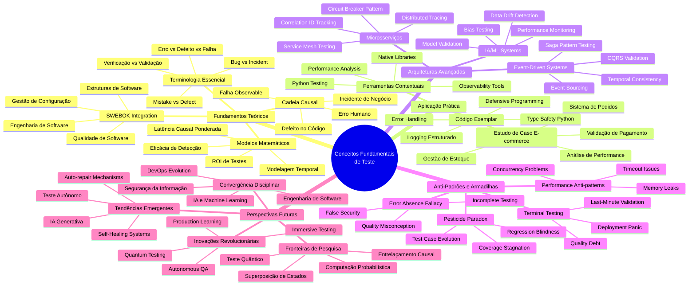

### 5.4. Referências e Leituras Adicionais

#### Livros Fundamentais

1. **Myers, Glenford J.; Sandler, Corey; Badgett, Tom** (2011). *The Art of Software Testing, 3rd Edition*. John Wiley & Sons.
   - Obra seminal que estabeleceu os fundamentos da disciplina

2. **Kaner, Cem; Bach, James; Pettichord, Bret** (2001). *Lessons Learned in Software Testing*. Wiley.
   - Abordagem prática com foco em contexto e heurísticas

3. **Whittaker, James A.** (2009). *Exploratory Software Testing: Tips, Tricks, Tours, and Techniques*. Addison-Wesley.
   - Metodologias modernas de teste exploratório

4. **Humble, Jez; Farley, David** (2010). *Continuous Delivery: Reliable Software Releases through Build, Test, and Deployment Automation*. Addison-Wesley.
   - Integração de teste em pipelines de entrega contínua

#### Artigos de Pesquisa

1. **Bertolino, Antonia** (2007). "Software Testing Research: Achievements, Challenges, Dreams". *Future of Software Engineering (FOSE '07)*, pp. 85-103.
   - Análise abrangente do estado da arte em pesquisa de teste

2. **Harman, Mark; McMinn, Phil; de Souza, Jerffeson Teixeira; Yoo, Shin** (2012). "Search Based Software Engineering: Techniques, Taxonomy, Tutorial". *Empirical Software Engineering and Verification*, pp. 1-59.
   - Técnicas baseadas em busca para otimização de teste

3. **Fraser, Gordon; Arcuri, Andrea** (2011). "EvoSuite: Automatic Test Suite Generation for Object-Oriented Software". *Proceedings of the 19th ACM SIGSOFT Symposium*, pp. 416-419.
   - Geração automática de casos de teste

#### Recursos Online e Padrões

1. **IEEE Standard 829-2008**: IEEE Standard for Software and System Test Documentation
   - Padrão internacional para documentação de teste

2. **ISO/IEC/IEEE 29119**: Software and Systems Engineering -- Software Testing
   - Série de padrões internacionais para teste de software

3. **ISTQB (International Software Testing Qualifications Board)**: [https://www.istqb.org/](https://www.istqb.org/)
   - Certificações e corpo de conhecimento internacional

4. **SWEBOK v3.0 - Chapter 4: Software Testing**: [https://www.computer.org/education/bodies-of-knowledge/software-engineering](https://www.computer.org/education/bodies-of-knowledge/software-engineering)
   - Capítulo oficial sobre teste no corpo de conhecimento da engenharia de software

#### Ferramentas e Plataformas de Pesquisa

1. **Google Scholar**: [https://scholar.google.com/](https://scholar.google.com/)
   - Busca acadêmica para artigos de pesquisa em teste de software

2. **ACM Digital Library**: [https://dl.acm.org/](https://dl.acm.org/)
   - Biblioteca digital com conferências e journals de qualidade

3. **IEEE Xplore**: [https://ieeexplore.ieee.org/](https://ieeexplore.ieee.org/)
   - Base de dados técnica e científica da IEEE

#### Conferências e Journals de Referência

1. **ICSE (International Conference on Software Engineering)**: Premier conferência em engenharia de software
2. **ISSTA (International Symposium on Software Testing and Analysis)**: Focada especificamente em teste e análise
3. **ASE (Automated Software Engineering)**: Automação em engenharia de software
4. **TSE (IEEE Transactions on Software Engineering)**: Journal principal da área
5. **STVR (Software Testing, Verification and Reliability)**: Journal especializado em teste

#### Repositórios de Código e Datasets

1. **GitHub - Software Testing Research**: Repositórios com implementações de técnicas de pesquisa
2. **Defects4J**: Dataset com defeitos reais em projetos Java
3. **SIR (Software-artifact Infrastructure Repository)**: Repositório de artefatos para pesquisa em teste

#### Tendências Futuras - Recursos Emergentes

1. **Quantum Computing and Software Testing**: Artigos emergentes sobre aplicação de computação quântica
2. **AI-Driven Testing**: Pesquisas sobre aplicação de IA generativa em teste
3. **Blockchain Testing**: Metodologias específicas para sistemas distribuídos blockchain
4. **IoT Testing**: Desafios e soluções para teste de Internet das Coisas

---

**Conclusão do Capítulo**: Os conceitos fundamentais de teste de software que exploramos neste capítulo formam a base sólida sobre a qual toda a disciplina se constrói. Da compreensão da cadeia causal básica erro→defeito→falha→incidente até as fronteiras emergentes do teste quântico, estabelecemos um framework conceitual robusto que servirá como alicerce para todos os tópicos avançados que exploraremos nos próximos capítulos.

A jornada apenas começou. Os conceitos aqui apresentados são ferramentas poderosas que, quando dominadas, transformam a prática de teste de uma atividade reativa em uma disciplina proativa, estratégica e scientificamente fundamentada.

**Próximos Passos**: No próximo capítulo, aplicaremos esses conceitos fundamentais ao estudo detalhado de casos de teste e critérios de adequação, onde veremos como transformar a teoria em metodologias práticas e mensuráveis.
