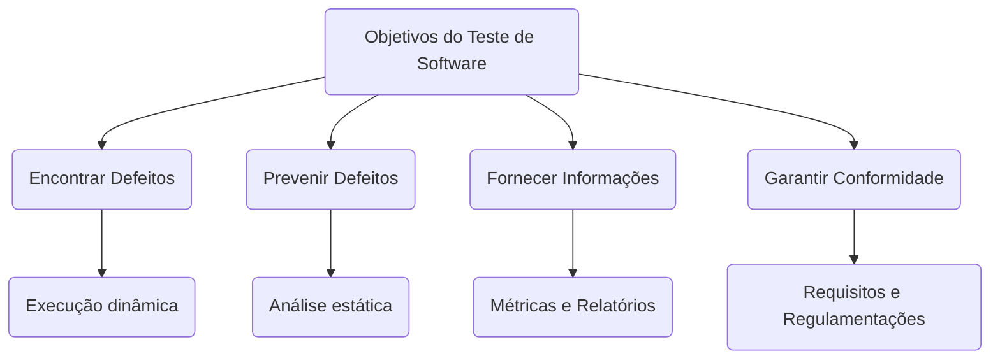
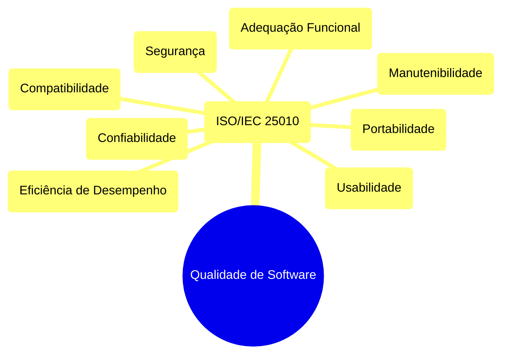

# Aulas 1-2: Introdução ao Teste de Software e Qualidade de Software

## Sumário Completo

*   **Seção 1: Abertura e Engajamento**
    *   1.1. Problema Motivador: O Lançamento Desastroso do "ConnectApp"
    *   1.2. Contexto Histórico e Relevância Atual
*   **Seção 2: Fundamentos Teóricos**
    *   **Bloco 1: A Disciplina do Teste de Software**
        *   2.1.1. Terminologia Essencial e Definições Formais
        *   2.1.2. Estrutura Conceitual: Os Pilares do Teste
        *   2.1.3. Análise de Consequências e Trade-offs
        *   2.1.4. Análise Crítica: Mitos e Verdades sobre Testes
    *   **Bloco 2: O Papel dos Testes no Processo de Desenvolvimento**
        *   2.2.1. Contextualização nos Modelos de Processo
        *   2.2.2. Análise Crítica: A Evolução da Mentalidade de Teste
    *   **Bloco 3: A Natureza da Qualidade de Software**
        *   2.3.1. Terminologia Essencial e Definições Formais
        *   2.3.2. Estrutura Conceitual: O Modelo de Qualidade ISO/IEC 25010
        *   2.3.3. Análise Crítica: Qualidade Percebida vs. Qualidade Intrínseca
    *   **Bloco 4: A Economia da Qualidade**
        *   2.4.1. Estrutura Conceitual: A Curva de Boehm
        *   2.4.2. Modelagem Matemática: O Custo Exponencial do Defeito
        *   2.4.3. Análise Crítica: O ROI do Investimento em Qualidade
*   **Seção 3: Aplicação Prática e Implementação**
    *   3.1. Estudo de Caso Guiado: Analisando o "FoodDash" sob a Ótica da ISO 25010
    *   3.2. Exemplos de Código Comentado
    *   3.3. Ferramentas, Bibliotecas e Ecossistema
*   **Seção 4: Tópicos Avançados e Nuances**
    *   4.1. Desafios Comuns e "Anti-Padrões"
    *   4.2. Variações e Abordagens Modernas: Shift-Left e Shift-Right
    *   4.3. Análise de Trade-offs: O Triângulo de Ferro da Qualidade
*   **Seção 5: Síntese e Perspectivas Futuras**
    *   5.1. Conexões com Outras Áreas da Computação
    *   5.2. A Fronteira da Pesquisa e o Futuro: Testando a Inteligência Artificial
    *   5.3. Resumo do Capítulo e Mapa Mental
    *   5.4. Referências e Leituras Adicionais

---

## Seção 1: Abertura e Engajamento

### 1.1. Problema Motivador: O Lançamento Desastroso do "ConnectApp"

Imagine uma jovem startup de tecnologia, a "Innovatech", que passou os últimos seis meses desenvolvendo o "ConnectApp", um aplicativo de rede social com a promessa de revolucionar a forma como as pessoas organizam eventos. A equipe de desenvolvimento, formada por programadores talentosos e apaixonados, trabalhou incansavelmente, focando em entregar o maior número de funcionalidades no menor tempo possível. A data de lançamento foi anunciada com grande alarde.

No dia do lançamento, o desastre aconteceu. Milhares de usuários baixaram o aplicativo, mas logo as avaliações negativas inundaram a loja de aplicativos. O cadastro de usuários falhava intermitentemente. A função de criar eventos travava o aplicativo. Mensagens privadas eram, por vezes, enviadas para os destinatários errados. Em menos de 24 horas, a reputação da Innovatech foi severamente abalada, e a empresa teve que retirar o aplicativo do ar, enfrentando uma crise de confiança e um prejuízo financeiro considerável. O que deu errado? A equipe era brilhante, o código era inovador, mas eles negligenciaram um pilar fundamental: o **teste de software**. Eles sabiam *construir* o software, mas não sabiam como garantir que ele funcionava de forma correta, confiável e segura.

### 1.2. Contexto Histórico e Relevância Atual

A necessidade de testar não é nova. A história da computação é repleta de "bugs" famosos, desde o primeiro inseto literal (uma mariposa) que travou o computador Mark II em 1947, um incidente documentado pela pioneira Grace Hopper. Naquela época, o teste era um processo informal, quase sinônimo de depuração. O próprio programador era o único responsável por verificar seu trabalho.

Com a explosão da complexidade do software nas décadas seguintes, essa abordagem se tornou insustentável. Surgiram disciplinas como a **Garantia da Qualidade (QA)**, que tratava o teste como uma fase separada, um portão de qualidade antes da entrega. Hoje, na era Ágil e DevOps, o teste evoluiu novamente. Ele deixou de ser uma fase no final do ciclo para se tornar uma **atividade contínua, integrada e responsabilidade de toda a equipe**. A mentalidade moderna, conhecida como *Shift-Left*, prega a antecipação dos testes para o início do ciclo de vida, prevenindo defeitos em vez de apenas detectá-los. Em um mundo onde o software controla carros, sistemas bancários e equipamentos médicos, a relevância do teste transcendeu a funcionalidade e se tornou uma questão de segurança, economia e confiança.

---

## Seção 2: Fundamentos Teóricos

### Bloco 1: A Disciplina do Teste de Software

#### 2.1.1. Terminologia Essencial e Definições Formais

*   **Teste de Software:** Uma definição formal, provida pelo **ISTQB (International Software Testing Qualifications Board)**, descreve o teste como "o processo que consiste em todas as atividades do ciclo de vida, tanto estáticas quanto dinâmicas, preocupadas com o planejamento, preparação e avaliação de produtos de software e produtos de trabalho relacionados para determinar se eles satisfazem os requisitos especificados, para demonstrar que são adequados para o propósito e para detectar defeitos." Essencialmente, é um processo de investigação empírica e técnica para fornecer aos stakeholders informações sobre a qualidade do produto.

*   **Verificação (Verification):** É o processo de avaliação para determinar se os produtos de uma determinada fase de desenvolvimento satisfazem as condições impostas no início dessa fase. Não envolve a execução do código. A pergunta fundamental da verificação é: **"Estamos construindo o produto corretamente?"**.
    > ##### Caixa de Destaque: Analogia para Entender
    >
    > Pense na construção de uma casa. A **verificação** é como o engenheiro revisando a planta baixa para garantir que todas as especificações (medidas dos cômodos, pontos elétricos, encanamento) estão corretas e seguem as normas de engenharia, *antes* de assentar um único tijolo.

*   **Validação (Validation):** É o processo de avaliação de um sistema ou componente durante ou no final do processo de desenvolvimento para determinar se ele satisfaz os requisitos especificados. Envolve a execução do código. A pergunta fundamental da validação é: **"Estamos construindo o produto certo?"**.
    > ##### Caixa de Destaque: Analogia para Entender
    >
    > Usando a mesma analogia da casa, a **validação** é quando os futuros moradores visitam a casa já construída, abrem as janelas, testam as torneiras e caminham pelos cômodos para garantir que ela atende às suas necessidades e expectativas de moradia. A planta pode estar tecnicamente correta (verificada), mas a casa pode não ser funcional para aquela família (não validada).

#### 2.1.2. Estrutura Conceitual: Os Pilares do Teste

Os objetivos do teste de software formam os pilares que sustentam a disciplina. Eles vão muito além da simples detecção de defeitos.

*   **Pilar 1: Encontrar Defeitos e Falhas:** O objetivo mais evidente. O teste busca exercitar o software para provocar a ocorrência de falhas, que indicam a presença de defeitos no código.
*   **Pilar 2: Prevenir Defeitos:** Através de atividades de verificação (como revisão de requisitos e design), o processo de teste ajuda a identificar ambiguidades e erros antes que eles se tornem defeitos no código, o que é muito mais econômico.
*   **Pilar 3: Fornecer Informações para Tomada de Decisão:** Os resultados dos testes (relatórios, métricas de cobertura, listas de defeitos) são insumos cruciais para que os gestores de projeto decidam se um software tem a qualidade necessária para ser lançado.
*   **Pilar 4: Garantir Conformidade:** Verificar se o software atende a todos os requisitos funcionais e não funcionais especificados, além de garantir conformidade com contratos, padrões e regulamentações (como leis de proteção de dados ou normas de segurança).



#### 2.1.3. Análise de Consequências e Trade-offs

A decisão de quanto e como testar não é puramente técnica; ela envolve uma análise de trade-offs. O principal trade-off é entre **custo, tempo e qualidade**. Testar exaustivamente (verificar todas as combinações de entradas e condições) é impraticável para a maioria dos sistemas. Portanto, a estratégia de teste deve ser baseada em risco.

*   **Prós de um Teste Abrangente:** Maior confiança no produto, menor chance de falhas em produção, proteção da reputação da marca.
*   **Contras de um Teste Abrangente:** Aumento do custo e do tempo para lançamento, o que pode resultar na perda de uma janela de oportunidade de mercado.
*   **Consequência de Testes Insuficientes:** Risco elevado de falhas críticas em produção, insatisfação do cliente, custos de correção altíssimos e potenciais perdas financeiras ou danos à imagem.

#### 2.1.4. Análise Crítica: Mitos e Verdades sobre Testes

*   **Mito 1: Testar é caro.**
    *   **Verdade:** Não testar é muito mais caro. A Curva de Boehm demonstra que o custo de correção de um defeito cresce exponencialmente ao longo do ciclo de vida do software.
*   **Mito 2: O objetivo do teste é garantir um software 100% livre de defeitos.**
    *   **Verdade:** Testar pode mostrar a presença de defeitos, mas não provar sua ausência. O objetivo é reduzir o risco de falhas a um nível aceitável.
*   **Mito 3: Qualquer um pode testar.**
    *   **Verdade:** Teste eficaz requer conhecimento técnico, pensamento crítico, curiosidade e um entendimento profundo tanto do sistema quanto do negócio. É uma disciplina de engenharia.
*   **Mito 4: Teste é responsabilidade apenas da equipe de QA.**
    *   **Verdade:** Em metodologias modernas, a qualidade é responsabilidade de toda a equipe (*whole-team approach*). Desenvolvedores, analistas de negócio, designers e operações, todos têm um papel na construção e verificação da qualidade.

### Bloco 2: O Papel dos Testes no Processo de Desenvolvimento

#### 2.2.1. Contextualização nos Modelos de Processo

A organização e a filosofia do teste mudam drasticamente dependendo do modelo de processo de software adotado.

*   **Modelo Cascata (Waterfall):** O teste é uma fase distinta e tardia, que ocorre somente após a conclusão de todo o desenvolvimento. A equipe de teste recebe o software "pronto" e executa um grande volume de testes. O feedback é lento e as correções são caras.
*   **Modelo V:** Representa uma evolução, onde para cada fase de desenvolvimento existe uma fase de teste correspondente planejada em paralelo. Por exemplo, os testes de aceitação são planejados durante a fase de levantamento de requisitos. Isso promove um planejamento mais antecipado, mas ainda mantém a rigidez sequencial do modelo cascata.
*   **Modelos Iterativos (ex: RUP):** O software é desenvolvido em ciclos (iterações). Cada iteração produz um incremento funcional do software, que é testado ao final da iteração. Isso permite um feedback mais rápido e uma adaptação mais fácil a mudanças.
*   **Modelos Ágeis (ex: Scrum, XP):** O teste é uma atividade **contínua e integrada**. A qualidade é construída em conjunto com o software. Práticas como **TDD (Test-Driven Development)**, onde os testes são escritos *antes* do código, e a automação de testes em um pipeline de **Integração Contínua (CI)** são fundamentais. O teste deixa de ser uma fase para se tornar uma disciplina onipresente.
*   **DevOps:** Leva a filosofia Ágil ao extremo, integrando desenvolvimento, teste e operações. O teste é totalmente automatizado e faz parte do pipeline de **Entrega Contínua (CD)**. Conceitos como **Quality Gates** (portões de qualidade automatizados) e **Observabilidade** (monitoramento em produção) tornam-se cruciais.

#### 2.2.2. Análise Crítica: A Evolução da Mentalidade de Teste

A jornada dos modelos de processo reflete uma profunda mudança filosófica:

| Paradigma Antigo (Cascata) | Paradigma Moderno (Ágil/DevOps) |
| :--- | :--- |
| Teste é uma **fase** no final. | Teste é uma **atividade contínua**. |
| Foco em **encontrar defeitos**. | Foco em **prevenir defeitos**. |
| Qualidade é **verificada** no final. | Qualidade é **construída** durante o processo. |
| Responsabilidade da **equipe de QA**. | Responsabilidade de **toda a equipe**. |
| Teste é um **gargalo**. | Teste é um **facilitador** da entrega. |

Essa evolução é frequentemente descrita pelo termo **"Shift-Left"**, que significa deslocar as atividades de teste para a esquerda no cronograma do projeto, ou seja, para mais perto do início.

### Bloco 3: A Natureza da Qualidade de Software

#### 2.3.1. Terminologia Essencial e Definições Formais

*   **Qualidade de Software:** A definição clássica de pioneiros como **Joseph Juran** é a "adequação ao uso" (*fitness for use*). A norma **ISO/IEC 25010** define qualidade como "o grau em que um sistema, produto ou componente atende aos requisitos especificados e às necessidades e expectativas do cliente ou usuário". Não é um atributo único, mas um conjunto de características.

#### 2.3.2. Estrutura Conceitual: O Modelo de Qualidade ISO/IEC 25010

A norma ISO/IEC 25010 é o principal modelo para estruturar o conceito de qualidade. Ela o decompõe em oito características principais:

1.  **Adequação Funcional:** O software faz o que deveria fazer? (Correção, Completude, Adequação).
2.  **Confiabilidade:** O software opera de forma confiável ao longo do tempo? (Maturidade, Disponibilidade, Tolerância a Falhas).
3.  **Usabilidade:** É fácil para o usuário aprender e operar o software? (Inteligibilidade, Apreensibilidade, Operabilidade, Proteção contra Erros do Usuário, Estética da Interface, Acessibilidade).
4.  **Eficiência de Desempenho:** O software utiliza os recursos (tempo, memória, CPU) de forma eficiente? (Comportamento em Relação ao Tempo, Utilização de Recursos, Capacidade).
5.  **Segurança:** O software protege os dados e o sistema contra acessos não autorizados? (Confidencialidade, Integridade, Não Repúdio, Responsabilidade, Autenticidade).
6.  **Compatibilidade:** O software consegue coexistir e interoperar com outros sistemas? (Coexistência, Interoperabilidade).
7.  **Manutenibilidade:** É fácil modificar o software para corrigir defeitos ou adicionar funcionalidades? (Modularidade, Reusabilidade, Analisabilidade, Modificabilidade, Testabilidade).
8.  **Portabilidade:** É fácil transferir o software para outros ambientes? (Adaptabilidade, Instalabilidade, Substituibilidade).



#### 2.3.3. Análise Crítica: Qualidade Percebida vs. Qualidade Intrínseca

É crucial distinguir dois tipos de qualidade:

*   **Qualidade Intrínseca (ou Interna):** Refere-se às características do código e da arquitetura. Um código limpo, bem documentado, com baixo acoplamento e alta coesão possui alta qualidade intrínseca. Essa qualidade é sentida principalmente pela equipe de desenvolvimento e impacta diretamente a **manutenibilidade**.
*   **Qualidade Percebida (ou Externa):** É a qualidade do ponto de vista do usuário final. Envolve características como **usabilidade, confiabilidade e desempenho**.

Um software pode ter alta qualidade intrínseca (código perfeito), mas baixa qualidade percebida (difícil de usar). O inverso também é possível, mas insustentável: um software fácil de usar, mas com código de baixa qualidade (um "monstro de espaguete"), será extremamente caro e difícil de manter e evoluir. O ideal é buscar um equilíbrio, mas a qualidade percebida é, em última análise, o que determina o sucesso do produto no mercado.

### Bloco 4: A Economia da Qualidade

#### 2.4.1. Estrutura Conceitual: A Curva de Boehm

A **Curva de Boehm**, proposta pelo cientista da computação Barry Boehm, é um modelo visual que ilustra o princípio mais importante da economia da engenharia de software: **o custo para corrigir um defeito aumenta exponencialmente quanto mais tarde ele é encontrado no ciclo de vida do desenvolvimento.**

*   **Fase de Requisitos:** Encontrar um erro aqui (ex: um requisito ambíguo) pode custar apenas alguns minutos de conversa para esclarecimento.
*   **Fase de Design:** Um erro no design, se encontrado, pode exigir a reformulação de diagramas e especificações.
*   **Fase de Codificação:** Um defeito encontrado pelo próprio desenvolvedor exige a reescrita de uma parte do código.
*   **Fase de Testes:** Um defeito encontrado pela equipe de QA exige correção, re-teste, re-integração e, possivelmente, a atualização de múltiplos artefatos.
*   **Fase de Produção:** Um defeito em produção é o cenário mais caro. Envolve não apenas todo o custo técnico da correção, mas também o custo de negócio: suporte ao cliente, gerenciamento de crise, perda de dados, dano à reputação e, em casos extremos, prejuízos financeiros diretos ou consequências legais.

#### 2.4.2. Modelagem Matemática: O Custo Exponencial do Defeito

Podemos modelar o custo de um defeito com uma função exponencial simplificada. Seja $C(f)$ o custo de correção de um defeito encontrado na fase $f$, onde as fases são numeradas sequencialmente (ex: 1 para Requisitos, 2 para Design, etc.). O custo pode ser representado por:

$ C(f) = C_0 \cdot k^{f-1} $

Onde:
*   $C_0$ é o custo base para corrigir o defeito na primeira fase (Requisitos).
*   $k$ é o fator multiplicativo, que representa o aumento do custo de uma fase para a outra. Estudos empíricos sugerem que $k$ pode variar de 3 a 10.
*   $f$ é o número da fase.

**Exemplo:** Se $C_0 = R\$ 100$ e $k = 5$:
*   Custo na Fase 1 (Requisitos): $100 \cdot 5^0 = R\$ 100$
*   Custo na Fase 3 (Codificação): $100 \cdot 5^2 = R\$ 2.500$
*   Custo na Fase 5 (Produção): $100 \cdot 5^4 = R\$ 62.500$

Este modelo, embora simples, ilustra poderosamente o impacto econômico de antecipar a detecção de defeitos.

#### 2.4.3. Análise Crítica: O ROI do Investimento em Qualidade

A Curva de Boehm fornece a base para calcular o **Retorno sobre o Investimento (ROI)** em atividades de qualidade. Investir em práticas de "Shift-Left", como revisões de código, TDD ou análise estática, tem um custo inicial. No entanto, se essas práticas previnem que um defeito "vaze" para as fases posteriores, a economia gerada (o custo que *deixou* de ser pago) é muito maior que o investimento inicial.

**ROI = (Custo Evitado - Custo do Investimento) / Custo do Investimento**

Comunicar o valor do teste em termos de ROI é uma das formas mais eficazes de obter apoio da gestão para a implementação de uma cultura de qualidade robusta.

---

## Seção 3: Aplicação Prática e Implementação

### 3.1. Estudo de Caso Guiado: Analisando o "FoodDash" sob a Ótica da ISO 25010

Vamos analisar um aplicativo de entrega de comida fictício, o "FoodDash", usando as características da ISO 25010 para pensar como testaríamos sua qualidade.

*   **Passo 1: Adequação Funcional**
    *   **Pergunta:** O aplicativo faz o que promete?
    *   **Exemplo de Teste:** Criar um caso de teste para verificar se, ao adicionar 3 itens de R$ 10,00 ao carrinho e aplicar um cupom de 10% de desconto, o valor final calculado é R$ 27,00.

*   **Passo 2: Usabilidade**
    *   **Pergunta:** É fácil para um novo usuário pedir comida?
    *   **Exemplo de Teste:** Convidar uma pessoa que nunca usou o app e pedir que ela complete a tarefa de "encontrar um restaurante, escolher um prato, pagar e finalizar o pedido". Cronometrar o tempo e anotar os pontos onde ela sentiu dificuldade.

*   **Passo 3: Eficiência de Desempenho**
    *   **Pergunta:** O aplicativo é rápido, mesmo com muitos usuários?
    *   **Exemplo de Teste:** Usar uma ferramenta de teste de carga (como JMeter ou k6) para simular 5.000 usuários fazendo pedidos ao mesmo tempo e medir o tempo de resposta do servidor. O tempo deve permanecer abaixo de 3 segundos.

*   **Passo 4: Segurança**
    *   **Pergunta:** Os dados de pagamento do cliente estão seguros?
    *   **Exemplo de Teste:** Realizar um teste de penetração para tentar interceptar os dados do cartão de crédito durante a transmissão. Verificar se os dados estão devidamente criptografados (usando HTTPS).

*   **Passo 5: Confiabilidade**
    *   **Pergunta:** O aplicativo funciona de forma consistente?
    *   **Exemplo de Teste:** Deixar um teste automatizado rodando por 24 horas, fazendo um pedido a cada 5 minutos, para garantir que nenhuma falha ou travamento ocorra durante a operação contínua.

### 3.2. Exemplos de Código Comentado

Para a demonstração dos conceitos desta aula introdutória, utilizamos apenas recursos conceituais. Nenhuma implementação de código ou biblioteca externa foi necessária, reforçando que os princípios de qualidade e a estratégia de teste são fundamentais para a estruturação do pensamento antes mesmo da escrita da primeira linha de código.

### 3.3. Ferramentas, Bibliotecas e Ecossistema

Nesta aula, o foco é puramente conceitual. No entanto, ao longo da disciplina, as seguintes categorias de ferramentas serão introduzidas para colocar esses conceitos em prática:

*   **Ferramentas de Gestão de Testes:** Jira, TestRail (para planejar testes e gerenciar defeitos).
*   **Ferramentas de Automação de Testes:** Selenium, Cypress (para testes de interface web), Pytest (para testes em Python).
*   **Ferramentas de Teste de Performance:** JMeter, k6, Gatling.
*   **Ferramentas de Análise de Código:** SonarQube, lints (para garantir a qualidade intrínseca).

---

## Seção 4: Tópicos Avançados e Nuances

### 4.1. Desafios Comuns e "Anti-Padrões"

> ####  caixa de Destaque: Armadilhas a Evitar
>
> 1.  **O Paradoxo do Pesticida:** Se você aplicar os mesmos testes repetidamente, eles eventualmente deixarão de encontrar novos defeitos, assim como os pesticidas perdem o efeito sobre os insetos. É crucial revisar e atualizar constantemente os casos de teste.
> 2.  **A Falácia da Ausência de Erros:** Só porque os testes não encontraram nenhum defeito não significa que o software está pronto. O software pode passar em todos os testes, mas ainda assim ser inútil se não atender às necessidades do usuário.
> 3.  **Teste é uma Fase, não uma Atividade:** Pensar que o teste só acontece no final é o anti-padrão mais perigoso. Isso leva diretamente aos altos custos previstos pela Curva de Boehm.

### 4.2. Variações e Abordagens Modernas: Shift-Left e Shift-Right

*   **Shift-Left (Antecipar):** Esta abordagem move as atividades de teste para o início do ciclo de vida. Em vez de esperar o software ficar pronto, os testes são "deslocados para a esquerda" no cronograma. Isso inclui revisões de requisitos, TDD, análise estática de código e testes de integração contínua. O objetivo é **prevenir defeitos**.
*   **Shift-Right (Validar em Produção):** Esta abordagem envolve testar e monitorar o software depois que ele foi lançado, em ambiente de produção. Isso inclui testes A/B, lançamento canário (*canary releases*), monitoramento de performance e análise de logs. O objetivo é **validar o comportamento do software em condições reais** e obter feedback rápido dos usuários.

### 4.3. Análise de Trade-offs: O Triângulo de Ferro da Qualidade

Em projetos de software, raramente é possível ter tudo. Existe um trade-off constante entre **escopo (features), tempo (prazo) e custo (recursos)**. A **qualidade** está no centro desse triângulo. Se você pressionar qualquer um dos lados, a qualidade é a primeira a ser afetada. Por exemplo, se o prazo é encurtado (tempo), a equipe pode pular testes para entregar mais rápido, resultando em menor qualidade. Um bom profissional de teste entende esses trade-offs e sabe comunicar os riscos de sacrificar a qualidade.

---

## Seção 5: Síntese e Perspectivas Futuras

### 5.1. Conexões com Outras Áreas da Computação

O teste de software moderno não é uma atividade isolada, mas uma disciplina que converge com várias outras áreas:

*   **Engenharia de Software:** O teste é uma parte fundamental do ciclo de vida do software.
*   **Gestão de Projetos:** O planejamento e o progresso dos testes são cruciais para o cronograma e o orçamento do projeto.
*   **Design de Experiência do Usuário (UX):** Testes de usabilidade são essenciais para garantir que o design atenda às necessidades e expectativas dos usuários.
*   **Segurança da Informação:** Testes de segurança (pentest, análise de vulnerabilidades) são vitais para proteger o sistema contra ataques.

### 5.2. A Fronteira da Pesquisa e o Futuro: Testando a Inteligência Artificial

Com a ascensão da IA e do Machine Learning, surgem novos e complexos desafios de teste. Como testar um sistema que aprende e muda seu comportamento ao longo do tempo? As tendências futuras incluem:
*   **Teste de Justiça (Fairness):** Garantir que algoritmos de IA não sejam tendenciosos ou discriminatórios.
*   **Teste de Robustez:** Avaliar como um modelo de IA se comporta com dados inesperados ou maliciosos.
*   **IA para Testes:** Usar a própria IA para gerar casos de teste mais eficientes e prever áreas de risco no código.

### 5.3. Resumo do Capítulo e Mapa Mental

*   **Pontos-Chave:**
    *   Teste de Software é um processo para avaliar a qualidade e não apenas encontrar bugs.
    *   Verificação é "construir certo", Validação é "construir a coisa certa".
    *   A qualidade é multifacetada, e a ISO 25010 nos dá um modelo para avaliá-la.
    *   A Curva de Boehm prova que detectar defeitos cedo economiza muito dinheiro.
    *   Modelos ágeis e DevOps integraram o teste como uma atividade contínua.
    *   A mentalidade moderna é prevenir defeitos (Shift-Left) e validar em produção (Shift-Right).

*   **Mapa Mental:**
    ```mermaid
    mindmap
      root((Teste de Software))
        (Qualidade)
          ::icon(fa fa-award)
          (ISO 25010)
            (Funcionalidade)
            (Confiabilidade)
            (Usabilidade)
            (Eficiência)
            (Segurança)
            (Compatibilidade)
            (Manutenibilidade)
            (Portabilidade)
        (Processo)
          ::icon(fa fa-cogs)
          (Verificação)
          (Validação)
          (Modelos)
            (Cascata)
            (Ágil/DevOps)
        (Economia)
          ::icon(fa fa-dollar-sign)
          (Curva de Boehm)
          (Custo do Defeito)
        (Estratégia)
          ::icon(fa fa-chess-board)
          (Shift-Left)
          (Shift-Right)
          (Automação)
    ```

### 5.4. Referências e Leituras Adicionais

*   **Livros:**
    *   Pressman, R. S., & Maxim, B. R. (2016). *Engenharia de Software: Uma Abordagem Profissional*. 8ª ed. McGraw-Hill.
    *   Myers, G. J., Sandler, C., & Badgett, T. (2011). *The Art of Software Testing*. 3rd ed. John Wiley & Sons.
*   **Organizações e Certificações:**
    *   [ISTQB (International Software Testing Qualifications Board)](https://www.istqb.org/): A principal organização de certificação para profissionais de teste.
    *   [SWEBOK (Guide to the Software Engineering Body of Knowledge)](https://www.computer.org/education/bodies-of-knowledge/software-engineering): Guia que consolida o conhecimento da área.
*   **Artigos e Blogs:**
    *   [Martin Fowler's Blog](https://martinfowler.com/): Artigos sobre design de software, refatoração e testes.
    *   [Google Testing Blog](https://testing.googleblog.com/): Insights sobre como o Google testa seus produtos.
