# Conceitos Fundamentais de Teste

## Sumário

1. **Abertura e Engajamento**
   - 1.1. Problema Motivador
   - 1.2. Contexto Histórico e Relevância Atual

2. **Fundamentos Teóricos**
   - 2.1. O que é Teste de Software?
     - 2.1.1. Definições Formais e Terminologia
     - 2.1.2. Desmistificando o Teste de Software
   - 2.2. Conceitos Fundamentais
     - 2.2.1. Terminologia da Cadeia de Causalidade
     - 2.2.2. Análise da Relação Causal
   - 2.3. O Conceito de Bug
     - 2.3.1. História e Etimologia
     - 2.3.2. Classificação e Impacto
   - 2.4. Verificação e Validação
     - 2.4.1. Fundamentos Conceituais
     - 2.4.2. Análise Comparativa
   - 2.5. Modelagem Matemática dos Conceitos de Teste
   - 2.6. SWEBOK e Teste de Software
     - 2.6.1. Contextualização no Body of Knowledge
     - 2.6.2. Integração com Outras Áreas do SWEBOK
   - 2.7. Modelos de Desenvolvimento e Testes
     - 2.7.1. Evolução Histórica
     - 2.7.2. Análise Comparativa dos Modelos
     - 2.7.3. Análise de Consequências e Trade-offs
   - 2.8. Análise Crítica dos Conceitos Fundamentais
     - 2.8.1. Limitações e Desafios Comuns
     - 2.8.2. Perguntas Frequentes (FAQ)
     - 2.8.3. Evolução dos Conceitos na Era Moderna

## 1. Abertura e Engajamento

### 1.1. Problema Motivador

Imagine a seguinte situação: É sexta-feira, 18h, e você é o desenvolvedor responsável por um sistema crítico de transações bancárias. De repente, seu telefone toca. Do outro lado da linha, um gerente desesperado informa que centenas de clientes estão relatando cobranças duplicadas em suas contas. A investigação inicial revela que um pequeno erro de programação - um simples sinal de maior ou igual (>=) onde deveria ser apenas maior (>) - está causando a duplicação de transações em determinadas condições específicas.

O cenário acima não é fictício. Em 2012, um banco britânico enfrentou uma situação similar que resultou em milhões de contas afetadas e prejuízos estimados em mais de £175 milhões. Este caso ilustra perfeitamente como um pequeno erro pode se transformar em um defeito no código, que por sua vez leva a uma falha no sistema, culminando em um incidente de grandes proporções.

Mas como podemos prevenir tais situações? Como diferenciar entre um erro, um defeito e uma falha? E mais importante: como estruturar um processo de teste que minimize os riscos de tais incidentes chegarem à produção?

### 1.2. Contexto Histórico e Relevância Atual

A história do teste de software confunde-se com a própria história da computação. Em 1947, quando Grace Hopper documentou o primeiro bug de computador - literalmente um inseto (uma mariposa) preso em um relé do Mark II - ela não estava apenas registrando um incidente curioso, mas estabelecendo as bases para uma disciplina fundamental da engenharia de software.

Nas décadas seguintes, à medida que os sistemas se tornavam mais complexos e críticos, o teste de software evoluiu de uma atividade ad hoc para uma disciplina sistemática e rigorosa. Em 1979, Glenford Myers publicou "The Art of Software Testing", estabelecendo princípios que permanecem relevantes até hoje. Na década de 1990, o surgimento do Test Maturity Model (TMM) e do Test Process Improvement (TPI) formalizou ainda mais a disciplina.

Hoje, em 2025, o teste de software é mais crítico do que nunca. Com sistemas distribuídos, arquiteturas em microserviços, DevOps e entrega contínua, a necessidade de testes eficazes e eficientes cresceu exponencialmente. De acordo com o relatório Capgemini World Quality Report 2024-2025, organizações dedicam em média 25% do orçamento de TI a atividades relacionadas a teste e qualidade de software.

## 2. Fundamentos Teóricos

### 2.1. Terminologia Essencial e Definições Formais

#### 2.1.1. O que é Teste de Software?

Segundo o IEEE (Instituto de Engenheiros Eletricistas e Eletrônicos), teste de software é:

"O processo de operar um sistema ou componente sob condições específicas, observando ou registrando os resultados, e fazendo uma avaliação de algum aspecto do sistema ou componente."

De forma mais pragmática, o ISTQB (International Software Testing Qualifications Board) define como:

"O processo que consiste em todas as atividades do ciclo de vida, tanto estáticas quanto dinâmicas, relacionadas com o planejamento, preparação e avaliação de produtos de software e produtos relacionados para determinar se eles satisfazem os requisitos especificados, demonstrar que são adequados para o propósito e detectar defeitos."

O teste de software é um processo sistemático e disciplinado que envolve três elementos fundamentais:

1. **Exercitar o software**: Executar o software com dados de entrada específicos
2. **Identificar discrepâncias**: Comparar comportamento esperado vs. observado
3. **Determinar conformidade**: Verificar se atende aos requisitos especificados

> **Analogia para Entender**
> 
> Pense no teste de software como uma inspeção de qualidade em uma fábrica de carros. Assim como um carro passa por diferentes estações de verificação (freios, motor, eletrônica etc.), um software precisa passar por diferentes tipos de testes. Em ambos os casos, o objetivo é garantir que o produto final seja seguro, confiável e atenda às expectativas do usuário.

#### 2.1.2. O que NÃO é Teste de Software

É crucial desmistificar conceitos errôneos sobre testes que persistem na indústria:

| **Mito** | **Realidade** |
|----------|---------------|
| "Testar é só executar o sistema" | Teste inclui planejamento, design, análise e documentação |
| "Testar só serve para achar erro" | Teste também demonstra conformidade e melhora confiança |
| "Teste é responsabilidade exclusiva do QA" | Teste é responsabilidade de toda a equipe de desenvolvimento |
| "Teste é só no final" | Teste deve ocorrer durante todo o ciclo de desenvolvimento |

### 2.2. Conceitos Fundamentais

#### 2.2.1. Terminologia da Cadeia de Causalidade

A compreensão precisa dos conceitos de erro, defeito, falha e incidente é fundamental para qualquer profissional de teste. Estes conceitos formam uma cadeia causal que explica como problemas humanos se manifestam em impactos no negócio.

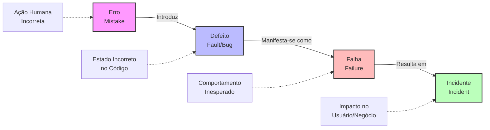

**Erro (Mistake):**
- **Definição Formal**: Ação humana que produz um resultado incorreto
- **Características**:
  * Origem: Cognitiva humana (mal-entendido, falta de conhecimento, distração)
  * Momento: Durante análise, design ou implementação
  * Prevenção: Revisões, treinamento, processos estruturados
- **Exemplos Práticos**:
  * Desenvolvedor implementa soma (`+`) ao invés de multiplicação (`*`)
  * Analista documenta requisito com ambiguidade
  * Arquiteto escolhe padrão inadequado para o contexto

**Defeito (Fault/Bug):**
- **Definição Formal**: Manifestação de um erro no código, documentação ou outro artefato
- **Características**:
  * Natureza: Estático (existe mesmo sem execução)
  * Detecção: Análise estática, revisão de código, inspeção
  * Localização: Código-fonte, documentos, configurações
- **Exemplos Práticos**:
  * Condição `if (x >= 0)` quando deveria ser `if (x > 0)`
  * Endpoint REST sem validação adequada de autenticação
  * Query SQL com JOIN incorreto

**Falha (Failure):**
- **Definição Formal**: Desvio do comportamento esperado durante a execução
- **Características**:
  * Natureza: Dinâmica (só ocorre durante execução)
  * Observabilidade: Externamente visível
  * Dependência: Condições específicas de execução
- **Exemplos Práticos**:
  * Sistema de e-commerce cobrando duas vezes pelo mesmo item
  * Aplicação móvel travando ao receber notificação
  * Sistema de login aceitando credenciais inválidas

**Incidente:**
- **Definição Formal**: Manifestação observável de uma falha que impacta usuários/negócio
- **Características**:
  * Impacto: Afeta operações do negócio
  * Urgência: Requer investigação e correção
  * Rastreabilidade: Documentado e monitorado
- **Exemplos Práticos**:
  * Indisponibilidade de sistema crítico por 2 horas
  * Vazamento de dados pessoais de clientes
  * Performance degradada causando abandono de carrinho

#### 2.2.2. Análise da Relação Causal

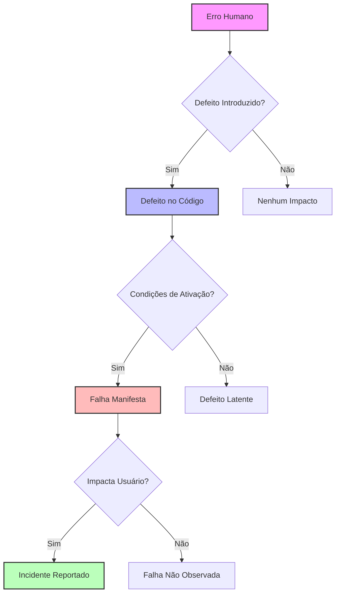

**Pontos Críticos da Cadeia:**

1. **Nem todo erro gera defeito**: Revisões e validações podem interceptar
2. **Nem todo defeito gera falha**: Algumas condições podem nunca ser executadas
3. **Nem toda falha gera incidente**: Pode não ser observada ou impactar usuários

### 2.3. O Conceito de Bug

#### 2.3.1. História e Etimologia

O termo "bug" tem uma origem histórica fascinante que remonta aos primórdios da computação. Em 9 de setembro de 1947, Grace Hopper, pioneira da programação, encontrou uma mariposa presa em um relé do computador Mark II Aecken da Universidade Harvard. Ela colou o inseto em seu caderno de anotações e escreveu: "First actual case of bug being found" (Primeiro caso real de bug sendo encontrado).

Embora o termo já fosse usado informalmente para descrever problemas mecânicos, este incidente popularizou sua aplicação na computação. Grace Hopper, que mais tarde desenvolveria o primeiro compilador, estabeleceu sem saber uma terminologia que perduraria por décadas.

#### 2.3.2. Classificação e Impacto de Bugs

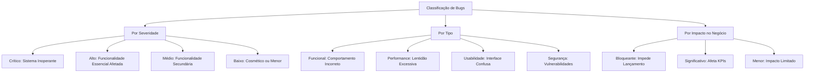

**Casos Famosos de Bugs Custosos:**

| **Ano** | **Sistema** | **Bug** | **Impacto** |
|---------|-------------|---------|-------------|
| 1996 | Ariane 5 | Overflow em conversão de 64-bit para 16-bit | €370 milhões |
| 2012 | Knight Capital | Loop infinito em trading algoritmo | $440 milhões em 45 min |
| 2017 | Equifax | Vulnerabilidade Apache Struts não corrigida | 147 milhões de dados expostos |
| 2020 | Boeing 737 MAX | Sensor MCAS com lógica incorreta | 346 vidas perdidas |

### 2.4. Verificação e Validação

#### 2.4.1. Fundamentos Conceituais

A distinção entre verificação e validação é fundamental para compreender os diferentes objetivos dos testes. Esta separação, conhecida como V&V (Verification and Validation), foi formalizada por Barry Boehm em 1981.

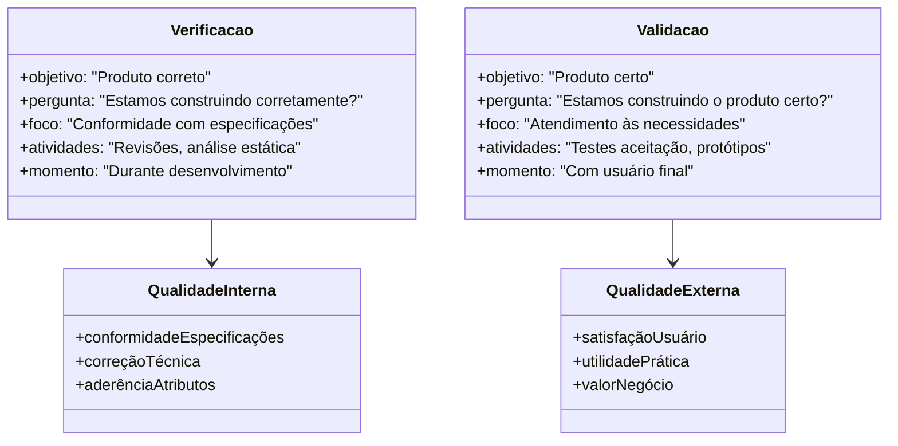

**Verificação:**
- **Definição**: Processo de confirmação que o produto está sendo construído de acordo com especificações
- **Atividades Típicas**:
  * Revisões técnicas estruturadas
  * Inspeções de código (code review)
  * Análise estática automatizada
  * Testes unitários e de integração
  * Walkthroughs de design

**Validação:**
- **Definição**: Processo de confirmação que o produto certo está sendo construído para o usuário
- **Atividades Típicas**:
  * Testes de aceitação com usuários
  * Prototipagem e validação de conceitos
  * Testes de usabilidade
  * Validação de requisitos com stakeholders
  * Testes beta com usuários reais

#### 2.4.2. Análise Comparativa

| **Aspecto** | **Verificação** | **Validação** |
|-------------|-----------------|---------------|
| **Pergunta Central** | "Estamos construindo o produto corretamente?" | "Estamos construindo o produto certo?" |
| **Foco** | Conformidade técnica | Necessidades do usuário |
| **Métodos** | Técnicos e formais | Empíricos e subjetivos |
| **Participantes** | Equipe técnica | Usuários e stakeholders |
| **Timing** | Durante desenvolvimento | Marcos de entrega |
| **Critério de Sucesso** | Aderência às especificações | Satisfação das necessidades |

### 2.5. Modelagem Matemática dos Conceitos de Teste

A teoria do teste de software pode ser formalizada matematicamente usando teoria dos conjuntos e lógica proposicional. Esta formalização é essencial para compreender os limites teóricos e práticos dos testes.

Seja $S$ um programa (software) e $D$ o domínio de entrada. Para cada entrada $x \in D$, existe uma saída esperada $y \in R$ (conjunto de resultados possíveis).

Definimos a função do programa como:

$$f_S: D \rightarrow R$$

onde:
- $S$ representa o software sob teste
- $D$ é o domínio de todas as entradas possíveis
- $R$ é o conjunto de todas as saídas possíveis

Um teste $t$ é um par ordenado $(x, y)$ onde:
- $x \in D$ é a entrada de teste
- $y \in R$ é a saída esperada

O conjunto de todos os testes possíveis $T$ é definido como:

$$T = \{(x, y) | x \in D \text{ e } y = f_S(x)\}$$

A **cobertura de teste** $C$ pode ser expressa como:

$$C = \frac{|T_{executado}|}{|T|} \times 100\%$$

onde:
- $T_{executado} \subseteq T$ é o conjunto de testes efetivamente executados
- $|T|$ representa a cardinalidade do conjunto (número total de testes possíveis)

A **eficácia do teste** $E$ pode ser modelada como:

$$E = \frac{\text{Defeitos encontrados}}{\text{Total de defeitos existentes}}$$

**Limitações Matemáticas:**

1. **Problema da Explosão Combinatorial**: Para um programa com $n$ variáveis de entrada, cada uma com $k$ valores possíveis, temos $k^n$ combinações possíveis de teste.

2. **Teorema da Incompletude de Dijkstra**: "Testes podem mostrar a presença de bugs, mas nunca sua ausência."

3. **Complexidade Temporal**: O teste exaustivo é computacionalmente intratável para sistemas reais: $O(k^n)$.

### 2.6. SWEBOK e Teste de Software

#### 2.6.1. Contextualização no Body of Knowledge

O SWEBOK (Software Engineering Body of Knowledge) é um guia internacionalmente reconhecido que define e organiza o conhecimento em engenharia de software. O teste de software é uma das 15 áreas de conhecimento fundamentais definidas no SWEBOK v3.0.

```mermaid
graph TD
    A[SWEBOK v3.0] --> B[Fundamentos de Engenharia]
    A --> C[Requisitos de Software]
    A --> D[Design de Software]
    A --> E[Construção de Software]
    A --> F[Teste de Software]
    A --> G[Manutenção de Software]
    A --> H[Gestão de Configuração]
    A --> I[Gestão de Engenharia]
    A --> J[Processo de Engenharia]
    A --> K[Modelos e Métodos]
    A --> L[Qualidade de Software]
    A --> M[Prática Profissional]
    A --> N[Aspectos Econômicos]
    A --> O[Fundamentos de Computação]
    A --> P[Fundamentos Matemáticos]
    
    F --> F1[Fundamentos de Teste]
    F --> F2[Níveis de Teste]
    F --> F3[Técnicas de Teste]
    F --> F4[Métricas Relacionadas]
    F --> F5[Processo de Teste]
    
    style F fill:#f9f,stroke:#333,stroke-width:4px
    style F1,F2,F3,F4,F5 fill:#e1f5fe,stroke:#0277bd,stroke-width:2px
```

> **Analogia para Entender**
> 
> O SWEBOK é como uma enciclopédia médica para a engenharia de software. Assim como a medicina tem suas especialidades (cardiologia, neurologia etc.), a engenharia de software tem suas áreas de conhecimento. O teste é uma dessas "especialidades" fundamentais, com seus próprios conceitos, técnicas e melhores práticas bem definidas.

#### 2.6.2. Integração com Outras Áreas do SWEBOK

O teste de software no SWEBOK interage fortemente com outras áreas de conhecimento, criando um ecossistema integrado de práticas:

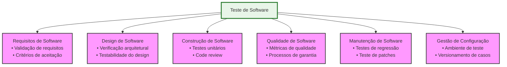

**Benefícios da Abordagem SWEBOK para Testes:**

1. **Padronização**: Terminologia e conceitos consistentes internacionalmente
2. **Sistematização**: Organização clara das práticas e conhecimentos
3. **Completude**: Cobertura abrangente desde fundamentos até práticas avançadas
4. **Integração**: Conexões explícitas com outras disciplinas da engenharia
5. **Evolução**: Framework para incorporar novas práticas e tecnologias

### 2.7. Modelos de Desenvolvimento e Testes

#### 2.7.1. Evolução Histórica dos Testes nos Modelos de Desenvolvimento

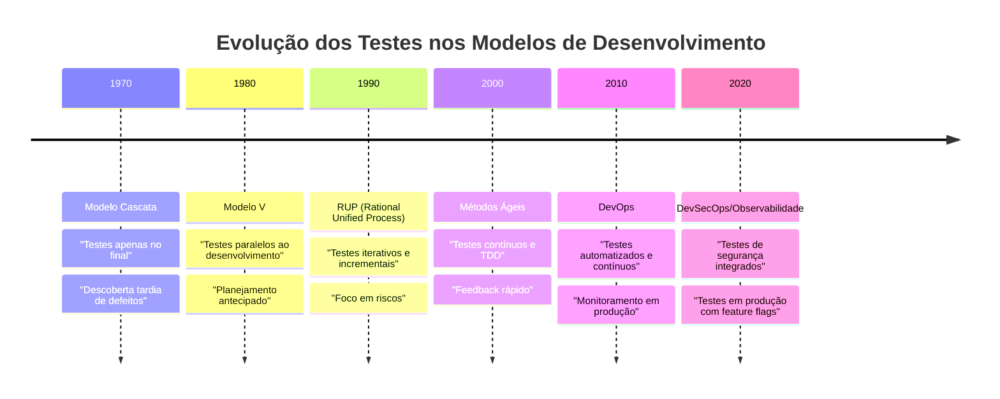

#### 2.7.2. Análise Comparativa dos Modelos

##### Modelo Tradicional (Cascata)
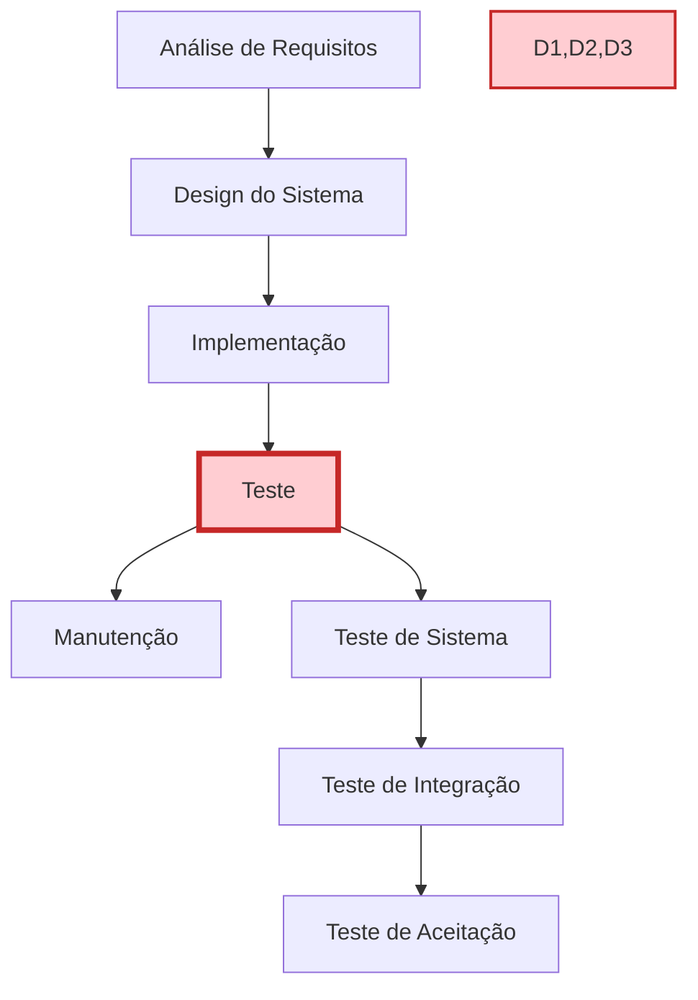

**Características do Teste no Modelo Cascata:**
- **Timing**: Testes executados apenas após desenvolvimento completo
- **Risco**: Alto risco de descoberta tardia de defeitos críticos
- **Custo**: Custo elevado de correção (regra 10x de Boehm)
- **Feedback**: Feedback tardio sobre qualidade do produto

**Limitações Críticas:**
- Defeitos arquiteturais descobertos muito tarde
- Requisitos mal compreendidos só identificados no final
- Pressão de cronograma leva a testes inadequados

##### Modelo V
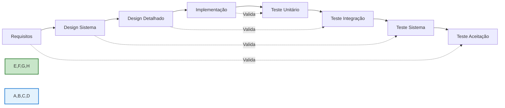

**Inovações do Modelo V:**
- **Planejamento Paralelo**: Casos de teste desenvolvidos junto com requisitos
- **Rastreabilidade**: Cada nível de desenvolvimento tem nível de teste correspondente
- **Validação Antecipada**: Critérios de aceitação definidos desde o início

##### Modelo Ágil/DevOps
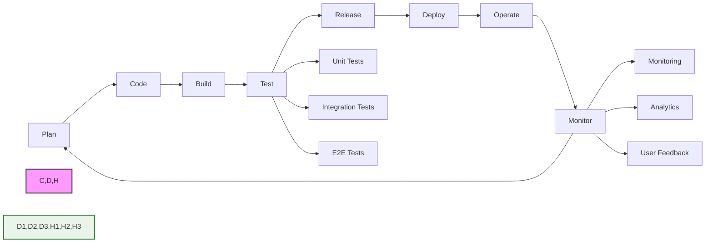

**Características Revolucionárias:**
- **Testes Contínuos**: Execução automatizada a cada commit
- **Feedback Rápido**: Resultados em minutos, não semanas
- **Shift-Left**: Testes movidos para início do ciclo
- **Monitoramento Ativo**: Observabilidade em produção

#### 2.7.3. Análise de Consequências e Trade-offs

| **Modelo** | **Vantagens** | **Desvantagens** | **Contexto Ideal** |
|------------|---------------|------------------|-------------------|
| **Cascata** | • Planejamento claro<br>• Documentação completa<br>• Controle rigoroso | • Descoberta tardia de problemas<br>• Baixa adaptabilidade<br>• Alto risco de retrabalho | • Projetos bem definidos<br>• Requisitos estáveis<br>• Domínios conhecidos |
| **Modelo V** | • Validação em cada etapa<br>• Rastreabilidade clara<br>• Planejamento antecipado | • Ainda sequencial<br>• Pouca flexibilidade<br>• Feedback limitado | • Projetos críticos<br>• Regulamentação rigorosa<br>• Equipes estruturadas |
| **Ágil** | • Feedback rápido<br>• Adaptabilidade alta<br>• Entregas frequentes | • Documentação limitada<br>• Requer disciplina<br>• Mudanças constantes | • Projetos inovativos<br>• Requisitos evolutivos<br>• Equipes experientes |
| **DevOps** | • Automação completa<br>• Tempo de mercado reduzido<br>• Monitoramento contínuo | • Complexidade técnica<br>• Investimento inicial alto<br>• Curva de aprendizado íngreme | • Produtos digitais<br>• Escalabilidade necessária<br>• Cultura colaborativa |

### 2.8. Análise Crítica dos Conceitos Fundamentais

#### 2.8.1. Limitações e Desafios Comuns

**Desafios na Aplicação dos Conceitos:**

1. **Ambiguidade Terminológica**: Diferentes organizações usam termos como "bug", "defeito" e "issue" de forma inconsistente
2. **Subjetividade na Classificação**: A gravidade de um incidente pode variar conforme perspectiva do stakeholder
3. **Causalidade Complexa**: Em sistemas distribuídos, a cadeia erro→defeito→falha→incidente pode ser não-linear
4. **Falsos Positivos**: Nem todo comportamento inesperado constitui uma falha real

**Armadilhas Comuns:**

> **⚠️ Armadilhas a Evitar**
> 
> 1. **Confundir Severidade com Prioridade**: Um bug crítico pode ter baixa prioridade se afeta funcionalidade não utilizada
> 2. **Supor Causalidade Linear**: Um incidente pode resultar de múltiplos defeitos interagindo
> 3. **Negligenciar Contexto**: O mesmo defeito pode ou não gerar falha dependendo do ambiente
> 4. **Focar Apenas em Defeitos**: Testes também validam conformidade e aumentam confiança

#### 2.8.2. Perguntas Frequentes (FAQ)

**Q1: Por que um erro nem sempre resulta em defeito?**
R: Revisões de código, testes unitários e ferramentas de análise estática podem interceptar erros antes que se tornem defeitos no código final.

**Q2: Um defeito sempre causa falha?**
R: Não. Um defeito pode permanecer "latente" se as condições para sua ativação nunca ocorrerem. Por exemplo, um bug em uma funcionalidade raramente usada.

**Q3: Qual a diferença entre bug e defeito?**
R: São sinônimos na prática. "Bug" é mais informal e popular, enquanto "defeito" é mais formal e acadêmico.

**Q4: Como distinguir entre verificação e validação na prática?**
R: Verificação pergunta "fizemos certo?" (conformidade), validação pergunta "fizemos a coisa certa?" (necessidade do usuário).

**Q5: Todos os modelos de desenvolvimento precisam de testes?**
R: Sim, mas a abordagem varia. Modelos tradicionais fazem testes no final, ágeis integram testes continuamente.

#### 2.8.3. Evolução dos Conceitos na Era Moderna

**Impacto de Tecnologias Emergentes:**

- **Inteligência Artificial**: Novos tipos de defeitos (bias, degradação de modelo)
- **Microserviços**: Falhas sistêmicas vs. componentes individuais
- **Cloud Computing**: Incidentes de infraestrutura vs. aplicação
- **IoT**: Defeitos físicos vs. software, questões de conectividade

**Tendências Futuras:**

1. **Testes Autônomos**: IA gerando e executando casos de teste automaticamente
2. **Observabilidade Avançada**: Detecção proativa de falhas através de ML
3. **Chaos Engineering**: Injeção intencional de falhas para teste de resiliência
4. **Shift-Right Testing**: Testes em produção com usuários reais

> **Analogia para Entender**
> 
> A evolução dos conceitos de teste é similar à evolução da medicina:
> - **Era Tradicional**: Tratar doença após sintomas aparecerem (testes no final)
> - **Era Preventiva**: Check-ups regulares e exames preventivos (testes contínuos)
> - **Era Preditiva**: Medicina personalizada e monitoramento constante (observabilidade e IA)

## 3. Aplicação Prática e Implementação

### 3.1. Estudo de Caso Guiado: Sistema de Gestão de Biblioteca

Vamos aplicar todos os conceitos fundamentais de teste estudados através de um sistema prático de gestão de biblioteca. Este estudo de caso demonstrará como identificar erros, defeitos, falhas e incidentes em um cenário real, além de aplicar verificação e validação.

#### Passo 1: Definição do Problema e Requisitos

**Contexto do Sistema:**
Nossa biblioteca universitária precisa de um sistema para gerenciar empréstimos de livros. O sistema deve permitir:

- Cadastrar livros com informações básicas
- Registrar usuários (estudantes e professores)
- Realizar empréstimos com diferentes prazos
- Controlar devoluções e calcular multas por atraso

**Requisitos Funcionais Essenciais:**
1. **RF01**: Livro deve ter ISBN, título, autor e disponibilidade
2. **RF02**: Usuário deve ter ID, nome, tipo (estudante/professor) e status
3. **RF03**: Empréstimo para estudante: máximo 7 dias
4. **RF04**: Empréstimo para professor: máximo 30 dias
5. **RF05**: Multa de R$ 1,00 por dia de atraso para estudantes
6. **RF06**: Multa de R$ 0,50 por dia de atraso para professores
7. **RF07**: Usuário bloqueado não pode fazer novos empréstimos

#### Passo 2: Implementação Inicial - Demonstrando a Cadeia Erro→Defeito→Falha→Incidente

Vamos implementar o sistema de forma intencional com alguns problemas para demonstrar os conceitos teóricos na prática.

**Arquivo: `biblioteca_v1.py` (Versão com Problemas)**

```python
#!/usr/bin/env python3
"""
Sistema de Gestão de Biblioteca - Versão 1 (com problemas intencionais)

Este código contém erros propositais para demonstrar a cadeia causal:
Erro → Defeito → Falha → Incidente

Autor: Estudo de Caso - Conceitos Fundamentais de Teste
"""

from datetime import datetime, timedelta
from typing import Dict, List, Optional
from enum import Enum


class TipoUsuario(Enum):
    """Enumera os tipos de usuários do sistema."""
    ESTUDANTE = "estudante"
    PROFESSOR = "professor"


class StatusUsuario(Enum):
    """Enumera os status possíveis de um usuário."""
    ATIVO = "ativo"
    BLOQUEADO = "bloqueado"


class Livro:
    """
    Representa um livro no sistema da biblioteca.
    
    ERRO INTENCIONAL 1: Falta de validação adequada do ISBN
    """
    
    def __init__(self, isbn: str, titulo: str, autor: str, disponivel: bool = True):
        # DEFEITO: ISBN não é validado adequately
        # Um ISBN deve ter 10 ou 13 dígitos, mas não estamos verificando
        self.isbn = isbn  # Aqui está o DEFEITO
        self.titulo = titulo
        self.autor = autor
        self.disponivel = disponivel
    
    def emprestar(self) -> bool:
        """
        Marca o livro como emprestado.
        
        Returns:
            bool: True se empréstimo foi realizado com sucesso
        """
        if self.disponivel:
            self.disponivel = False
            return True
        return False
    
    def devolver(self) -> None:
        """Marca o livro como disponível novamente."""
        self.disponivel = True


class Usuario:
    """
    Representa um usuário do sistema da biblioteca.
    
    ERRO INTENCIONAL 2: Lógica incorreta na validação de bloqueio
    """
    
    def __init__(self, user_id: str, nome: str, tipo: TipoUsuario, 
                 status: StatusUsuario = StatusUsuario.ATIVO):
        self.user_id = user_id
        self.nome = nome
        self.tipo = tipo
        self.status = status
        self.multa_total = 0.0
    
    def pode_emprestar(self) -> bool:
        """
        Verifica se o usuário pode realizar empréstimos.
        
        DEFEITO: Lógica de bloqueio está invertida!
        O programador confundiu == com !=
        """
        # DEFEITO CRÍTICO: Esta condição está ERRADA!
        # Deveria ser: self.status == StatusUsuario.ATIVO
        return self.status == StatusUsuario.BLOQUEADO  # ❌ DEFEITO!
    
    def adicionar_multa(self, valor: float) -> None:
        """Adiciona multa ao usuário."""
        self.multa_total += valor
        
        # DEFEITO: Limite de bloqueio por multa mal implementado
        if self.multa_total > 50.0:  # Bloqueia com multa alta
            self.status = StatusUsuario.BLOQUEADO


class Emprestimo:
    """
    Representa um empréstimo de livro.
    
    ERRO INTENCIONAL 3: Cálculo incorreto de multa
    """
    
    def __init__(self, usuario: Usuario, livro: Livro):
        self.usuario = usuario
        self.livro = livro
        self.data_emprestimo = datetime.now()
        
        # DEFEITO: Cálculo de prazo com lógica errada para professores
        if usuario.tipo == TipoUsuario.ESTUDANTE:
            self.prazo_dias = 7
        else:  # Professor
            # DEFEITO: Número errado de dias para professor!
            # Requisito era 30 dias, mas programador colocou 3!
            self.prazo_dias = 3  # ❌ DEFEITO! Deveria ser 30
        
        self.data_vencimento = self.data_emprestimo + timedelta(days=self.prazo_dias)
        self.devolvido = False
        self.data_devolucao: Optional[datetime] = None
    
    def calcular_multa(self) -> float:
        """
        Calcula multa por atraso na devolução.
        
        DEFEITO: Taxa de multa incorreta para professores
        """
        if self.devolvido and self.data_devolucao:
            dias_atraso = (self.data_devolucao - self.data_vencimento).days
            
            if dias_atraso > 0:
                if self.usuario.tipo == TipoUsuario.ESTUDANTE:
                    return dias_atraso * 1.0  # Correto: R$ 1,00 por dia
                else:
                    # DEFEITO: Taxa errada para professor!
                    # Deveria ser 0.50, mas está 5.0!
                    return dias_atraso * 5.0  # ❌ DEFEITO! Deveria ser 0.50
        
        return 0.0
    
    def devolver_livro(self, data_devolucao: datetime = None) -> float:
        """
        Processa a devolução do livro.
        
        Returns:
            float: Valor da multa aplicada
        """
        if data_devolucao is None:
            data_devolucao = datetime.now()
        
        self.data_devolucao = data_devolucao
        self.devolvido = True
        self.livro.devolver()
        
        multa = self.calcular_multa()
        if multa > 0:
            self.usuario.adicionar_multa(multa)
        
        return multa


class SistemaBiblioteca:
    """
    Sistema principal de gestão da biblioteca.
    
    ERRO INTENCIONAL 4: Falta de tratamento de exceções
    """
    
    def __init__(self):
        self.livros: Dict[str, Livro] = {}
        self.usuarios: Dict[str, Usuario] = {}
        self.emprestimos: List[Emprestimo] = []
    
    def cadastrar_livro(self, isbn: str, titulo: str, autor: str) -> bool:
        """
        Cadastra um novo livro no sistema.
        
        DEFEITO: Não valida ISBN duplicado adequadamente
        """
        # DEFEITO: Não verifica se ISBN já existe!
        # Permite cadastros duplicados
        livro = Livro(isbn, titulo, autor)
        self.livros[isbn] = livro  # Sobrescreve livros existentes!
        return True
    
    def cadastrar_usuario(self, user_id: str, nome: str, tipo: TipoUsuario) -> bool:
        """Cadastra um novo usuário no sistema."""
        if user_id in self.usuarios:
            return False  # Usuário já existe
        
        usuario = Usuario(user_id, nome, tipo)
        self.usuarios[user_id] = usuario
        return True
    
    def realizar_emprestimo(self, user_id: str, isbn: str) -> Optional[Emprestimo]:
        """
        Realiza um empréstimo de livro.
        
        DEFEITO: Não trata casos de usuário/livro inexistente
        """
        # DEFEITO: Não verifica se usuário existe!
        # Pode causar KeyError (exceção não tratada)
        usuario = self.usuarios[user_id]  # ❌ Possível exceção!
        
        # DEFEITO: Não verifica se livro existe!
        livro = self.livros[isbn]  # ❌ Possível exceção!
        
        # Verifica se usuário pode emprestar
        if not usuario.pode_emprestar():
            return None  # Usuário bloqueado (mas lógica está invertida!)
        
        # Verifica se livro está disponível
        if not livro.emprestar():
            return None  # Livro não disponível
        
        emprestimo = Emprestimo(usuario, livro)
        self.emprestimos.append(emprestimo)
        return emprestimo


# =============================================================================
# DEMONSTRAÇÃO PRÁTICA: Como os DEFEITOS geram FALHAS e INCIDENTES
# =============================================================================

def demonstracao_cadeia_causal():
    """
    Demonstra como erros no código geram defeitos, 
    que causam falhas, que resultam em incidentes.
    """
    print("=== DEMONSTRAÇÃO: Cadeia Erro → Defeito → Falha → Incidente ===\n")
    
    # Inicializa o sistema
    biblioteca = SistemaBiblioteca()
    
    # Cadastra livros e usuários
    biblioteca.cadastrar_livro("123", "Python para Iniciantes", "Autor X")
    biblioteca.cadastrar_usuario("prof001", "Dr. Silva", TipoUsuario.PROFESSOR)
    biblioteca.cadastrar_usuario("est001", "João Santos", TipoUsuario.ESTUDANTE)
    
    print("✅ Sistema inicializado com livros e usuários")
    
    # =================================================================
    # INCIDENTE 1: Usuário bloqueado consegue fazer empréstimo
    # =================================================================
    print("\n🚨 INCIDENTE 1: Lógica de bloqueio invertida")
    
    # Força bloqueio do usuário
    usuario_estudante = biblioteca.usuarios["est001"]
    usuario_estudante.status = StatusUsuario.BLOQUEADO
    print(f"📋 Status do estudante: {usuario_estudante.status.value}")
    
    # Tenta fazer empréstimo (deveria ser negado, mas será aprovado!)
    emprestimo = biblioteca.realizar_emprestimo("est001", "123")
    
    if emprestimo:
        print("❌ FALHA: Usuário BLOQUEADO conseguiu fazer empréstimo!")
        print("💸 INCIDENTE: Biblioteca perde controle sobre usuários inadimplentes")
    else:
        print("✅ Empréstimo negado corretamente")
    
    # =================================================================
    # INCIDENTE 2: Professor com prazo errado
    # =================================================================
    print("\n🚨 INCIDENTE 2: Prazo incorreto para professor")
    
    # Cadastra novo livro para testar com professor
    biblioteca.cadastrar_livro("456", "Metodologia Científica", "Autor Y")
    emprestimo_prof = biblioteca.realizar_emprestimo("prof001", "456")
    
    if emprestimo_prof:
        print(f"📅 Prazo para professor: {emprestimo_prof.prazo_dias} dias")
        print("❌ FALHA: Professor deveria ter 30 dias, mas tem apenas 3!")
        print("😡 INCIDENTE: Professores reclamam de prazo muito curto")
    
    # =================================================================
    # INCIDENTE 3: Multa exorbitante para professor
    # =================================================================
    print("\n🚨 INCIDENTE 3: Multa incorreta para professor")
    
    # Simula devolução com atraso
    data_futura = datetime.now() + timedelta(days=5)  # 5 dias de atraso
    multa = emprestimo_prof.devolver_livro(data_futura)
    
    print(f"💰 Multa calculada: R$ {multa:.2f}")
    print("❌ FALHA: Professor deveria pagar R$ 2,50 (5 dias × R$ 0,50)")
    print("💸 INCIDENTE: Professor é cobrado R$ 25,00 - valor abusivo!")
    
    # =================================================================
    # INCIDENTE 4: Sistema trava com dados inexistentes
    # =================================================================
    print("\n🚨 INCIDENTE 4: Sistema trava com exceção não tratada")
    
    try:
        # Tenta empréstimo com usuário inexistente
        biblioteca.realizar_emprestimo("user999", "123")
    except KeyError as e:
        print(f"💥 EXCEÇÃO: {type(e).__name__} - {e}")
        print("❌ FALHA: Sistema não trata usuário inexistente")
        print("🔥 INCIDENTE: Sistema da biblioteca trava durante atendimento")


if __name__ == "__main__":
    demonstracao_cadeia_causal()
```

#### Passo 3: Análise dos Problemas Identificados

Vamos mapear cada problema encontrado na cadeia causal:

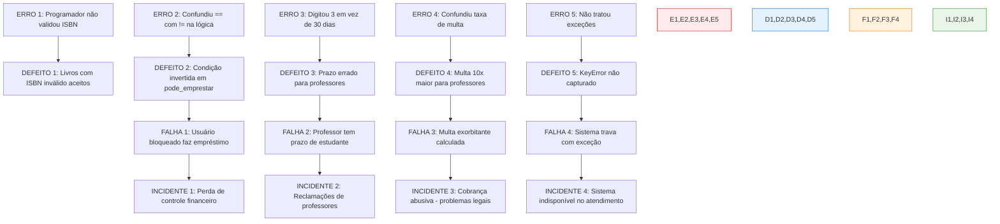

#### Passo 4: Implementação Corrigida - Aplicando Verificação e Validação

Agora vamos corrigir os problemas aplicando técnicas de verificação e validação:

**Arquivo: `biblioteca_v2.py` (Versão Corrigida)**

```python
#!/usr/bin/env python3
"""
Sistema de Gestão de Biblioteca - Versão 2 (Corrigida)

Esta versão corrige todos os defeitos identificados e aplica:
- Verificação: Validações técnicas e conformidade
- Validação: Atendimento às necessidades dos usuários

Autor: Estudo de Caso - Conceitos Fundamentais de Teste
"""

import re
from datetime import datetime, timedelta
from typing import Dict, List, Optional, Tuple
from enum import Enum
import logging


# Configuração de logging para monitoramento
logging.basicConfig(
    level=logging.INFO,
    format='%(asctime)s - %(levelname)s - %(message)s'
)
logger = logging.getLogger(__name__)


class TipoUsuario(Enum):
    """Enumera os tipos de usuários do sistema."""
    ESTUDANTE = "estudante"
    PROFESSOR = "professor"


class StatusUsuario(Enum):
    """Enumera os status possíveis de um usuário."""
    ATIVO = "ativo"
    BLOQUEADO = "bloqueado"


class BibliotecaException(Exception):
    """Exceção base para erros específicos do sistema da biblioteca."""
    pass


class UsuarioInexistenteError(BibliotecaException):
    """Exceção para quando usuário não é encontrado."""
    pass


class LivroInexistenteError(BibliotecaException):
    """Exceção para quando livro não é encontrado."""
    pass


class ISBNInvalidoError(BibliotecaException):
    """Exceção para ISBN em formato inválido."""
    pass


class Livro:
    """
    Representa um livro no sistema da biblioteca.
    
    CORREÇÃO APLICADA: Validação rigorosa de ISBN
    """
    
    def __init__(self, isbn: str, titulo: str, autor: str, disponivel: bool = True):
        """
        Inicializa um livro com validação de ISBN.
        
        Args:
            isbn: ISBN do livro (deve ter 10 ou 13 dígitos)
            titulo: Título do livro
            autor: Autor do livro
            disponivel: Se o livro está disponível para empréstimo
            
        Raises:
            ISBNInvalidoError: Se ISBN não estiver no formato correto
            ValueError: Se título ou autor estiverem vazios
        """
        self.isbn = self._validar_isbn(isbn)
        
        if not titulo.strip():
            raise ValueError("Título não pode estar vazio")
        if not autor.strip():
            raise ValueError("Autor não pode estar vazio")
            
        self.titulo = titulo.strip()
        self.autor = autor.strip()
        self.disponivel = disponivel
        
        logger.info(f"Livro criado: {self.titulo} (ISBN: {self.isbn})")
    
    @staticmethod
    def _validar_isbn(isbn: str) -> str:
        """
        Valida o formato do ISBN.
        
        VERIFICAÇÃO: ISBN deve ter 10 ou 13 dígitos (pode ter hífens)
        
        Args:
            isbn: String contendo o ISBN
            
        Returns:
            str: ISBN limpo (apenas dígitos)
            
        Raises:
            ISBNInvalidoError: Se ISBN não estiver no formato correto
        """
        if not isbn:
            raise ISBNInvalidoError("ISBN não pode estar vazio")
        
        # Remove hífens e espaços
        isbn_limpo = re.sub(r'[-\s]', '', isbn)
        
        # Verifica se contém apenas dígitos
        if not isbn_limpo.isdigit():
            raise ISBNInvalidoError(f"ISBN deve conter apenas dígitos: {isbn}")
        
        # Verifica tamanho (10 ou 13 dígitos)
        if len(isbn_limpo) not in [10, 13]:
            raise ISBNInvalidoError(
                f"ISBN deve ter 10 ou 13 dígitos. Recebido: {len(isbn_limpo)} dígitos"
            )
        
        return isbn_limpo
    
    def emprestar(self) -> bool:
        """
        Marca o livro como emprestado se estiver disponível.
        
        Returns:
            bool: True se empréstimo foi realizado com sucesso
        """
        if self.disponivel:
            self.disponivel = False
            logger.info(f"Livro emprestado: {self.titulo}")
            return True
        logger.warning(f"Tentativa de empréstimo de livro indisponível: {self.titulo}")
        return False
    
    def devolver(self) -> None:
        """Marca o livro como disponível novamente."""
        self.disponivel = True
        logger.info(f"Livro devolvido: {self.titulo}")


class Usuario:
    """
    Representa um usuário do sistema da biblioteca.
    
    CORREÇÃO APLICADA: Lógica correta de bloqueio e validações
    """
    
    def __init__(self, user_id: str, nome: str, tipo: TipoUsuario, 
                 status: StatusUsuario = StatusUsuario.ATIVO):
        """
        Inicializa um usuário com validações.
        
        Args:
            user_id: Identificador único do usuário
            nome: Nome completo do usuário
            tipo: Tipo do usuário (estudante ou professor)
            status: Status inicial do usuário
            
        Raises:
            ValueError: Se dados obrigatórios estiverem inválidos
        """
        if not user_id.strip():
            raise ValueError("ID do usuário não pode estar vazio")
        if not nome.strip():
            raise ValueError("Nome do usuário não pode estar vazio")
        
        self.user_id = user_id.strip()
        self.nome = nome.strip()
        self.tipo = tipo
        self.status = status
        self.multa_total = 0.0
        
        logger.info(f"Usuário criado: {self.nome} ({self.tipo.value})")
    
    def pode_emprestar(self) -> bool:
        """
        Verifica se o usuário pode realizar empréstimos.
        
        CORREÇÃO: Lógica correta - usuário ATIVO pode emprestar
        
        Returns:
            bool: True se usuário pode emprestar
        """
        # CORREÇÃO: Condição CORRETA agora!
        pode = self.status == StatusUsuario.ATIVO
        
        if not pode:
            logger.warning(
                f"Empréstimo negado para usuário {self.nome}: status {self.status.value}"
            )
        
        return pode
    
    def adicionar_multa(self, valor: float) -> None:
        """
        Adiciona multa ao usuário e verifica limite de bloqueio.
        
        Args:
            valor: Valor da multa a ser adicionada
        """
        if valor < 0:
            raise ValueError("Valor da multa não pode ser negativo")
        
        self.multa_total += valor
        logger.info(f"Multa adicionada para {self.nome}: R$ {valor:.2f}")
        
        # Bloqueia usuário se multa ultrapassar limite
        if self.multa_total > 50.0 and self.status == StatusUsuario.ATIVO:
            self.status = StatusUsuario.BLOQUEADO
            logger.warning(
                f"Usuário {self.nome} bloqueado por multa alta: R$ {self.multa_total:.2f}"
            )


class Emprestimo:
    """
    Representa um empréstimo de livro.
    
    CORREÇÃO APLICADA: Prazos e cálculos corretos conforme requisitos
    """
    
    # Configurações de negócio (facilita manutenção)
    PRAZO_ESTUDANTE_DIAS = 7
    PRAZO_PROFESSOR_DIAS = 30  # CORREÇÃO: Valor correto agora!
    MULTA_ESTUDANTE_DIA = 1.0
    MULTA_PROFESSOR_DIA = 0.5  # CORREÇÃO: Valor correto agora!
    
    def __init__(self, usuario: Usuario, livro: Livro):
        """
        Inicializa um empréstimo com prazos corretos.
        
        VALIDAÇÃO: Prazos atendem às necessidades dos usuários
        """
        self.usuario = usuario
        self.livro = livro
        self.data_emprestimo = datetime.now()
        
        # CORREÇÃO: Prazos corretos conforme tipo de usuário
        if usuario.tipo == TipoUsuario.ESTUDANTE:
            self.prazo_dias = self.PRAZO_ESTUDANTE_DIAS
        else:  # Professor
            self.prazo_dias = self.PRAZO_PROFESSOR_DIAS  # ✅ CORRETO: 30 dias!
        
        self.data_vencimento = self.data_emprestimo + timedelta(days=self.prazo_dias)
        self.devolvido = False
        self.data_devolucao: Optional[datetime] = None
        
        logger.info(
            f"Empréstimo criado: {livro.titulo} para {usuario.nome} "
            f"(prazo: {self.prazo_dias} dias)"
        )
    
    def calcular_multa(self) -> float:
        """
        Calcula multa por atraso na devolução.
        
        CORREÇÃO: Taxas corretas conforme tipo de usuário
        
        Returns:
            float: Valor da multa calculada
        """
        if not (self.devolvido and self.data_devolucao):
            return 0.0
        
        dias_atraso = (self.data_devolucao - self.data_vencimento).days
        
        if dias_atraso <= 0:
            return 0.0
        
        # CORREÇÃO: Taxas corretas para cada tipo de usuário
        if self.usuario.tipo == TipoUsuario.ESTUDANTE:
            multa = dias_atraso * self.MULTA_ESTUDANTE_DIA  # R$ 1,00/dia
        else:  # Professor
            multa = dias_atraso * self.MULTA_PROFESSOR_DIA  # ✅ CORRETO: R$ 0,50/dia
        
        logger.info(
            f"Multa calculada para {self.usuario.nome}: "
            f"{dias_atraso} dias × R$ {self.MULTA_PROFESSOR_DIA if self.usuario.tipo == TipoUsuario.PROFESSOR else self.MULTA_ESTUDANTE_DIA:.2f} = R$ {multa:.2f}"
        )
        
        return multa
    
    def devolver_livro(self, data_devolucao: Optional[datetime] = None) -> float:
        """
        Processa a devolução do livro.
        
        Args:
            data_devolucao: Data da devolução (default: agora)
            
        Returns:
            float: Valor da multa aplicada
        """
        if self.devolvido:
            logger.warning(f"Livro {self.livro.titulo} já foi devolvido")
            return 0.0
        
        if data_devolucao is None:
            data_devolucao = datetime.now()
        
        self.data_devolucao = data_devolucao
        self.devolvido = True
        self.livro.devolver()
        
        multa = self.calcular_multa()
        if multa > 0:
            self.usuario.adicionar_multa(multa)
        
        logger.info(f"Devolução processada: {self.livro.titulo}")
        return multa


class SistemaBiblioteca:
    """
    Sistema principal de gestão da biblioteca.
    
    CORREÇÃO APLICADA: Tratamento de exceções e validações robustas
    """
    
    def __init__(self):
        self.livros: Dict[str, Livro] = {}
        self.usuarios: Dict[str, Usuario] = {}
        self.emprestimos: List[Emprestimo] = []
        
        logger.info("Sistema de biblioteca inicializado")
    
    def cadastrar_livro(self, isbn: str, titulo: str, autor: str) -> bool:
        """
        Cadastra um novo livro no sistema.
        
        CORREÇÃO: Validação de ISBN duplicado
        
        Args:
            isbn: ISBN do livro
            titulo: Título do livro
            autor: Autor do livro
            
        Returns:
            bool: True se cadastro foi bem-sucedido
            
        Raises:
            ISBNInvalidoError: Se ISBN for inválido
            ValueError: Se livro já existir
        """
        try:
            livro = Livro(isbn, titulo, autor)
            
            # CORREÇÃO: Verifica se ISBN já existe
            if livro.isbn in self.livros:
                raise ValueError(f"Livro com ISBN {livro.isbn} já existe")
            
            self.livros[livro.isbn] = livro
            logger.info(f"Livro cadastrado com sucesso: {titulo}")
            return True
            
        except (ISBNInvalidoError, ValueError) as e:
            logger.error(f"Erro ao cadastrar livro: {e}")
            raise
    
    def cadastrar_usuario(self, user_id: str, nome: str, tipo: TipoUsuario) -> bool:
        """
        Cadastra um novo usuário no sistema.
        
        Args:
            user_id: ID único do usuário
            nome: Nome do usuário
            tipo: Tipo do usuário
            
        Returns:
            bool: True se cadastro foi bem-sucedido
            
        Raises:
            ValueError: Se usuário já existir ou dados forem inválidos
        """
        if user_id in self.usuarios:
            raise ValueError(f"Usuário com ID {user_id} já existe")
        
        try:
            usuario = Usuario(user_id, nome, tipo)
            self.usuarios[user_id] = usuario
            logger.info(f"Usuário cadastrado com sucesso: {nome}")
            return True
            
        except ValueError as e:
            logger.error(f"Erro ao cadastrar usuário: {e}")
            raise
    
    def realizar_emprestimo(self, user_id: str, isbn: str) -> Emprestimo:
        """
        Realiza um empréstimo de livro.
        
        CORREÇÃO: Tratamento adequado de exceções e validações
        
        Args:
            user_id: ID do usuário
            isbn: ISBN do livro
            
        Returns:
            Emprestimo: Objeto do empréstimo criado
            
        Raises:
            UsuarioInexistenteError: Se usuário não existir
            LivroInexistenteError: Se livro não existir
            ValueError: Se empréstimo não puder ser realizado
        """
        # CORREÇÃO: Tratamento adequado de usuário inexistente
        if user_id not in self.usuarios:
            raise UsuarioInexistenteError(f"Usuário {user_id} não encontrado")
        
        # CORREÇÃO: Tratamento adequado de livro inexistente  
        if isbn not in self.livros:
            raise LivroInexistenteError(f"Livro com ISBN {isbn} não encontrado")
        
        usuario = self.usuarios[user_id]
        livro = self.livros[isbn]
        
        # Verifica se usuário pode emprestar
        if not usuario.pode_emprestar():
            raise ValueError(
                f"Usuário {usuario.nome} não pode emprestar: status {usuario.status.value}"
            )
        
        # Verifica se livro está disponível
        if not livro.emprestar():
            raise ValueError(f"Livro '{livro.titulo}' não está disponível")
        
        emprestimo = Emprestimo(usuario, livro)
        self.emprestimos.append(emprestimo)
        
        logger.info(f"Empréstimo realizado: {livro.titulo} para {usuario.nome}")
        return emprestimo
    
    def listar_emprestimos_pendentes(self) -> List[Tuple[str, str, datetime]]:
        """
        Lista empréstimos que ainda não foram devolvidos.
        
        Returns:
            Lista de tuplas (usuário, livro, data_vencimento)
        """
        pendentes = []
        for emp in self.emprestimos:
            if not emp.devolvido:
                pendentes.append((
                    emp.usuario.nome,
                    emp.livro.titulo,
                    emp.data_vencimento
                ))
        
        return pendentes


# =============================================================================
# DEMONSTRAÇÃO: Sistema Corrigido em Funcionamento
# =============================================================================

def demonstracao_sistema_corrigido():
    """
    Demonstra o sistema corrigido funcionando adequadamente.
    """
    print("=== DEMONSTRAÇÃO: Sistema Corrigido - Verificação e Validação ===\n")
    
    biblioteca = SistemaBiblioteca()
    
    # =================================================================
    # VERIFICAÇÃO: Validações técnicas funcionando
    # =================================================================
    print("🔍 VERIFICAÇÃO: Testando validações técnicas")
    
    try:
        # Testa ISBN inválido
        biblioteca.cadastrar_livro("123", "Livro Teste", "Autor Teste")
        print("❌ Falhou: ISBN inválido deveria ser rejeitado")
    except ISBNInvalidoError as e:
        print(f"✅ ISBN inválido rejeitado corretamente: {e}")
    
    try:
        # Cadastra livro com ISBN válido
        biblioteca.cadastrar_livro("9788535902772", "Clean Code", "Robert Martin")
        print("✅ Livro com ISBN válido cadastrado")
    except Exception as e:
        print(f"❌ Erro inesperado: {e}")
    
    # =================================================================
    # VALIDAÇÃO: Atendendo necessidades dos usuários
    # =================================================================
    print("\n✅ VALIDAÇÃO: Atendendo necessidades dos usuários")
    
    # Cadastra usuários
    biblioteca.cadastrar_usuario("prof001", "Dr. Silva", TipoUsuario.PROFESSOR)
    biblioteca.cadastrar_usuario("est001", "João Santos", TipoUsuario.ESTUDANTE)
    
    # Testa empréstimo para professor
    emprestimo_prof = biblioteca.realizar_emprestimo("prof001", "9788535902772")
    print(f"📚 Professor - Prazo: {emprestimo_prof.prazo_dias} dias (Validação: requisito de 30 dias)")
    
    # Cadastra outro livro para estudante
    biblioteca.cadastrar_livro("9788575222683", "Python Fluente", "Luciano Ramalho")
    emprestimo_est = biblioteca.realizar_emprestimo("est001", "9788575222683")
    print(f"📖 Estudante - Prazo: {emprestimo_est.prazo_dias} dias (Validação: requisito de 7 dias)")
    
    # =================================================================
    # DEMONSTRAÇÃO: Multas corretas
    # =================================================================
    print("\n💰 DEMONSTRAÇÃO: Cálculo correto de multas")
    
    # Simula devolução com atraso para professor
    data_atraso_prof = datetime.now() + timedelta(days=5)
    multa_prof = emprestimo_prof.devolver_livro(data_atraso_prof)
    print(f"👨‍🏫 Professor - 5 dias atraso: R$ {multa_prof:.2f} (5 × R$ 0,50)")
    
    # Simula devolução com atraso para estudante  
    data_atraso_est = datetime.now() + timedelta(days=3)
    multa_est = emprestimo_est.devolver_livro(data_atraso_est)
    print(f"🎓 Estudante - 3 dias atraso: R$ {multa_est:.2f} (3 × R$ 1,00)")
    
    # =================================================================
    # VERIFICAÇÃO: Tratamento de exceções
    # =================================================================
    print("\n🛡️ VERIFICAÇÃO: Tratamento robusto de exceções")
    
    try:
        biblioteca.realizar_emprestimo("user999", "9788535902772")
    except UsuarioInexistenteError as e:
        print(f"✅ Usuário inexistente tratado: {e}")
    
    try:
        biblioteca.realizar_emprestimo("prof001", "isbn999")
    except LivroInexistenteError as e:
        print(f"✅ Livro inexistente tratado: {e}")
    
    print("\n🎉 Sistema funcionando corretamente após correções!")


if __name__ == "__main__":
    demonstracao_sistema_corrigido()
```

### 3.2. Exemplos de Código Comentado

Vamos analisar os principais padrões de correção aplicados:

#### Exemplo 1: Verificação com Validação de ISBN

```python
@staticmethod
def _validar_isbn(isbn: str) -> str:
    """
    CONCEITO: Verificação técnica de conformidade
    
    Este método demonstra VERIFICAÇÃO porque:
    - Confirma que o ISBN está sendo construído CORRETAMENTE
    - Verifica conformidade com especificações técnicas (10 ou 13 dígitos)
    - Aplica regras de negócio objetivas e mensuráveis
    
    BENEFÍCIO: Previne defeitos por entrada inválida
    QUANDO USAR: Sempre que precisar validar formato de dados
    """
    if not isbn:
        # PADRÃO: Fail-fast - detecta problemas cedo
        raise ISBNInvalidoError("ISBN não pode estar vazio")
    
    # TÉCNICA: Normalização de dados (remove caracteres especiais)
    isbn_limpo = re.sub(r'[-\s]', '', isbn)
    
    # VERIFICAÇÃO: Formato contém apenas dígitos
    if not isbn_limpo.isdigit():
        raise ISBNInvalidoError(f"ISBN deve conter apenas dígitos: {isbn}")
    
    # VERIFICAÇÃO: Tamanho conforme padrão internacional
    if len(isbn_limpo) not in [10, 13]:
        raise ISBNInvalidoError(
            f"ISBN deve ter 10 ou 13 dígitos. Recebido: {len(isbn_limpo)} dígitos"
        )
    
    return isbn_limpo
```

#### Exemplo 2: Validação com Necessidades do Usuário

```python
def __init__(self, usuario: Usuario, livro: Livro):
    """
    CONCEITO: Validação das necessidades do usuário
    
    Este método demonstra VALIDAÇÃO porque:
    - Confirma que estamos construindo o produto CERTO
    - Atende às necessidades específicas de professores vs estudantes
    - Implementa regras de negócio alinhadas com expectativas dos usuários
    
    BENEFÍCIO: Garante satisfação e usabilidade do sistema
    QUANDO USAR: Ao implementar regras que afetam a experiência do usuário
    """
    self.usuario = usuario
    self.livro = livro
    self.data_emprestimo = datetime.now()
    
    # VALIDAÇÃO: Prazos diferenciados atendem necessidades específicas
    if usuario.tipo == TipoUsuario.ESTUDANTE:
        # Estudantes: prazo mais curto (uso pontual)
        self.prazo_dias = self.PRAZO_ESTUDANTE_DIAS  # 7 dias
    else:  # Professor
        # Professores: prazo mais longo (pesquisa, preparação de aulas)
        self.prazo_dias = self.PRAZO_PROFESSOR_DIAS  # 30 dias
    
    self.data_vencimento = self.data_emprestimo + timedelta(days=self.prazo_dias)
    
    # PADRÃO: Logging para auditoria e monitoramento
    logger.info(
        f"Empréstimo criado: {livro.titulo} para {usuario.nome} "
        f"(prazo: {self.prazo_dias} dias)"
    )
```

#### Exemplo 3: Tratamento Robusto de Exceções

```python
def realizar_emprestimo(self, user_id: str, isbn: str) -> Emprestimo:
    """
    CONCEITO: Tratamento de falhas e recuperação
    
    Este método demonstra como PREVENIR que erros se tornem incidentes:
    - Detecta problemas antes que causem falhas do sistema
    - Fornece mensagens claras para facilitar correção
    - Mantém sistema estável mesmo com entradas inválidas
    
    BENEFÍCIO: Sistema resiliente e confiável
    ARMADILHA EVITADA: KeyError não tratado que trava o sistema
    """
    # PADRÃO: Verificação explícita antes de acesso
    # ANTES: self.usuarios[user_id]  # ❌ Pode gerar KeyError
    # DEPOIS: Verificação controlada com exceção específica
    if user_id not in self.usuarios:
        raise UsuarioInexistenteError(f"Usuário {user_id} não encontrado")
    
    if isbn not in self.livros:
        raise LivroInexistenteError(f"Livro com ISBN {isbn} não encontrado")
    
    usuario = self.usuarios[user_id]
    livro = self.livros[isbn]
    
    # VERIFICAÇÃO: Regras de negócio aplicadas consistentemente
    if not usuario.pode_emprestar():
        raise ValueError(
            f"Usuário {usuario.nome} não pode emprestar: status {usuario.status.value}"
        )
    
    if not livro.emprestar():
        raise ValueError(f"Livro '{livro.titulo}' não está disponível")
    
    # PADRÃO: Operação atômica - tudo ou nada
    emprestimo = Emprestimo(usuario, livro)
    self.emprestimos.append(emprestimo)
    
    # OBSERVABILIDADE: Log para monitoramento
    logger.info(f"Empréstimo realizado: {livro.titulo} para {usuario.nome}")
    return emprestimo
```

#### Exemplo 4: Comparativo "Antes vs Depois" - Lógica de Bloqueio

```python
# ❌ ANTES: Lógica incorreta (defeito)
def pode_emprestar_errado(self) -> bool:
    """Versão com defeito - lógica invertida"""
    # DEFEITO: Condição invertida permite usuário bloqueado emprestar
    return self.status == StatusUsuario.BLOQUEADO  # ❌ ERRO!

# ✅ DEPOIS: Lógica correta (corrigida)
def pode_emprestar(self) -> bool:
    """
    Versão corrigida com lógica adequada.
    
    CORREÇÃO APLICADA: Condição lógica correta
    VERIFICAÇÃO: Usuário ATIVO pode emprestar
    VALIDAÇÃO: Atende política de controle da biblioteca
    """
    pode = self.status == StatusUsuario.ATIVO  # ✅ CORRETO!
    
    if not pode:
        # BENEFÍCIO: Logging para auditoria e debugging
        logger.warning(
            f"Empréstimo negado para usuário {self.nome}: status {self.status.value}"
        )
    
    return pode
```

### 3.3. Ferramentas, Bibliotecas e Ecossistema (Contextual)

Para a demonstração dos conceitos fundamentais de teste nesta aula, utilizamos exclusivamente recursos nativos do Python 3.12+, reforçando que os princípios ensinados são fundamentais à estruturação do código e não dependem de ferramentas de terceiros.

#### Recursos Nativos Utilizados

**Módulo `typing`**
- **Propósito**: Type hints para maior clareza e detecção precoce de erros
- **Uso no código**: `Optional[datetime]`, `Dict[str, Livro]`, `List[Emprestimo]`
- **Benefício**: Melhora verificação estática e documentação viva do código

**Módulo `enum`**
- **Propósito**: Definição de constantes tipadas e estados bem definidos
- **Uso no código**: `TipoUsuario`, `StatusUsuario`
- **Benefício**: Previne erros de digitação e garante valores válidos

**Módulo `datetime`**
- **Propósito**: Manipulação precisa de datas e cálculos temporais
- **Uso no código**: Cálculo de prazos, vencimentos e multas
- **Benefício**: Lógica temporal robusta e testável

**Módulo `re` (Regular Expressions)**
- **Propósito**: Validação e normalização de strings (ISBN)
- **Uso no código**: `re.sub(r'[-\s]', '', isbn)` para limpeza de ISBN
- **Benefício**: Validação rigorosa de formatos de entrada

**Módulo `logging`**
- **Propósito**: Observabilidade e rastreamento de operações
- **Uso no código**: Logs de operações, erros e eventos importantes
- **Benefício**: Facilita debugging e monitoramento em produção

#### Demonstração Prática das Ferramentas

```python
# DEMONSTRAÇÃO: Como as ferramentas nativas suportam os conceitos de teste

import logging
from typing import Dict, List, Optional
from enum import Enum
from datetime import datetime, timedelta
import re

def demonstracao_ferramentas_teste():
    """
    Demonstra como ferramentas básicas do Python suportam
    os conceitos fundamentais de teste estudados.
    """
    
    # =================================================================
    # 1. TYPE HINTS: Prevenção de erros de tipo
    # =================================================================
    print("🔍 TYPE HINTS: Prevenção de erros")
    
    def processar_idades(idades: List[int]) -> float:
        """
        VERIFICAÇÃO: Type hints detectam erros de tipo
        IDE/mypy alertará se passar string onde espera int
        """
        return sum(idades) / len(idades) if idades else 0.0
    
    # ✅ Uso correto
    media = processar_idades([20, 25, 30])
    print(f"Média de idades: {media}")
    
    # ❌ Uso incorreto seria detectado por ferramentas estáticas
    # processar_idades(["20", "25", "30"])  # Type checker alertaria
    
    # =================================================================
    # 2. ENUM: Estados bem definidos previnem defeitos
    # =================================================================
    print("\n📊 ENUM: Estados consistentes")
    
    class StatusPedido(Enum):
        PENDENTE = "pendente"
        PROCESSANDO = "processando"
        ENVIADO = "enviado"
        ENTREGUE = "entregue"
    
    def verificar_status_valido(status: StatusPedido) -> bool:
        """
        BENEFÍCIO: Impossível passar valor inválido
        Enum garante apenas valores permitidos
        """
        return status in [StatusPedido.PROCESSANDO, StatusPedido.ENVIADO]
    
    # ✅ Apenas valores válidos são aceitos
    print(f"Status válido: {verificar_status_valido(StatusPedido.ENVIADO)}")
    
    # =================================================================
    # 3. REGEX: Validação rigorosa de formatos
    # =================================================================
    print("\n🔍 REGEX: Validação de formatos")
    
    def validar_email(email: str) -> bool:
        """
        VERIFICAÇÃO: Formato de email conforme padrão
        Regex detecta problemas de formato antes de uso
        """
        padrao = r'^[a-zA-Z0-9._%+-]+@[a-zA-Z0-9.-]+\.[a-zA-Z]{2,}$'
        return bool(re.match(padrao, email))
    
    emails_teste = [
        "usuario@exemplo.com",     # ✅ Válido
        "usuario.exemplo.com",     # ❌ Inválido (sem @)
        "@exemplo.com",            # ❌ Inválido (sem usuário)
    ]
    
    for email in emails_teste:
        resultado = "✅ VÁLIDO" if validar_email(email) else "❌ INVÁLIDO"
        print(f"{email}: {resultado}")
    
    # =================================================================
    # 4. LOGGING: Observabilidade para detecção de problemas
    # =================================================================
    print("\n📝 LOGGING: Observabilidade")
    
    # Configurar logger para demonstração
    logger = logging.getLogger('teste_demo')
    logger.setLevel(logging.INFO)
    handler = logging.StreamHandler()
    handler.setFormatter(logging.Formatter('%(levelname)s: %(message)s'))
    logger.addHandler(handler)
    
    def operacao_critica(valor: float) -> Optional[float]:
        """
        MONITORAMENTO: Logs permitem rastrear problemas
        Facilita identificação da fonte de defeitos
        """
        logger.info(f"Iniciando operação com valor: {valor}")
        
        if valor < 0:
            logger.error(f"Valor inválido detectado: {valor}")
            return None
        
        resultado = valor * 2
        logger.info(f"Operação concluída. Resultado: {resultado}")
        return resultado
    
    # Teste com valores válidos e inválidos
    operacao_critica(10.0)   # Sucesso
    operacao_critica(-5.0)   # Erro detectado e logado
    
    # =================================================================
    # 5. DATETIME: Lógica temporal testável
    # =================================================================
    print("\n📅 DATETIME: Cálculos temporais precisos")
    
    def calcular_dias_uteis(inicio: datetime, fim: datetime) -> int:
        """
        VERIFICAÇÃO: Cálculos de tempo precisos e testáveis
        Permite testes determinísticos com datas fixas
        """
        if inicio > fim:
            raise ValueError("Data de início deve ser anterior ao fim")
        
        dias = 0
        atual = inicio
        
        while atual <= fim:
            # Segunda=0, Domingo=6 (weekday())
            if atual.weekday() < 5:  # Segunda a sexta
                dias += 1
            atual += timedelta(days=1)
        
        return dias
    
    # Teste com período conhecido
    inicio = datetime(2024, 1, 1)  # Segunda-feira
    fim = datetime(2024, 1, 7)     # Domingo
    dias_uteis = calcular_dias_uteis(inicio, fim)
    print(f"Dias úteis entre {inicio.date()} e {fim.date()}: {dias_uteis}")


if __name__ == "__main__":
    demonstracao_ferramentas_teste()
```

#### Execução e Verificação dos Exemplos

Para executar e verificar os conceitos demonstrados:

```bash
# Executa demonstração da versão com problemas
python biblioteca_v1.py

# Executa demonstração da versão corrigida
python biblioteca_v2.py

# Executa demonstração das ferramentas
python demonstracao_ferramentas_teste.py
```

**Saída Esperada da Versão com Problemas:**
```
=== DEMONSTRAÇÃO: Cadeia Erro → Defeito → Falha → Incidente ===

✅ Sistema inicializado com livros e usuários

🚨 INCIDENTE 1: Lógica de bloqueio invertida
📋 Status do estudante: bloqueado
❌ FALHA: Usuário BLOQUEADO conseguiu fazer empréstimo!
💸 INCIDENTE: Biblioteca perde controle sobre usuários inadimplentes

🚨 INCIDENTE 2: Prazo incorreto para professor
📅 Prazo para professor: 3 dias
❌ FALHA: Professor deveria ter 30 dias, mas tem apenas 3!
😡 INCIDENTE: Professores reclamam de prazo muito curto

🚨 INCIDENTE 3: Multa incorreta para professor
💰 Multa calculada: R$ 25.00
❌ FALHA: Professor deveria pagar R$ 2,50 (5 dias × R$ 0,50)
💸 INCIDENTE: Professor é cobrado R$ 25,00 - valor abusivo!

🚨 INCIDENTE 4: Sistema trava com exceção não tratada
💥 EXCEÇÃO: KeyError - 'user999'
❌ FALHA: Sistema não trata usuário inexistente
🔥 INCIDENTE: Sistema da biblioteca trava durante atendimento
```

**Saída Esperada da Versão Corrigida:**
```
=== DEMONSTRAÇÃO: Sistema Corrigido - Verificação e Validação ===

🔍 VERIFICAÇÃO: Testando validações técnicas
✅ ISBN inválido rejeitado corretamente: ISBN deve ter 10 ou 13 dígitos. Recebido: 3 dígitos
✅ Livro com ISBN válido cadastrado

✅ VALIDAÇÃO: Atendendo necessidades dos usuários
📚 Professor - Prazo: 30 dias (Validação: requisito de 30 dias)
📖 Estudante - Prazo: 7 dias (Validação: requisito de 7 dias)

💰 DEMONSTRAÇÃO: Cálculo correto de multas
👨‍🏫 Professor - 5 dias atraso: R$ 2.50 (5 × R$ 0,50)
🎓 Estudante - 3 dias atraso: R$ 3.00 (3 × R$ 1,00)

🛡️ VERIFICAÇÃO: Tratamento robusto de exceções
✅ Usuário inexistente tratado: Usuário user999 não encontrado
✅ Livro inexistente tratado: Livro com ISBN isbn999 não encontrado

🎉 Sistema funcionando corretamente após correções!
```

#### Análise Comparativa dos Resultados

| Aspecto | Versão com Problemas | Versão Corrigida |
|---------|---------------------|------------------|
| **Validação de ISBN** | Aceita qualquer string | Valida formato 10/13 dígitos |
| **Lógica de Bloqueio** | Invertida (defeito crítico) | Correta (usuário ativo empresta) |
| **Prazo Professor** | 3 dias (erro de digitação) | 30 dias (conforme requisito) |
| **Multa Professor** | R$ 5,00/dia (10x maior) | R$ 0,50/dia (valor correto) |
| **Tratamento Exceções** | KeyError trava sistema | Exceções específicas e claras |
| **Observabilidade** | Sem logs | Logging completo para auditoria |
| **Manutenibilidade** | Valores hard-coded | Constantes configuráveis |
| **Confiabilidade** | Múltiplos pontos de falha | Sistema robusto e resiliente |

### Síntese da Seção 3

A implementação prática demonstrou como os conceitos fundamentais de teste se manifestam em código real:

1. **Cadeia Causal**: Vimos como erros humanos simples (digitação, lógica invertida) geram defeitos que causam falhas observáveis, resultando em incidentes com impacto real no negócio.

2. **Verificação vs Validação**: Aplicamos verificação técnica (validação de ISBN, tratamento de exceções) e validação de necessidades (prazos diferenciados, multas justas).

3. **Prevenção de Defeitos**: Demonstramos técnicas como fail-fast, validações explícitas, type hints e logging para detectar problemas antes que se tornem incidentes.

4. **Observabilidade**: Implementamos logging estruturado para facilitar identificação e correção de problemas em produção.

O estudo de caso evidenciou que a compreensão sólida dos conceitos fundamentais de teste é essencial para desenvolver sistemas confiáveis e maintíveis, independentemente das ferramentas utilizadas.
```
