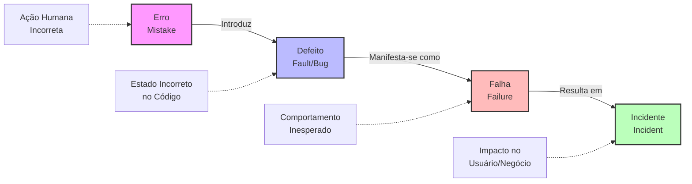
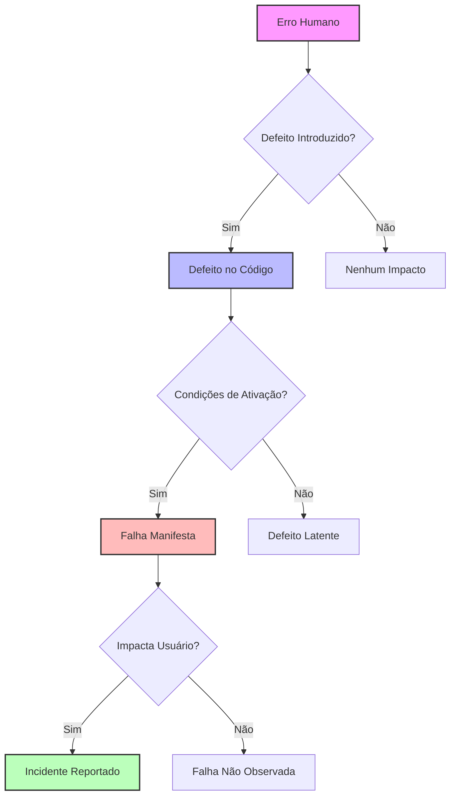
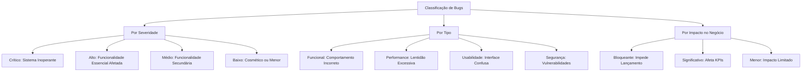
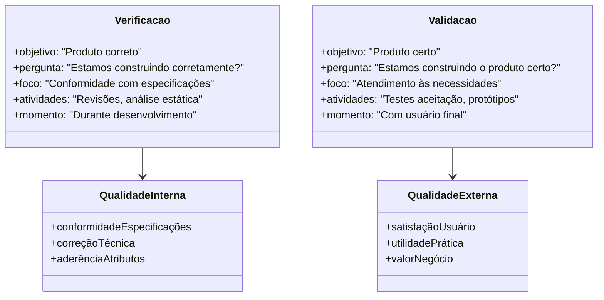
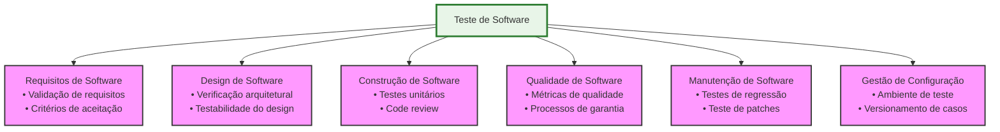
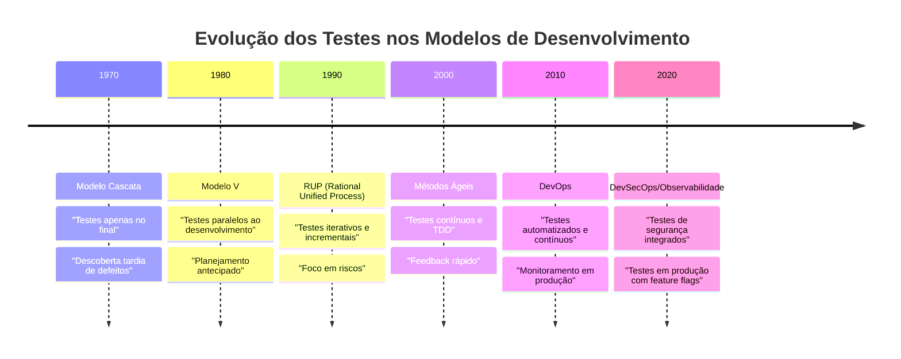
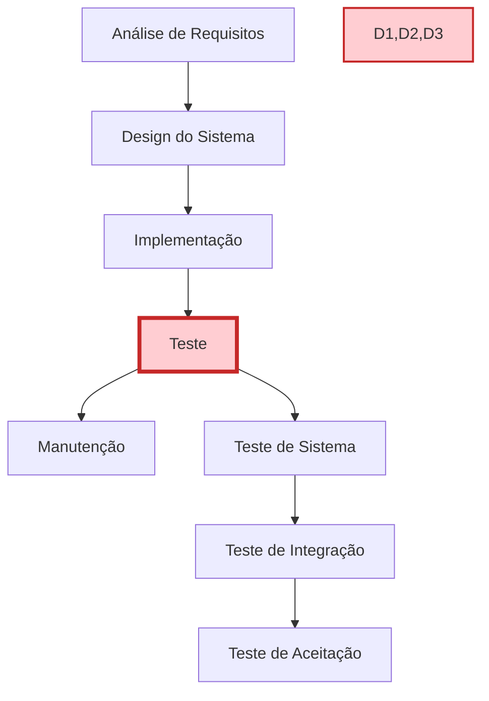
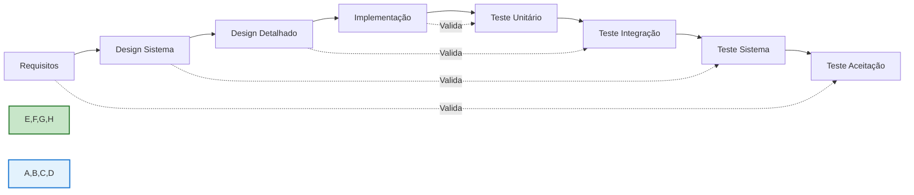
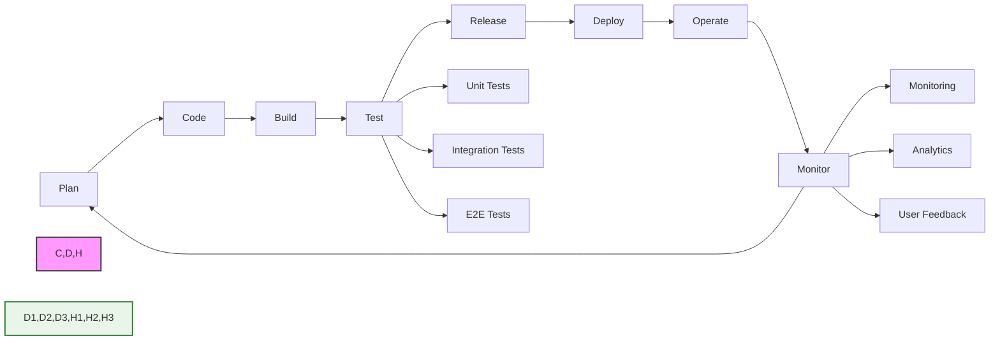

# Conceitos Fundamentais de Teste

## Sumário

1. **Abertura e Engajamento**
   - 1.1. Problema Motivador
   - 1.2. Contexto Histórico e Relevância Atual

2. **Fundamentos Teóricos**
   - 2.1. O que é Teste de Software?
     - 2.1.1. Definições Formais e Terminologia
     - 2.1.2. Desmistificando o Teste de Software
   - 2.2. Conceitos Fundamentais
     - 2.2.1. Terminologia da Cadeia de Causalidade
     - 2.2.2. Análise da Relação Causal
   - 2.3. O Conceito de Bug
     - 2.3.1. História e Etimologia
     - 2.3.2. Classificação e Impacto
   - 2.4. Verificação e Validação
     - 2.4.1. Fundamentos Conceituais
     - 2.4.2. Análise Comparativa
   - 2.5. Modelagem Matemática dos Conceitos de Teste
   - 2.6. SWEBOK e Teste de Software
     - 2.6.1. Contextualização no Body of Knowledge
     - 2.6.2. Integração com Outras Áreas do SWEBOK
   - 2.7. Modelos de Desenvolvimento e Testes
     - 2.7.1. Evolução Histórica
     - 2.7.2. Análise Comparativa dos Modelos
     - 2.7.3. Análise de Consequências e Trade-offs
   - 2.8. Análise Crítica dos Conceitos Fundamentais
     - 2.8.1. Limitações e Desafios Comuns
     - 2.8.2. Perguntas Frequentes (FAQ)
     - 2.8.3. Evolução dos Conceitos na Era Moderna

## 1. Abertura e Engajamento

### 1.1. Problema Motivador

Imagine a seguinte situação: É sexta-feira, 18h, e você é o desenvolvedor responsável por um sistema crítico de transações bancárias. De repente, seu telefone toca. Do outro lado da linha, um gerente desesperado informa que centenas de clientes estão relatando cobranças duplicadas em suas contas. A investigação inicial revela que um pequeno erro de programação - um simples sinal de maior ou igual (>=) onde deveria ser apenas maior (>) - está causando a duplicação de transações em determinadas condições específicas.

O cenário acima não é fictício. Em 2012, um banco britânico enfrentou uma situação similar que resultou em milhões de contas afetadas e prejuízos estimados em mais de £175 milhões. Este caso ilustra perfeitamente como um pequeno erro pode se transformar em um defeito no código, que por sua vez leva a uma falha no sistema, culminando em um incidente de grandes proporções.

Mas como podemos prevenir tais situações? Como diferenciar entre um erro, um defeito e uma falha? E mais importante: como estruturar um processo de teste que minimize os riscos de tais incidentes chegarem à produção?

### 1.2. Contexto Histórico e Relevância Atual

A história do teste de software confunde-se com a própria história da computação. Em 1947, quando Grace Hopper documentou o primeiro bug de computador - literalmente um inseto (uma mariposa) preso em um relé do Mark II - ela não estava apenas registrando um incidente curioso, mas estabelecendo as bases para uma disciplina fundamental da engenharia de software.

Nas décadas seguintes, à medida que os sistemas se tornavam mais complexos e críticos, o teste de software evoluiu de uma atividade ad hoc para uma disciplina sistemática e rigorosa. Em 1979, Glenford Myers publicou "The Art of Software Testing", estabelecendo princípios que permanecem relevantes até hoje. Na década de 1990, o surgimento do Test Maturity Model (TMM) e do Test Process Improvement (TPI) formalizou ainda mais a disciplina.

Hoje, em 2025, o teste de software é mais crítico do que nunca. Com sistemas distribuídos, arquiteturas em microserviços, DevOps e entrega contínua, a necessidade de testes eficazes e eficientes cresceu exponencialmente. De acordo com o relatório Capgemini World Quality Report 2024-2025, organizações dedicam em média 25% do orçamento de TI a atividades relacionadas a teste e qualidade de software.

## 2. Fundamentos Teóricos

### 2.1. Terminologia Essencial e Definições Formais

#### 2.1.1. O que é Teste de Software?

Segundo o IEEE (Instituto de Engenheiros Eletricistas e Eletrônicos), teste de software é:

"O processo de operar um sistema ou componente sob condições específicas, observando ou registrando os resultados, e fazendo uma avaliação de algum aspecto do sistema ou componente."

De forma mais pragmática, o ISTQB (International Software Testing Qualifications Board) define como:

"O processo que consiste em todas as atividades do ciclo de vida, tanto estáticas quanto dinâmicas, relacionadas com o planejamento, preparação e avaliação de produtos de software e produtos relacionados para determinar se eles satisfazem os requisitos especificados, demonstrar que são adequados para o propósito e detectar defeitos."

O teste de software é um processo sistemático e disciplinado que envolve três elementos fundamentais:

1. **Exercitar o software**: Executar o software com dados de entrada específicos
2. **Identificar discrepâncias**: Comparar comportamento esperado vs. observado
3. **Determinar conformidade**: Verificar se atende aos requisitos especificados

> **Analogia para Entender**
> 
> Pense no teste de software como uma inspeção de qualidade em uma fábrica de carros. Assim como um carro passa por diferentes estações de verificação (freios, motor, eletrônica etc.), um software precisa passar por diferentes tipos de testes. Em ambos os casos, o objetivo é garantir que o produto final seja seguro, confiável e atenda às expectativas do usuário.

#### 2.1.2. O que NÃO é Teste de Software

É crucial desmistificar conceitos errôneos sobre testes que persistem na indústria:

| **Mito** | **Realidade** |
|----------|---------------|
| "Testar é só executar o sistema" | Teste inclui planejamento, design, análise e documentação |
| "Testar só serve para achar erro" | Teste também demonstra conformidade e melhora confiança |
| "Teste é responsabilidade exclusiva do QA" | Teste é responsabilidade de toda a equipe de desenvolvimento |
| "Teste é só no final" | Teste deve ocorrer durante todo o ciclo de desenvolvimento |

### 2.2. Conceitos Fundamentais

#### 2.2.1. Terminologia da Cadeia de Causalidade

A compreensão precisa dos conceitos de erro, defeito, falha e incidente é fundamental para qualquer profissional de teste. Estes conceitos formam uma cadeia causal que explica como problemas humanos se manifestam em impactos no negócio.

**Erro (Mistake):**
- **Definição Formal**: Ação humana que produz um resultado incorreto
- **Características**:
  * Origem: Cognitiva humana (mal-entendido, falta de conhecimento, distração)
  * Momento: Durante análise, design ou implementação
  * Prevenção: Revisões, treinamento, processos estruturados
- **Exemplos Práticos**:
  * Desenvolvedor implementa soma (`+`) ao invés de multiplicação (`*`)
  * Analista documenta requisito com ambiguidade
  * Arquiteto escolhe padrão inadequado para o contexto

**Defeito (Fault/Bug):**
- **Definição Formal**: Manifestação de um erro no código, documentação ou outro artefato
- **Características**:
  * Natureza: Estático (existe mesmo sem execução)
  * Detecção: Análise estática, revisão de código, inspeção
  * Localização: Código-fonte, documentos, configurações
- **Exemplos Práticos**:
  * Condição `if (x >= 0)` quando deveria ser `if (x > 0)`
  * Endpoint REST sem validação adequada de autenticação
  * Query SQL com JOIN incorreto

**Falha (Failure):**
- **Definição Formal**: Desvio do comportamento esperado durante a execução
- **Características**:
  * Natureza: Dinâmica (só ocorre durante execução)
  * Observabilidade: Externamente visível
  * Dependência: Condições específicas de execução
- **Exemplos Práticos**:
  * Sistema de e-commerce cobrando duas vezes pelo mesmo item
  * Aplicação móvel travando ao receber notificação
  * Sistema de login aceitando credenciais inválidas

**Incidente:**
- **Definição Formal**: Manifestação observável de uma falha que impacta usuários/negócio
- **Características**:
  * Impacto: Afeta operações do negócio
  * Urgência: Requer investigação e correção
  * Rastreabilidade: Documentado e monitorado
- **Exemplos Práticos**:
  * Indisponibilidade de sistema crítico por 2 horas
  * Vazamento de dados pessoais de clientes
  * Performance degradada causando abandono de carrinho

#### 2.2.2. Análise da Relação Causal

**Pontos Críticos da Cadeia:**

1. **Nem todo erro gera defeito**: Revisões e validações podem interceptar
2. **Nem todo defeito gera falha**: Algumas condições podem nunca ser executadas
3. **Nem toda falha gera incidente**: Pode não ser observada ou impactar usuários

### 2.3. O Conceito de Bug

#### 2.3.1. História e Etimologia

O termo "bug" tem uma origem histórica fascinante que remonta aos primórdios da computação. Em 9 de setembro de 1947, Grace Hopper, pioneira da programação, encontrou uma mariposa presa em um relé do computador Mark II Aecken da Universidade Harvard. Ela colou o inseto em seu caderno de anotações e escreveu: "First actual case of bug being found" (Primeiro caso real de bug sendo encontrado).

Embora o termo já fosse usado informalmente para descrever problemas mecânicos, este incidente popularizou sua aplicação na computação. Grace Hopper, que mais tarde desenvolveria o primeiro compilador, estabeleceu sem saber uma terminologia que perduraria por décadas.

#### 2.3.2. Classificação e Impacto de Bugs

**Casos Famosos de Bugs Custosos:**

| **Ano** | **Sistema** | **Bug** | **Impacto** |
|---------|-------------|---------|-------------|
| 1996 | Ariane 5 | Overflow em conversão de 64-bit para 16-bit | €370 milhões |
| 2012 | Knight Capital | Loop infinito em trading algoritmo | $440 milhões em 45 min |
| 2017 | Equifax | Vulnerabilidade Apache Struts não corrigida | 147 milhões de dados expostos |
| 2020 | Boeing 737 MAX | Sensor MCAS com lógica incorreta | 346 vidas perdidas |

### 2.4. Verificação e Validação

#### 2.4.1. Fundamentos Conceituais

A distinção entre verificação e validação é fundamental para compreender os diferentes objetivos dos testes. Esta separação, conhecida como V&V (Verification and Validation), foi formalizada por Barry Boehm em 1981.

**Verificação:**
- **Definição**: Processo de confirmação que o produto está sendo construído de acordo com especificações
- **Atividades Típicas**:
  * Revisões técnicas estruturadas
  * Inspeções de código (code review)
  * Análise estática automatizada
  * Testes unitários e de integração
  * Walkthroughs de design

**Validação:**
- **Definição**: Processo de confirmação que o produto certo está sendo construído para o usuário
- **Atividades Típicas**:
  * Testes de aceitação com usuários
  * Prototipagem e validação de conceitos
  * Testes de usabilidade
  * Validação de requisitos com stakeholders
  * Testes beta com usuários reais

#### 2.4.2. Análise Comparativa

| **Aspecto** | **Verificação** | **Validação** |
|-------------|-----------------|---------------|
| **Pergunta Central** | "Estamos construindo o produto corretamente?" | "Estamos construindo o produto certo?" |
| **Foco** | Conformidade técnica | Necessidades do usuário |
| **Métodos** | Técnicos e formais | Empíricos e subjetivos |
| **Participantes** | Equipe técnica | Usuários e stakeholders |
| **Timing** | Durante desenvolvimento | Marcos de entrega |
| **Critério de Sucesso** | Aderência às especificações | Satisfação das necessidades |

### 2.5. Modelagem Matemática dos Conceitos de Teste

A teoria do teste de software pode ser formalizada matematicamente usando teoria dos conjuntos e lógica proposicional. Esta formalização é essencial para compreender os limites teóricos e práticos dos testes.

Seja $S$ um programa (software) e $D$ o domínio de entrada. Para cada entrada $x \in D$, existe uma saída esperada $y \in R$ (conjunto de resultados possíveis).

Definimos a função do programa como:

$$f_S: D \rightarrow R$$

onde:
- $S$ representa o software sob teste
- $D$ é o domínio de todas as entradas possíveis
- $R$ é o conjunto de todas as saídas possíveis

Um teste $t$ é um par ordenado $(x, y)$ onde:
- $x \in D$ é a entrada de teste
- $y \in R$ é a saída esperada

O conjunto de todos os testes possíveis $T$ é definido como:

$$T = \{(x, y) | x \in D \text{ e } y = f_S(x)\}$$

A **cobertura de teste** $C$ pode ser expressa como:

$$C = \frac{|T_{executado}|}{|T|} \times 100\%$$

onde:
- $T_{executado} \subseteq T$ é o conjunto de testes efetivamente executados
- $|T|$ representa a cardinalidade do conjunto (número total de testes possíveis)

A **eficácia do teste** $E$ pode ser modelada como:

$$E = \frac{\text{Defeitos encontrados}}{\text{Total de defeitos existentes}}$$

**Limitações Matemáticas:**

1. **Problema da Explosão Combinatorial**: Para um programa com $n$ variáveis de entrada, cada uma com $k$ valores possíveis, temos $k^n$ combinações possíveis de teste.

2. **Teorema da Incompletude de Dijkstra**: "Testes podem mostrar a presença de bugs, mas nunca sua ausência."

3. **Complexidade Temporal**: O teste exaustivo é computacionalmente intratável para sistemas reais: $O(k^n)$.

### 2.6. SWEBOK e Teste de Software

#### 2.6.1. Contextualização no Body of Knowledge

O SWEBOK (Software Engineering Body of Knowledge) é um guia internacionalmente reconhecido que define e organiza o conhecimento em engenharia de software. O teste de software é uma das 15 áreas de conhecimento fundamentais definidas no SWEBOK v3.0.

```mermaid
graph TD
    A[SWEBOK v3.0] --> B[Fundamentos de Engenharia]
    A --> C[Requisitos de Software]
    A --> D[Design de Software]
    A --> E[Construção de Software]
    A --> F[Teste de Software]
    A --> G[Manutenção de Software]
    A --> H[Gestão de Configuração]
    A --> I[Gestão de Engenharia]
    A --> J[Processo de Engenharia]
    A --> K[Modelos e Métodos]
    A --> L[Qualidade de Software]
    A --> M[Prática Profissional]
    A --> N[Aspectos Econômicos]
    A --> O[Fundamentos de Computação]
    A --> P[Fundamentos Matemáticos]
    
    F --> F1[Fundamentos de Teste]
    F --> F2[Níveis de Teste]
    F --> F3[Técnicas de Teste]
    F --> F4[Métricas Relacionadas]
    F --> F5[Processo de Teste]
    
    style F fill:#f9f,stroke:#333,stroke-width:4px
    style F1,F2,F3,F4,F5 fill:#e1f5fe,stroke:#0277bd,stroke-width:2px
```

> **Analogia para Entender**
> 
> O SWEBOK é como uma enciclopédia médica para a engenharia de software. Assim como a medicina tem suas especialidades (cardiologia, neurologia etc.), a engenharia de software tem suas áreas de conhecimento. O teste é uma dessas "especialidades" fundamentais, com seus próprios conceitos, técnicas e melhores práticas bem definidas.

#### 2.6.2. Integração com Outras Áreas do SWEBOK

O teste de software no SWEBOK interage fortemente com outras áreas de conhecimento, criando um ecossistema integrado de práticas:

**Benefícios da Abordagem SWEBOK para Testes:**

1. **Padronização**: Terminologia e conceitos consistentes internacionalmente
2. **Sistematização**: Organização clara das práticas e conhecimentos
3. **Completude**: Cobertura abrangente desde fundamentos até práticas avançadas
4. **Integração**: Conexões explícitas com outras disciplinas da engenharia
5. **Evolução**: Framework para incorporar novas práticas e tecnologias

### 2.7. Modelos de Desenvolvimento e Testes

#### 2.7.1. Evolução Histórica dos Testes nos Modelos de Desenvolvimento

#### 2.7.2. Análise Comparativa dos Modelos

##### Modelo Tradicional (Cascata)

**Características do Teste no Modelo Cascata:**
- **Timing**: Testes executados apenas após desenvolvimento completo
- **Risco**: Alto risco de descoberta tardia de defeitos críticos
- **Custo**: Custo elevado de correção (regra 10x de Boehm)
- **Feedback**: Feedback tardio sobre qualidade do produto

**Limitações Críticas:**
- Defeitos arquiteturais descobertos muito tarde
- Requisitos mal compreendidos só identificados no final
- Pressão de cronograma leva a testes inadequados

##### Modelo V

**Inovações do Modelo V:**
- **Planejamento Paralelo**: Casos de teste desenvolvidos junto com requisitos
- **Rastreabilidade**: Cada nível de desenvolvimento tem nível de teste correspondente
- **Validação Antecipada**: Critérios de aceitação definidos desde o início

##### Modelo Ágil/DevOps

**Características Revolucionárias:**
- **Testes Contínuos**: Execução automatizada a cada commit
- **Feedback Rápido**: Resultados em minutos, não semanas
- **Shift-Left**: Testes movidos para início do ciclo
- **Monitoramento Ativo**: Observabilidade em produção

#### 2.7.3. Análise de Consequências e Trade-offs

| **Modelo** | **Vantagens** | **Desvantagens** | **Contexto Ideal** |
|------------|---------------|------------------|-------------------|
| **Cascata** | • Planejamento claro • Documentação completa • Controle rigoroso | • Descoberta tardia de problemas • Baixa adaptabilidade • Alto risco de retrabalho | • Projetos bem definidos • Requisitos estáveis • Domínios conhecidos |
| **Modelo V** | • Validação em cada etapa • Rastreabilidade clara • Planejamento antecipado | • Ainda sequencial • Pouca flexibilidade • Feedback limitado | • Projetos críticos • Regulamentação rigorosa • Equipes estruturadas |
| **Ágil** | • Feedback rápido • Adaptabilidade alta • Entregas frequentes | • Documentação limitada • Requer disciplina • Mudanças constantes | • Projetos inovativos • Requisitos evolutivos • Equipes experientes |
| **DevOps** | • Automação completa • Tempo de mercado reduzido • Monitoramento contínuo | • Complexidade técnica • Investimento inicial alto • Curva de aprendizado íngreme | • Produtos digitais • Escalabilidade necessária • Cultura colaborativa |

### 2.8. Análise Crítica dos Conceitos Fundamentais

#### 2.8.1. Limitações e Desafios Comuns

**Desafios na Aplicação dos Conceitos:**

1. **Ambiguidade Terminológica**: Diferentes organizações usam termos como "bug", "defeito" e "issue" de forma inconsistente
2. **Subjetividade na Classificação**: A gravidade de um incidente pode variar conforme perspectiva do stakeholder
3. **Causalidade Complexa**: Em sistemas distribuídos, a cadeia erro→defeito→falha→incidente pode ser não-linear
4. **Falsos Positivos**: Nem todo comportamento inesperado constitui uma falha real

**Armadilhas Comuns:**

> **⚠️ Armadilhas a Evitar**
> 
> 1. **Confundir Severidade com Prioridade**: Um bug crítico pode ter baixa prioridade se afeta funcionalidade não utilizada
> 2. **Supor Causalidade Linear**: Um incidente pode resultar de múltiplos defeitos interagindo
> 3. **Negligenciar Contexto**: O mesmo defeito pode ou não gerar falha dependendo do ambiente
> 4. **Focar Apenas em Defeitos**: Testes também validam conformidade e aumentam confiança

#### 2.8.2. Perguntas Frequentes (FAQ)

**Q1: Por que um erro nem sempre resulta em defeito?**
R: Revisões de código, testes unitários e ferramentas de análise estática podem interceptar erros antes que se tornem defeitos no código final.

**Q2: Um defeito sempre causa falha?**
R: Não. Um defeito pode permanecer "latente" se as condições para sua ativação nunca ocorrerem. Por exemplo, um bug em uma funcionalidade raramente usada.

**Q3: Qual a diferença entre bug e defeito?**
R: São sinônimos na prática. "Bug" é mais informal e popular, enquanto "defeito" é mais formal e acadêmico.

**Q4: Como distinguir entre verificação e validação na prática?**
R: Verificação pergunta "fizemos certo?" (conformidade), validação pergunta "fizemos a coisa certa?" (necessidade do usuário).

**Q5: Todos os modelos de desenvolvimento precisam de testes?**
R: Sim, mas a abordagem varia. Modelos tradicionais fazem testes no final, ágeis integram testes continuamente.

#### 2.8.3. Evolução dos Conceitos na Era Moderna

**Impacto de Tecnologias Emergentes:**

- **Inteligência Artificial**: Novos tipos de defeitos (bias, degradação de modelo)
- **Microserviços**: Falhas sistêmicas vs. componentes individuais
- **Cloud Computing**: Incidentes de infraestrutura vs. aplicação
- **IoT**: Defeitos físicos vs. software, questões de conectividade

**Tendências Futuras:**

1. **Testes Autônomos**: IA gerando e executando casos de teste automaticamente
2. **Observabilidade Avançada**: Detecção proativa de falhas através de ML
3. **Chaos Engineering**: Injeção intencional de falhas para teste de resiliência
4. **Shift-Right Testing**: Testes em produção com usuários reais

> **Analogia para Entender**
> 
> A evolução dos conceitos de teste é similar à evolução da medicina:
> - **Era Tradicional**: Tratar doença após sintomas aparecerem (testes no final)
> - **Era Preventiva**: Check-ups regulares e exames preventivos (testes contínuos)
> - **Era Preditiva**: Medicina personalizada e monitoramento constante (observabilidade e IA)
