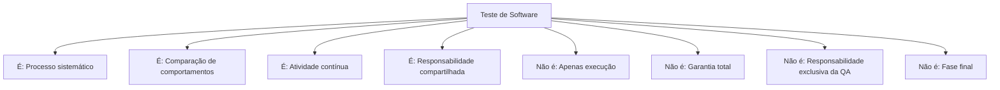
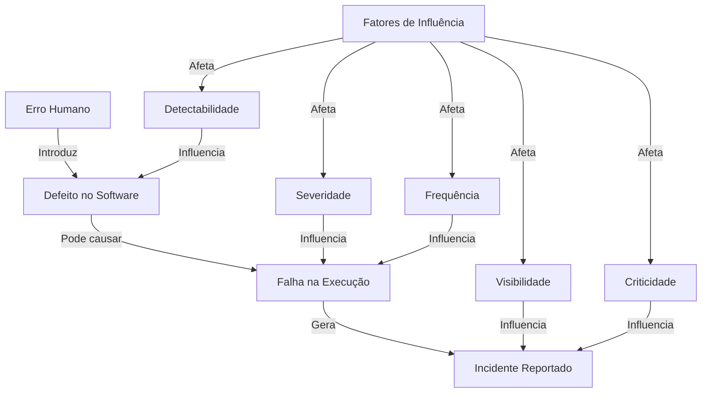
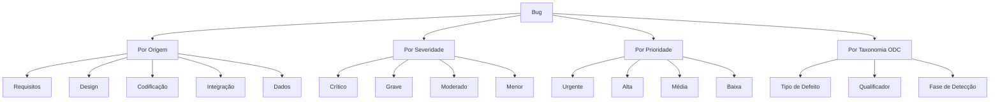

# Aulas 3-4: Conceitos Fundamentais de Teste

## Sumário Completo

* **Seção 1: Abertura e Engajamento**
  * 1.1. Problema Motivador: O Colapso do Sistema Bancário Online
  * 1.2. Contexto Histórico e Relevância Atual

* **Seção 2: Fundamentos Teóricos**
  * **Definições Básicas em Teste de Software**
    * 2.1.1. Terminologia Essencial e Definições Formais
    * 2.1.2. Estrutura Conceitual: O que é e o que não é Teste de Software
    * 2.1.3. Análise de Consequências: Testes e Qualidade
    * 2.1.4. Análise Crítica: Mitos sobre Teste de Software
  
  * **Conceitos Fundamentais**
    * 2.2.1. Terminologia Essencial: Erro, Defeito, Falha e Incidente
    * 2.2.2. Estrutura Conceitual: Relação Causal entre Conceitos
    * 2.2.3. Análise de Consequências: Manifestações e Impactos
    * 2.2.4. Análise Crítica: A Psicologia do Erro

  * **O Conceito de Bug**
    * 2.3.1. Terminologia Essencial: Origem e Definição de Bug
    * 2.3.2. Estrutura Conceitual: Taxonomia e Categorização de Bugs
    * 2.3.3. Análise de Consequências: Impactos de Bugs em Produção
    * 2.3.4. Análise Crítica: Bugs Históricos e Lições Aprendidas

  * **Verificação, Validação e Teste**
    * 2.4.1. Terminologia Essencial: Definições Formais
    * 2.4.2. Estrutura Conceitual: O Triângulo V&V&T
    * 2.4.3. Análise de Consequências: Impactos na Qualidade
    * 2.4.4. Análise Crítica: Balanço entre V&V&T

  * **O SWEBOK e a Engenharia de Software**
    * 2.5.1. Terminologia Essencial: O Guia do Conhecimento
    * 2.5.2. Estrutura Conceitual: Áreas de Conhecimento
    * 2.5.3. Análise de Consequências: Padronização e Profissionalização
    * 2.5.4. Análise Crítica: Limitações e Alternativas

  * **Modelos de Desenvolvimento de Software e a Inserção do Teste**
    * 2.6.1. Terminologia Essencial: Modelos de Ciclo de Vida
    * 2.6.2. Estrutura Conceitual: Evolução do Teste nos Modelos
    * 2.6.3. Análise de Consequências: Impacto do Modelo na Qualidade
    * 2.6.4. Análise Crítica: Qual o Melhor Modelo?

  * **Teste como Atividade Estratégica**
    * 2.7.1. Terminologia Essencial: KPIs e Métricas de Teste
    * 2.7.2. Estrutura Conceitual: Cultura de Qualidade
    * 2.7.3. Análise de Consequências: ROI do Teste
    * 2.7.4. Análise Crítica: Barreiras e Facilitadores

* **Seção 3: Aplicação Prática e Implementação**
  * 3.1. Estudo de Caso Guiado: Sistema de Processamento de Pagamentos
  * 3.2. Exemplos de Código Comentado
  * 3.3. Ferramentas e Bibliotecas para Teste

* **Seção 4: Tópicos Avançados e Nuances**
  * 4.1. Desafios Comuns e Anti-Padrões em Teste
  * 4.2. Variações e Arquiteturas de Teste
  * 4.3. Análise de Efetividade dos Testes

* **Seção 5: Síntese e Perspectivas Futuras**
  * 5.1. Conexões com Outras Áreas da Computação
  * 5.2. A Fronteira da Pesquisa e o Futuro
  * 5.3. Resumo do Capítulo e Mapa Mental
  * 5.4. Referências e Leituras Adicionais

---

## Seção 1: Abertura e Engajamento

### 1.1. Problema Motivador: O Colapso do Sistema Bancário Online

Em uma manhã de segunda-feira, o sistema bancário online do Banco Nacional sofreu um colapso total logo após uma atualização de rotina. Milhares de clientes perderam acesso às suas contas, transações ficaram pendentes por horas, e o sistema de pagamentos automáticos falhou completamente. O custo estimado do incidente ultrapassou 25 milhões em perdas diretas, sem contar os danos à reputação da instituição.

A investigação posterior revelou que o problema ocorreu devido a um defeito aparentemente simples: um desenvolvedor havia implementado uma validação incorreta no módulo de autenticação, que só se manifestava quando o volume de transações ultrapassava determinado limiar. Apesar de testes unitários extensivos terem sido realizados, esta condição específica nunca foi testada. O mais alarmante? O código problemático havia passado por três revisões e estava em produção há semanas, sem que o defeito tivesse sido detectado.

Este caso ilustra perfeitamente por que precisamos compreender profundamente os conceitos fundamentais de teste. Não basta testar; é necessário saber *o que* testar, *como* testar e, principalmente, entender a diferença entre um sistema que simplesmente "funciona" e um que é verdadeiramente confiável sob qualquer circunstância.

### 1.2. Contexto Histórico e Relevância Atual

A história do teste de software é quase tão antiga quanto a própria computação. Nos primórdios da programação, na década de 1940, quando os primeiros computadores como o ENIAC eram programados, a verificação era feita manualmente pelos próprios programadores. O termo "bug" entrou para a história em 1947, quando Grace Hopper encontrou uma mariposa presa em um relé do computador Mark II, causando um mal funcionamento – literalmente, um "bug" no sistema.

À medida que os sistemas computacionais cresciam em complexidade, a disciplina de teste evoluiu. Nos anos 1950, os testes eram primariamente focados em depuração (*debugging*). A década de 1970 marcou um ponto de virada com os trabalhos seminais de Glenford Myers, que em 1979 publicou "The Art of Software Testing", estabelecendo que o propósito do teste não era mostrar que o software funcionava corretamente, mas sim encontrar defeitos.

Os anos 1990 trouxeram metodologias formais de teste, com a consolidação de técnicas estruturadas como testes de caixa branca e caixa preta. Em 1999, Kent Beck introduziu o Test-Driven Development (TDD) como parte da metodologia Extreme Programming (XP), revolucionando a forma como pensamos sobre testes ao propor que eles deveriam preceder a própria implementação.

Hoje, em um mundo onde software controla desde marcapassos cardíacos até sistemas financeiros globais, a compreensão profunda dos conceitos de teste tornou-se não apenas relevante, mas crítica. O custo anual global de falhas de software é estimado em mais de 1,1 trilhão de dólares. Empresas de tecnologia líderes como Google, Microsoft e Amazon investem massivamente em infraestrutura de teste automatizado e práticas como continuous testing.

A relevância atual dos conceitos fundamentais de teste é amplificada pelo movimento DevOps, que integra desenvolvimento e operações em um fluxo contínuo, exigindo testes consistentes em todas as etapas do pipeline. O surgimento de tecnologias como computação em nuvem, microserviços e containers aumentou exponencialmente a complexidade dos sistemas, tornando ainda mais vital o domínio profundo dos conceitos básicos que fundamentam práticas efetivas de teste.

---

## Seção 2: Fundamentos Teóricos

### Definições Básicas em Teste de Software

#### 2.1.1. Terminologia Essencial e Definições Formais

O teste de software é definido formalmente pelo IEEE (Instituto de Engenheiros Eletricistas e Eletrônicos) como "o processo de analisar um item de software para detectar as diferenças entre os requisitos existentes e os requisitos necessários (isto é, defeitos) e avaliar os recursos do item de software".

O ISTQB (International Software Testing Qualifications Board), por sua vez, define teste como "o processo que consiste em todas as atividades do ciclo de vida, tanto estáticas quanto dinâmicas, preocupadas com o planejamento, preparação e avaliação de produtos de software e produtos de trabalho relacionados para determinar se eles satisfazem os requisitos especificados, demonstrar que são adequados para o propósito e detectar defeitos".

Essas definições formais destacam alguns elementos fundamentais:
- É um **processo sistemático**, não uma atividade ad hoc
- Envolve **comparação** entre comportamento esperado e observado
- Possui um **propósito duplo**: verificar conformidade e encontrar defeitos
- Abrange **atividades estáticas e dinâmicas**

> ##### Caixa de Destaque: Analogia para Entender
>
> O teste de software pode ser comparado ao trabalho de um detetive investigando um caso. O detetive não apenas verifica se tudo está em ordem (validação de requisitos), mas também procura ativamente por pistas e evidências de problemas (detecção de defeitos). Ele usa tanto técnicas de observação passiva (análise estática) quanto de interação ativa com o ambiente (análise dinâmica), seguindo uma metodologia sistemática para garantir que nenhum detalhe importante seja negligenciado.

#### 2.1.2. Estrutura Conceitual: O que é e o que não é Teste de Software

**O que é Teste de Software**

O teste de software é uma disciplina estruturada que pode ser decomposta em quatro pilares fundamentais:

1. **Pilar da Verificação**

   O teste verifica se o sistema atende às especificações definidas. Este pilar foca em responder à pergunta: "Construímos o sistema corretamente?" Trata-se de uma atividade objetiva, baseada em verificação de conformidade com requisitos explícitos.

   ```
   Pseudocódigo do processo de verificação:
   
   função verificar(sistema, requisitos):
       para cada requisito em requisitos:
           resultado = testar_conformidade(sistema, requisito)
           se não resultado.conformidade:
               registrar_não_conformidade(requisito, resultado.detalhes)
       retornar relatório_conformidade
   ```

2. **Pilar da Validação**

   O teste valida se o sistema atende às necessidades reais dos usuários. Este pilar foca em responder à pergunta: "Construímos o sistema certo?" É uma atividade mais subjetiva, que envolve avaliar se o software cumpre sua finalidade do ponto de vista do usuário.

   ```
   Pseudocódigo do processo de validação:
   
   função validar(sistema, necessidades_usuário):
       para cada necessidade em necessidades_usuário:
           resultado = avaliar_satisfação(sistema, necessidade)
           se resultado.satisfação < limiar_aceitável:
               registrar_insatisfação(necessidade, resultado.detalhes)
       retornar relatório_validação
   ```

3. **Pilar da Detecção**

   O teste procura ativamente por defeitos. Este pilar foca em "quebrar" o sistema, expondo problemas antes que eles afetem os usuários. É uma atividade proativa, baseada em uma mentalidade crítica e cética.

   ```
   Pseudocódigo do processo de detecção:
   
   função detectar_defeitos(sistema):
       cenários_teste = gerar_cenários_críticos(sistema)
       defeitos_encontrados = []
       para cada cenário em cenários_teste:
           resultado = executar_cenário(sistema, cenário)
           se resultado.falhou:
               defeitos_encontrados.adicionar(novo_defeito(cenário, resultado))
       retornar defeitos_encontrados
   ```

4. **Pilar da Prevenção**

   O teste atua como mecanismo de prevenção, evitando que defeitos sejam introduzidos. Este pilar foca em antecipar problemas e estabelecer práticas que reduzam a probabilidade de defeitos.

   ```
   Pseudocódigo do processo de prevenção:
   
   função prevenir_defeitos(processo_desenvolvimento):
       padrões = definir_padrões_qualidade()
       revisões = estabelecer_processo_revisão()
       automação = configurar_testes_automatizados()
       métricas = definir_métricas_qualidade()
       
       aplicar(processo_desenvolvimento, padrões)
       aplicar(processo_desenvolvimento, revisões)
       aplicar(processo_desenvolvimento, automação)
       monitorar(processo_desenvolvimento, métricas)
       
       retornar processo_aprimorado
   ```

**O que NÃO é Teste de Software**

É igualmente importante entender o que o teste de software não é, para evitar concepções errôneas que comprometem sua eficácia:

1. **Não é apenas Execução do Sistema**

   Muitos confundem teste com a simples execução do software. O teste envolve planejamento, design, implementação, execução, análise e documentação. A execução é apenas uma parte do processo completo.

2. **Não é Garantia de Ausência de Defeitos**

   Edsger Dijkstra afirmou que "testes podem mostrar a presença de defeitos, mas nunca sua ausência". Por mais completo que seja, o teste nunca pode garantir 100% que um sistema está livre de defeitos.

3. **Não é Responsabilidade Exclusiva da Equipe de QA**

   O teste é uma responsabilidade compartilhada. Embora especialistas em qualidade possam liderar os esforços, todos os envolvidos no processo de desenvolvimento têm responsabilidade sobre a qualidade.

4. **Não é uma Fase Final do Desenvolvimento**

   O teste não deve ser visto como uma etapa que ocorre apenas ao final do desenvolvimento. É um processo contínuo que deve ser integrado em todo o ciclo de desenvolvimento.



#### 2.1.3. Análise de Consequências: Testes e Qualidade

O papel do teste na garantia da qualidade do software tem implicações profundas em várias dimensões. Analisemos as principais consequências de uma abordagem eficaz versus ineficaz de testes:

**Consequências Técnicas**

| Dimensão | Teste Eficaz | Teste Ineficaz |
|----------|--------------|----------------|
| **Estabilidade do Sistema** | Sistema robusto, previsível, com comportamento consistente | Sistema frágil, com comportamento errático sob certas condições |
| **Segurança** | Vulnerabilidades detectadas e corrigidas antes da exploração | Brechas de segurança expostas em produção |
| **Manutenibilidade** | Código bem estruturado, com testes que servem como documentação viva | Código "legacy" temido pelos desenvolvedores, difícil de modificar |
| **Escalabilidade** | Limites do sistema conhecidos e dimensionados adequadamente | Falhas inesperadas sob carga, comportamento imprevisível |

**Consequências Econômicas**

| Dimensão | Teste Eficaz | Teste Ineficaz |
|----------|--------------|----------------|
| **Custo de Correção** | Defeitos encontrados cedo, com custo de correção menor | Defeitos encontrados tarde, com custo de correção exponencialmente maior |
| **Time-to-Market** | Entregas previsíveis, ritmo sustentável | Atrasos frequentes, ciclos de correção prolongados |
| **Retrabalho** | Minimizado, esforço focado em novos desenvolvimentos | Constante, consumindo recursos significativos |
| **Custo de Oportunidade** | Recursos disponíveis para inovação | Recursos consumidos em "apagar incêndios" |

**Consequências Organizacionais**

| Dimensão | Teste Eficaz | Teste Ineficaz |
|----------|--------------|----------------|
| **Satisfação da Equipe** | Alta, com sentimento de qualidade e orgulho profissional | Baixa, com frustração por problemas recorrentes |
| **Comunicação Interna** | Clara, baseada em evidências objetivas | Conflituosa, com "caça às bruxas" para identificar culpados |
| **Cultura Organizacional** | Orientada à melhoria contínua e aprendizado | Orientada à culpa e soluções paliativas |
| **Tomada de Decisão** | Informada por dados objetivos de qualidade | Reativa, baseada em crises e percepções subjetivas |

**Consequências para o Usuário/Cliente**

| Dimensão | Teste Eficaz | Teste Ineficaz |
|----------|--------------|----------------|
| **Experiência do Usuário** | Consistente, confiável, satisfatória | Frustrante, imprevisível, alienante |
| **Confiança na Marca** | Fortalecida por produtos de qualidade | Enfraquecida por falhas frequentes |
| **Retenção de Clientes** | Alta, clientes se tornam defensores da marca | Baixa, alta rotatividade de clientes |
| **Suporte ao Cliente** | Focado em assistência e novos recursos | Sobrecarregado com relatórios de bugs e reclamações |

#### 2.1.4. Análise Crítica: Mitos sobre Teste de Software

O campo de teste de software é permeado por diversos mitos que podem comprometer significativamente a eficácia das práticas de teste. Vamos analisar criticamente os mais prevalentes:

**Mito 1: O Teste Completo é Possível**

Este mito sugere que é possível testar todas as possíveis entradas, caminhos e combinações em um sistema, garantindo sua correção absoluta.

*Realidade*: Para qualquer sistema não-trivial, o número de possíveis combinações de entrada e caminhos de execução é astronomicamente grande. Considere um simples formulário com 10 campos de texto, cada um aceitando até 20 caracteres. O número de possíveis combinações é da ordem de $256^{200}$, um número maior que o estimado de átomos no universo observável.

*Implicações*: A crença na possibilidade de teste completo leva a um falso senso de segurança e à má alocação de recursos. O foco deve estar em testes estratégicos baseados em risco, não em cobertura exaustiva.

**Mito 2: O Teste Prova que o Software Funciona Corretamente**

Este mito afirma que um conjunto abrangente de testes bem-sucedidos demonstra a correção do software.

*Realidade*: Como afirmou Dijkstra, "testes podem mostrar a presença de defeitos, mas nunca sua ausência". Testes bem-sucedidos indicam apenas que o sistema não falhou sob as condições específicas testadas.

*Implicações*: Este mito pode levar a uma falsa confiança. Mesmo com testes extensivos, um software pode conter defeitos críticos em áreas ou condições não testadas.

**Mito 3: O Teste é uma Atividade que Qualquer Um Pode Fazer**

Este mito desvaloriza a expertise necessária para testes eficazes, sugerindo que qualquer pessoa pode realizar testes sem treinamento específico.

*Realidade*: O teste eficaz requer conhecimento profundo de técnicas de teste, design de casos de teste, análise de riscos, automação, e uma mentalidade crítica especializada.

*Implicações*: Atribuir responsabilidades de teste a pessoas sem a formação adequada resulta em testes superficiais que falham em identificar defeitos importantes.

**Mito 4: A Automação Resolve Todos os Problemas de Teste**

Este mito propõe que automatizar testes é suficiente para garantir a qualidade do software.

*Realidade*: A automação é uma ferramenta poderosa, mas tem limitações significativas. Testes automatizados só verificam o que foram programados para verificar, carecem de intuição humana, e podem se tornar rapidamente desatualizados em sistemas que evoluem constantemente.

*Implicações*: Dependência excessiva da automação pode levar a lacunas críticas na cobertura de teste, especialmente em aspectos que requerem percepção humana, como usabilidade e experiência do usuário.

**Mito 5: Testes Atrasam a Entrega do Software**

Este mito apresenta o teste como um obstáculo à entrega rápida, um "mal necessário" que desacelera o desenvolvimento.

*Realidade*: Embora o teste exija investimento de tempo a curto prazo, ele economiza tempo significativo a médio e longo prazo ao prevenir retrabalho, corrigir defeitos quando são mais baratos de corrigir, e evitar crises de qualidade.

*Implicações*: A pressão para "pular" ou apressar os testes leva frequentemente a atrasos maiores no futuro, quando defeitos não detectados causam problemas em produção, exigindo correções emergenciais.

**FAQ: Perguntas Frequentes sobre Teste de Software**

1. **Os testes garantem que o software não tem bugs?**
   *Resposta*: Não. Testes podem mostrar a presença de defeitos, mas nunca podem garantir sua ausência completa. Mesmo sistemas amplamente testados podem conter bugs em condições não testadas.

2. **Quanto tempo deve ser dedicado a testes em um projeto?**
   *Resposta*: Depende do contexto, criticidade e requisitos de qualidade. Projetos críticos podem dedicar mais de 50% dos recursos a atividades de teste, enquanto projetos menos críticos podem alocar 20-30%.

3. **Quem deve ser responsável pelos testes?**
   *Resposta*: Todos os envolvidos no desenvolvimento têm responsabilidade sobre a qualidade. Embora especialistas em teste possam liderar os esforços, desenvolvedores, analistas de requisitos e até usuários desempenham papéis importantes no processo de teste.

4. **É melhor corrigir todos os bugs antes de lançar?**
   *Resposta*: Nem sempre. A decisão deve ser baseada em análise de risco. Bugs críticos que afetam segurança, funcionalidade essencial ou dados devem ser corrigidos antes do lançamento, enquanto problemas menores podem ser priorizados para versões futuras.

5. **Quando devemos começar a planejar testes?**
   *Resposta*: O planejamento de testes deve começar nas fases iniciais do projeto, idealmente em paralelo com a definição de requisitos. Quanto mais cedo os testes são considerados, mais eficaz será a estratégia de teste.

**Comparação de Abordagens de Teste**

| Característica | Abordagem Reativa | Abordagem Preventiva |
|----------------|-------------------|----------------------|
| **Início dos testes** | Após codificação | Durante especificação |
| **Foco principal** | Encontrar defeitos | Prevenir defeitos |
| **Métricas valorizadas** | Número de bugs encontrados | Redução na densidade de defeitos |
| **Relação com desenvolvimento** | Separada, muitas vezes adversarial | Integrada, colaborativa |
| **Custo relativo** | Maior a longo prazo | Menor a longo prazo |
| **Eficácia em projetos complexos** | Limitada | Alta |
| **Adaptabilidade a mudanças** | Baixa, exige retrabalho | Alta, evolui com o produto |
| **Necessidade de especialização** | Alta, centrada em especialistas | Moderada, distribuída na equipe |

### Conceitos Fundamentais

#### 2.2.1. Terminologia Essencial: Erro, Defeito, Falha e Incidente

A terminologia precisa é crucial para a comunicação eficaz em teste de software. O padrão IEEE 1044 (Classificação de Anomalias de Software) e o ISTQB estabelecem definições formais para conceitos fundamentais que são frequentemente confundidos:

**Erro (Error/Mistake)**

Definição formal (IEEE): "Uma ação humana que produz um resultado incorreto."

O erro é a ação mental ou física incorreta realizada por uma pessoa. É a raiz causal dos problemas subsequentes no software. Erros ocorrem na mente humana e se manifestam através de ações.

Exemplos:
- Um desenvolvedor que interpreta erroneamente um requisito
- Um arquiteto que projeta uma estrutura inadequada para o problema
- Um testador que cria casos de teste que não cobrem cenários críticos

**Defeito (Defect/Fault)**

Definição formal (IEEE): "Uma imperfeição ou deficiência em um produto de trabalho onde esse produto não atende seus requisitos ou especificações."

O defeito é a manifestação do erro no artefato de software ou documentação. É um problema estático presente no código ou nos artefatos relacionados.

Exemplos:
- Uma função que implementa um algoritmo incorreto
- Uma condição de limite (boundary) tratada incorretamente
- Um requisito ambíguo ou contraditório na documentação

**Falha (Failure)**

Definição formal (IEEE): "A incapacidade de um sistema ou componente de executar suas funções requeridas dentro dos requisitos de desempenho especificados."

A falha é a manifestação observável do defeito durante a execução do programa. É um problema dinâmico que ocorre quando o defeito é "ativado" por determinadas condições de execução.

Exemplos:
- Um aplicativo que fecha inesperadamente
- Um cálculo que produz resultados incorretos
- Uma interface que não responde após determinada sequência de ações

**Incidente (Incident)**

Definição formal (ISTQB): "Qualquer ocorrência que requer investigação."

O incidente é uma manifestação observada durante testes ou operação que requer análise para determinar se representa uma falha do sistema ou não.

Exemplos:
- Um comportamento inesperado reportado por um usuário
- Uma discrepância entre o comportamento esperado e o observado durante testes
- Um problema de desempenho intermitente

> ##### Caixa de Destaque: Analogia para Entender
>
> Imagine uma ponte sendo construída:
> - **Erro**: O engenheiro calcula incorretamente a carga que a ponte deve suportar (erro mental)
> - **Defeito**: Como resultado, o projeto especifica vigas de espessura insuficiente (problema na especificação)
> - **Falha**: Quando um caminhão pesado atravessa a ponte, ela se deforma além dos limites seguros (manifestação observável)
> - **Incidente**: Um inspetor nota oscilações incomuns e relata o problema para investigação (ocorrência que demanda análise)

#### 2.2.2. Estrutura Conceitual: Relação Causal entre Conceitos

A relação entre erro, defeito, falha e incidente segue uma cadeia causal que é fundamental para a compreensão do processo de qualidade. Esta relação não é linear simples, mas um sistema complexo com diversas nuances.

**Pilar 1: O Modelo Causal Básico**

O modelo básico estabelece uma sequência causal direta:

1. Um humano comete um **erro**
2. O erro introduz um **defeito** no software ou documentação
3. O defeito, quando executado sob certas condições, causa uma **falha**
4. A falha é observada e reportada como um **incidente**

Este modelo pode ser representado em pseudocódigo:

```
função modelo_causal_básico():
    erro = ação_humana_incorreta()
    defeito = introduzir_no_software(erro)
    
    se condições_de_ativação_presentes():
        falha = manifestar(defeito)
        incidente = reportar(falha)
        investigar(incidente)
    senão:
        // O defeito permanece latente
        return
```

**Pilar 2: Complexidade das Relações**

Na prática, as relações entre estes conceitos são mais complexas:

1. **Relação Um-para-Muitos**: Um único erro pode introduzir múltiplos defeitos
2. **Relação Muitos-para-Um**: Múltiplos defeitos podem contribuir para uma única falha
3. **Defeitos Latentes**: Nem todo defeito causa falhas imediatamente
4. **Falhas Intermitentes**: Algumas falhas ocorrem apenas sob condições específicas difíceis de reproduzir
5. **Falhas em Cascata**: Uma falha pode desencadear outras falhas em partes relacionadas do sistema

Este modelo complexo pode ser representado em pseudocódigo:

```
função modelo_causal_complexo():
    erros = coleção_de_erros_humanos()
    defeitos = []
    
    para cada erro em erros:
        defeitos_do_erro = introduzir_no_software(erro)
        defeitos.adicionar(defeitos_do_erro)
    
    falhas = []
    para cada combinação_de_condições em espaço_de_execução:
        defeitos_ativados = ativar_sob_condição(defeitos, combinação_de_condições)
        se defeitos_ativados não está vazio:
            falha = manifestar(defeitos_ativados)
            falhas.adicionar(falha)
            falhas_secundárias = verificar_efeito_cascata(falha)
            falhas.adicionar(falhas_secundárias)
    
    incidentes = []
    para cada falha em falhas:
        se é_observável(falha):
            incidente = reportar(falha)
            incidentes.adicionar(incidente)
    
    return incidentes
```

**Pilar 3: Fatores de Influência**

A propagação de erro para defeito, defeito para falha e falha para incidente é influenciada por diversos fatores:

1. **Detectabilidade**: A facilidade com que o problema pode ser identificado em cada estágio
2. **Severidade**: O impacto potencial do problema
3. **Frequência**: A probabilidade de ocorrência das condições que ativam o defeito
4. **Visibilidade**: A probabilidade de a falha ser notada pelos usuários
5. **Criticidade**: A importância da funcionalidade afetada



#### 2.2.3. Análise de Consequências: Manifestações e Impactos

As consequências dos erros, defeitos, falhas e incidentes variam significativamente em termos de impacto, manifestação e rastreabilidade.

**Consequências dos Erros**

Os erros, sendo ações humanas incorretas, têm consequências principalmente na introdução de defeitos. Porém, nem todo erro resulta em defeito, graças a:

1. **Mecanismos de Detecção Precoce**:
   - Revisão por pares
   - Programação em par
   - Checklists de desenvolvimento

2. **Barreiras de Proteção**:
   - Linguagens com verificação estática de tipos
   - Análise estática de código
   - Compiladores com verificações avançadas

A magnitude das consequências de um erro depende de:

| Fator | Baixo Impacto | Alto Impacto |
|-------|---------------|--------------|
| **Localização** | Componente isolado | Componente central ou compartilhado |
| **Natureza** | Erro de implementação | Erro de design arquitetural |
| **Timing** | Fases tardias (mais visível) | Fases iniciais
| **Contexto** | Funcionalidade não crítica | Segurança ou funcionalidade crítica |

**Consequências dos Defeitos**

Os defeitos têm uma relação probabilística com falhas - nem todo defeito se manifestará como falha. Esta probabilidade é influenciada por:

$$P(Falha|Defeito) = P(Ativação) \times P(Propagação) \times P(Observação)$$

Onde:
- $P(Ativação)$ é a probabilidade das condições que ativam o defeito ocorrerem
- $P(Propagação)$ é a probabilidade do defeito ativado propagar-se e afetar o estado do sistema
- $P(Observação)$ é a probabilidade da alteração de estado ser observável externamente

Defeitos podem permanecer dormentes por anos antes de causar falhas. Um estudo do SEI (Software Engineering Institute) estimou que o tempo médio entre a introdução de um defeito de segurança e sua exploração é de aproximadamente 2,5 anos.

**Consequências das Falhas**

As falhas têm impactos que podem ser categorizados em diferentes dimensões:

1. **Impacto Técnico**:
   - Corrupção de dados
   - Degradação de performance
   - Vazamento de recursos
   - Falha total do sistema

2. **Impacto no Usuário**:
   - Interrupção de atividades
   - Frustração e perda de confiança
   - Decisões baseadas em informações incorretas
   - Exposição de dados sensíveis

3. **Impacto no Negócio**:
   - Custos diretos de correção
   - Custos indiretos (suporte, compensações)
   - Danos à reputação
   - Implicações legais e regulatórias

Um modelo para quantificar o impacto de uma falha pode ser expresso como:

$$Impacto = Severidade \times Alcance \times Duração$$

Onde:
- $Severidade$ representa o grau de disfunção causado
- $Alcance$ representa o número de usuários ou sistemas afetados
- $Duração$ representa o tempo até a resolução

**Consequências dos Incidentes**

Os incidentes, como manifestações reportadas de possíveis falhas, têm consequências operacionais e organizacionais:

1. **Consequências Operacionais**:
   - Alocação de recursos para investigação
   - Priorização entre múltiplos incidentes
   - Comunicação com stakeholders afetados

2. **Consequências Organizacionais**:
   - Aprendizado e melhoria de processos
   - Refinamento de práticas de teste
   - Ajustes em procedimentos de garantia de qualidade

Um indicador importante é a Taxa de Conversão de Incidentes:

$$Taxa de Conversão = \frac{Incidentes Confirmados como Falhas}{Total de Incidentes Reportados}$$

Uma taxa alta indica processos de reporte eficientes, enquanto uma taxa baixa pode sugerir ruído excessivo ou falta de clareza nos critérios de reporte.

---

## Gráficos Didáticos Essenciais

### Comunicação e Fluxo de Informação entre Níveis Organizacionais

```text
+-------------------+     +-----------------+     +------------------+
|                   |     |                 |     |                  |
|   Desenvolvedores | --> |  Gerentes de    | --> |   Executivos     |
|   (Micro)         |     |  Projeto (Meso) |     |   (Macro)        |
|                   |     |                 |     |                  |
+-------------------+     +-----------------+     +------------------+
       ^                        ^                        ^
       |                        |                        |
 "Quais módulos       "Podemos entregar       "Qual é o risco
  precisam de          na data prevista?"      dessa release?"
  refatoração?"
```

---

### Eficácia do Teste vs. Quantidade de Testes

```text
Eficácia
do teste
   ^
   |
   |        .---------
   |      /
   |    /
   |  /
   |/
   +----------------------> Quantidade de testes
```

---

### Custo Total vs. Qualidade/Esforço de Teste

```text
Custo Total
    ^
    |
    |                 .
    |              .     .
    |           .           . 
    |        .                 .
    |     .                       .
    |  .                             .
    |.                                  .
    +---------------------------------->
       Baixa                    Alta    Qualidade/Esforço de Teste
       
       Custo da Má Qualidade
           \
            \
             \
              v
                    Custo dos Testes
                     /
                    /
                   /
                  ^
```

---

### Custo Relativo de Correção (Curva de Boehm)

```text
Custo Relativo
de Correção
    ^
    |                                        o (1000x)
    |                                      /
    |                                    /
    |                                  /
    |                                /
    |                              /
    |                            /
    |                          /
    |                        /
    |                      /
    |                    o (100x)
    |                  /
    |                /
    |              /
    |            /
    |          o (15x)
    |        /
    |      /
    |    o (5x)
    |  /
    |o (1x)
    +---------------------------------------->
       Requisitos Design Código Teste Produção
                          Fase de Detecção
```

---

#### 2.2.4. Análise Crítica: A Psicologia do Erro

Compreender os aspectos psicológicos e cognitivos dos erros humanos é fundamental para desenvolver estratégias eficazes de prevenção e detecção.

**Taxonomia Cognitiva de Erros**

Os erros humanos que levam a defeitos em software podem ser categorizados usando taxonomias da psicologia cognitiva:

1. **Erros baseados em habilidades (Skill-based errors)**:
   - Lapsos de atenção
   - Omissões por interrupção
   - Erros de digitação
   - Aplicação automática de padrões em contexto inadequado

2. **Erros baseados em regras (Rule-based errors)**:
   - Aplicação de regras boas em situação errada
   - Aplicação de regras erradas
   - Falha em aplicar exceções a regras

3. **Erros baseados em conhecimento (Knowledge-based errors)**:
   - Entendimento incompleto ou incorreto do problema
   - Limitações no processamento de informação
   - Vieses cognitivos
   - Simplificação excessiva de modelos mentais

**Fatores que Contribuem para Erros Humanos em Software**

1. **Fatores Cognitivos**:
   - Carga cognitiva excessiva
   - Multitarefa
   - Fadiga mental
   - Capacidade limitada de memória de trabalho

2. **Fatores Organizacionais**:
   - Pressão de prazo
   - Cultura que desencoraja o questionamento
   - Processos inadequados
   - Treinamento insuficiente

3. **Fatores Tecnológicos**:
   - Ferramentas com usabilidade pobre
   - Feedback inadequado dos sistemas
   - Ambientes de desenvolvimento complexos
   - Documentação confusa ou desatualizada

**Estratégias de Mitigação Baseadas em Psicologia Cognitiva**

1. **Estratégias para Reduzir Erros baseados em Habilidades**:
   - Checklists e lembretes
   - Automação de tarefas repetitivas
   - Ambientes de trabalho com menos interrupções
   - Ferramentas com verificação instantânea

2. **Estratégias para Reduzir Erros baseados em Regras**:
   - Documentação clara de regras e exceções
   - Revisão por pares com perspectivas diversas
   - Treinamento regular em boas práticas
   - Validação de decisões críticas

3. **Estratégias para Reduzir Erros baseados em Conhecimento**:
   - Modelos mentais compartilhados (documentação visual)
   - Comunicação frequente entre stakeholders
   - Abordagem iterativa para problemas complexos
   - Diversidade de perspectivas nas equipes

**FAQ: Perguntas Frequentes sobre Erro, Defeito, Falha e Incidente**

1. **Um software pode ter defeitos e ainda assim não apresentar falhas?**
   *Resposta*: Sim, absolutamente. Um defeito só se manifesta como falha quando as condições específicas para sua ativação ocorrem. Muitos sistemas operam com defeitos latentes que nunca são ativados em ambiente de produção.

2. **Todo erro humano resulta em defeito no software?**
   *Resposta*: Não. Muitos erros são detectados pelo próprio indivíduo, por revisões de código, compiladores, ou outras barreiras de proteção antes de se tornarem defeitos persistentes no software.

3. **Um mesmo defeito pode causar diferentes tipos de falha?**
   *Resposta*: Sim. Dependendo do contexto de execução e dos dados de entrada, um único defeito pode manifestar-se de formas variadas, desde comportamentos sutilmente incorretos até falhas catastróficas do sistema.

4. **Como diferenciar entre uma falha do sistema e um uso incorreto?**
   *Resposta*: Esta distinção nem sempre é clara. Em geral, se o sistema se comporta conforme sua especificação, mas não atende às expectativas do usuário, pode ser um problema de requisitos ou de uso incorreto. Se o sistema viola sua própria especificação, é uma falha.

5. **Por que é importante distinguir entre erro, defeito, falha e incidente?**
   *Resposta*: Esta distinção permite melhor análise de causa raiz, atribuição adequada de responsabilidades, e desenvolvimento de estratégias de mitigação apropriadas para cada nível do processo.

**Comparação entre Modelos de Classificação de Erros**

| Modelo | Foco Principal | Forças | Limitações |
|--------|----------------|--------|------------|
| **Reason's Swiss Cheese** | Múltiplas camadas de defesa | Visualiza como falhas atravessam barreiras | Não detalha tipos específicos de erros |
| **Taxonomia SRK de Rasmussen** | Níveis cognitivos de desempenho | Conecta tipos de erro a processos mentais | Menos aplicável a erros organizacionais |
| **HFACS (Human Factors Analysis and Classification System)** | Fatores organizacionais e supervisórios | Abrangente para falhas sistêmicas | Complexo para aplicação cotidiana |
| **Método CREAM (Cognitive Reliability and Error Analysis Method)** | Análise preditiva e retrospectiva | Considera contexto e condições | Exige treinamento significativo |
| **Modelo GEMS (Generic Error Modelling System)** | Mecanismos cognitivos de erro | Integra múltiplos níveis de cognição | Menos focado em fatores externos |

### O Conceito de Bug

#### 2.3.1. Terminologia Essencial: Origem e Definição de Bug

O termo "bug" é provavelmente o mais popularmente conhecido no universo de teste de software, frequentemente usado de forma genérica para se referir a qualquer problema em um sistema computacional.

**Origem Histórica**

A origem do termo "bug" para se referir a defeitos em sistemas é frequentemente atribuída a um incidente ocorrido em 9 de setembro de 1947, quando a almirante Grace Hopper, trabalhando no computador Harvard Mark II, encontrou uma mariposa presa em um relé, causando mau funcionamento. A equipe removeu o inseto e colou-o no diário de bordo do computador com a anotação "First actual case of bug being found" (Primeiro caso real de bug encontrado). Embora esta história seja verdadeira e bem documentada, o uso do termo "bug" para problemas técnicos já existia antes deste incidente, sendo usado por engenheiros desde o final do século XIX.

**Definição Formal**

Formalmente, um bug é um defeito ou imperfeição em um produto de trabalho ou sistema. O padrão IEEE 1044 prefere o termo "anomalia" (anomaly), definindo-o como "qualquer condição que se desvia da expectativa baseada em requisitos de especificação, documentação de design, documentos de usuário, padrões, etc., ou da percepção ou experiência de alguém."

Na indústria e na literatura de teste de software, "bug" é usado como sinônimo de defeito (defect), referindo-se a uma imperfeição no código ou design que pode levar a comportamentos incorretos do sistema.

**Definição Operacional**

Na prática, um bug pode ser definido como:
1. Uma discrepância entre o comportamento esperado e o comportamento real do sistema
2. Uma condição que viola requisitos explícitos ou implícitos
3. Um problema que afeta negativamente o valor do produto para algum stakeholder
4. Uma característica do sistema que reduz sua qualidade ou utilidade

> ##### Caixa de Destaque: Analogia para Entender
>
> Um bug de software pode ser comparado a uma falha na receita de um bolo. Imagine uma receita (o programa) que instrui o confeiteiro (o computador) a adicionar "uma colher de fermento" sem especificar se é colher de sopa ou de chá. Esta ambiguidade na "programação" da receita (o bug) pode resultar em um bolo que não cresce adequadamente (a falha). O bug estava presente na receita desde o início, mas só se manifesta como um problema quando o bolo é assado - assim como um bug no código só causa uma falha quando o programa é executado nas condições certas.

#### 2.3.2. Estrutura Conceitual: Taxonomia e Categorização de Bugs

Os bugs podem ser categorizados de várias maneiras, cada uma oferecendo uma perspectiva diferente e útil para análise, priorização e correção.

**Pilar 1: Categorização por Origem**

Bugs podem ser classificados de acordo com a fase do desenvolvimento em que foram introduzidos:

1. **Bugs de Requisitos**: Especificações incorretas, incompletas, ambíguas ou contraditórias.
   - *Exemplo*: Requisito que afirma que o sistema deve "responder rapidamente" sem definir métricas específicas de performance.

2. **Bugs de Design**: Decisões arquiteturais ou de design que levam a problemas, mesmo quando implementadas corretamente.
   - *Exemplo*: Escolha de uma arquitetura que não suporta escalabilidade, resultando em falhas sob carga.

3. **Bugs de Codificação**: Erros na implementação do código.
   - *Exemplo*: Um loop que itera uma vez a mais ou a menos do que o necessário (off-by-one error).

4. **Bugs de Integração**: Problemas que surgem na interação entre componentes.
   - *Exemplo*: Incompatibilidade de tipos de dados entre módulos desenvolvidos por diferentes equipes.

5. **Bugs de Dados**: Problemas relacionados a estrutura, conteúdo ou manipulação de dados.
   - *Exemplo*: Assumir que um campo nunca será nulo, sem validação adequada.

O pseudocódigo abaixo ilustra como diferentes tipos de bugs são introduzidos em diferentes fases:

```
função processo_desenvolvimento():
    requisitos = capturar_requisitos()
    se existem_ambiguidades(requisitos):
        introduzir_bug_de_requisitos()
    
    design = criar_design(requisitos)
    se design_inadequado_para_problema(design):
        introduzir_bug_de_design()
    
    código = implementar(design)
    se existem_erros_lógicos(código):
        introduzir_bug_de_codificação()
    
    sistema = integrar_componentes(código)
    se existem_incompatibilidades(componentes):
        introduzir_bug_de_integração()
    
    dados = popular_sistema(sistema)
    se existem_problemas_dados(dados, sistema):
        introduzir_bug_de_dados()
    
    return sistema
```

**Pilar 2: Categorização por Severidade e Prioridade**

A severidade refere-se ao impacto técnico do bug, enquanto a prioridade indica a urgência de correção do ponto de vista do negócio:

**Níveis de Severidade**:

1. **Crítico (Critical)**: Bug que causa crash do sistema, perda de dados, comprometimento de segurança ou impede completamente a função principal do sistema.
   - *Exemplo*: Falha que permite acesso não autorizado a todos os dados de usuários.

2. **Grave (Major)**: Bug que afeta seriamente a funcionalidade, mas permite o uso limitado ou tem contornos.
   - *Exemplo*: Funcionalidade principal que falha sob certas condições, mas com alternativas disponíveis.

3. **Moderado (Moderate)**: Bug que causa inconveniência ou limitação, mas não impede o uso principal do sistema.
   - *Exemplo*: Um formulário que não valida corretamente entradas, exigindo múltiplas tentativas.

4. **Menor (Minor)**: Bug que causa problemas menores que não afetam significativamente a funcionalidade.
   - *Exemplo*: Problema cosmético na interface ou texto com erro de ortografia.

**Níveis de Prioridade**:

1. **Urgente (Urgent)**: Deve ser corrigido imediatamente, mesmo que exija uma release especial.
   - *Exemplo*: Bug que impede transações financeiras em um sistema bancário.

2. **Alta (High)**: Deve ser corrigido na próxima release ou sprint.
   - *Exemplo*: Bug que afeta um fluxo de trabalho importante para a maioria dos usuários.

3. **Média (Medium)**: Deve ser planejado para correção em uma release futura próxima.
   - *Exemplo*: Problema em uma funcionalidade usada regularmente, mas com contorno disponível.

4. **Baixa (Low)**: Pode ser corrigido quando houver tempo disponível.
   - *Exemplo*: Pequeno problema cosmético em área pouco visitada da aplicação.

**Matriz de Decisão Severidade x Prioridade**:

A combinação de severidade e prioridade frequentemente segue este padrão:

| Severidade↓ Prioridade→ | Urgente | Alta | Média | Baixa |
|-------------------------|---------|------|-------|-------|
| **Crítico** | Correção imediata | Próxima release | Avaliação especial | Raro |
| **Grave** | Próxima release | Próxima release | Release planejada | Avaliação especial |
| **Moderado** | Avaliação especial | Release planejada | Quando conveniente | Quando conveniente |
| **Menor** | Raro | Avaliação especial | Quando conveniente | Backlog |

**Pilar 3: Taxonomia de Bugs de Software**

Taxonomias mais detalhadas, como a IBM Orthogonal Defect Classification (ODC), classificam bugs em categorias ortogonais para análise estatística:

1. **Tipo de Defeito**:
   - Interface/Limite de Objeto (Interface/Object Boundary)
   - Função (Function)
   - Verificação (Checking)
   - Atribuição (Assignment)
   - Timing/Serialização (Timing/Serialization)
   - Build/Package/Merge
   - Documentação (Documentation)
   - Algoritmo (Algorithm)

2. **Qualificador de Defeito**:
   - Faltando (Missing)
   - Incorreto (Incorrect)
   - Extrâneo (Extraneous)

3. **Fase de Detecção**:
   - Revisão de Design
   - Revisão de Código
   - Teste Unitário
   - Teste de Função
   - Teste do Sistema
   - Teste de Aceitação
   - Produção

Este tipo de taxonomia permite análises estatísticas sofisticadas sobre padrões de bugs em uma organização.



#### 2.3.3. Análise de Consequências: Impactos de Bugs em Produção

Os impactos de bugs em sistemas em produção podem ser categorizados e analisados de diversas formas, cada uma revelando diferentes dimensões do problema.

**Análise Quantitativa de Impacto**

O impacto financeiro de bugs pode ser modelado através de várias equações:

1. **Custo Direto de Bugs em Produção**:

$$C_{total} = C_{detecção} + C_{correção} + C_{validação} + C_{implantação} + C_{impacto}$$

Onde:
- $C_{detecção}$ = custo para identificar e reproduzir o bug
- $C_{correção}$ = custo para desenvolver e implementar a correção
- $C_{validação}$ = custo para verificar que a correção funciona e não introduz novos problemas
- $C_{implantação}$ = custo para implantar a correção em produção
- $C_{impacto}$ = custo do impacto direto do bug (perda de vendas, compensação a clientes, etc.)

2. **Custo de Oportunidade**:

$$CO = T_{resolução} \times R_{produtividade}$$

Onde:
- $T_{resolução}$ = tempo total dedicado à resolução do bug
- $R_{produtividade}$ = taxa de produtividade que poderia ser aplicada a novos desenvolvimentos

3. **Impacto na Reputação** (mais difícil de quantificar, mas pode ser estimado):

$$IR = U_{afetados} \times P_{insatisfação} \times V_{cliente} \times F_{divulgação}$$

Onde:
- $U_{afetados}$ = número de usuários afetados
- $P_{insatisfação}$ = probabilidade de insatisfação significativa
- $V_{cliente}$ = valor médio do cliente ao longo da vida
- $F_{divulgação}$ = fator multiplicador baseado na divulgação pública do problema

**Impactos por Dimensão**

1. **Impacto Financeiro**:
   - Custos diretos de correção
   - Perda de receita durante indisponibilidade
   - Reembolsos ou compensações a clientes
   - Multas regulatórias ou contratuais
   - Perda de valor de mercado (para empresas públicas)

2. **Impacto na Experiência do Usuário**:
   - Frustração e perda de confiança
   - Migração para soluções concorrentes
   - Resistência a atualizações futuras
   - Danos à percepção da marca
   - Redução no Net Promoter Score (NPS)

3. **Impacto Operacional**:
   - Sobrecarga das equipes de suporte
   - Desvio de recursos de desenvolvimento
   - Pressão para entregas apressadas (aumentando risco de novos bugs)
   - Adiamento de novas funcionalidades
   - Revisão de processos de QA e release

4. **Impacto na Segurança e Conformidade**:
   - Exposição de dados sensíveis
   - Vulnerabilidades a ataques
   - Violações de regulamentações (GDPR, HIPAA, etc.)
   - Obrigações de divulgação pública
   - Ações legais de stakeholders afetados

**Trade-offs e Balanços**

Em produção, as organizações enfrentam trade-offs difíceis ao lidar com bugs:

1. **Velocidade vs. Qualidade de Correção**:
   - Correção rápida com mais riscos vs. correção cuidadosa mais demorada
   - Quais testes podem ser omitidos para acelerar a correção?
   - Como balancear verificação manual e automatizada?

2. **Amplitude vs. Profundidade de Correção**:
   - Corrigir apenas o sintoma vs. resolver a causa raiz
   - Patch pontual vs. refatoração estrutural
   - Solução temporária vs. solução definitiva

3. **Transparência vs. Proteção da Reputação**:
   - Divulgação completa vs. comunicação seletiva
   - Admitir responsabilidade vs. minimizar percepção de gravidade
   - Detalhamento técnico público vs. comunicação simplificada

4. **Proatividade vs. Reatividade**:
   - Busca ativa por problemas similares vs. esperar novos relatos
   - Revisão sistemática vs. tratamento caso a caso
   - Substituição preventiva vs. correção quando necessário

**Estratégias de Mitigação de Impacto**

1. **Mitigação Técnica**:
   - Feature flags para desabilitar funcionalidades problemáticas
   - Rollbacks automatizados em caso de detecção de problemas
   - Redundância e failover para sistemas críticos
   - Degradação graciosa vs. falha total

2. **Mitigação de Experiência do Usuário**:
   - Comunicação transparente sobre problemas e prazos
   - Oferta proativa de compensações
   - Canais dedicados para usuários afetados
   - Experiência de suporte excepcional durante a crise

3. **Mitigação Organizacional**:
   - Processos de resposta a incidentes bem definidos
   - Incorporação de lições aprendidas em processos futuros
   - Processos de "post-mortem" sem culpa para aprender com os incidentes
   - Alocação de um time de resposta a incidentes (war room) para centralizar a comunicação e a ação
   - Planos de contingência e comunicação pré-aprovados para crises

#### 2.3.4. Análise Crítica: Bugs Históricos e Lições Aprendidas

A análise de bugs históricos notórios oferece lições valiosas sobre as causas e consequências de falhas de software.

**Caso 1: O Bug do Ariane 5 (1996)**

*   **O Bug**: O foguete Ariane 5 explodiu 37 segundos após o lançamento devido a uma falha de software. A causa foi uma conversão de dados de um número de ponto flutuante de 64 bits para um inteiro de 16 bits. O número era maior do que o que o inteiro podia representar, causando um estouro de hardware (overflow).
*   **Causa Raiz**: Reutilização de código do Ariane 4 sem testes adequados para as novas condições de voo do Ariane 5. O código de alinhamento, que causou a falha, nem era necessário após o lançamento.
*   **Lições Aprendidas**:
    1.  **Perigo da Reutilização Cega**: Código reutilizado deve ser testado tão rigorosamente quanto código novo no novo contexto.
    2.  **Importância da Análise de Requisitos**: A funcionalidade que causou a falha não era mais necessária e poderia ter sido removida.
    3.  **Tratamento de Exceções**: O sistema não tinha um tratamento adequado para a exceção de conversão de dados.

**Caso 2: O Bug do "Pentium FDIV" (1994)**

*   **O Bug**: Um defeito no processador Intel Pentium original causava erros em certas operações de divisão de ponto flutuante. O erro era sutil e ocorria em casos raros, mas minou a confiança na precisão do processador.
*   **Causa Raiz**: Uma tabela de consulta interna no processador continha entradas incorretas, resultado de um erro em um script que gerava a tabela.
*   **Lições Aprendidas**:
    1.  **Impacto da Confiança**: Mesmo bugs raros podem ter um impacto desproporcional na reputação e confiança do cliente.
    2.  **Validação de Ferramentas Internas**: Bugs podem ser introduzidos não apenas no código do produto, mas também nas ferramentas que o geram.
    3.  **Transparência na Resposta**: A resposta inicial da Intel, minimizando o problema, agravou a crise de relações públicas. A transparência é crucial.
