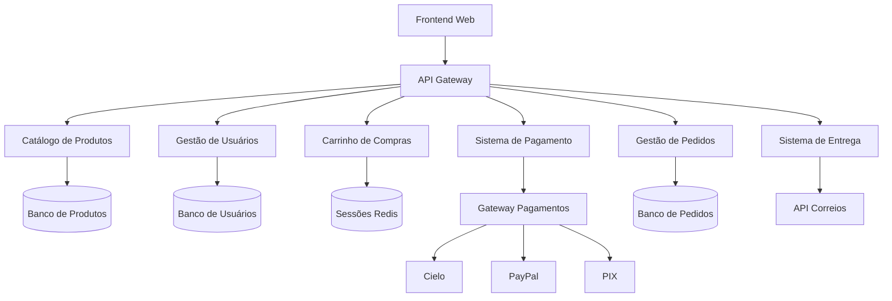

# Exercício 2.1 - Sistema de E-commerce 🛒

## 📋 Informações do Exercício

**Nível**: 🟡 Intermediário  
**Tempo Estimado**: 60 minutos  
**Modalidade**: Dupla  
**Competências**: Análise de sistemas integrados, rastreabilidade avançada, critérios por módulo

## 🎯 Objetivo

Desenvolver uma estratégia de teste completa para um sistema de e-commerce com múltiplos módulos interconectados, praticando a integração de conceitos de casos de teste, critérios de qualidade e rastreabilidade em um contexto complexo e realista.

## 📋 Cenário

A empresa "TechMart" está lançando uma nova plataforma de e-commerce B2C. Você e seu(sua) parceiro(a) são os testadores responsáveis por garantir a qualidade antes do lançamento. A plataforma possui múltiplos módulos que devem trabalhar de forma integrada.

### Arquitetura do Sistema



### Módulos e Funcionalidades

#### Módulo 1: Catálogo de Produtos
**Responsável**: [Defina na dupla quem será o responsável principal]

**Funcionalidades:**
- Busca de produtos (texto, categoria, preço)
- Filtros avançados (marca, avaliação, disponibilidade)
- Visualização de detalhes do produto
- Recomendações personalizadas
- Avaliações e comentários

**Requisitos Específicos:**
- **CAT-01**: Busca deve retornar resultados em < 2 segundos
- **CAT-02**: Suporte a 10.000 produtos simultâneos na busca
- **CAT-03**: Filtros devem ser aplicados em tempo real
- **CAT-04**: Integração com sistema de recomendação por ML

#### Módulo 2: Gestão de Usuários
**Responsável**: [Defina na dupla quem será o responsável principal]

**Funcionalidades:**
- Cadastro de novos usuários
- Login/logout com autenticação 2FA
- Recuperação de senha
- Perfil do usuário (dados pessoais, endereços)
- Histórico de compras

**Requisitos Específicos:**
- **USR-01**: Senha deve ter min. 8 caracteres com complexidade
- **USR-02**: 2FA obrigatório para compras > R$ 500
- **USR-03**: Dados pessoais devem seguir LGPD
- **USR-04**: Session timeout após 30 min de inatividade

#### Módulo 3: Carrinho de Compras
**Responsável**: [Responsabilidade compartilhada - integração crítica]

**Funcionalidades:**
- Adicionar/remover produtos do carrinho
- Calcular preços, descontos e frete
- Salvamento de carrinho entre sessões
- Aplicação de cupons de desconto
- Cálculo de estoque em tempo real

**Requisitos Específicos:**
- **CAR-01**: Carrinho deve persistir por 7 dias sem login
- **CAR-02**: Sincronização entre múltiplos dispositivos
- **CAR-03**: Verificação de estoque antes do pagamento
- **CAR-04**: Aplicação de regras de desconto automáticas

#### Módulo 4: Sistema de Pagamento
**Responsável**: [Defina na dupla quem será o responsável principal]

**Funcionalidades:**
- Processamento de cartões (Visa, Mastercard, Elo)
- Integração com PayPal e PIX
- Parcelamento automático
- Validação de dados do cartão
- Processamento de estornos

**Requisitos Específicos:**
- **PAY-01**: Transações devem ser processadas em < 10 segundos
- **PAY-02**: Criptografia end-to-end para dados sensíveis
- **PAY-03**: Retry automático para falhas temporárias
- **PAY-04**: Compliance PCI DSS obrigatório

#### Módulo 5: Gestão de Pedidos
**Responsável**: [Responsabilidade compartilhada - coordenação geral]

**Funcionalidades:**
- Criação de pedidos após pagamento aprovado
- Tracking de status do pedido
- Comunicação com sistema de entrega
- Envio de notificações ao cliente
- Gestão de cancelamentos e devoluções

**Requisitos Específicos:**
- **PED-01**: Pedido deve ser criado em < 5 segundos após pagamento
- **PED-02**: Notificações por email e SMS em tempo real
- **PED-03**: Integração com múltiplas transportadoras
- **PED-04**: Possibilidade de cancelamento até 1 hora após compra

### Fluxos Críticos de Integração

#### Fluxo 1: Compra Completa (Happy Path)
1. **Usuário** faz login no sistema
2. **Catálogo** apresenta produtos recomendados
3. **Usuário** busca e seleciona produtos
4. **Carrinho** calcula preços e frete
5. **Pagamento** processa transação
6. **Pedidos** cria pedido e aciona entrega
7. **Notificações** são enviadas ao cliente

#### Fluxo 2: Falha de Pagamento
1. **Pagamento** falha por diversos motivos
2. **Carrinho** mantém produtos reservados por 15 min
3. **Sistema** oferece métodos alternativos
4. **Usuário** pode tentar novamente ou cancelar

#### Fluxo 3: Produto Indisponível
1. **Carrinho** detecta produto sem estoque
2. **Sistema** oferece produtos similares
3. **Usuário** pode substituir ou remover item
4. **Carrinho** recalcula valores

## 📝 Sua Tarefa

### 🔄 Etapa 1: Divisão de Responsabilidades (5 minutos)

**Decidam em dupla:**
- Quem será responsável principal por cada módulo
- Como integrar os trabalhos individuais
- Cronograma interno para entrega

**Sugestão de Divisão A:**
- **Pessoa 1**: Catálogo + Usuários + parte da análise de integração
- **Pessoa 2**: Pagamento + Pedidos + parte da análise de integração
- **Ambos**: Carrinho (módulo crítico) + Critérios gerais

**Sugestão de Divisão B:**
- **Pessoa 1**: Foco em funcionalidades (CAT, CAR, PED)
- **Pessoa 2**: Foco em qualidade (USR, PAY) + Critérios não-funcionais
- **Ambos**: Integração entre módulos

### 🔍 Etapa 2: Análise Individual dos Módulos (20 minutos)

Cada pessoa desenvolve casos de teste para seus módulos designados:

**Para cada módulo sob sua responsabilidade:**
1. **Identifique cenários críticos** (mínimo 3 por módulo)
2. **Crie casos de teste detalhados** (use template da aula)
3. **Defina critérios específicos** por módulo
4. **Identifique dependências** com outros módulos

### 🔗 Etapa 3: Análise de Integração Colaborativa (15 minutos)

**Trabalhem juntos para:**
1. **Mapear pontos de integração** entre módulos
2. **Identificar fluxos end-to-end** críticos
3. **Criar casos de integração** específicos
4. **Definir critérios de integração**

### 📊 Etapa 4: Consolidação da Estratégia (15 minutos)

**Integrem o trabalho individual:**
1. **Revise casos de teste** uns dos outros
2. **Unifique critérios** onde necessário
3. **Complete matriz de rastreabilidade**
4. **Identifique gaps** e redundâncias

### 🎯 Etapa 5: Análise de Qualidade (5 minutos)

**Validem a estratégia:**
1. **Todos os módulos** estão adequadamente cobertos?
2. **Pontos de integração** estão testados?
3. **Critérios são realistas** e aplicáveis?
4. **Estratégia é executável** no prazo disponível?

## 📄 Template para Entrega

```markdown
# Exercício 2.1 - Sistema de E-commerce TechMart
**Dupla**: [Nome Pessoa 1] + [Nome Pessoa 2]
**Data**: [Data de Realização]

## Divisão de Responsabilidades

**[Nome Pessoa 1]**: [Módulos responsáveis]
**[Nome Pessoa 2]**: [Módulos responsáveis]
**Responsabilidade Compartilhada**: [Módulos/atividades conjuntas]

## Casos de Teste por Módulo

### Módulo: Catálogo de Produtos
**Responsável**: [Nome]

#### CT-CAT-001: [Título do caso]
[Use template padrão da aula]

#### CT-CAT-002: [Título do caso]
[Use template padrão da aula]

#### CT-CAT-003: [Título do caso]
[Use template padrão da aula]

### [Repita para todos os módulos]

## Casos de Teste de Integração

### Fluxo: Compra Completa (Happy Path)
#### CT-INT-001: [Título do caso end-to-end]
[Detalhe o fluxo completo com verificações em cada etapa]

### Fluxo: Falha de Pagamento
#### CT-INT-002: [Título do caso de falha]
[Detalhe o fluxo de tratamento de erro]

### [Continue para outros fluxos críticos]

## Matriz de Rastreabilidade Avançada

| Módulo | Requisito | Prioridade | Casos de Teste | Cobertura | Dependências | Status |
|--------|-----------|------------|----------------|-----------|--------------|--------|
| CAT | CAT-01 | Alta | CT-CAT-001, CT-CAT-002 | 100% | USR-04 | ✅ |
| CAT | CAT-02 | Crítica | CT-CAT-003 | 100% | - | ✅ |
| USR | USR-01 | Alta | CT-USR-001 | 100% | - | ✅ |
| [Continue para todos os requisitos] |

## Critérios de Teste por Módulo

### Critérios de Entrada - Catálogo
- [ ] [Critério específico 1]
- [ ] [Critério específico 2]

### Critérios de Cobertura - Catálogo
- **Funcional**: [X]% dos cenários de busca testados
- **Performance**: [Y] cenários de carga
- **Integração**: [Z] pontos de integração validados

### Critérios de Saída - Catálogo
- **Quantitativos**: [Percentuais específicos]
- **Qualitativos**: [Condições específicas]

### [Repita para todos os módulos]

## Critérios de Integração

### Critérios de Entrada - Integração
- [ ] Todos os módulos individuais aprovados
- [ ] Ambiente de integração configurado
- [ ] Dados de teste cross-módulos preparados

### Critérios de Cobertura - Integração
- **Fluxos End-to-End**: [X] fluxos críticos testados
- **Pontos de Falha**: [Y] cenários de erro entre módulos
- **Performance Integrada**: [Z] cenários de carga completa

### Critérios de Saída - Integração
- **Taxa de Sucesso**: [X]% dos fluxos end-to-end passando
- **Performance**: Fluxo completo em < [Y] segundos
- **Estabilidade**: [Z] horas de teste contínuo sem falhas

## Análise de Gaps e Riscos

### Gaps Identificados
1. **[Gap 1]**: [Descrição e impacto]
   - **Mitigação**: [Como resolver]
   - **Responsável**: [Quem resolverá]

2. **[Gap 2]**: [Descrição e impacto]
   - **Mitigação**: [Como resolver]
   - **Responsável**: [Quem resolverá]

### Riscos da Estratégia
1. **[Risco 1]**: [Descrição]
   - **Probabilidade**: [Alta/Média/Baixa]
   - **Impacto**: [Alto/Médio/Baixo]
   - **Contingência**: [Plano B]

## Reflexão da Dupla

### Desafios Enfrentados
[1-2 parágrafos sobre principais dificuldades na elaboração]

### Aprendizados sobre Colaboração
[1-2 parágrafos sobre como dividiram o trabalho e integraram resultados]

### Melhorias Futuras
[1-2 parágrafos sobre o que fariam diferente em um próximo projeto]
```

## 🔍 Critérios de Avaliação Específicos

### Cobertura por Módulo (25 pontos)
- **Excelente (23-25)**: Todos os módulos adequadamente cobertos
- **Bom (20-22)**: Maioria dos módulos bem cobertos
- **Satisfatório (17-19)**: Cobertura básica dos módulos principais
- **Insatisfatório (0-16)**: Cobertura inadequada ou incompleta

### Integração Between Módulos (25 pontos)
- **Excelente (23-25)**: Pontos de integração claramente identificados e testados
- **Bom (20-22)**: Maioria das integrações cobertas
- **Satisfatório (17-19)**: Integrações básicas identificadas
- **Insatisfatório (0-16)**: Integrações negligenciadas

### Qualidade da Colaboração (25 pontos)
- **Excelente (23-25)**: Divisão eficiente, integração coesa, revisão evidente
- **Bom (20-22)**: Boa colaboração com pequenas inconsistências
- **Satisfatório (17-19)**: Colaboração básica funcional
- **Insatisfatório (0-16)**: Trabalho fragmentado, pouca integração

### Realismo e Aplicabilidade (25 pontos)
- **Excelente (23-25)**: Estratégia realista e executável no contexto
- **Bom (20-22)**: Estratégia majoritariamente aplicável
- **Satisfatório (17-19)**: Estratégia básica viável
- **Insatisfatório (0-16)**: Estratégia irrealista ou inaplicável

## 💡 Dicas Específicas para Este Exercício

### ✅ Foquem Em

**Pontos de Integração Críticos:**
- Carrinho → Pagamento (dados financeiros)
- Pagamento → Pedidos (confirmação)
- Catálogo → Carrinho (disponibilidade)
- Usuários → Todos (autenticação/autorização)

**Cenários de Alto Risco:**
- Falhas de pagamento durante Black Friday
- Concorrência no último item em estoque
- Fraudes e tentativas de ataque
- Performance durante picos de acesso

**Critérios Diferenciados:**
- E-commerce precisa de critérios de performance agressivos
- Tolerância zero para falhas de pagamento
- Critérios de segurança mais rigorosos para dados financeiros

### ❌ Evitem

- Tratar módulos de forma completamente isolada
- Negligenciar cenários de falha entre módulos
- Critérios genéricos sem considerar especificidades do e-commerce
- Casos de teste muito granulares que perdem visão sistêmica

### 🔧 Ferramentas Úteis

- **Miro/Lucidchart**: Para mapear fluxos de integração
- **Google Sheets**: Para matriz de rastreabilidade complexa
- **Postman**: Para simular APIs durante planejamento
- **JMeter**: Para estimar cenários de performance

## ❓ Perguntas Frequentes

**P: Como dividir o trabalho se um módulo é mais complexo?**
R: Considerem a experiência de cada pessoa. Quem tem mais expertise pode pegar módulos complexos, mas ambos devem contribuir com revisão.

**P: E se identificarmos muitas integrações?**
R: Priorizem as integrações críticas para o negócio. Documentem todas, mas foquem esforço nas de maior risco.

**P: Como definir critérios diferentes por módulo?**
R: Considerem a criticidade do módulo. Pagamento precisa de critérios mais rigorosos que Catálogo, por exemplo.

**P: O que fazer se não concordarmos sobre uma abordagem?**
R: Documentem ambas as perspectivas e justifiquem a escolha final. Em dúvida, priorizem a segurança.

---

**Tempo extra?** Considerem criar cenários de carga específicos (Black Friday), analisar impacto de regulamentações (LGPD) ou detalhar estratégias de automação para cada módulo.
