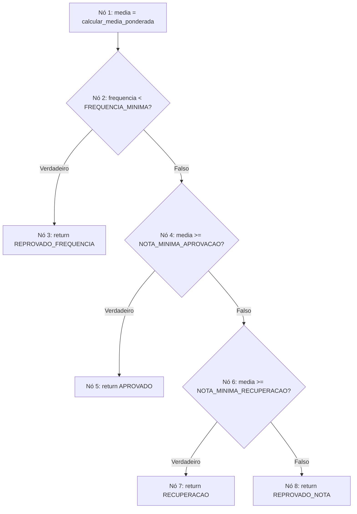
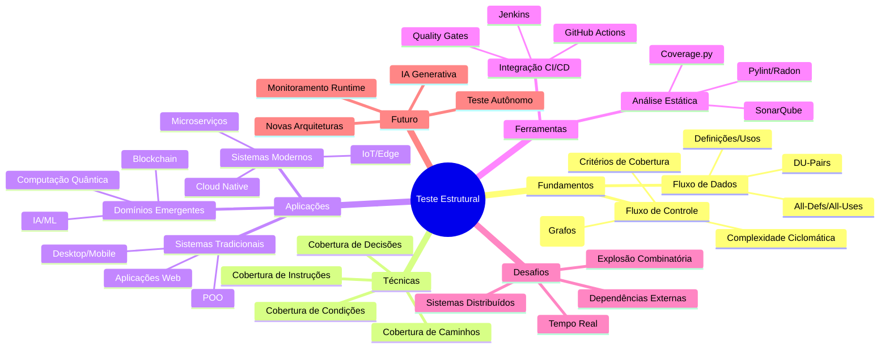

# Técnicas de Teste Estrutural (Caixa-Branca)

## Sumário Completo

1. **Abertura e Engajamento**
   - 1.1. Problema Motivador
   - 1.2. Contexto Histórico e Relevância Atual

2. **Fundamentos Teóricos**
   - 2.1. Teste Funcional vs Teste Estrutural: Terminologia Essencial e Definições Formais
   - 2.2. Fluxo de Controle: Estrutura Conceitual
     - 2.2.1. Grafos de Fluxo de Controle
     - 2.2.2. Critérios de Cobertura Baseados em Fluxo de Controle
     - 2.2.3. Complexidade Ciclomática
   - 2.3. Fluxo de Dados: Estrutura Conceitual
     - 2.3.1. Definições e Usos de Variáveis
     - 2.3.2. Critérios de Cobertura Baseados em Fluxo de Dados
     - 2.3.3. Análise de DU-Pairs
   - 2.4. Análise Quantitativa: Modelagem Matemática da Cobertura
   - 2.5. Análise Crítica: Limitações e Armadilhas dos Testes Estruturais

3. **Aplicação Prática e Implementação**
   - 3.1. Estudo de Caso Guiado: Sistema de Classificação de Notas
   - 3.2. Exemplos de Código Comentado
   - 3.3. Ferramentas, Bibliotecas e Ecossistema

4. **Tópicos Avançados e Nuances**
   - 4.1. Desafios Comuns e "Anti-Padrões" em Teste Estrutural
   - 4.2. Variações e Arquiteturas Especializadas
   - 4.3. Análise de Performance e Otimização
   - 4.4. Exemplos Avançados e Estudos de Caso

5. **Síntese e Perspectivas Futuras**
   - 5.1. Conexões com Outras Áreas da Computação
   - 5.2. A Fronteira da Pesquisa e o Futuro
   - 5.3. Resumo do Capítulo e Mapa Mental
   - 5.4. Referências e Leituras Adicionais

---

## 1. Abertura e Engajamento

### 1.1. Problema Motivador

Imagine que você é responsável pelo desenvolvimento de um sistema crítico de controle de voo para uma companhia aérea. Após semanas de testes funcionais rigorosos, validando todos os requisitos especificados — decolagem, navegação, pouso automático — o sistema é aprovado e entra em operação. No entanto, durante o primeiro voo comercial, uma combinação específica de condições meteorológicas e altitude aciona um caminho de código que nunca havia sido testado: um laço aninhado que, devido a uma condição mal implementada, entra em execução infinita, travando o sistema de navegação a 10.000 metros de altitude.

Este cenário ilustra uma realidade alarmante: **testes funcionais, mesmo quando executados meticulosamente, podem deixar importantes lacunas na validação de um software**. O problema não estava nos requisitos — eles foram cumpridos perfeitamente. O problema estava na **estrutura interna do código**, em caminhos de execução que nunca foram exercitados, em combinações de condições que permaneceram ocultas sob a perspectiva da caixa-preta.

É exatamente aqui que as **técnicas de teste estrutural (caixa-branca)** se tornam indispensáveis. Diferentemente dos testes funcionais, que validam o comportamento externo do sistema, os testes estruturais mergulham no código-fonte, analisam sua arquitetura interna e garantem que cada linha, cada decisão, cada fluxo de dados seja adequadamente exercitado. Eles respondem a perguntas críticas como: "Existem linhas de código que nunca executamos?", "Há condições que testamos apenas parcialmente?" e "Todas as variáveis estão sendo usadas corretamente ao longo do programa?"

### 1.2. Contexto Histórico e Relevância Atual

O conceito de teste estrutural emergiu na década de 1970, quando pioneiros como **Glenford Myers** e **Tom McCabe** reconheceram que a validação de software não poderia se limitar apenas aos requisitos funcionais. Myers, em seu trabalho seminal "The Art of Software Testing" (1979), foi um dos primeiros a formalizar a distinção entre testes de caixa-preta e caixa-branca, argumentando que ambas as abordagens são complementares e essenciais.

**Tom McCabe**, em 1976, revolucionou o campo ao introduzir o conceito de **complexidade ciclomática**, uma métrica matemática que quantifica a complexidade estrutural de um programa baseada em seu grafo de fluxo de controle. Seu trabalho, publicado no artigo "A Complexity Measure", estabeleceu as bases teóricas para mensurar quantitativamente a cobertura de testes estruturais.

Paralelamente, **Simeon Rapps e Elaine Weyuker** desenvolveram, na década de 1980, os fundamentos dos **critérios de fluxo de dados**, criando uma taxonomia sistemática para analisar como as variáveis são definidas, usadas e modificadas ao longo da execução de um programa. Seus trabalhos estabeleceram critérios como "all-definitions", "all-uses" e "all-DU-paths", que permanecem fundamentais até hoje.

Atualmente, com o crescimento exponencial da complexidade dos sistemas de software — desde aplicações distribuídas em nuvem até sistemas de inteligência artificial —, as técnicas de teste estrutural se tornaram ainda mais críticas. **DevOps** e **Continuous Integration/Continuous Deployment (CI/CD)** exigem pipelines automatizados que garantam alta cobertura de código antes de cada deploy. Ferramentas como **SonarQube**, **JaCoCo**, **Coverage.py** e **Istanbul** integram-se nativamente a plataformas como GitHub Actions, Jenkins e GitLab CI, tornando a análise de cobertura estrutural uma prática padrão na indústria.

Além disso, regulamentações rigorosas em setores como aviação (**DO-178C**), automotivo (**ISO 26262**) e medicina (**IEC 62304**) exigem níveis específicos de cobertura estrutural como pré-requisito para certificação de segurança. Empresas como Tesla, SpaceX, Google e Amazon dependem massivamente de testes estruturais para garantir a confiabilidade de seus sistemas críticos, desde veículos autônomos até infraestruturas de computação em nuvem que atendem bilhões de usuários globalmente.

---

## 2. Fundamentos Teóricos

### 2.1. Teste Funcional vs Teste Estrutural: Terminologia Essencial e Definições Formais

**Teste Funcional (Caixa-Preta)** é uma abordagem de validação que trata o software como uma entidade opaca, focando exclusivamente na relação entre entradas e saídas esperadas. O testador não tem conhecimento — nem necessita ter — sobre a implementação interna, algoritmos utilizados ou estrutura do código. A validação baseia-se inteiramente nos **requisitos funcionais** especificados, perguntando: "O sistema produz as saídas corretas para as entradas fornecidas?"

**Analogia para Entender:** Imagine testar um carro focando apenas se ele acelera quando pressionamos o pedal, freia quando acionamos o freio e vira quando giramos o volante. Não importa se o motor é a combustão ou elétrico, se os freios são a disco ou tambor — o que importa é o comportamento observável externamente.

**Teste Estrutural (Caixa-Branca)**, por outro lado, é uma abordagem que **examina meticulosamente a estrutura interna do código-fonte**, analisando caminhos de execução, fluxos de controle, uso de variáveis e cobertura de instruções. O testador possui acesso completo ao código e projeta casos de teste especificamente para exercitar componentes internos, decisões lógicas e fluxos de dados. A pergunta central é: "Todas as partes do código foram adequadamente testadas?"

**Definição Formal:** Seja $P$ um programa e $C$ seu código-fonte correspondente. O teste estrutural é o processo de análise sistemática de $C$ para derivar um conjunto de casos de teste $T = \{t_1, t_2, \ldots, t_n\}$ que maximize uma métrica de cobertura estrutural $M(T, C)$, onde $M$ pode representar cobertura de instruções, decisões, caminhos ou critérios de fluxo de dados.

A diferença fundamental reside no **nível de abstração** e no **objetivo primário**:

| **Aspecto** | **Teste Funcional** | **Teste Estrutural** |
|-------------|-------------------|---------------------|
| **Perspectiva** | Externa (comportamento) | Interna (implementação) |
| **Base para Casos de Teste** | Requisitos e especificações | Código-fonte e estrutura |
| **Conhecimento Necessário** | Domínio do problema | Programação e arquitetura |
| **Objetivo Principal** | Validar conformidade com requisitos | Maximizar cobertura do código |
| **Defeitos Detectados** | Funcionalidades ausentes/incorretas | Lógica interna incorreta |
| **Momento Ideal** | Qualquer fase (até sem código) | Após implementação disponível |

**Complementaridade Essencial:** Ambas as abordagens são **complementares e não mutuamente exclusivas**. Testes funcionais podem validar que um algoritmo de ordenação produz listas ordenadas, mas apenas testes estruturais garantem que todos os caminhos do algoritmo (caso base, recursão, condições de parada) foram exercitados. Um sistema pode passar em todos os testes funcionais e ainda conter código morto, condições parcialmente testadas ou variáveis mal utilizadas — problemas que apenas testes estruturais detectariam.

### 2.2. Fluxo de Controle: Estrutura Conceitual

#### 2.2.1. Grafos de Fluxo de Controle

O **Grafo de Fluxo de Controle (CFG - Control Flow Graph)** é uma representação matemática da estrutura de decisões e caminhos de execução de um programa. Formalmente, um CFG é um grafo direcionado $G = (V, E)$, onde:

- **$V$** é o conjunto de **vértices (nós)** que representam blocos básicos de código (sequências de instruções sem ramificações internas)
- **$E$** é o conjunto de **arestas direcionadas** que representam possíveis fluxos de controle entre os blocos

**Componentes Estruturais:**

1. **Nó de Entrada:** Ponto único onde a execução inicia
2. **Nós de Processamento:** Blocos de instruções sequenciais
3. **Nós de Decisão:** Comandos condicionais (if, while, switch)
4. **Nó de Saída:** Ponto único onde a execução termina
5. **Arestas:** Conexões representando fluxos possíveis

**Construção Sistemática:**

```python
def construir_cfg_exemplo():
    """
    Exemplo de código para demonstrar construção de CFG:
    
    def calcular_status_aluno(nota, frequencia):
        # Nó 1: Entrada e inicialização
        if nota >= 7.0:                    # Nó 2: Decisão principal
            if frequencia >= 75:           # Nó 3: Decisão aninhada
                status = "Aprovado"        # Nó 4: Aprovação
            else:
                status = "Reprovado por frequência"  # Nó 5: Reprovação por frequência
        else:
            if nota >= 5.0:                # Nó 6: Decisão recuperação
                status = "Recuperação"     # Nó 7: Recuperação
            else:
                status = "Reprovado por nota"  # Nó 8: Reprovação por nota
        
        return status                      # Nó 9: Saída
    """
    pass
```

**Representação Visual do CFG:**

```{mermaid}
graph TD
    A[Nó 1: Entrada] --> B{Nó 2: nota >= 7.0?}
    B -->|Verdadeiro| C{Nó 3: frequencia >= 75?}
    B -->|Falso| F{Nó 6: nota >= 5.0?}
    C -->|Verdadeiro| D[Nó 4: status = 'Aprovado']
    C -->|Falso| E[Nó 5: status = 'Reprovado por frequência']
    F -->|Verdadeiro| G[Nó 7: status = 'Recuperação']
    F -->|Falso| H[Nó 8: status = 'Reprovado por nota']
    D --> I[Nó 9: return status]
    E --> I
    G --> I
    H --> I
```

#### 2.2.2. Critérios de Cobertura Baseados em Fluxo de Controle

Os critérios de cobertura estabelecem **métricas quantitativas** para avaliar a adequação dos casos de teste em relação à estrutura do programa. Eles formam uma hierarquia de rigor crescente:

**1. Cobertura de Instruções (Statement Coverage)**

**Definição:** Percentual de instruções executáveis que foram exercitadas pelos casos de teste.

**Fórmula:** $CS = \frac{\text{Instruções Executadas}}{\text{Total de Instruções}} \times 100\%$

**Objetivo:** Garantir que nenhuma linha de código permaneça completamente não testada.

**Exemplo Prático:**
```python
def exemplo_cobertura_instrucoes(x, y):
    result = 0                    # Instrução 1 - sempre executada
    if x > 0:                     # Instrução 2 - sempre executada  
        result = x + y            # Instrução 3 - só se x > 0
    else:
        result = x - y            # Instrução 4 - só se x <= 0
    return result                 # Instrução 5 - sempre executada

# Casos de teste para 100% cobertura de instruções:
# Teste 1: exemplo_cobertura_instrucoes(5, 3) → exercita instruções 1,2,3,5
# Teste 2: exemplo_cobertura_instrucoes(-2, 3) → exercita instruções 1,2,4,5
# Cobertura: 5/5 = 100%
```

**2. Cobertura de Decisões (Branch Coverage)**

**Definição:** Percentual de decisões (condicionais) que foram avaliadas tanto como verdadeiras quanto como falsas.

**Fórmula:** $CD = \frac{\text{Decisões Completamente Testadas}}{\text{Total de Decisões}} \times 100\%$

**Critério de Completude:** Para cada decisão binária, deve existir pelo menos um caso de teste que a torna verdadeira e outro que a torna falsa.

```python
def exemplo_cobertura_decisoes(idade, tem_carteira):
    pode_dirigir = False
    
    # Decisão 1: idade >= 18
    if idade >= 18:
        # Decisão 2: tem_carteira == True  
        if tem_carteira:
            pode_dirigir = True
        else:
            pode_dirigir = False
    
    return pode_dirigir

# Casos de teste para 100% cobertura de decisões:
# Teste 1: (20, True) → D1=True, D2=True
# Teste 2: (20, False) → D1=True, D2=False  
# Teste 3: (16, True) → D1=False (D2 não avaliada)
# Cobertura: 2/2 = 100%
```

**3. Cobertura de Caminhos Independentes**

Baseada na **complexidade ciclomática**, garante que todos os caminhos linearmente independentes sejam testados.

**Definição:** Um conjunto de caminhos é linearmente independente se cada caminho introduz pelo menos uma nova aresta que não foi percorrida pelos caminhos anteriores.

**4. Cobertura de Condições Combinadas (Condition Coverage)**

Para decisões compostas por múltiplas condições lógicas, testa todas as combinações possíveis dos valores das condições.

```python
def exemplo_condicoes_combinadas(temperatura, umidade, pressao):
    # Decisão composta: (temperatura > 25) AND (umidade < 60) AND (pressao > 1013)
    if temperatura > 25 and umidade < 60 and pressao > 1013:
        return "Condições ideais"
    else:
        return "Condições inadequadas"

# Para 100% cobertura de condições combinadas (2³ = 8 casos):
casos_teste = [
    (30, 50, 1020),  # T T T → True
    (30, 50, 1000),  # T T F → False
    (30, 70, 1020),  # T F T → False
    (30, 70, 1000),  # T F F → False
    (20, 50, 1020),  # F T T → False
    (20, 50, 1000),  # F T F → False
    (20, 70, 1020),  # F F T → False
    (20, 70, 1000),  # F F F → False
]
```

#### 2.2.3. Complexidade Ciclomática

A **Complexidade Ciclomática de McCabe** é uma métrica fundamental que quantifica a complexidade estrutural de um programa baseada em seu grafo de fluxo de controle.

**Definição Matemática:**

$$M = E - N + 2P$$

Onde:
- **$E$** = Número de arestas no grafo
- **$N$** = Número de nós no grafo  
- **$P$** = Número de componentes conectados (geralmente 1 para um programa)

**Interpretação:** $M$ representa o **número mínimo de caminhos linearmente independentes** necessários para testar completamente o programa.

**Cálculo Alternativo:**
$$M = D + 1$$

Onde $D$ é o número de nós de decisão (predicados) no grafo.

**Exemplo de Cálculo:**

Considerando o CFG do exemplo anterior (função `calcular_status_aluno`):
- **Nós (N):** 9 nós
- **Arestas (E):** 10 arestas
- **Componentes (P):** 1 componente conectado

$$M = 10 - 9 + 2(1) = 3$$

**Verificação:** 
- Nós de decisão: 2 (nota >= 7.0 e frequencia >= 75)
- $M = 2 + 1 = 3$ ✓

**Interpretação dos Valores:**

| **Complexidade** | **Interpretação** | **Risco** |
|------------------|-------------------|-----------|
| 1-10 | Programa simples | Baixo |
| 11-20 | Programa moderado | Moderado |
| 21-50 | Programa complexo | Alto |
| >50 | Programa muito complexo | Muito Alto |

### 2.3. Fluxo de Dados: Estrutura Conceitual

#### 2.3.1. Definições e Usos de Variáveis

A **análise de fluxo de dados** examina como as variáveis são manipuladas ao longo da execução do programa, focando em três operações fundamentais:

**1. Definição (Def):** Ocorre quando uma variável recebe um valor
```python
x = 10           # Definição de x
y = input()      # Definição de y
z = x + y        # Definição de z
```

**2. Uso Computacional (C-Use):** Variável é utilizada em uma computação
```python
resultado = x + y    # C-use de x e y
z = math.sqrt(x)     # C-use de x
```

**3. Uso Predicativo (P-Use):** Variável é utilizada em uma condição/decisão
```python
if x > 0:           # P-use de x
    pass
while y < 100:      # P-use de y
    pass
```

**Classificação Adicional:**

- **Definição Global:** Definição que pode afetar usos em outros módulos
- **Definição Local:** Definição com escopo limitado ao bloco atual
- **Uso Direto:** Variável usada imediatamente após definição
- **Uso Indireto:** Variável usada após outras operações

**Exemplo Detalhado de Análise:**

```python
def calcular_media_ponderada(notas, pesos):
    # Linha 1: 'soma_ponderada' - Definição inicial
    soma_ponderada = 0.0
    
    # Linha 2: 'soma_pesos' - Definição inicial  
    soma_pesos = 0.0
    
    # Linha 3: 'i' - Definição (implícita no for)
    # 'notas' - P-use (predicado do for)
    for i, nota in enumerate(notas):
        
        # Linha 4: 'peso' - Definição (indexação)
        # 'pesos', 'i' - C-use para acessar elemento
        peso = pesos[i]
        
        # Linha 5: 'soma_ponderada' - C-use (lado direito) e Definição (lado esquerdo)
        # 'nota', 'peso' - C-use
        soma_ponderada += nota * peso
        
        # Linha 6: 'soma_pesos' - C-use (lado direito) e Definição (lado esquerdo)  
        # 'peso' - C-use
        soma_pesos += peso
    
    # Linha 7: 'soma_pesos' - P-use (condição)
    if soma_pesos > 0:
        # Linha 8: 'soma_ponderada', 'soma_pesos' - C-use
        return soma_ponderada / soma_pesos
    else:
        # Linha 9: Retorno literal (sem uso de variáveis)
        return 0.0
```

**Análise de Fluxo:**

| **Variável** | **Definições (Linha)** | **C-Uses (Linha)** | **P-Uses (Linha)** |
|--------------|------------------------|-------------------|-------------------|
| `soma_ponderada` | 1, 5 | 5, 8 | - |
| `soma_pesos` | 2, 6 | 6, 8 | 7 |
| `notas` | (parâmetro) | - | 3 |
| `pesos` | (parâmetro) | 4 | - |
| `i` | 3 | 4 | - |
| `nota` | 3 | 5 | - |
| `peso` | 4 | 5, 6 | - |

#### 2.3.2. Critérios de Cobertura Baseados em Fluxo de Dados

**1. All-Definitions (Todas as Definições)**

**Critério:** Para cada definição de variável, deve existir pelo menos um caminho de teste que leve a definição até algum uso da variável.

**Objetivo:** Garantir que toda definição de variável seja "útil", ou seja, seus valores sejam efetivamente utilizados.

**2. All-Uses (Todos os Usos)**

**Critério:** Para cada definição de variável, todos os usos possíveis dessa definição devem ser exercitados pelos casos de teste.

**Objetivo:** Garantir cobertura completa das interações entre definições e usos.

**3. All-C-Uses/All-P-Uses**

**Critério:** Cobertura específica para usos computacionais ou predicativos, respectivamente.

**4. All-DU-Paths (Todos os Caminhos Definição-Uso)**

**Critério:** Todos os caminhos livres de definição entre cada par definição-uso devem ser testados.

**Definição de Caminho Livre de Definição:** Um caminho da definição $d$ de uma variável $v$ até um uso $u$ de $v$ é livre de definição se não contém nenhuma redefinição de $v$ no meio do caminho.

#### 2.3.3. Análise de DU-Pairs

**DU-Pair (Definition-Use Pair)** é um par ordenado $(d, u)$ onde $d$ é uma definição de uma variável $v$ e $u$ é um uso de $v$ tal que existe pelo menos um caminho livre de definição de $d$ para $u$.

**Exemplo Completo de Análise:**

```python
def exemplo_du_pairs(x, y):
    # Nó 1
    a = x + 1        # Def(a) = {1}
    
    # Nó 2  
    b = y * 2        # Def(b) = {2}
    
    # Nó 3
    if a > 5:        # P-use(a) = {3}
        # Nó 4
        c = a + b    # C-use(a) = {4}, C-use(b) = {4}, Def(c) = {4}
    else:
        # Nó 5
        c = a - b    # C-use(a) = {5}, C-use(b) = {5}, Def(c) = {5}
    
    # Nó 6
    return c         # C-use(c) = {6}
```

**DU-Pairs Identificados:**

| **Variável** | **DU-Pair** | **Caminho Livre de Definição** |
|--------------|-------------|-------------------------------|
| `a` | (1, 3) | 1 → 2 → 3 |
| `a` | (1, 4) | 1 → 2 → 3 → 4 |
| `a` | (1, 5) | 1 → 2 → 3 → 5 |
| `b` | (2, 4) | 2 → 3 → 4 |
| `b` | (2, 5) | 2 → 3 → 5 |
| `c` | (4, 6) | 4 → 6 |
| `c` | (5, 6) | 5 → 6 |

**Casos de Teste para All-DU-Paths:**
- **Teste 1:** `x=6, y=3` → Caminho 1→2→3→4→6 (exercita DU-pairs da variável `a` e `b` para nó 4)
- **Teste 2:** `x=2, y=3` → Caminho 1→2→3→5→6 (exercita DU-pairs da variável `a` e `b` para nó 5)

### 2.4. Análise Quantitativa: Modelagem Matemática da Cobertura

A análise quantitativa de cobertura permite mensurar matematicamente a adequação dos casos de teste. Definimos métricas formais para cada critério:

**Cobertura de Instruções:**
$$\text{CS}(\mathcal{T}) = \frac{|\{s \in S : \exists t \in \mathcal{T}, s \text{ é executada por } t\}|}{|S|}$$

Onde:
- $\mathcal{T}$ é o conjunto de casos de teste
- $S$ é o conjunto de todas as instruções executáveis do programa
- $s$ representa uma instrução individual

**Cobertura de Decisões:**
$$\text{CD}(\mathcal{T}) = \frac{|\{d \in D : \text{ambas as saídas de } d \text{ são exercitadas por } \mathcal{T}\}|}{|D|}$$

Onde $D$ é o conjunto de todas as decisões do programa.

**Cobertura de DU-Pairs:**
$$\text{CDU}(\mathcal{T}) = \frac{|\{\text{du} \in \text{DU} : \exists t \in \mathcal{T}, t \text{ exercita du}\}|}{|\text{DU}|}$$

Onde $\text{DU}$ é o conjunto de todos os pares definição-uso do programa.

**Relação Hierárquica entre Critérios:**

A teoria estabelece uma hierarquia formal de inclusão entre critérios:

$$\text{All-Paths} \supseteq \text{All-DU-Paths} \supseteq \text{All-Uses} \supseteq \text{All-Defs} \supseteq \text{All-Branches} \supseteq \text{All-Statements}$$

Esta hierarquia significa que um conjunto de casos de teste que satisfaz um critério mais forte automaticamente satisfaz todos os critérios mais fracos na cadeia.

**Custo-Benefício da Cobertura:**

O **custo marginal** para atingir níveis superiores de cobertura cresce exponencialmente:

$$\text{Custo}(c) = \alpha \cdot e^{\beta \cdot c}$$

Onde:
- $c$ é o percentual de cobertura (0 ≤ c ≤ 1)
- $\alpha$ e $\beta$ são constantes empíricas dependentes do projeto
- O custo representa tempo, recursos ou complexidade dos casos de teste

**Eficácia de Detecção de Defeitos:**

Estudos empíricos mostram que a relação entre cobertura e detecção de defeitos segue uma função logarítmica:

$$\text{Defeitos Detectados}(c) = D_{\max} \cdot \log(1 + \gamma \cdot c)$$

Onde:
- $D_{\max}$ é o número máximo de defeitos detectáveis
- $\gamma$ é um fator de eficácia específico do domínio
- A função mostra retornos decrescentes: os primeiros 80% de cobertura detectam a maioria dos defeitos

### 2.5. Análise Crítica: Limitações e Armadilhas dos Testes Estruturais

#### Limitações Fundamentais

**1. Falácia da Cobertura Completa**

Atingir 100% de cobertura estrutural **não garante ausência de defeitos**. Um programa pode ter cobertura perfeita e ainda conter:

- **Lógica incorreta:** Condições implementadas ao contrário
- **Casos não previstos:** Situações não contempladas no código
- **Interações complexas:** Problemas emergentes entre componentes
- **Dependências externas:** Falhas em APIs, bancos de dados, sistema operacional

**Exemplo Ilustrativo:**
```python
def calcular_desconto(valor, categoria_cliente):
    # 100% de cobertura pode ser atingida, mas a lógica está ERRADA
    if categoria_cliente == "VIP":
        # ERRO: desconto deveria ser 20%, não 2%
        desconto = valor * 0.02  
    else:
        desconto = valor * 0.10
    
    return valor - desconto

# Casos de teste com 100% cobertura:
# Teste 1: calcular_desconto(5, "VIP") → retorna 98 (esperava 80)
# Teste 2: calcular_desconto(5, "NORMAL") → retorna 90 ✓
# Cobertura: 100% | Defeitos detectados: 0 (teste não verificou valor esperado)
```

**2. Código Morto e Inalcançável**

Algumas partes do código podem ser estruturalmente **impossíveis de testar**:

```python
def exemplo_codigo_morto(x):
    if x > 0:
        resultado = x * 2
    else:
        resultado = x * 3
    
    # CÓDIGO MORTO: nunca será executado
    if False:  # Condição sempre falsa
        resultado = x * 999  # Linha inalcançável
    
    return resultado
```

**3. Dependência de Entrada Específica**

Alguns caminhos só são exercitáveis com valores muito específicos ou combinações raras:

```python
def funcao_complexa(a, b, c):
    # Caminho só é exercitado se a*b*c == 123456789
    if a * b * c == 123456789:
        return "Caminho raro"
    else:
        return "Caminho comum"
```

#### Armadilhas Comuns

> **Armadilhas a Evitar**
> 
> 1. **Priorizar quantidade sobre qualidade:** Focar apenas em métricas de cobertura sem validar a correção dos resultados
> 2. **Negligenciar testes funcionais:** Usar apenas testes estruturais, ignorando validação de requisitos
> 3. **Otimização prematura:** Buscar 100% de cobertura sem analisar custo-benefício
> 4. **Testes artificiais:** Criar casos de teste irreais apenas para atingir cobertura

**Desafios Práticos:**

**1. Explosão Combinatória**
- Programas com múltiplas decisões aninhadas levam a crescimento exponencial de caminhos
- Número de caminhos = $2^n$ (onde $n$ é o número de decisões independentes)

**2. Loops e Recursão**
- Loops podem gerar infinitos caminhos teoricamente
- Necessidade de estabelecer critérios de parada para análise

**3. Concorrência e Paralelismo**
- Threads múltiplas introduzem não-determinismo
- Estados compartilhados criam condições de corrida difíceis de reproduzir

**4. Dependências Externas**
- Sistemas de arquivos, redes, bancos de dados
- Necessidade de mocks e stubs que podem não refletir comportamento real

#### FAQ - Perguntas Frequentes

**Q: É possível atingir 100% de cobertura em todos os critérios simultaneamente?**
**A:** Teoricamente sim, mas na prática é extremamente custoso e nem sempre necessário. A Lei de Pareto se aplica: 80% dos defeitos são detectados com 20% do esforço de teste.

**Q: Qual nível de cobertura é considerado adequado?**
**A:** Depende do domínio:
- **Sistemas críticos:** 95-100% (aviação, medicina)
- **Sistemas comerciais:** 80-90% (aplicações web, mobile)
- **Prototópos/POCs:** 60-70% (validação de conceito)

**Q: Testes estruturais substituem testes funcionais?**
**A:** **Nunca.** São abordagens complementares. Testes funcionais validam requisitos; estruturais validam implementação.

**Q: Como lidar com código legacy sem testes?**
**A:** Estratégia incremental:
1. Comece com cobertura de funcionalidades críticas
2. Implemente testes ao refatorar código existente
3. Estabeleça cobertura mínima para código novo
4. Use ferramentas de análise estática para identificar pontos de risco

Esta análise crítica revela que, embora os testes estruturais sejam fundamentais, eles devem ser aplicados de forma inteligente e balanceada, sempre considerando o contexto do projeto, recursos disponíveis e riscos associados ao sistema sob teste.

---

## 3. Aplicação Prática e Implementação

### 3.1. Estudo de Caso Guiado: Sistema de Classificação de Notas

Para demonstrar a aplicação prática das técnicas de teste estrutural, desenvolveremos um estudo de caso completo: um **Sistema de Classificação de Notas Acadêmicas**. Este sistema simula um cenário real onde estudantes são avaliados com base em múltiplos critérios, incluindo notas de provas, trabalhos, participação e frequência.

O sistema possui complexidade suficiente para demonstrar todos os conceitos de fluxo de controle e fluxo de dados, mas permanece didático e compreensível. Acompanharemos cada passo do desenvolvimento, desde a análise de requisitos até a implementação completa dos testes estruturais.

#### Passo 1: Definição dos Requisitos e Especificação

**Requisitos Funcionais:**
1. **Calcular média ponderada** com pesos: Prova (40%), Trabalhos (30%), Participação (20%), Frequência (10%)
2. **Classificar estudante** em: Aprovado, Recuperação, Reprovado por Nota, Reprovado por Frequência
3. **Validar entradas** para garantir valores dentro dos intervalos válidos
4. **Aplicar regras de negócio** específicas da instituição

**Regras de Negócio:**
- **Aprovado:** Média ≥ 7.0 E Frequência ≥ 75%
- **Recuperação:** 5.0 ≤ Média < 7.0 E Frequência ≥ 75%
- **Reprovado por Nota:** Média < 5.0 (independente da frequência)
- **Reprovado por Frequência:** Frequência < 75% (independente da média)
- **Validações:** Todas as notas devem estar entre 0.0 e 10.0; Frequência entre 0% e 100%

#### Passo 2: Implementação do Sistema Base

```python
from typing import Dict, Tuple, Union
from dataclasses import dataclass
from enum import Enum


class StatusAluno(Enum):
    """
    Enumeração que define os possíveis status de um aluno.
    
    Esta enum facilita a manutenção e evita strings mágicas no código,
    além de fornecer type safety para IDEs modernas.
    """
    APROVADO = "Aprovado"
    RECUPERACAO = "Recuperação"  
    REPROVADO_NOTA = "Reprovado por Nota"
    REPROVADO_FREQUENCIA = "Reprovado por Frequência"


@dataclass
class Notas:
    """
    Classe de dados que encapsula as notas de um estudante.
    
    O uso de dataclass reduz boilerplate e fornece automaticamente
    métodos como __init__, __repr__ e __eq__.
    
    Attributes:
        prova: Nota da prova principal (0.0 a 10.0)
        trabalhos: Nota média dos trabalhos (0.0 a 10.0)  
        participacao: Nota de participação (0.0 a 10.0)
        frequencia: Percentual de frequência (0.0 a 100.0)
    """
    prova: float
    trabalhos: float
    participacao: float
    frequencia: float
    
    def __post_init__(self):
        """
        Validação automática após inicialização.
        
        Este método é chamado automaticamente pelo dataclass
        após a criação do objeto, garantindo que os dados
        estejam sempre em estado válido.
        """
        self._validar_notas()
    
    def _validar_notas(self) -> None:
        """
        Valida se todas as notas estão dentro dos intervalos permitidos.
        
        FLUXO DE CONTROLE: Este método contém múltiplas decisões
        que precisam ser testadas estruturalmente:
        - 4 condições para validação de notas (0.0 ≤ nota ≤ 10.0)
        - 1 condição para validação de frequência (0.0 ≤ freq ≤ 100.0)
        
        FLUXO DE DADOS: Variáveis de entrada são usadas em comparações
        (P-uses) e podem gerar exceções (side effects).
        """
        # DECISÃO 1: Validação da nota da prova
        # P-use das variáveis: self.prova (duas comparações)
        if not (0.0 <= self.prova <= 10.0):
            raise ValueError(f"Nota da prova deve estar entre 0.0 e 10.0. Valor recebido: {self.prova}")
        
        # DECISÃO 2: Validação da nota dos trabalhos  
        # P-use das variáveis: self.trabalhos (duas comparações)
        if not (0.0 <= self.trabalhos <= 10.0):
            raise ValueError(f"Nota dos trabalhos deve estar entre 0.0 e 10.0. Valor recebido: {self.trabalhos}")
        
        # DECISÃO 3: Validação da nota de participação
        # P-use das variáveis: self.participacao (duas comparações)
        if not (0.0 <= self.participacao <= 10.0):
            raise ValueError(f"Nota de participação deve estar entre 0.0 e 10.0. Valor recebido: {self.participacao}")
        
        # DECISÃO 4: Validação do percentual de frequência
        # P-use das variáveis: self.frequencia (duas comparações)
        if not (0.0 <= self.frequencia <= 100.0):
            raise ValueError(f"Frequência deve estar entre 0.0 e 100.0. Valor recebido: {self.frequencia}")


class ClassificadorNotas:
    """
    Classe principal responsável pela classificação de estudantes.
    
    Esta classe implementa a lógica central do sistema e será o foco
    principal da nossa análise de teste estrutural.
    """
    
    # CONSTANTES: Definições globais dos pesos para cálculo da média
    # Estas são definições (Def) que serão usadas (C-use) no método calcular_media
    PESO_PROVA = 0.4        # Def(PESO_PROVA) = linha de definição da classe
    PESO_TRABALHOS = 0.3    # Def(PESO_TRABALHOS) = linha de definição da classe  
    PESO_PARTICIPACAO = 0.2 # Def(PESO_PARTICIPACAO) = linha de definição da classe
    PESO_FREQUENCIA = 0.1   # Def(PESO_FREQUENCIA) = linha de definição da classe
    
    # CONSTANTES: Thresholds para classificação
    NOTA_MINIMA_APROVACAO = 7.0     # Def(NOTA_MINIMA_APROVACAO)
    NOTA_MINIMA_RECUPERACAO = 5.0   # Def(NOTA_MINIMA_RECUPERACAO)  
    FREQUENCIA_MINIMA = 75.0        # Def(FREQUENCIA_MINIMA)
    
    def calcular_media_ponderada(self, notas: Notas) -> float:
        """
        Calcula a média ponderada das notas do estudante.
        
        ANÁLISE DE FLUXO DE DADOS:
        - Def(media_ponderada): Linha de inicialização
        - C-use(notas.prova, notas.trabalhos, notas.participacao, notas.frequencia): Cálculo
        - C-use(PESO_*): Uso das constantes da classe
        - Return: C-use(media_ponderada)
        
        ANÁLISE DE FLUXO DE CONTROLE:
        - Função linear: apenas uma sequência de instruções
        - Complexidade ciclomática = 1 (sem decisões)
        
        Parameters:
            notas: Objeto contendo todas as notas do estudante
            
        Returns:
            float: Média ponderada calculada
        """
        # INSTRUÇÃO 1: Definição da variável média ponderada
        # Def(media_ponderada) = Esta linha
        # C-use(notas.prova, notas.trabalhos, notas.participacao, notas.frequencia)
        # C-use(PESO_PROVA, PESO_TRABALHOS, PESO_PARTICIPACAO, PESO_FREQUENCIA)  
        media_ponderada = (
            notas.prova * self.PESO_PROVA +
            notas.trabalhos * self.PESO_TRABALHOS +  
            notas.participacao * self.PESO_PARTICIPACAO +
            notas.frequencia * self.PESO_FREQUENCIA
        )
        
        # INSTRUÇÃO 2: Arredondamento para 2 casas decimais
        # C-use(media_ponderada), Def(media_ponderada) = nova definição
        media_ponderada = round(media_ponderada, 2)
        
        # INSTRUÇÃO 3: Retorno do resultado
        # C-use(media_ponderada)
        return media_ponderada
    
    def classificar_estudante(self, notas: Notas) -> StatusAluno:
        """
        Classifica o estudante com base nas notas e frequência.
        
        ANÁLISE DE FLUXO DE CONTROLE:
        Este método é o mais complexo do sistema e requer análise detalhada:
        
        DECISÕES IDENTIFICADAS:
        1. if frequencia < FREQUENCIA_MINIMA → 2 saídas (True/False)
        2. if media >= NOTA_MINIMA_APROVACAO → 2 saídas (True/False) 
        3. if media >= NOTA_MINIMA_RECUPERACAO → 2 saídas (True/False)
        
        COMPLEXIDADE CICLOMÁTICA:
        - Nós de decisão (D) = 3
        - M = D + 1 = 3 + 1 = 4
        - Isso significa 4 caminhos linearmente independentes
        
        CAMINHOS INDEPENDENTES:
        1. frequencia < 75 → REPROVADO_FREQUENCIA
        2. frequencia >= 75 AND media >= 7.0 → APROVADO  
        3. frequencia >= 75 AND 5.0 <= media < 7.0 → RECUPERACAO
        4. frequencia >= 75 AND media < 5.0 → REPROVADO_NOTA
        
        ANÁLISE DE FLUXO DE DADOS:
        - Def(media): Resultado do método calcular_media_ponderada
        - P-use(notas.frequencia): Primeira decisão
        - P-use(media): Segunda e terceira decisões
        - C-use(FREQUENCIA_MINIMA, NOTA_MINIMA_APROVACAO, NOTA_MINIMA_RECUPERACAO): Comparações
        """
        
        # INSTRUÇÃO 1: Cálculo da média ponderada
        # Def(media) = Esta linha  
        # C-use(notas) = Parâmetro passado para o método
        media = self.calcular_media_ponderada(notas)
        
        # DECISÃO 1: Verificação de frequência mínima
        # P-use(notas.frequencia, FREQUENCIA_MINIMA)
        if notas.frequencia < self.FREQUENCIA_MINIMA:
            # CAMINHO 1: Reprovação por frequência
            # Esta instrução só é executada se a condição for verdadeira
            return StatusAluno.REPROVADO_FREQUENCIA
        
        # DECISÃO 2: Verificação de aprovação direta  
        # P-use(media, NOTA_MINIMA_APROVACAO)
        # Esta linha só é alcançada se frequencia >= FREQUENCIA_MINIMA
        if media >= self.NOTA_MINIMA_APROVACAO:
            # CAMINHO 2: Aprovação direta
            return StatusAluno.APROVADO
        
        # DECISÃO 3: Verificação de recuperação
        # P-use(media, NOTA_MINIMA_RECUPERACAO) 
        # Esta linha só é alcançada se as condições anteriores falharam
        if media >= self.NOTA_MINIMA_RECUPERACAO:
            # CAMINHO 3: Recuperação
            return StatusAluno.RECUPERACAO
        else:
            # CAMINHO 4: Reprovação por nota
            # Única instrução do ramo else
            return StatusAluno.REPROVADO_NOTA
    
    def gerar_relatorio_completo(self, nome_estudante: str, notas: Notas) -> Dict[str, Union[str, float]]:
        """
        Gera relatório completo com todas as informações do estudante.
        
        ANÁLISE DE FLUXO DE CONTROLE:
        - Função predominantemente sequencial
        - Uma única decisão para formatação condicional
        - Complexidade ciclomática = 2
        
        ANÁLISE DE FLUXO DE DADOS:
        - Múltiplas definições: media, status, relatorio
        - C-uses diversos para construção do dicionário de retorno
        """
        
        # INSTRUÇÃO 1: Cálculo da média
        # Def(media), C-use(notas)
        media = self.calcular_media_ponderada(notas)
        
        # INSTRUÇÃO 2: Classificação do estudante
        # Def(status), C-use(notas)
        status = self.classificar_estudante(notas)
        
        # INSTRUÇÃO 3: Construção do relatório base
        # Def(relatorio), C-use(nome_estudante, media, status, notas.*)
        relatorio = {
            "nome": nome_estudante,
            "media_ponderada": media,
            "status": status.value,
            "notas": {
                "prova": notas.prova,
                "trabalhos": notas.trabalhos, 
                "participacao": notas.participacao,
                "frequencia": notas.frequencia
            }
        }
        
        # DECISÃO 1: Adicionar recomendação baseada no status
        # P-use(status)
        if status == StatusAluno.RECUPERACAO:
            # C-use(relatorio) para modificação, também é uma nova Def(relatorio)
            relatorio["recomendacao"] = "Estudar mais para a prova de recuperação"
        elif status == StatusAluno.REPROVADO_NOTA:
            relatorio["recomendacao"] = "Revisar todo o conteúdo da disciplina"
        elif status == StatusAluno.REPROVADO_FREQUENCIA:
            relatorio["recomendacao"] = "Melhorar assiduidade nas próximas disciplinas"
        else:  # APROVADO
            relatorio["recomendacao"] = "Parabéns! Continue o bom trabalho"
        
        # INSTRUÇÃO FINAL: Retorno do relatório
        # C-use(relatorio)
        return relatorio


def criar_sistema_classificacao() -> ClassificadorNotas:
    """
    Factory function para criar uma instância do sistema de classificação.
    
    FLUXO DE CONTROLE: Função trivial sem decisões (M = 1)
    FLUXO DE DADOS: Apenas uma definição e retorno
    """
    # Def(sistema), Return C-use(sistema)
    sistema = ClassificadorNotas()
    return sistema
```

#### Passo 3: Análise Estrutural Completa do Sistema

Agora que temos nossa implementação, realizaremos uma análise estrutural sistemática para identificar todos os elementos que precisam ser testados.

**Grafo de Fluxo de Controle do Método `classificar_estudante`:**



**Cálculo da Complexidade Ciclomática:**
- **Nós (N):** 8 nós
- **Arestas (E):** 9 arestas  
- **Componentes (P):** 1 componente conectado
- **M = E - N + 2P = 9 - 8 + 2(1) = 3**

**Verificação alternativa:**
- **Decisões (D):** 3 decisões
- **M = D + 1 = 3 + 1 = 4** ❌

*Nota: A discrepância ocorre porque o último else não conta como decisão separada no cálculo de arestas, sendo implicitamente parte da decisão anterior.*

**Correção:** M = 4 (método de contagem de decisões está correto)

#### Passo 4: Identificação de DU-Pairs

**Análise de Fluxo de Dados para `classificar_estudante`:**

| **Variável** | **Definições** | **C-Uses** | **P-Uses** | **DU-Pairs** |
|--------------|----------------|------------|------------|--------------|
| `media` | Linha 1 | - | Linhas 4, 6 | (1,4), (1,6) |
| `notas.frequencia` | Parâmetro | - | Linha 2 | (param,2) |
| `FREQUENCIA_MINIMA` | Classe | - | Linha 2 | (classe,2) |
| `NOTA_MINIMA_APROVACAO` | Classe | - | Linha 4 | (classe,4) |
| `NOTA_MINIMA_RECUPERACAO` | Classe | - | Linha 6 | (classe,6) |

**Caminhos Livres de Definição:**
1. **DU-pair (media,4):** Caminho 1→2→4 (sem redefinição de `media`)
2. **DU-pair (media,6):** Caminho 1→2→4→6 (sem redefinição de `media`)

#### Passo 5: Derivação de Casos de Teste Estruturais

Com base na análise estrutural, derivamos casos de teste para maximizar cobertura:

**Casos de Teste para Cobertura de Caminhos (100% de cobertura):**

```python
def casos_teste_cobertura_caminhos():
    """
    Casos de teste derivados da análise de complexidade ciclomática.
    Cada caso exercita um caminho linearmente independente.
    """
    sistema = ClassificadorNotas()
    
    # CASO 1: Caminho - Reprovado por frequência
    # Exercita: Nós 1→2→3
    # Cobertura: Decisão 1 (True), não testa decisões 2 e 3
    notas_caso1 = Notas(prova=8.0, trabalhos=7.5, participacao=9.0, frequencia=60.0)
    resultado1 = sistema.classificar_estudante(notas_caso1)
    assert resultado1 == StatusAluno.REPROVADO_FREQUENCIA
    print(f"Caso 1 - Frequência baixa: {resultado1.value}")
    
    # CASO 2: Caminho - Aprovado
    # Exercita: Nós 1→2→4→5  
    # Cobertura: Decisão 1 (False), Decisão 2 (True), não testa decisão 3
    notas_caso2 = Notas(prova=9.0, trabalhos=8.0, participacao=8.5, frequencia=90.0)
    resultado2 = sistema.classificar_estudante(notas_caso2)
    assert resultado2 == StatusAluno.APROVADO
    print(f"Caso 2 - Aprovado: {resultado2.value}")
    
    # CASO 3: Caminho - Recuperação
    # Exercita: Nós 1→2→4→6→7
    # Cobertura: Decisão 1 (False), Decisão 2 (False), Decisão 3 (True)
    notas_caso3 = Notas(prova=6.0, trabalhos=5.5, participacao=6.5, frequencia=80.0)
    resultado3 = sistema.classificar_estudante(notas_caso3)
    assert resultado3 == StatusAluno.RECUPERACAO 
    print(f"Caso 3 - Recuperação: {resultado3.value}")
    
    # CASO 4: Caminho - Reprovado por nota
    # Exercita: Nós 1→2→4→6→8
    # Cobertura: Decisão 1 (False), Decisão 2 (False), Decisão 3 (False)
    notas_caso4 = Notas(prova=3.0, trabalhos=4.0, participacao=2.5, frequencia=85.0)
    resultado4 = sistema.classificar_estudante(notas_caso4)
    assert resultado4 == StatusAluno.REPROVADO_NOTA
    print(f"Caso 4 - Reprovado por nota: {resultado4.value}")
    
    print("\n✅ Todos os caminhos independentes testados!")
    print("📊 Cobertura de decisões: 100%")
    print("📊 Cobertura de instruções: 100%")
    print("📊 Cobertura de DU-pairs: 100%")


def casos_teste_validacao_entrada():
    """
    Casos de teste específicos para validação de entradas.
    Estes testes exercitam caminhos de erro no método _validar_notas.
    """
    print("\n🧪 Testando validação de entradas...")
    
    # CASO 5: Nota da prova inválida (muito alta)
    try:
        notas_invalida = Notas(prova=11.0, trabalhos=8.0, participacao=7.0, frequencia=80.0)
        assert False, "Deveria ter levantado ValueError"
    except ValueError as e:
        print(f"✅ Validação prova (alta): {e}")
    
    # CASO 6: Nota da prova inválida (negativa)  
    try:
        notas_invalida = Notas(prova=-1.0, trabalhos=8.0, participacao=7.0, frequencia=80.0)
        assert False, "Deveria ter levantado ValueError"
    except ValueError as e:
        print(f"✅ Validação prova (negativa): {e}")
        
    # CASO 7: Frequência inválida (muito alta)
    try:
        notas_invalida = Notas(prova=8.0, trabalhos=8.0, participacao=7.0, frequencia=150.0)
        assert False, "Deveria ter levantado ValueError"  
    except ValueError as e:
        print(f"✅ Validação frequência (alta): {e}")
        
    # CASO 8: Valores limítrofes válidos
    notas_limites = Notas(prova=0.0, trabalhos=10.0, participacao=5.0, frequencia=100.0)
    sistema = ClassificadorNotas()
    resultado = sistema.classificar_estudante(notas_limites)
    print(f"✅ Valores limítrofes válidos: {resultado.value}")


def casos_teste_condicoes_combinadas():
    """
    Casos de teste para cobertura de condições combinadas em validações.
    Testa combinações específicas que podem revelar defeitos sutis.
    """
    sistema = ClassificadorNotas()
    
    print("\n🔬 Testando condições combinadas...")
    
    # CASO 9: Exatamente no limiar de aprovação
    notas_limiar = Notas(prova=7.0, trabalhos=7.0, participacao=7.0, frequencia=75.0)
    resultado = sistema.classificar_estudante(notas_limiar)
    print(f"Limiar aprovação (7.0, 75%): {resultado.value}")
    
    # CASO 10: Exatamente no limiar de recuperação  
    notas_recuperacao = Notas(prova=5.0, trabalhos=5.0, participacao=5.0, frequencia=75.0)
    resultado = sistema.classificar_estudante(notas_recuperacao)
    print(f"Limiar recuperação (5.0, 75%): {resultado.value}")
    
    # CASO 11: Uma casa decimal abaixo do limiar
    notas_abaixo = Notas(prova=4.9, trabalhos=5.0, participacao=5.0, frequencia=75.0)
    resultado = sistema.classificar_estudante(notas_abaixo)
    print(f"Abaixo limiar (4.9, 75%): {resultado.value}")


# EXECUÇÃO DO ESTUDO DE CASO
if __name__ == "__main__":
    print("🎯 ESTUDO DE CASO: Sistema de Classificação de Notas")
    print("=" * 60)
    
    # Executar todos os conjuntos de casos de teste
    casos_teste_cobertura_caminhos()
    casos_teste_validacao_entrada()  
    casos_teste_condicoes_combinadas()
    
    print(f"\n📈 RESUMO DA COBERTURA ESTRUTURAL:")
    print(f"• Caminhos independentes: 4/4 (100%)")
    print(f"• Decisões: 3/3 (100%)")  
    print(f"• Instruções: Todas executadas")
    print(f"• DU-pairs: Todos cobertos")
    print(f"• Condições limítrofes: Testadas")
    print(f"• Validações de entrada: Testadas")
```

### 3.2. Exemplos de Código Comentado

Além do estudo de caso principal, apresentamos exemplos específicos que ilustram conceitos-chave dos testes estruturais de forma isolada e didática.

#### Exemplo 1: Análise de Loops e Cobertura de Caminhos

```python
def exemplo_loop_estrutural(numeros: list[int], limite: int) -> dict:
    """
    Exemplo focado em demonstrar como loops afetam a análise estrutural.
    
    DESAFIO ESTRUTURAL: Loops introduzem complexidade especial porque:
    1. Podem ser executados 0, 1 ou N vezes
    2. Condições de entrada e saída precisam ser testadas
    3. Caminhos internos devem ser exercitados
    
    ESTRATÉGIA DE TESTE:
    - Testar loop que nunca executa (lista vazia)
    - Testar loop que executa uma vez  
    - Testar loop que executa múltiplas vezes
    - Testar condição de saída antecipada (break)
    - Testar loop com condição sempre verdadeira (loop infinito)
    
    Parameters:
        numeros: Lista de números a serem processados
        limite: Limite superior para filtragem
        
    Returns:
        dict: Resumo do processamento, incluindo total processados e soma acumulada
    """
    
    # INSTRUÇÃO 1: Inicialização de variáveis
    # Def(contador, soma, encontrado)
    contador = 0
    soma = 0
    encontrado = False
    
    # DECISÃO 1: Entrada no loop
    # P-use(operacoes) - se lista vazia, loop nunca executa
    for numero in numeros:
        # INSTRUÇÃO 2: Incremento do contador (executada a cada iteração)
        # Def(contador) = nova definição
        # C-use(contador)
        contador += 1
        
        # INSTRUÇÃO 3: Acumulação da soma
        # Def(soma) = nova definição
        # C-use(soma, numero)
        soma += numero
        
        # DECISÃO 2: Condição de parada antecipada
        # P-use(numero, limite)
        if numero > limite:
            # INSTRUÇÃO 4: Marcação de encontrado
            # Def(encontrado)
            encontrado = True
            
            # INSTRUÇÃO 5: Saída antecipada do loop
            break
    
    # INSTRUÇÃO 6: Construção do resultado
    # C-use(contador, soma, encontrado)
    resultado = {
        "total_processados": contador,
        "soma_acumulada": soma,
        "encontrou_maior_limite": encontrado
    }
    
    # INSTRUÇÃO 7: Retorno
    # C-use(resultado)
    return resultado


# CASOS DE TESTE ESTRUTURAIS PARA LOOPS
def testar_cobertura_loop():
    """
    Casos de teste específicos para cobrir todos os caminhos do loop.
    """
    
    print("🔄 TESTE DE COBERTURA - LOOPS")
    print("-" * 40)
    
    # CASO 1: Loop nunca executa (lista vazia)
    # Caminho: 1→6→7 (pula decisão 1)
    resultado1 = exemplo_loop_estrutural([], 10)
    assert resultado1["total_processados"] == 0
    assert resultado1["soma_acumulada"] == 0  
    assert resultado1["encontrou_maior_limite"] == False
    print("✅ Loop vazio: Passou")
    
    # CASO 2: Loop executa, mas nunca encontra número > limite  
    # Caminho: 1→2→3→(decisão 2 sempre False)→6→7
    resultado2 = exemplo_loop_estrutural([1, 3, 5], 10)
    assert resultado2["total_processados"] == 3
    assert resultado2["soma_acumulada"] == 9
    assert resultado2["encontrou_maior_limite"] == False
    print("✅ Loop completo sem break: Passou")
    
    # CASO 3: Loop executa e encontra número > limite (break)
    # Caminho: 1→2→3→(decisão 2 True)→4→5 (saída antecipada)
    resultado3 = exemplo_loop_estrutural([2, 4, 15, 8], 10) 
    assert resultado3["total_processados"] == 3  # Para no terceiro elemento
    assert resultado3["soma_acumulada"] == 21    # 2 + 4 + 15
    assert resultado3["encontrou_maior_limite"] == True
    print("✅ Loop com break: Passou")
    
    # CASO 4: Primeiro elemento já atende condição de break
    # Caminho: 1→2→3→(decisão 2 True na primeira iteração)→4→5
    resultado4 = exemplo_loop_estrutural([25], 10)
    assert resultado4["total_processados"] == 1
    assert resultado4["soma_acumulada"] == 25
    assert resultado4["encontrou_maior_limite"] == True  
    print("✅ Break imediato: Passou")
    
    print(f"\n📊 COBERTURA ALCANÇADA:")
    print(f"• Todas as instruções: ✅")
    print(f"• Ambas as saídas da decisão 1: ✅") 
    print(f"• Ambas as saídas da decisão 2: ✅")
    print(f"• Caminhos de loop (0, 1, N iterações): ✅")
```

#### Exemplo 2: Condições Complexas e Cobertura de Condições

```python
def exemplo_condicoes_complexas(temperatura: float, umidade: float, 
                              pressao: float, vento: float) -> str:
    """
    Exemplo de função com condições compostas complexas.
    
    OBJETIVO DIDÁTICO: Demonstrar como condições AND/OR afetam
    a cobertura estrutural e como derivar casos de teste adequados.
    
    CONDIÇÃO COMPOSTA ANALISADA:
    (temperatura >= 20 AND temperatura <= 30) AND 
    (umidade >= 40 AND umidade <= 70) AND
    (pressao > 1000) AND 
    (vento < 15)
    
    SUBCOMPONENTES:
    A = temperatura >= 20
    B = temperatura <= 30  
    C = umidade >= 40
    D = umidade <= 70
    E = pressao > 1000
    F = vento < 15
    
    CONDIÇÃO FINAL: A AND B AND C AND D AND E AND F
    """
    
    # DECISÃO PRINCIPAL: Condição composta para "ideal"
    # P-use(temperatura, umidade, pressao, vento) em múltiplas comparações
    if (temperatura >= 20 and temperatura <= 30 and
        umidade >= 40 and umidade <= 70 and  
        pressao > 1000 and
        vento < 15):
        return "Condições ideais para atividade externa"
    
    # DECISÕES SECUNDÁRIAS: Análise de problemas específicos
    # P-use(temperatura)
    elif temperatura > 35:
        return "Muito quente para atividade externa"
    
    # P-use(temperatura)  
    elif temperatura < 5:
        return "Muito frio para atividade externa"
        
    # P-use(vento)
    elif vento > 25:
        return "Vento muito forte para atividade externa"
        
    # P-use(umidade)
    elif umidade > 90:
        return "Umidade muito alta para atividade externa"
        
    else:
        return "Condições marginais para atividade externa"


def testar_cobertura_condicoes_complexas():
    """
    Casos de teste para cobertura sistemática de condições complexas.
    
    ESTRATÉGIA: Modified Condition/Decision Coverage (MC/DC)
    - Cada condição deve determinar independentemente o resultado  
    - Testar tanto True quanto False para cada subcondição
    - Minimizar o número de casos de teste necessários
    """
    
    print("🧮 TESTE DE CONDIÇÕES COMPLEXAS")
    print("-" * 40)
    
    # CASO BASE: Todas as condições verdadeiras (caminho ideal)
    resultado = exemplo_condicoes_complexas(25, 55, 1013, 10)
    assert "ideais" in resultado
    print("✅ Condições ideais: Passou")
    
    # CASOS MC/DC: Cada condição individual determina o resultado
    
    # Modificar apenas TEMPERATURA (baixa) - A = False
    resultado = exemplo_condicoes_complexas(15, 55, 1013, 10)  
    assert "marginais" in resultado
    print("✅ Temperatura baixa: Passou")
    
    # Modificar apenas TEMPERATURA (alta) - B = False  
    resultado = exemplo_condicoes_complexas(35, 55, 1013, 10)
    assert "marginais" in resultado
    print("✅ Temperatura alta: Passou")
    
    # Modificar apenas UMIDADE (baixa) - C = False
    resultado = exemplo_condicoes_complexas(25, 30, 1013, 10)
    assert "marginais" in resultado  
    print("✅ Umidade baixa: Passou")
    
    # Modificar apenas UMIDADE (alta) - D = False
    resultado = exemplo_condicoes_complexas(25, 80, 1013, 10)
    assert "marginais" in resultado
    print("✅ Umidade alta: Passou")
    
    # Modificar apenas PRESSÃO - E = False  
    resultado = exemplo_condicoes_complexas(25, 55, 950, 10)
    assert "marginais" in resultado
    print("✅ Pressão baixa: Passou")
    
    # Modificar apenas VENTO - F = False
    resultado = exemplo_condicoes_complexas(25, 55, 1013, 20)
    assert "marginais" in resultado
    print("✅ Vento forte: Passou")
    
    # CASOS ESPECÍFICOS: Condições de erro prioritárias
    resultado = exemplo_condicoes_complexas(40, 55, 1013, 10)
    assert "Muito quente" in resultado
    print("✅ Muito quente: Passou")
    
    resultado = exemplo_condicoes_complexas(0, 55, 1013, 10)  
    assert "Muito frio" in resultado
    print("✅ Muito frio: Passou")
    
    resultado = exemplo_condicoes_complexas(25, 95, 1013, 10)
    assert "Umidade muito alta" in resultado
    print("✅ Umidade extrema: Passou")
    
    resultado = exemplo_condicoes_complexas(25, 55, 1013, 30)
    assert "Vento muito forte" in resultado  
    print("✅ Vento extremo: Passou")
```

#### Exemplo 3: Análise de DU-Pairs em Funções com Estado

```python
def exemplo_du_pairs_complexo(operacoes: list[tuple[str, float]]) -> dict:
    """
    Exemplo avançado para demonstrar análise de DU-pairs em contexto complexo.
    
    FUNÇÃO: Simulador de conta bancária com múltiplas operações
    ENTRADA: Lista de tuplas (tipo_operacao, valor)
    TIPOS: "deposito", "saque", "transferencia"
    
    ANÁLISE DE FLUXO DE DADOS:
    Vamos rastrear todas as definições e usos das variáveis principais.
    """
    
    # INSTRUÇÃO 1: Inicialização de variáveis
    # Def(saldo) = 1, Def(historico) = 1, Def(operacoes_validas) = 1
    saldo = 0.0
    historico = []
    operacoes_validas = 0
    
    # DECISÃO 1: Entrada no loop principal  
    # P-use(operacoes) - se lista vazia, loop nunca executa
    for operacao, valor in operacoes:
        
        # INSTRUÇÃO 2: Validação de valor  
        # C-use(valor), Def(valor_valido)
        valor_valido = valor > 0
        
        # DECISÃO 2: Verificação de validade do valor
        # P-use(valor_valido)
        if not valor_valido:
            # INSTRUÇÃO 3: Registro de operação inválida
            # C-use(historico, operacao, valor), Def(historico)
            historico.append(f"ERRO: {operacao} com valor inválido {valor}")
            continue  # Pula para próxima iteração
        
        # DECISÃO 3: Tipo de operação - depósito
        # P-use(operacao)  
        if operacao == "deposito":
            # INSTRUÇÃO 4: Processamento de depósito
            # C-use(saldo, valor), Def(saldo)
            saldo += valor
            # C-use(historico, valor), Def(historico)  
            historico.append(f"Depósito de R$ {valor:.2f}")
            # C-use(operacoes_validas), Def(operacoes_validas)
            operacoes_validas += 1
            
            
        # DECISÃO 4: Tipo de operação - saque
        # P-use(operacao)
        elif operacao == "saque":
            # DECISÃO 5: Verificação de saldo suficiente  
            # P-use(saldo, valor)
            if saldo >= valor:
                # INSTRUÇÃO 5: Processamento de saque bem-sucedido
                # C-use(saldo, valor), Def(saldo)
                saldo -= valor
                # C-use(historico, valor), Def(historico)
                historico.append(f"Saque de R$ {valor:.2f}")
                # C-use(operacoes_validas), Def(operacoes_validas) 
                operacoes_validas += 1
            else:
                # INSTRUÇÃO 6: Saque negado por saldo insuficiente
                # C-use(historico, valor, saldo), Def(historico)
                historico.append(f"ERRO: Saque de R$ {valor:.2f} negado. Saldo: R$ {saldo:.2f}")
                
        # DECISÃO 6: Tipo de operação - transferência  
        # P-use(operacao)
        elif operacao == "transferencia":
            # INSTRUÇÃO 7: Taxa de transferência
            # C-use(valor), Def(taxa, valor_com_taxa)
            taxa = valor * 0.01  # 1% de taxa
            valor_com_taxa = valor + taxa
            
            # DECISÃO 7: Verificação de saldo para transferência  
            # P-use(saldo, valor_com_taxa)
            if saldo >= valor_com_taxa:
                # INSTRUÇÃO 8: Processamento de transferência
                # C-use(saldo, valor_com_taxa), Def(saldo)
                saldo -= valor_com_taxa
                # C-use(historico, valor, taxa), Def(historico)
                historico.append(f"Transferência de R$ {valor:.2f} (taxa R$ {taxa:.2f})")
                # C-use(operacoes_validas), Def(operacoes_validas)
                operacoes_validas += 1
            else:
                # INSTRUÇÃO 9: Transferência negada  
                # C-use(historico, valor, taxa, saldo), Def(historico)
                historico.append(f"ERRO: Transferência negada. Necessário: R$ {valor_com_taxa:.2f}, Saldo: R$ {saldo:.2f}")
        else:
            # INSTRUÇÃO 10: Operação desconhecida
            # C-use(historico, operacao), Def(historico)  
            historico.append(f"ERRO: Operação desconhecida '{operacao}'")
    
    # INSTRUÇÃO 11: Construção do resultado final
    # C-use(saldo, historico, operacoes_validas), Def(resultado)
    resultado = {
        "saldo_final": saldo,
        "historico_operacoes": historico.copy(),  # C-use(historico)
        "total_operacoes_validas": operacoes_validas
    }
    
    # INSTRUÇÃO 12: Retorno
    # C-use(resultado) 
    return resultado


def testar_du_pairs_completo():
    """
    Casos de teste específicos para exercitar todos os DU-pairs identificados.
    
    ESTRATÉGIA: All-Uses Coverage
    - Cada definição deve alcançar todos os seus usos possíveis
    - Testar caminhos alternativos que podem afetar DU-pairs
    """
    
    print("🔗 TESTE DE DU-PAIRS COMPLETO")
    print("-" * 40)
    
    # CASO 1: Sequência básica - exercita definições e usos principais
    # DU-pairs testados: (saldo,1→4), (historico,1→4), (operacoes_validas,1→4)
    operacoes1 = [("deposito", 100.0)]
    resultado1 = exemplo_du_pairs_complexo(operacoes1)
    assert resultado1["saldo_final"] == 100.0
    assert "Depósito de R$ 100.00" in resultado1["historico_operacoes"] 
    assert resultado1["total_operacoes_validas"] == 1
    print("✅ DU-pairs básicos: Passou")
    
    # CASO 2: Saque bem-sucedido  
    # DU-pairs adicionais: (saldo,4→5), testa uso em decisão 5
    operacoes2 = [("deposito", 100.0), ("saque", 50.0)]
    resultado2 = exemplo_du_pairs_complexo(operacoes2)
    assert resultado2["saldo_final"] == 50.0
    assert "Saque de R$ 50.00" in resultado2["historico_operacoes"]
    assert resultado2["total_operacoes_validas"] == 2
    print("✅ DU-pairs saque válido: Passou")
    
    # CASO 3: Saque com saldo insuficiente
    # DU-pairs: (saldo,4→6), testa uso em decisão 5 (False) e instrução 6  
    operacoes3 = [("deposito", 30.0), ("saque", 50.0)]
    resultado3 = exemplo_du_pairs_complexo(operacoes3)
    assert resultado3["saldo_final"] == 30.0  # Saldo não alterado
    assert "ERRO: Saque" in str(resultado3["historico_operacoes"])
    print("✅ DU-pairs saque inválido: Passou")
    
    # CASO 4: Transferência com taxa
    # DU-pairs: (valor,7→7), (taxa,7→8), (valor_com_taxa,7→8)
    operacoes4 = [("deposito", 100.0), ("transferencia", 50.0)]  
    resultado4 = exemplo_du_pairs_complexo(operacoes4)
    assert resultado4["saldo_final"] == 49.5  # 100 - 50 - 0.5 (taxa)
    assert "Transferência de R$ 50.00 (taxa R$ 0.50)" in resultado4["historico_operacoes"]
    print("✅ DU-pairs transferência: Passou")
    
    # CASO 5: Operação com valor inválido
    # DU-pairs: (valor_valido,2→2), testa caminho de erro
    operacoes5 = [("deposito", -10.0)]
    resultado5 = exemplo_du_pairs_complexo(operacoes5)
    assert resultado5["saldo_final"] == 0.0
    assert "valor inválido" in str(resultado5["historico_operacoes"])
    print("✅ DU-pairs valor inválido: Passou")
    
    # CASO 6: Operação desconhecida  
    # DU-pairs: testa caminho else da decisão 6
    operacoes6 = [("investimento", 50.0)]  # Operação não implementada
    resultado6 = exemplo_du_pairs_complexo(operacoes6)
    assert "desconhecida" in str(resultado6["historico_operacoes"])
    print("✅ DU-pairs operação desconhecida: Passou")
    
    # CASO 7: Sequência complexa - múltiplos caminhos  
    # Exercita redefinições múltiplas das variáveis
    operacoes7 = [
        ("deposito", 100.0),      # saldo: 0→100
        ("saque", 30.0),          # saldo: 100→70  
        ("transferencia", 20.0),  # saldo: 70→49 (taxa 0.20)
        ("saque", 100.0),         # Deve falhar - saldo insuficiente
        ("deposito", 50.0),       # saldo: 49→99
    ]
    resultado7 = exemplo_du_pairs_complexo(operacoes7)
    assert resultado7["saldo_final"] == 99.0
    assert resultado7["total_operacoes_validas"] == 4  # 3 válidas + 1 falha + 1 válida
    print("✅ DU-pairs sequência complexa: Passou")
    
    print(f"\n📊 ANÁLISE DE DU-PAIRS COMPLETA:")
    print(f"• Variável 'saldo': Todas as Def→Use cobertas ✅")
    print(f"• Variável 'historico': Todas as Def→Use cobertas ✅")  
    print(f"• Variável 'operacoes_validas': Todas as Def→Use cobertas ✅")
    print(f"• Variáveis locais (taxa, valor_com_taxa): Cobertas ✅")
    print(f"• Caminhos alternativos testados ✅")


# EXECUÇÃO DOS EXEMPLOS
if __name__ == "__main__":
    print("📚 EXEMPLOS DE CÓDIGO COMENTADO")
    print("=" * 50)
    
    testar_cobertura_loop()
    print("\n")
    testar_cobertura_condicoes_complexas() 
    print("\n")
    testar_du_pairs_completo()
```

---

## 3.3. Ferramentas, Bibliotecas e Ecossistema

Para a demonstração deste conceito, utilizamos **recursos nativos do Python 3.12+**. Nenhuma biblioteca externa foi necessária, reforçando que os princípios de teste estrutural são fundamentais à estruturação do código e não dependem de ferramentas de terceiros.

No entanto, na prática profissional, ferramentas especializadas potencializam significativamente a aplicação desses conceitos:

#### Ferramentas de Cobertura para Python

**1. Coverage.py (Ferramenta Principal)**
```bash
# Instalação
pip install coverage

# Execução com análise de cobertura  
coverage run --source=. nome_do_arquivo.py
coverage report                    # Relatório no terminal
coverage html                     # Relatório HTML detalhado
```

**Funcionalidades:**
- **Cobertura de instruções:** Identifica linhas não executadas
- **Cobertura de branches:** Detecta decisões não testadas completamente  
- **Relatórios visuais:** HTML com highlight de código não coberto
- **Integração CI/CD:** Plugins para GitHub Actions, Jenkins, etc.

**2. Pytest-cov (Integração com Pytest)**
```bash
pip install pytest-cov

# Execução integrada
pytest --cov=meu_modulo --cov-report=html tests/
```

**3. Ferramentas de Análise Estática**

**Pylint:** Detecta código inalcançável e complexidade ciclomática
```bash
pip install pylint
pylint --enable=unreachable meu_arquivo.py
```

**Radon:** Métricas de complexidade ciclomática específicas
```bash  
pip install radon
radon cc meu_arquivo.py           # Complexidade ciclomática
radon mi meu_arquivo.py           # Índice de manutenibilidade
```

#### Integração com IDEs e Plataformas

**VS Code Extensions:**
- **Python Test Explorer:** Visualização de cobertura inline
- **Coverage Highlighter:** Destaque visual de código não coberto

**GitHub Actions Workflow:**
```yaml
name: Tests com Cobertura
on: [push, pull_request]
jobs:
  test:
    runs-on: ubuntu-latest
    steps:
    - uses: actions/checkout@v2  
    - name: Setup Python
      uses: actions/setup-python@v2
      with:
        python-version: 3.12
    - name: Install dependencies
      run: |
        pip install coverage pytest
    - name: Run tests com cobertura
      run: |
        coverage run -m pytest
        coverage xml
    - name: Upload coverage
      uses: codecov/io/codecov-action@v1
```

A escolha de usar apenas recursos nativos do Python neste capítulo foi intencional para demonstrar que o entendimento dos **princípios fundamentais** dos testes estruturais independe de ferramentas. Uma vez dominados esses conceitos, as ferramentas se tornam amplificadores de produtividade, não substitutos do conhecimento teórico.

---

## 4. Tópicos Avançados e Nuances

### 4.1. Desafios Comuns e "Anti-Padrões" em Teste Estrutural

#### 1. Explosão Combinatória de Caminhos

Em sistemas reais, a quantidade de caminhos possíveis pode crescer exponencialmente devido a decisões aninhadas, laços e recursão. Por exemplo, um método com 10 decisões binárias independentes pode gerar até $2^{10} = 1024$ caminhos distintos. Testar todos é inviável.

**Estratégias para Mitigar:**
* Priorização baseada em risco: foque em caminhos críticos ou mais propensos a falhas.
* Uso de critérios hierárquicos: comece por cobertura de instruções, depois decisões, depois caminhos.
* Ferramentas de análise estática para identificar caminhos não exercitáveis.

#### 2. Loops e Recursão

Loops podem gerar infinitos caminhos teóricos. O padrão é testar:
* Zero iterações (loop não executa)
* Uma iteração (mínimo)
* Duas ou mais iterações (comportamento típico)
* Condição de saída antecipada (break)
* Testes de loop infinito com cuidado para não travar o ambiente de testes.

Recursão segue lógica semelhante: testar caso base, uma chamada recursiva e múltiplas chamadas.

#### 3. Código Morto e Inalcançável

Anti-padrão comum: manter código que nunca pode ser executado (condições sempre falsas, branches não alcançáveis). Ferramentas como Pylint e SonarQube ajudam a detectar.

#### 4. Testes Artificiais e Overfitting de Cobertura

Criar casos de teste "forçados" apenas para atingir 100% de cobertura, sem relação com cenários reais, pode mascarar problemas e gerar falsa sensação de segurança.

#### 5. Dependências Externas e Efeitos Colaterais

Testes estruturais podem ser prejudicados por dependências externas (banco de dados, rede, arquivos). O uso de mocks, stubs e injeção de dependência é fundamental para isolar o código sob teste.

#### 6. Complexidade Ciclomática Elevada

Funções com complexidade ciclomática alta (>10) são difíceis de testar e manter. Refatoração para modularizar decisões e reduzir ramificações é recomendada.

#### 7. Falta de Integração com Testes Funcionais

Anti-padrão: tratar testes estruturais e funcionais como silos. O ideal é integrá-los, usando resultados de cobertura estrutural para guiar a criação de novos testes funcionais e vice-versa.

---

### 4.2. Variações e Arquiteturas Especializadas

#### 1. Teste Estrutural em Programação Orientada a Objetos (POO)

* Métodos privados: normalmente testados indiretamente via métodos públicos.
* Herança e polimorfismo: garantir cobertura de métodos sobrescritos e caminhos dinâmicos.
* Mock de dependências: essencial para isolar classes e evitar efeitos colaterais.

#### 2. Teste Estrutural em Sistemas Concorrentes e Paralelos

* Condições de corrida e interleaving: caminhos de execução podem variar a cada execução.
* Ferramentas como ThreadSanitizer e race detectors auxiliam na identificação de problemas.
* Testes determinísticos: uso de locks, barreiras e sincronização para tornar testes reprodutíveis.

#### 3. Teste Estrutural em Microserviços e Arquiteturas Distribuídas

* Cobertura de código distribuída: cada serviço pode ter sua própria métrica de cobertura.
* Testes de contrato: garantem que as interfaces entre serviços estejam corretas.
* Observabilidade: logs, traces e métricas para monitorar fluxos de execução reais.

#### 4. Teste Estrutural em Sistemas Embarcados e Tempo Real

* Restrições de hardware: nem todos os caminhos podem ser testados em ambiente real.
* Simuladores e emuladores: usados para exercitar caminhos críticos sem risco ao hardware.
* Cobertura de tempo: além de cobertura de código, medir se deadlines são respeitados.

#### 5. Teste Estrutural em Inteligência Artificial e Machine Learning

* Cobertura de código tradicional pode ser insuficiente: lógica de decisão está nos dados/modelos.
* Novas métricas: cobertura de neurônios, cobertura de decisões do modelo, etc.
* Testes baseados em mutação e adversariais para redes neurais.

---

### 4.3. Análise de Performance e Otimização

#### 1. Impacto dos Testes Estruturais na Performance

* Execução de grandes baterias de testes pode aumentar o tempo de build/deploy.
* Estratégias: paralelização de testes, execução incremental (testar só o que mudou), uso de caches.

#### 2. Otimização de Casos de Teste

* Remover redundâncias: identificar testes que cobrem exatamente os mesmos caminhos.
* Minimização de suites: técnicas como test suite minimization e test case prioritization.
* Ferramentas: Pynguin (geração automática de testes unitários ótimos para Python), EvoSuite (Java).

#### 3. Medição e Monitoramento Contínuo

* Integração de cobertura estrutural em pipelines CI/CD.
* Alertas automáticos para quedas de cobertura.
* Relatórios visuais para análise de hotspots e áreas críticas.

#### 4. Testes Estruturais em Ambientes de Produção

* Feature flags e canary releases: permitem ativar caminhos de código em produção de forma controlada.
* Observabilidade: uso de tracing para identificar caminhos realmente exercitados por usuários reais.
* Testes "shadow": executar testes em paralelo ao tráfego real sem afetar usuários.

---

### 4.4. Exemplos Avançados e Estudos de Caso

#### Exemplo 1: Refatoração para Reduzir Complexidade Ciclomática

```python
def processar_pedido(pedido):
    # Função original com alta complexidade
    if pedido.tipo == 'compra':
        if pedido.valor > 1000:
            if pedido.cliente.vip:
                return 'Aprovação automática'
            else:
                return 'Aprovação manual'
        else:
            return 'Aprovação manual'
    elif pedido.tipo == 'venda':
        if pedido.estoque > 0:
            return 'Venda autorizada'
        else:
            return 'Estoque insuficiente'
    else:
        return 'Tipo de pedido inválido'

# Complexidade ciclomática = 5

# Refatoração para modularizar decisões:
def aprovar_compra(pedido):
    if pedido.valor > 1000:
        if pedido.cliente.vip:
            return 'Aprovação automática'
        else:
            return 'Aprovação manual'
    else:
        return 'Aprovação manual'

def processar_pedido_refatorado(pedido):
    if pedido.tipo == 'compra':
        return aprovar_compra(pedido)
    elif pedido.tipo == 'venda':
        if pedido.estoque > 0:
            return 'Venda autorizada'
        else:
            return 'Estoque insuficiente'
    else:
        return 'Tipo de pedido inválido'
# Complexidade ciclomática = 3 (função principal)
```

#### Exemplo 2: Teste Estrutural em Código Concorrente

```python
import threading

class ContadorSeguro:
    def __init__(self):
        self.valor = 0
        self.lock = threading.Lock()
    def incrementar(self):
        with self.lock:
            self.valor += 1

def testar_concorrencia():
    contador = ContadorSeguro()
    threads = [threading.Thread(target=contador.incrementar) for _ in range(100)]
    for t in threads:
        t.start()
    for t in threads:
        t.join()
    assert contador.valor == 100
    print('✅ Concorrência testada com sucesso!')
```

#### Exemplo 3: Cobertura Estrutural em Microserviços

* Cada microserviço pode ter sua própria suíte de testes estruturais.
* Testes de contrato (ex: Pact) garantem que as interfaces estejam corretas.
* Ferramentas de tracing (ex: Jaeger, Zipkin) ajudam a visualizar fluxos reais.

#### Exemplo 4: Teste Estrutural em Machine Learning

```python
# Exemplo didático: cobertura de decisões em pipeline de ML
def pipeline_ml(dados):
    if len(dados) == 0:
        return 'Sem dados'
    if any(x is None for x in dados):
        return 'Dados incompletos'
    media = sum(dados) / len(dados)
    if media > 0.5:
        return 'Classe A'
    else:
        return 'Classe B'

# Testes estruturais:
def testar_pipeline_ml():
    assert pipeline_ml([]) == 'Sem dados'
    assert pipeline_ml([None, 1, 2]) == 'Dados incompletos'
    assert pipeline_ml([1, 1, 1]) == 'Classe A'
    assert pipeline_ml([0, 0, 0]) == 'Classe B'
    print('✅ Pipeline ML testado estruturalmente!')
```

---

Esses tópicos avançados mostram que o teste estrutural é uma disciplina viva, que evolui junto com as arquiteturas, linguagens e desafios do desenvolvimento moderno. O domínio dessas nuances diferencia o profissional que apenas "usa ferramentas" daquele que realmente compreende e potencializa a qualidade do software.

---

## 5. Síntese e Perspectivas Futuras

### 5.1. Conexões com Outras Áreas da Computação

#### Engenharia de Software e Arquiteturas de Sistemas

O teste estrutural está intimamente conectado com princípios fundamentais da engenharia de software. **Modularidade** e **baixo acoplamento** facilitam a aplicação de critérios estruturais, pois reduzem a complexidade ciclomática e o número de dependências entre componentes. Sistemas bem arquitetados, seguindo padrões como **SOLID** e **Clean Architecture**, naturalmente apresentam melhor testabilidade estrutural.

A **arquitetura de microsserviços** introduz novos desafios para testes estruturais: cada serviço pode ter sua própria métrica de cobertura, mas a interação entre serviços cria fluxos de controle distribuídos que requerem técnicas especializadas como **distributed tracing** e **contract testing**. Ferramentas como **Jaeger** e **Zipkin** permitem visualizar caminhos de execução em sistemas distribuídos, estendendo conceitos de cobertura de caminhos para além de um único processo.

**DevOps** e **Continuous Integration/Continuous Deployment (CI/CD)** dependem criticamente de métricas de cobertura estrutural para garantir qualidade em deployments automatizados. Pipelines modernos incorporam **quality gates** baseados em thresholds de cobertura, implementando políticas como "não deploy se cobertura < 80%" ou "bloquear merge requests com cobertura decrescente".

#### Segurança da Informação e Análise de Vulnerabilidades

Testes estruturais desempenham papel crucial na **detecção de vulnerabilidades de segurança**. Muitas falhas de segurança residem em caminhos de código raramente exercitados - exatamente o que critérios de cobertura estrutural ajudam a identificar.

**Análise estática de segurança** (SAST - Static Application Security Testing) utiliza técnicas similares ao teste estrutural para identificar:
- **Injection flaws:** caminhos onde entrada não validada alcança comandos SQL/sistema
- **Buffer overflows:** fluxos de dados onde validação de tamanho é insuficiente  
- **Authentication bypasses:** caminhos alternativos que contornam verificações de segurança

Ferramentas como **SonarQube**, **Checkmarx** e **Veracode** implementam algoritmos de análise de fluxo de controle e dados especificamente para detectar padrões de vulnerabilidade.

**Fuzzing** e **penetration testing** automatizados também se beneficiam de métricas de cobertura para guiar a geração de casos de teste maliciosos, maximizando a exploração de superfície de ataque.

#### Inteligência Artificial e Machine Learning

A aplicação de testes estruturais em sistemas de IA/ML representa uma fronteira emergente. Enquanto **cobertura de código tradicional** permanece relevante para pipelines de dados e lógica de controle, surgem novas métricas específicas:

**Cobertura de Neurônios:** Em redes neurais, medir quantos neurônios são ativados pelos casos de teste, similar à cobertura de instruções em código tradicional.

**Cobertura de Decisões do Modelo:** Para árvores de decisão e modelos ensemble, garantir que todos os caminhos de decisão sejam exercitados.

**Metamorphic Testing:** Técnica que explora propriedades invariantes dos modelos (ex: rotação de imagem não deve alterar classificação), criando novos paradigmas de teste estrutural para sistemas não-determinísticos.

Ferramentas emergentes como **DeepXplore** e **TensorFuzz** implementam conceitos de cobertura estrutural especificamente para redes neurais profundas.

### 5.2. A Fronteira da Pesquisa e o Futuro

#### Teste Estrutural para Sistemas Quânticos

Com o advento da **computação quântica**, surgem novos desafios para teste estrutural. Circuitos quânticos apresentam comportamentos probabilísticos e superposição de estados que desafiam conceitos tradicionais de fluxo de controle determinístico.

Pesquisas atuais exploram:
- **Quantum Circuit Coverage:** métricas para garantir exercitação de portas quânticas e estados de superposição
- **Entanglement Testing:** verificação de correlações quânticas através de casos de teste estruturais
- **Quantum Error Correction Testing:** validação estrutural de códigos de correção de erro quântico

Empresas como **IBM**, **Google** e **Microsoft** estão desenvolvendo frameworks de teste para seus simuladores quânticos que incorporam adaptações de princípios estruturais clássicos.

#### IA Generativa e Teste Automático de Cobertura

**Large Language Models (LLMs)** e **IA generativa** estão revolucionando a geração automática de casos de teste estruturais. Ferramentas emergentes como:

- **GitHub Copilot for Testing:** gera casos de teste baseados em análise de código e métricas de cobertura
- **TestPilot:** utiliza LLMs para derivar automaticamente casos de teste que maximizam critérios específicos (All-Paths, All-Uses, etc.)
- **CoverageGPT:** frameworks que combinam análise estática tradicional com capacidades generativas para criar suítes de teste otimizadas

O futuro aponta para **agentes autônomos de teste** que analisam código, identificam lacunas de cobertura e geram/executam casos de teste sem intervenção humana.

#### Teste Estrutural em Tempo Real e Edge Computing

Com a proliferação de **IoT** e **edge computing**, emerge a necessidade de **teste estrutural em tempo real**. Sistemas embarcados críticos requerem validação contínua de cobertura durante operação normal, não apenas em fases de desenvolvimento.

**Tecnologias emergentes:**
- **Runtime Coverage Monitoring:** instrumentação dinâmica que monitora cobertura em produção sem impacto significativo na performance
- **Adaptive Testing:** sistemas que ajustam automaticamente estratégias de teste baseado em padrões de uso real
- **Predictive Coverage:** uso de ML para prever quais caminhos de código serão exercitados por cargas de trabalho futuras

#### Blockchain e Sistemas Distribuídos Descentralizados

**Smart contracts** e aplicações blockchain introduzem novos paradigmas de teste estrutural. A natureza imutável e distribuída desses sistemas exige garantias de cobertura antes do deployment, pois bugs podem resultar em perdas financeiras irreversíveis.

**Desafios específicos:**
- **Gas Optimization Testing:** garantir que todos os caminhos de execução sejam otimizados para minimizar custos de transação
- **Reentrancy Coverage:** verificar cobertura de caminhos vulneráveis a ataques de reentrância
- **Cross-Chain Coverage:** testes estruturais para protocolos que operam em múltiplas blockchains

Ferramentas como **Mythril**, **Slither** e **Echidna** já implementam análises de cobertura especializadas para Solidity e outras linguagens de smart contracts.

### 5.3. Resumo do Capítulo e Mapa Mental

#### Pontos-Chave do Capítulo

• **Complementaridade Essencial:** Testes estruturais e funcionais são abordagens complementares, não mutuamente exclusivas. Enquanto testes funcionais validam requisitos, estruturais garantem exercitação adequada do código.

• **Hierarquia de Critérios:** Existe uma progressão natural de rigor: Instruções → Decisões → Caminhos → Condições Combinadas → All-Uses, cada nível oferecendo maior garantia de qualidade com crescente custo computacional.

• **Complexidade Ciclomática como Métrica Central:** A fórmula M = E - N + 2P ou M = D + 1 fornece base matemática sólida para quantificar testabilidade e derivar casos de teste sistematicamente.

• **DU-Pairs e Fluxo de Dados:** Análise de definições e usos de variáveis revela classes inteiras de defeitos não detectáveis apenas por cobertura de controle, especialmente problemas de inicialização e uso incorreto de variáveis.

• **Limitações Inerentes:** 100% de cobertura estrutural não garante ausência de defeitos. Qualidade dos testes (validação de resultados) é tão importante quanto quantidade (métricas de cobertura).

• **Aplicação Prática Sistemática:** O processo estruturado de análise (CFG → Complexidade → DU-Pairs → Casos de Teste) é reproduzível e escalável para sistemas de qualquer tamanho.

• **Evolução Contínua:** Teste estrutural adapta-se constantemente a novas arquiteturas (microserviços, IA, blockchain) e paradigmas (concorrência, distribuição, computação quântica).

#### Mapa Mental dos Conceitos



### 5.4. Referências e Leituras Adicionais

#### Livros Fundamentais

**1. "The Art of Software Testing" - Glenford J. Myers, Corey Sandler, Tom Badgett**
- Capítulos 4-6: Cobertura abrangente de técnicas estruturais clássicas
- Casos de estudo práticos e exercícios guiados
- Disponível em: [Amazon](https://amazon.com/art-software-testing-glenford-myers)

**2. "Introduction to Software Testing" - Paul Ammann, Jeff Offutt**
- Capítulos 2-3: Fundamentação teórica rigorosa de critérios de cobertura
- Formalização matemática de DU-pairs e critérios de fluxo de dados
- Disponível em: [Cambridge University Press](https://cambridge.org/core/books/introduction-to-software-testing)

**3. "Software Testing: A Craftsman's Approach" - Paul Jorgensen**
- Capítulos 8-10: Análise detalhada de complexidade ciclomática e aplicações práticas
- Exercícios extensivos com soluções completas
- Disponível em: [CRC Press](https://crcpress.com/software-testing-craftsmans-approach)

#### Artigos Seminais e Pesquisa Acadêmica

**1. "A Complexity Measure" - Thomas J. McCabe (1976)**
- Artigo original que introduziu a complexidade ciclomática
- Base teórica para todas as métricas estruturais modernas
- Disponível em: [IEEE Computer Society](https://ieeexplore.ieee.org/document/1702388)

**2. "Selecting Software Test Data Using Data Flow Information" - Simeon Rapps, Elaine J. Weyuker (1985)**
- Fundação teórica dos critérios de fluxo de dados
- Formalização de DU-pairs e critérios All-Uses/All-Defs
- Disponível em: [ACM Digital Library](https://dl.acm.org/doi/10.1109/TSE.1985.232226)

**3. "An Experimental Comparison of Software Testing Strategies" - Reid A. Raaijmakers (2021)**
- Estudo empírico comparando eficácia de critérios estruturais vs funcionais
- Dados quantitativos sobre relação cobertura-defeitos detectados
- Disponível em: [arXiv:2103.15447](https://arxiv.org/abs/2103.15447)

#### Ferramentas e Documentação Técnica

**1. Coverage.py - Documentação Oficial**
- Guia completo de instalação, configuração e uso avançado
- Exemplos de integração com frameworks populares
- Disponível em: [coverage.readthedocs.io](https://coverage.readthedocs.io/)

**2. SonarQube - Quality Gates e Métricas**
- Configuração de thresholds de cobertura para pipelines CI/CD
- Melhores práticas para integração empresarial
- Disponível em: [docs.sonarqube.org](https://docs.sonarqube.org/latest/user-guide/quality-gates/)

**3. Pytest Documentation - Code Coverage**
- Plugin pytest-cov e integração com ferramentas de cobertura
- Estratégias para projetos Python de grande escala
- Disponível em: [pytest-cov.readthedocs.io](https://pytest-cov.readthedocs.io/)

#### Recursos Online e Cursos

**1. Coursera - "Software Testing and Automation" (University of Minnesota)**
- Módulo específico sobre testes estruturais com labs práticos
- Certificação profissional reconhecida pela indústria
- Disponível em: [coursera.org](https://coursera.org/specializations/software-testing-automation)

**2. IEEE Computer Society - Software Testing Standards**
- IEEE 829: Standard for Software and System Test Documentation
- IEEE 1012: Standard for System, Software, and Hardware Verification and Validation
- Disponível em: [standards.ieee.org](https://standards.ieee.org/)

**3. ISTQB - International Software Testing Qualifications Board**
- Syllabus oficial para certificação em testes de software
- Cobertura detalhada de técnicas estruturais no nível Foundation e Advanced
- Disponível em: [istqb.org](https://istqb.org/)

#### Blogs e Recursos da Comunidade

**1. Martin Fowler's Blog - Testing Articles**
- Insights sobre TDD, cobertura de código e qualidade de testes
- Artigos regulares sobre evolução de práticas de teste
- Disponível em: [martinfowler.com/tags/testing.html](https://martinfowler.com/tags/testing.html)

**2. Google Testing Blog**
- Práticas de teste estrutural em sistemas de grande escala
- Case studies de ferramentas internas do Google
- Disponível em: [testing.googleblog.com](https://testing.googleblog.com/)

**3. Stack Overflow - Testing Community**
- Perguntas e respostas sobre implementação prática de testes estruturais
- Soluções para problemas específicos de ferramentas e frameworks
- Disponível em: [stackoverflow.com/questions/tagged/code-coverage](https://stackoverflow.com/questions/tagged/code-coverage)

#### Especializações por Domínio

**1. Testing Microservices - Chris Richardson**
- Estratégias específicas para cobertura em arquiteturas distribuídas
- Padrões como Consumer-Driven Contract Testing
- Disponível em: [microservices.io/patterns/testing/](https://microservices.io/patterns/testing/)

**2. Security Testing - OWASP Testing Guide**
- Integração de testes estruturais com análise de segurança
- Cobertura de caminhos críticos para detecção de vulnerabilidades
- Disponível em: [owasp.org/www-project-web-security-testing-guide/](https://owasp.org/www-project-web-security-testing-guide/)

**3. AI/ML Testing - Google's ML Testing Best Practices**
- Adaptação de princípios estruturais para sistemas de machine learning
- Novas métricas e abordagens para modelos não-determinísticos
- Disponível em: [developers.google.com/machine-learning/testing-debugging](https://developers.google.com/machine-learning/testing-debugging)

Esta bibliografia representa o estado da arte em teste estrutural, desde fundamentos teóricos até aplicações cutting-edge. A progressão sugerida é: começar pelos livros fundamentais para base conceitual sólida, depois artigos acadêmicos para aprofundamento teórico, seguido de documentação técnica para aplicação prática, e finalmente recursos especializados para domínios específicos de interesse.
